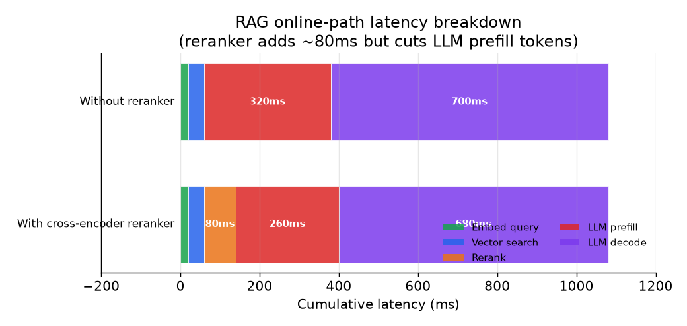

# 6. 服务与扩展

## 延迟预算

需求是 p99 首 token 延迟低于 1.5 秒。这个预算必须摊到在线路径上的每一个组件头上。
对一个带重排的系统来说，比较现实的分配是：

| 组件 | 预算 | 备注 |
|---|---|---|
| 查询 embedding | 约 20ms | 模型很小；命中缓存后几乎为零 |
| 带 ACL 过滤的 ANN 搜索 | 约 40ms | 在有副本的分片上跑 HNSW 或 IVF-PQ |
| Cross-encoder 重排（50 个候选，取 top 10） | 约 80ms | 可选；预算紧就跳过 |
| LLM prefill（拼进 top 5 到 10 个 chunk） | 约 250ms | 主要由 chunk 数量和 chunk 大小决定 |
| 首 token 解码 | 约 600ms | 受模型大小和硬件限制 |
| 网络 / 其他开销 | 约 50ms | 服务之间 |
| 合计（含重排） | 约 1040ms | 距离 p99 预算还有余量 |

影响首 token 延迟最大的杠杆是 prefill 成本，它随拼好的 prompt 里的 token 数增长。
把重排做得更狠（留下更少、更相关的 chunk），直接砍掉的是 prefill 成本和延迟，而不只是 token 费用。

*在线路径在有无 cross-encoder 重排器两种情况下的延迟拆解。重排器加了约 80ms，
但削减了 LLM prefill 的 token 数，从而压小了 prefill 那一段。
在上面这组预算水平下，总延迟基本持平，而回答质量得到了提升。示意图。*

## 缓存层

三种缓存，价值特征各不相同：

**查询 embedding 缓存。** 内部查询重复得很厉害："on-call 轮班表是怎么排的？"
"我们的故障处理政策是什么？"对归一化后的查询字符串做一个简单的 LRU 缓存，
命中时就完全省掉了访问 embedding 模型的一个来回。热门查询上命中率很高，内存开销可以忽略。

**System prompt 前缀缓存。** system 指令和上下文窗口的前缀在所有查询之间都是一样的。
支持 KV cache 前缀缓存的 LLM（大多数生产环境的 API 都支持）不会在每次请求时重新处理这些 token。
省下的 prefill 算力，和 system prompt token 占总 prompt token 的比例成正比。

**ACL 元数据缓存。** 每次查询都去查一遍用户的文档权限，就要往授权系统跑一个来回。
把每个用户的权限集合缓存起来，配一个较短的 TTL（几分钟）。
在 20 QPS 下，这一项对授权服务的负载相当敏感。

## 流式输出

1.5 秒的首 token 目标和"几秒内给出完整答案"的目标是两回事。
解码出来的 token 要边生成边流式吐出。首 token 延迟是在线路径上直到第一步解码为止的所有耗时之和。
后续 token 的流式输出不再产生额外的检索成本。

## 瓶颈

| 瓶颈 | 最早的征兆 | 修法 | 代价 |
|---|---|---|---|
| 查询 embedding 延迟 | p99 慢慢往上爬；缓存未命中率高 | 加大 embedding 缓存；换更小的 encoder | 小模型会损失一点召回 |
| ANN 搜索打满 | 高 QPS 下搜索延迟出现尖刺 | 给索引做分片和副本 | 基础设施更多；多出协调成本 |
| Prefill 成本（长上下文） | 每次查询的 LLM 成本高；首 token 延迟高 | 重排做得更狠；减少保留的 chunk 数（$m$） | 万一重排丢掉了相关 chunk，召回有一点风险 |
| 生成器吞吐 | 请求队列积压 | 连续批处理；加副本 | 成本线性增长 |
| Cross-encoder 重排延迟 | 重排器吃掉了在线路径的大部分预算 | 缩小候选集 $n$；换更小的 cross-encoder | 损失一些精度 |
| 重建索引滞后 | 新文档的答案是旧的 | 增量 upsert 更快；缩短批次间隔 | 索引写入侧负载加重 |
| ACL 过滤性能 | ACL 复杂度高的用户搜索变慢 | 预计算 ACL token 集合；用原生支持过滤的索引 | 会话中途权限变更时有陈旧风险 |

**细节。** prefill 成本那一行随保留的 chunk 数 m 增长，因为检索到的每个 token 在 prefill 阶段都要被注意到，
所以把 m 从 10 降到 5，在生成还没开始之前就大致把首 token 延迟和 prompt 成本砍掉了一半；
这也是为什么把重排做狠通常比把上下文窗口开大更省钱。
cross-encoder 重排那一行，是对每个（查询，候选）对跑一遍完整的 transformer 前向，
所以它的成本随候选数 n 线性增长，而与语料规模无关，把 n 从 100 降到 30 就是最直接的杠杆。
这里的 cross-encoder 出自 Sentence-BERT（UKP Darmstadt，2019）一脉。
