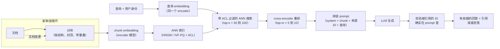

# 9. 小结

## 一页纸回顾

- **检索召回就是质量上限。** RAG 系统的端到端质量是有界的：
  $Q_{\text{e2e}} \leq \text{recall@}k \times Q_{\text{gen} \mid \text{retrieved}}$。
  答案不对的时候，先看分块和 embedding 模型，再看生成器。
  一个从没被检索到的 chunk，再强的生成器也捞不回来。

- **两条路径必须分开。** 离线（写）路径为每次文档变更付一次昂贵的 chunk embedding 成本。
  在线（读）路径每次请求只付一次查询 embedding，加一次快速的索引查找。
  把两者混在一起，要么是在查询时付 embedding 的钱，要么就是丢掉新鲜度。

- **分块是一个设计决策，不是一个默认值。** 先按文档结构切（标题、段落、表格），再按大小封顶。
  从表格中间切开的 chunk，产出的是畸形的 embedding 和错误的答案。
  取舍要说清楚：chunk 越小越精确，chunk 越大携带的上下文越多，同时也抬高 prompt 成本。

- **ACL 的强制执行要放在 ANN 搜索内部。** 对 top-k 做后过滤会泄露文档的存在性，
  还会让受限用户拿到空结果。ACL 元数据必须从入库、经索引、一路跟到查询。

- **在精确词项的查询上，混合胜过纯稠密。** BM25 抓得住那些被稠密 embedding 糊掉的产品代号、
  工单 ID 和行话。RRF 融合不需要改架构，就能带来 3 到 5 个百分点的召回。

- **重排要狠，上下文要紧。** 按每个段落算，cross-encoder 的成本大约是生成调用的七十五分之一。
  把 top-m 保持在 5 到 10 个而不是 top-50，既砍掉 prefill 成本，也减轻"lost in the middle"效应，
  而且往往还能提高准确率。

- **检索信号弱就拒答；返回之前先验证引用。** 一个自信的错误答案比一次诚实的拒答糟糕得多。
  生成后的引用校验是一次亚毫秒级的字符串检查，能抓出编造的来源 ID。

## 一页纸看整个系统

**它是怎么工作的。** 这张图把写路径和读路径画成在索引处交汇，从而把整个系统折叠到一页纸上。
离线部分，文档先经过感知结构、带封顶和重叠的切分，由 encoder 做 embedding，
写入一个带 ACL 标签的 ANN 索引；
虚线的新鲜度循环只把变更的那一篇文档重新跑一遍同样的分块和 embedding 步骤，
索引就能保持最新，而不必整体重建。
在线部分，查询连同用户身份由同一个 encoder 做 embedding
（两侧用同一个模型 embedding，正是它们的向量可比的原因），
接着带 ACL 过滤的 ANN 搜索返回一批较宽的 top-n，
再由 cross-encoder 收窄成精确的 top-m。
这些 chunk、system prompt、来源 ID 和查询被拼成一条 prompt 交给 LLM，
最后一道检查会在返回答案之前，确认被引用的每个 ID 都真的出现在拼好的 prompt 里。
最后那个节点就是防止编造引用的廉价护栏；
而当检索太弱、支撑不起一个笃定的回答时，系统走的就是拒答那个分支。

## 自测

答案是折叠起来的。每道题都先自己答一遍，再展开看。

1. 为什么检索召回给端到端回答质量设了上限？答案出错时，这一点意味着你该先从哪里查起？

   

答案

   生成器只能用检索放进上下文窗口里的东西，
   所以一个从没进过 top-k 的 chunk，任何下游环节都救不回来：
   $Q_{\text{e2e}} \leq \text{recall@}k \times Q_{\text{gen} \mid \text{retrieved}}$。
   排查顺序由此直接推出。
   先问"相关的 chunk 检索到了吗"，再问"是不是生成器不够强"，
   因为换一个更强、更贵的模型修不了一次召回失手，钱等于白花。
   第 [2](02-frame-the-system.md) 节把这件事表述成"先检索再生成"的契约；
   而 [3](03-indexing-and-chunking.md) 里的写路径失误，通常才是根因。

   

2. 有个团队在 ANN 结果出来之后再按 ACL 权限做过滤。说出两种失败模式，并解释怎么修。

   

答案

   第一是**召回饥饿**：索引返回的 top-k 是从整个语料里取的，
   事后再过滤，对可见集合很小的用户可能把列表滤成空，
   于是明明有他有权阅读的相关文档，他却什么答案都拿不到。
   第二是**存在性泄露**：一个用户若在某个特定话题上稳定地收到拒答，
   就能推断出关于它的文档是存在的，这本身就是一次披露。
   两者的修法是同一个，而且是结构性的：
   把权限过滤下推进 ANN 查询，让搜索自始至终只遍历已授权的向量。
   这要求 ACL 元数据从入库到索引一路跟着每个 chunk 走，
   同时也把索引选型限制在原生支持元数据过滤的引擎上
   （见第 [1](01-clarifying-requirements.md) 节和第 [3](03-indexing-and-chunking.md) 节）。

   

3. 用户查询里含有字符串"PROJ-8821"。稠密检索什么有用的都没返回。发生了什么，你要改什么？

   

答案

   embedding 编码的是语义相似，而一个工单 ID 不携带语义：
   encoder 把"PROJ-8821"映射到了其他长得像标识符的字符串附近，
   而不是那唯一一篇包含它的文档，于是精确匹配被糊掉了。
   这是稠密检索对标识符、SKU、错误码和内部行话的经典盲区。
   加一条词法通路：在稠密检索器旁边并行跑 BM25，
   再用 reciprocal rank fusion 融合这两个排序列表。
   第 [4](04-retrieval-and-reranking.md) 节给出的收益是，
   一步融合、不改架构，大约换来 3 到 5 个点的召回，
   这也是为什么混合是默认选项，而不是一项优化。

   

4. 你的系统在常见问题上答得对，但在那些横跨一份长文档多个章节的边角问题上答错。
   什么样的分块方法能解决这个问题，为什么？

   

答案

   答案骑在 chunk 边界上，于是每个单独的 chunk 都只是部分匹配，模型就开始打太极或者自己脑补。
   第 [3](03-indexing-and-chunking.md) 节给了两个互补的修法。
   **父子检索**把检索单元和上下文单元分开：
   embedding 小 chunk 以保持匹配精确，命中之后再把它扩展到所在的整节，然后才送进 prompt。
   **带 10% 到 15% 重叠窗口的递归结构化分块**，则一开始就让骑跨的答案完整地落在至少一个 chunk 里。
   如果 chunk 放在原文里读着没问题、单独拿出来却读不通（代词、"上面那个设计"），
   就加上下文化分块，让每个 chunk 都带一小段说明自己出处的摘要。

   

5. 你需要把每次查询的成本砍掉 50%。按"各自要付出多少质量代价"从小到大列出三个改动。

   

答案

   最便宜的排前面，因为账单的大头是 prefill，而 prefill 随你拼进去的 token 数增长。
   **第一，重排做狠一点，少留几个 chunk。** 把保留的 chunk 数 m 从 10 降到 5，
   大致把 prompt 成本和首 token 延迟都砍掉一半，
   而且因为减轻了 lost-in-the-middle 效应，准确率往往还会*上升*。
   **第二，加缓存。** 查询 embedding 缓存和 system prompt 前缀缓存，
   能在重复流量上省下真金白银，而质量代价基本为零，
   这也是内部部署从缓存里收益特别大的原因。
   **第三，换更小的生成器。** 它排在最后，因为它是唯一一个直接拿回答质量去换、
   而不是在削减浪费的杠杆。
   第 [6](06-serving-and-scaling.md) 节和第 [10](10-putting-it-together.md) 节把这笔账算了出来。

   

6. 一个答案流畅又笃定，事实上却是错的。被引用的来源 ID 出现在答案里，却不在拼好的 prompt 里。
   这是什么失败模式，怎么修？

   

答案

   模型编造了引用。它生成了一个长得像上下文里那些标识符的 ID，
   这是最危险的一种幻觉形态，因为引用恰恰是让错误答案显得可信的那个东西。
   修法是一道生成后的检查，而不是一条更好的 prompt：
   把被引用的每个 ID 和真正拼进 prompt 的 ID 集合比对，
   对不上就把答案压掉或者重新生成。
   这是一次亚毫秒级的字符串比较，所以它该待在每次请求的热路径上。
   再配上第 [5](05-generation-and-grounding.md) 节的拒答规则：
   检索置信度低于阈值时，宁可不答也不生成，因为一次诚实的拒答胜过一次自信的编造。

   

## 延伸阅读

- 收官之作：[完整的方案](10-putting-it-together.md)，
  本章的每一个选择都在那里针对题目场景一次性拍板、算清成本、
  在另外两组约束下重建一遍，最后压缩成一份可运行的单文件 RAG。
- 密度更高的专题参考（案例研究、数学推导、四象限图、完整的生产对比）：
  [topics/01-rag-serving.md](../../topics/01-rag-serving.md)。
- 按公司拆解，附面试题和坑：
  [tools/teardowns/01.md](../../tools/teardowns/01.md)。
- 检索策略对比，以及把它们区分开的数学：
  [tools/comparisons/01.md](../../tools/comparisons/01.md)。
- 在线追踪 embedding encoder（MiniLM-L6，384 维池化输出）：
  [Model Zoo](https://github.com/neurarch-ai/awesome-llm-model-zoo)。
- 下一个专题（长上下文与 KV cache 机制，和 RAG 的 prefill 成本相关）：
  [topics/02-long-context-and-kv-cache.md](../../topics/02-long-context-and-kv-cache.md)。
