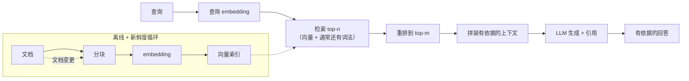

# RAG 服务

> 本章是英文原版的中文译本，原文见 [book/rag-serving/](../../book/rag-serving/)。译文和原文同步维护，发现问题请提 issue。

> **写法说明。** 本章按"先教后练"的书本方式讲检索增强生成（RAG）服务。
> 它借用候选人 / 面试官对话的*思路*来钉住需求，然后沿着一条固定的线索走：
> 搭骨架、建索引、检索、生成、上线服务，每个想法配一张小图。在此之上，
> 保留了这个仓库一贯加的东西：真实的生产案例、每组方法一张"什么时候用哪个"的表、
> embedding 模型的 Model Zoo 实时链接、算出来的图（mermaid 和 matplotlib），以及面试问答。

面试官很少直说"设计一个 RAG 系统"。他们会说：**"设计一个系统，回答员工基于我们内部知识库提出的问题。"**
这句题面里已经埋了好几个坑：候选人往往三十秒内画完"embed、检索、生成"，然后就没话可说了。
真正的信号在检索质量、数据新鲜度、访问控制，以及知道什么东西压住了质量上限、为什么。

本章把这个系统从头到尾搭一遍，每个决定都落在面试官真正在意的约束上，
并且展示 Uber、Dropbox、NVIDIA、Glean、Microsoft 和另外十几个团队实际是怎么把它做上线的。

## 各节内容

1. [澄清需求](01-clarifying-requirements.md)：一段对话，把问题的范围圈出来。
2. [搭出系统骨架](02-frame-the-system.md)：两条路径、先检索再生成、输入和输出。
3. [索引与分块](03-indexing-and-chunking.md)：分块策略、embedding 服务、新鲜度。
4. [检索与重排](04-retrieval-and-reranking.md)：稠密、稀疏、混合检索，以及 cross-encoder 重排。
5. [生成与 grounding](05-generation-and-grounding.md)：拼 prompt、引用来源、控制幻觉。
6. [服务与扩展](06-serving-and-scaling.md)：延迟预算、缓存、瓶颈。
7. [真实团队在生产环境里怎么做](07-how-teams-do-it-in-production.md)：具名公司在哪些地方走了不同的路，附一手资料链接。
8. [面试问答](08-interview-qa.md)：常被问到的、刁钻的、经常答错的。
9. [小结](09-summary.md)：一页纸回顾、全系统图和自测。
10. [把它们拼起来：完整的方案](10-putting-it-together.md)：一套默认技术栈、把题目场景从头到尾搭出来并算清延迟和成本、同一个系统在三组不同约束下的样子，以及最小可运行的 RAG。

## 一页纸看整个系统

第一次读请按顺序来，各节是层层递进的。每一节都从面试官真正会问的那个问题开头，然后回答它。

## 姊妹章节

经典 ML 那本姊妹书从另一面讲了同一块内容：
[search-ranking](https://github.com/neurarch-ai/awesome-ml-system-design/tree/main/book/search-ranking/) 把检索漏斗当成一个搜索产品来处理：查询理解、BM25、learning to rank，以及标注数据的收集。
