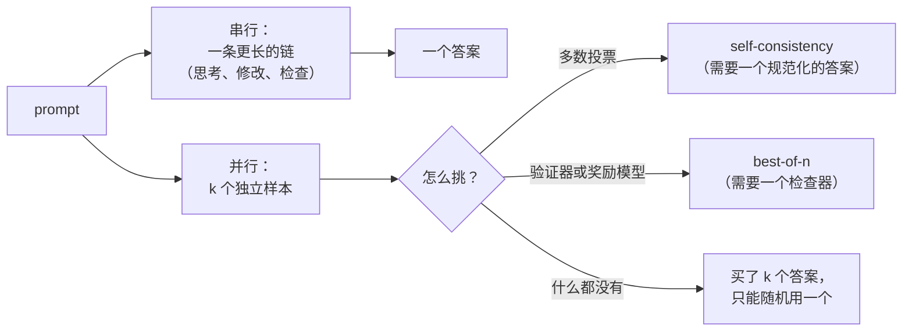

# 2. 搭出测试时计算的骨架

## 推理时多花钱的两种方式

**串行扩展**把 token 花在一条轨迹上：更长的思维链、自我检查、回溯。它不需要任何
额外的机制，就是服务商的 "effort" 或 "thinking budget" 参数控制的东西，它的成本
表现为延迟，因为 token 是一个接一个生成的。

**并行扩展**把 token 花在几次独立的尝试上。它对延迟友好（样本并发跑），对吞吐不
友好（每一份都要付钱），而且如果没有办法在样本之间做选择，它一文不值。面试里要
说的就是这句话：**并行采样是验证器的乘数，它自己不是一种技术。**重复采样能大幅
提高覆盖率，也就是*至少有一个*样本正确的问题占比
（[Large Language Monkeys](https://arxiv.org/abs/2407.21787)），但只有当有东西
能把那个正确的样本认出来时，覆盖率才会变成交付出去的质量。

两者可以组合，最优配比取决于问题相对于模型的难度：简单的问题从修改型的串行花费
中获益更多，难题则更需要更宽的搜索，而自适应地分配算力要好过固定设置
（[Scaling LLM Test-Time Compute Optimally can be More Effective than
Scaling Model Parameters](https://arxiv.org/abs/2408.03314)）。

## 曲线长什么样

准确率对 log 算力的曲线先升后平。比精确形状更重要的是三个推论：

- **平台期一定会来。**过了某个预算之后，更多的思考只会产出更多 token 和同一个答案，
  或者更糟，把自己从一个正确答案上说服到别处去。你的任务在哪个预算上变平，是个
  经验量，测一下要花一天，但马上就能回本。
- **拐点和任务有关。**竞赛数学能持续提升很久；抽取和格式化几乎立刻就平了。
- **成本不是产品关心的那条 x 轴。**串行路径上产品关心的是延迟，并行路径上关心的
  是钱。同样数量的 token，花在哪条轴上，后果差别很大。

## 思考帮不上忙的地方

| 任务形态 | 扩展思考为什么表现不好 | 换成什么 |
|---|---|---|
| 事实回忆 | 答案要么在权重里要么不在；反复斟酌不会增加知识 | 检索 |
| 格式化、抽取、分类 | 映射很浅；长链只会增加漂移和成本 | 小模型加约束解码 |
| 受延迟约束的交互式 UX | 尾部就是产品本身；一个快但大致对的答案往往胜过一个慢而正确的 | 不思考的路径，配验证器和升级机制 |
| 没有可检查信号也没有评分标准的任务 | 既没法在样本间选择，也不知道何时该停 | 先把评估修好，再买算力 |
| 超长上下文聚合 | 瓶颈在对输入做 attention，不在对它的斟酌 | 更好的检索和分块 |

一般规律：**思考有用的前提是模型能找到、并且能认出一个比第一次更好的答案。**如果
它认不出来，就把钱花在验证器上，而不是花在 token 上。

## 对比：花推理算力的五种方式

| 方法 | 额外机制 | 延迟成本 | Token 成本 | 在哪里赢 | 在哪里输 |
|---|---|---|---|---|---|
| 扩展思考（串行） | 无；一个预算参数 | 高，串行 | 与预算成线性 | 困难的单个问题，没有验证器可用 | 成本和尾延迟一起涨 |
| Self-consistency（多数投票） | 答案规范化 | 低（并行） | k 倍 | 简短的规范化答案（数学、标签） | 没有规范形式的自由输出 |
| 带验证器的 best-of-n | 验证器或奖励模型 | 低（并行） | k 倍加验证 | 代码、SQL、任何可执行的东西 | 收益被验证器质量封顶；被钻空子 |
| 级联（便宜、检查、升级） | 验证器或置信度信号 | 大多数请求都低 | 每个解决任务最便宜 | 多数请求可解的混合负载 | 需要一个可信的接受测试 |
| 工具使用和检索 | 工具、索引 | 看情况 | 不高 | 模型缺的知识和计算 | 不能替代困难逻辑上的推理 |

按"额外机制"这一列读这张表，就能解释大多数生产设计：团队先从串行那个旋钮开始，
因为它什么都不需要；而把经济账算对的团队，是那些投资了验证器、走到了后三行的
团队。

## 输入和输出

**系统的输入：**一个请求，一个难度或风险信号（预测出来的或声明的），以及一个把这
些映射到预算的策略。

**输出：**一个答案，外加一条记账记录，必须包含花掉的 token、墙钟时间、验证器是否
接受，以及任务最终解决了没有。缺了最后这个字段，就算不出每个解决任务的成本，本章
里所有的策略比较也都没有意义。

## 和训练的关系

推理行为是训练出来的，通常是用可验证奖励做强化学习，得到的模型暴露出一个推理时的
预算旋钮（[DeepSeek-R1](https://arxiv.org/abs/2501.12948) 是最经典的公开记录）。
对服务的讨论有两个后果。第一，模型在一个你没训练过的预算上，行为不保证优雅，这就
是为什么强制预算可能产出截断或退化的输出，而不是一个更短但格式完好的输出，也是为
什么会有显式的预算强制技术
（[s1: Simple test-time scaling](https://arxiv.org/abs/2501.19393)）。第二，训练
模型时用的那个验证器，往往就是应该和模型一起部署的那个：一个检查器如果好到能塑造
策略，就好到能在推理时从样本里挑选。
