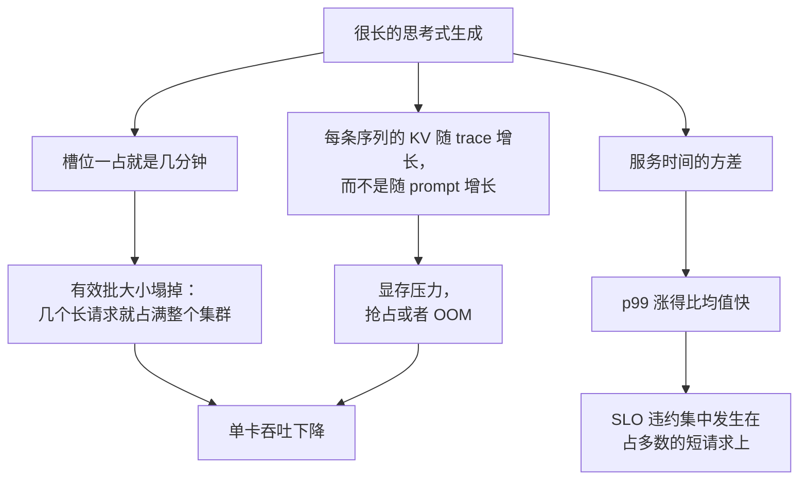

# 6. 服务与扩展

## 一个会思考的负载对服务栈做了什么

这里每一条箭头都是同一件事的后果：工作单元变长了，也变得更不稳定。[推理服务那一
章](../inference-serving/)里的服务技术全都还成立，变的是哪几项最要紧。

**连续批处理（continuous batching）更重要了，但收益更小了。** 更重要，是因为槽位的
周转现在成了稀缺资源；收益更小，是因为长生成本身就降低了槽位释放的速率。要盯的是
槽位驻留时间的分布，而不只是利用率。

**前缀缓存帮得上 prompt，帮不上思考。** 推理 trace 每个请求都不一样，所以能靠共享前
缀命中的 token 占比会下降。有一大段共享 system prompt 的系统，会发现思考越长，这份
收益缩得越厉害。

**投机解码正好打在对的那个阶段上。** 思考是纯粹的、受显存带宽限制的 decode，而这正
是投机能赚到钱的地方。它还有一层适配：推理 trace 里有大段可预测的套路化文字，draft
模型能猜对。

**prefill 与 decode 分离变得更有吸引力。** 相对于 prefill，decode 阶段现在长得多，
把两者拆开，decode 集群就能独立于 prompt 处理能力去扩容。

## 重尾之下的容量规划

按均值做容量规划，就是凌晨三点被叫醒的原因。要随身带的三个数：

1. $E[S]$，平均服务时间，它定的是原始容量：$C$ 个槽位时吞吐 $\approx C/E[S]$。
2. $C^2$，服务时间的平方变异系数，它定的是你必须离饱和点多远。
3. **预算封顶命中率**，它告诉你测到的这条尾巴到底是模型的，还是你自己那个封顶造成
   的。

因为排队延迟带着 $\rho/(1-\rho)$ 这个因子，一个思考型负载要守住同样的 p99，目标利
用率通常得比聊天型负载明显低一截。这是实打实的成本，它应该出现在容量规划里，而不
是等到压上流量才被发现。[第 10 节](10-putting-it-together.md)的 capstone 模拟的正是
这件事。

## 能把策略排对序的那个指标

| 指标 | 它藏起了什么 |
|---|---|
| 每请求成本 | 一个靠多失败几次来省钱的策略 |
| 准确率 | 一个靠多花十倍钱来提准的策略 |
| 每请求 token 数 | 验证成本、重试和取消 |
| p50 延迟 | 整个问题 |
| **每个解决任务的成本** | 基本什么都没藏，所以它是主指标 |
| **p95 或 p99 延迟** | 基本什么都没藏，所以它是并列主指标 |

要成对地报。一个策略变好，是指它推动了其中一个，同时没有把另一个往坏的方向带；也
正是这一对指标，才让 capstone 里的三种策略之间有了可比性。

## 瓶颈速查表

| 瓶颈 | 最早的征兆 | 怎么修 | 代价 |
|---|---|---|---|
| 槽位被长生成占住 | 有效批大小远低于配置值 | 预算封顶、按预算分级的队列、抢占 | 利用率变低，或者服务层变复杂 |
| 中等负载下 p99 爆掉 | 平均延迟看着没事，尾部惨不忍睹 | 降低运行利用率；队列分开；预测长度 | 每请求摊到的集群成本更高 |
| trace 带来的 KV 显存压力 | 压上负载就抢占或 OOM | paged KV、量化 KV、更短的预算 | 预算收得太紧会伤质量（见[模型压缩](../model-compression/)） |
| 验证成本超过生成成本 | 质量在涨，每个解决任务的成本却也在涨 | 换更便宜的验证器、只验证升级上来的请求、先采样再验证 | 接受测试变弱 |
| 级联升级风暴 | 流量分布一变，便宜那条路失败率上升，长的那条路被打满 | 给升级速率封顶；高负载下降级或丢弃 | 一部分请求只能拿到便宜的那个答案 |
| 预算封顶命中率上升 | 截断在悄悄变多 | 对封顶命中率报警；重新测一遍准确率与预算的拐点 | 把封顶调高会更贵 |
| 没有记录结果 | 根本没法比较策略 | 在优化任何东西之前，先按请求记录解决了没有 | 得先把埋点做了 |

**工具。** 支持连续批处理、paged KV 以及优先级或抢占的服务运行时（vLLM、SGLang、
TensorRT-LLM）是上面这些缓解手段能落地的前提；如果用的是厂商 API，那预算是以
effort 或 thinking token 参数的形式暴露出来的。长度预测和 effort 分类就是拿自己的
日志训出来的普通小模型。给验证器用的沙箱执行环境，可以直接复用
[Benchmark 一章第 3 节](../benchmark-eval/03-the-harness.md)的那套 harness。
