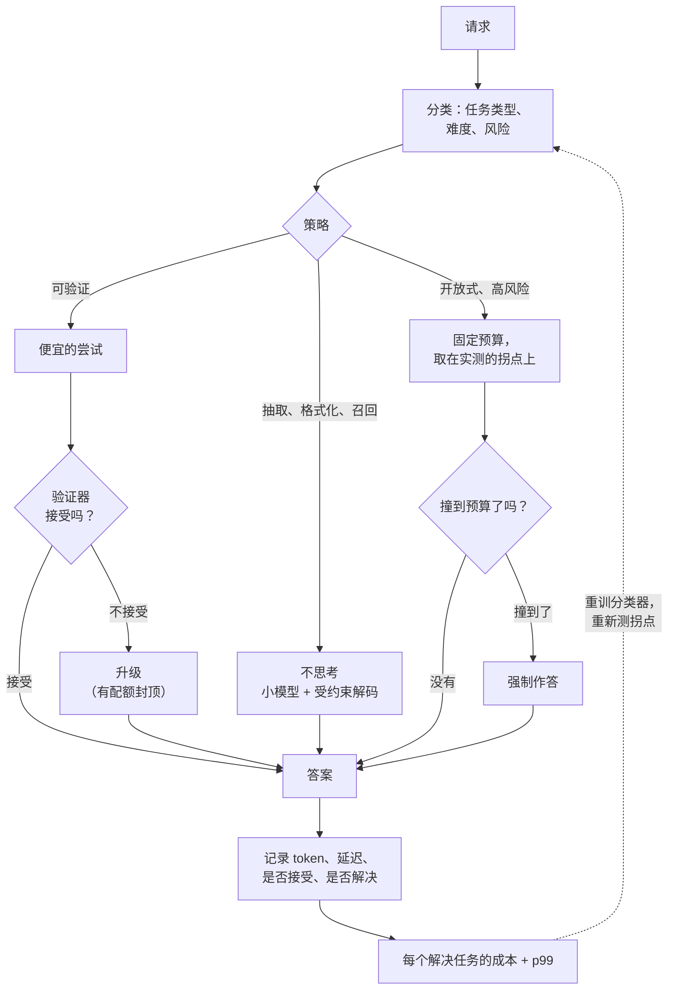

# 9. 小结

## 一页纸回顾

- **思考把输出长度变成了一个随机变量。** 容量规划要从看均值转到看尾部，因为排队延
  迟随服务时间的二阶矩变化。两个均值相同、尾部不同的负载，p99 差得很远，而带思考
  的那个尾巴永远更肥。

- **长生成会造成队头阻塞。** 它们占着 KV 槽位，把有效批压塌，让短请求干等。按预算
  等级分队列、长度预测和抢占是结构性的修法；加机器是那个贵的修法。

- **每一个预算都要封顶，并且把边界设计好。** 封顶就是一份延迟保证。撞顶时发生的事
  必须是强制作答或者明确拒答，绝不能是静默截断，那会返回畸形输出，在评估里算成一
  个错误答案。

- **并行采样是验证器的乘数，本身不是一项技术。** 重复采样能让覆盖率陡增；交付质量
  等于覆盖率乘以"你的选择器挑中正确样本"的频率。先投资验证器，再去买更多样本；只要
  输出跑得起来，就优先用执行器而不是模型裁判。

- **分配问题比开关问题更重要。** 用分类器做 effort 路由，更好的做法是级联（便宜的
  尝试、检查、升级），它是把难度测出来而不是预测出来，而且在解决率上有可能赢过"一
  律思考"，因为升级的请求拿到了两次尝试。

- **级联在** $a \gt (c_{\text{short}} + c_{\text{verify}})/c_{\text{long}}$
  **时划算**，按典型的成本比算下来，便宜那条路只要能接住大约五分之一的请求就够了。

- **思考并不总是有帮助。** 召回、抽取、格式化，以及受延迟约束的界面，加了思考都更
  差。在围着一个 benchmark 上的胜利做设计之前，先做成本对齐的比较。

- **成对地报每个解决任务的成本和 p99。** 每请求成本靠失败得更快就能压到最低；准确率
  靠无上限地花钱就能拉到最高。单看哪一个都排不出策略的优劣，而两个都要求按请求记
  录结果，那套埋点得你先建起来。

## 一页纸上的系统

## 自测题

1. 给 20% 的流量打开思考之后，平均延迟没变，p99 翻了三倍。解释一下，并给出两个不
   靠买硬件的修法。

   

答案

   均值是一个加权平均，20% 的请求服务时间变长，只把它挪动一点点；尾部是由服务时间
   的*方差*驱动的，而思考那条路是长尾的，所以 $C^2$ 陡增了
   （[3](03-budgets-and-latency.md)）。排队效应之上还叠着一个结构性效应：长生成占
   着 KV 槽位，有效批缩小，那 80% 的短请求现在排在它们后面，这就是队头阻塞。两个不
   涉及硬件的修法：**按预算等级给队列分区**，让短请求永远不必等在长请求后面；以及
   **给思考预算封顶**，在边界上接一个强制作答的步骤，直接把分布的尾巴截掉。如果有
   流量可以拿来训练，还有第三个：一个长度类别预测器，把近似的最短作业优先调度恢复
   回来，毕竟 FIFO 在这里对任何目标都不是最优的。

   

2. 便宜那条路成本 1 个单位，验证 0.2，思考那条路 10。便宜的路要接住多大比例的请
   求，级联才划算？上线前你还会检查什么？

   

答案

   级联的成本是 $1 + 0.2 + (1-a)\cdot 10$，对上"一律思考"的 10，所以它在
   $a \gt 1.2/10 = 12$ 个百分点时胜出（[4](04-allocation-and-routing.md)）。这个门
   槛很低，这正是为什么只要存在验证器，级联就通吃。上线前的三项检查：**接受测试的
   误接受率**，因为一个会放过错误答案的验证器，会把一次成本上的胜利换成一次无声的
   质量损失，而这是代价高的那个方向的错误；**延迟画像**，因为级联是双峰的，被升级
   的请求现在要付便宜路的延迟加上思考的延迟，所以均值改善的同时 p99 反而可能恶化；
   以及**升级配额**，因为一次把升级率从 20% 推到 60% 的流量变化，会把一个质量信号变
   成一次容量事故（[8](08-interview-qa.md)）。

   

3. 你采 8 个候选，实测覆盖率（pass@8）是 0.95，交付准确率是 0.62。问题出在哪，你
   怎么办？

   

答案

   生成器没有任何问题，瓶颈是**选择器**（[5](05-verification.md)）。覆盖率说的是
   95% 的样本组里存在一个正确答案，而交付准确率说的是你的验证器大约三分之二的时候
   能把它找出来，所以你花的钱大半是在选择这一步蒸发掉的。再多买样本，只是把覆盖率
   沿着一条本来就已经很平的曲线往前推，对交付质量几乎毫无影响。修法按顺序是：只要
   输出跑得起来（测试、编译器、对着一个固定数据库跑查询），就**用执行器把裁判换
   掉**，那几乎是一个完美的选择器；如果验证器非学不可、而且失败是可以定位的，就
   **用步骤级监督而不是只看结果的监督**；其余情况就给裁判做**集成或者认证**。顺手
   也查一下相反的那种失效：如果交付准确率随 k 增大反而*下降*，那你是在针对验证器的
   伪影做优化，应该把 k 卡在交付质量的峰值处。

   

4. 产品要求一条思考路径的 p95 低于 30 秒，而它的平均生成时间是 40 秒。你怎么说？

   

答案

   说这个要求照字面讲是做不到的，然后给出让它变得可行的三条路。**改分布**：给预算
   封顶，让平均生成时间装进这个承诺里，接受随之而来的质量代价，并且在准确率与预算
   曲线上把它测出来，而不是拍脑袋
   （[3](03-budgets-and-latency.md)）。**改人群**：做路由，让大多数请求根本不走思考
   那条路，因为 p95 是关于整个流量构成的一句陈述，一个 80% 的请求由便宜路作答的级
   联，能达到思考路自己达不到的 p95（[4](04-allocation-and-routing.md)）。**改承
   诺**：按界面把 SLO 拆开，交互式那条路守一个紧的，深思那条路做成异步的，配上进度
   信号和通知。不该做的是照着它去配集群：在服务时间方差很大的时候，
   $\rho/(1-\rho)$ 这个因子会让容量成为手里最贵的一根杆子。

   

5. 两个策略：A 每千次请求 \$26，解决率 79%；B 每千次请求 \$7，解决率 59%。上哪
   个？

   

答案

   先把管事的那个指标算出来再选：A 是每千个解决任务 \$33，B 是 \$12
   （[6](06-serving-and-scaling.md)、[10](10-putting-it-together.md)）。按每个解决
   任务的成本看，B 好得多，但这个决定不是自动的，因为那 20 个百分点的解决率有一份成
   本指标没有定价的产品价值：如果一个没解决的请求意味着一次重试、一张工单，或者一
   个流失的用户，那份价值可能超过省下的 \$19。正确的动作是算出第三个选项，而不是在
   这两个之间二选一：一个先跑便宜路、验证失败再升级的级联，通常**两个都赢**，因为
   被升级的请求拿到了两次尝试；在 capstone 里它解决了 85%（高于 A），每千个解决任务
   \$15（接近 B）。一般性的教训是，本章里那些 A 对 B 的提法，通常都是漏掉了级联。

   

## 延伸阅读

- capstone：[完整的方案](10-putting-it-together.md)，三种策略在同一个队列上做模拟，
  外加一个可运行的模型。
- 测试时扩展：[Scaling LLM Test-Time Compute Optimally](https://arxiv.org/abs/2408.03314)、[Large Language Monkeys](https://arxiv.org/abs/2407.21787)、[s1: Simple test-time scaling](https://arxiv.org/abs/2501.19393)。
- 验证：[Let's Verify Step by Step](https://arxiv.org/abs/2305.20050)。
- 训练那一侧：[DeepSeek-R1](https://arxiv.org/abs/2501.12948) 和[微调与后训练那一章](../post-training/)。
- 服务那一侧：[大规模 LLM 推理服务](../inference-serving/)、[长上下文推理与 KV Cache](../kv-cache/)、[成本优化与模型路由](../cost-optimization/)。
- 诚实地评估它：[给模型做 Benchmark](../benchmark-eval/)。
