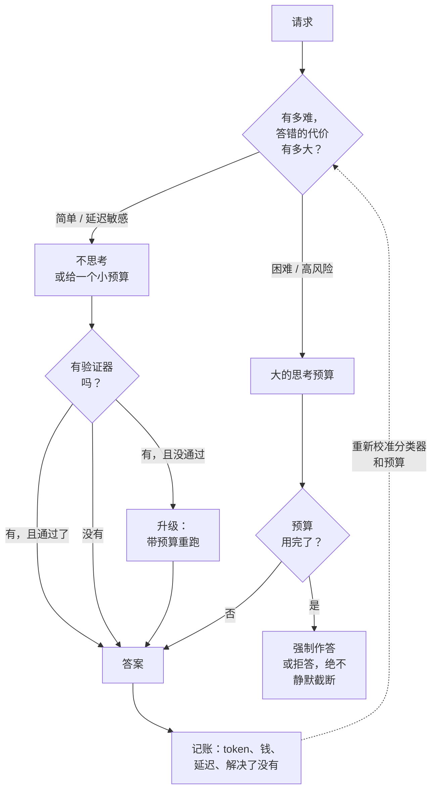

# 推理模型与测试时计算

> 本章是英文原版的中文译本，原文见 [book/reasoning-serving/](../../book/reasoning-serving/)。译文和原文同步维护，发现问题请提 issue。

面试官很少会说"解释一下 chain of thought"。他们会说：**"我们换成了推理模型。
质量上去了，但 p99 延迟变得没法预测，账单翻了三倍。你怎么办？"**

这是一个系统问题。一个先思考再回答的模型，把输出长度从一个大致固定的成本变成了
一个重尾的随机变量，而下游的每一项性质（延迟尾部、KV 压力、排队、单请求成本、
自动扩缩容）都继承了这条尾巴。这同时也是一个分配问题：思考是一个可以按请求
购买的质量维度，所以设计要回答的不是"推理开还是关"，而是"哪些请求拿到多少
预算，由谁来决定"。

[后训练那一章](../post-training/)讲的是这些模型是怎么*炼出来*的（RLHF、GRPO、
可验证奖励）。这一章讲的是当你必须*服务*一个这样的模型时，会发生什么。

## 小节

1. [澄清需求](01-clarifying-requirements.md)：把范围定下来的那段对话，以及由此推出的两个后果。
2. [搭出测试时计算的骨架](02-frame-test-time-compute.md)：串行扩展 vs 并行扩展，它能买到什么，在哪里毫无作用，以及曲线的形状。
3. [预算、延迟与尾部](03-budgets-and-latency.md)：输出长度是一个随机变量，服务时间高方差下的排队，截断策略，流式 UX。
4. [分配预算](04-allocation-and-routing.md)：按 effort 路由、难度预测、级联、提前退出，以及决定选哪个的那笔账。
5. [验证](05-verification.md)：让并行采样值回票价的乘数：执行器、符号检查、过程奖励模型和结果奖励模型，以及验证器是怎么被钻空子的。
6. [服务与扩展](06-serving-and-scaling.md)：KV 压力、抢占、与批处理的相互作用、思考 token 上的投机解码、容量规划、每个解决任务的成本。
7. [真实团队在生产环境里怎么做](07-how-teams-do-it-in-production.md)：真实设计在哪里分道扬镳；带一手来源链接的具名对比。
8. [面试问答](08-interview-qa.md)：常被问到的、有坑的、常被答错的。
9. [小结](09-summary.md)：一页纸回顾、mermaid 图、自测题、延伸阅读。
10. [把它们拼起来：完整的方案](10-putting-it-together.md)：一套默认技术栈，在三种策略下模拟同一份负载，以及一个可运行的排队与成本模型。

## 一页纸上的决策

记账那条箭头是团队最容易跳过的部分。如果不记录每个请求到底有没有被解决，就算不出
唯一能把这些策略正确排序的指标，也就是**每个解决任务的成本**，而不是每请求成本，
也不是单看准确率。

## 配套章节

- [微调与后训练](../post-training/)讲推理行为是怎么训练进去的（RLHF、DPO、GRPO、可验证奖励）。
- [大规模 LLM 推理服务](../inference-serving/)负责批处理、投机解码，以及本章施加压力的那套服务栈。
- [成本优化与模型路由](../cost-optimization/)负责一般意义上的路由和级联；本章把它们特化到"每请求花多少"这个维度上。
- [给模型做 Benchmark](../benchmark-eval/)负责成本对齐的比较，推理模型必须用这种方式评估。
- [Agent 编排](../agents/)负责多步循环，那是可变计算量出现的另一个地方。
