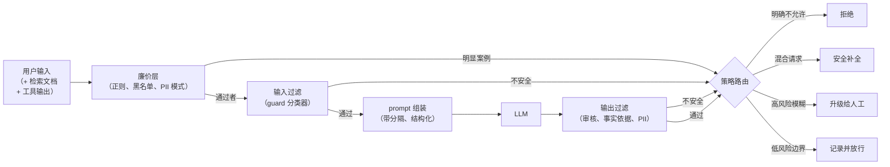

# 2. 搭出系统骨架

## 三个阶段

系统有三个彼此独立的阶段，多数设计出问题就出在没把它们分开。把三者揉成一次"安全调用"，就没法单独调每一层，没法从便宜到昂贵地级联，也没法把不同的判定结果送去不同的策略决策。

**输入过滤**在 LLM 看到任何东西之前运行。它的任务是抓住明显有害的请求，标记藏在用户文本里的注入企图，并把 PII 脱敏掉，让它既进不了模型也进不了日志。这一层必须快，它卡在关键路径上，主模型都还没开始。

**输出过滤**跑在 LLM 的生成结果上。它的任务是抓住从输入层漏过去的有害补全（一个无害的 prompt 照样可能生成不安全的回答），核实回答在 RAG 上下文里有依据，并且去掉模型可能从检索文档里带出来的 PII。这一层可以和生成部分并行。

**策略路由**是把护栏判定变成动作的决策层。护栏触发并不自动等于"拦截"。策略路由决定是拒绝、只对无害部分做安全补全、升级给人工，还是记录下来放行并持续监控。

**它是怎么跑的。**每一条输入，包括检索文档和工具输出，先经过一个由正则、黑名单和 PII 模式组成的廉价层，明显的案例在这里就解决掉，不用为模型付费。通过廉价层的输入交给 guard 分类器；判定不安全的直接短路到策略路由，通过的进入 prompt 组装，在那里可信指令和不可信数据以带分隔的结构化形式分开，然后才跑 LLM。模型的输出同样不被信任：它要过一遍输出过滤，做审核、事实依据和带出 PII 的检查，不安全和通过两种判定都汇入同一个策略路由。这个路由是唯一的决策点，把护栏判定转成四种动作之一：拒绝、安全补全、升级给人工、记录并放行。这就是为什么护栏触发只是给路由的一个信号，而不是自动拦截。三个阶段保持分离，每一层才能独立调优、独立级联，而不是坍缩成一次不透明的安全调用。

## 系统的输入和输出

系统接收两类输入：来自用户的文本（可信仅限于"知道是谁发的"这个意义上），以及来自应用控制边界之外的文本（检索文档、网页、工具结果）。第二类必须当作对抗性输入来对待。检索到的文档里有什么，我们并不知道；它可能藏着专门用来劫持模型的注入指令。

系统的输出是以下几种之一：安全的回复、拒绝、安全补全、升级触发，或者一条日志记录。它不是一个布尔值。

## 为什么系统 prompt 里的指令是最弱的一层

系统 prompt 里的指令（"绝不讨论有害话题"）是必要的，但永远不充分。它是一条模型通常会遵守、而有耐心的攻击者往往能绕开的建议。这个设计里的 guard 模型和确定性的策略代码是独立的决策：分类器不会继承基座模型的"可被说服性"，代码侧的动作闸门也不管模型被说服成了什么样，该触发就触发。

一个强的回答会倚重第二层和第三层（分类器和确定性代码），把系统 prompt 这层当作抬高低成本攻击门槛的兜底，而不是主防线。
