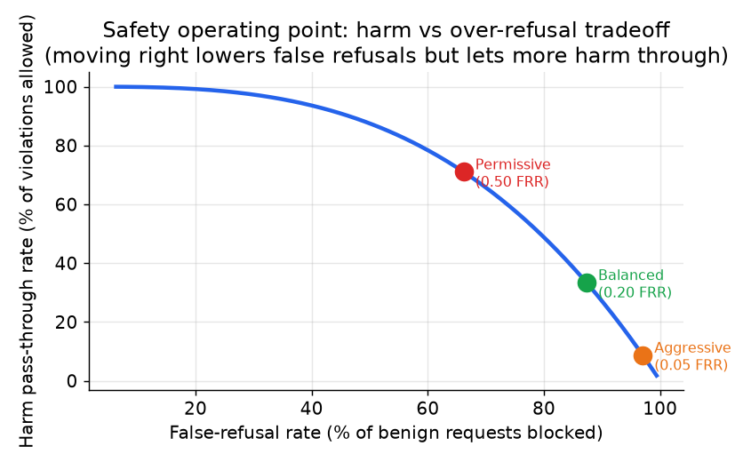

# 4. 输出护栏

输出护栏跑在 LLM 的生成结果上，在它到达用户之前。它们抓的问题和输入护栏是另一类：一个完全无害的 prompt，照样可能生成不安全的补全、一句幻觉出来的断言，或者复述出另一个用户的私人数据。输入护栏是必要的，但不充分。

## 毒性和策略分类器

毒性分类器（毒性指仇恨言论、威胁、自残内容这类有害语言）给补全打有害内容的分：暴力、自残、色情、仇恨言论。策略分类器打的是领域特定的违规分：客服产品里的跑题回复、无资质应用给出的医疗建议、带着免责声明的理财推荐。

两者通常都实现成 guard 模型：在产品所执行的那些类别的标注样本上微调出来的 transformer。关键的设计点是，它们作为独立于主模型的另一个决策，跑在输出文本上。攻击者就算成功越狱了基座模型的拒绝训练，还得过输出分类器这一关，而它没有参与对话，也没法被说服。

Salesforce 的 Einstein Trust Layer 对七个毒性类别用的是确定性规则加模型的混合方案：纯模型打分会漏掉明显的违规，纯规则又抓不到细微之处。混合方案比单独任何一种都更稳。

## 事实依据分类器（面向 RAG）

在 RAG 产品里，还有一类不安全输出是无依据的断言：模型说了检索来源并不支持的东西。在高风险领域（法律、医疗、金融），一句无依据的幻觉是安全问题，不只是质量问题。

事实依据分类器把生成文本和检索到的 chunk 做比对，返回一个支持度分数。最简版本算的是回答里的词有多大比例真的出现在来源里；分数低就标记出来，说明来源不支持这条断言：

```python
def support_score(answer, sources):   # answer: generated text; sources: list of retrieved chunk texts
    a = set(answer.lower().split())
    src = {w for chunk in sources for w in chunk.lower().split()}
    # fraction of the answer's words that actually appear in the retrieved sources
    return len(a & src) / len(a)
# support_score("the filing reports a profit", ["the filing reports a loss"]) -> 0.8
```

NVIDIA 的 NeMo Guardrails 用 AlignScore 做这件事。Thomson Reuters 的 CoCounsel 把法律回答锚定在一个可信语料库上，每晚跑 1,500 个自动化测试来验证这种依据关系还成立。

关键的洞察是：事实依据和毒性是正交的。一段完全礼貌、毫无毒性的输出，在受监管领域里照样可能是一条不安全的幻觉。

## 工作点：召回、精确率，以及带 KL 锚定的目标函数

给分类器定阈值是一个业务决策，不是一个默认值。取舍是明摆着的：阈值越低，拦住的危害越多，但拦掉的正常请求也越多。

把捕获率（真阳性率）定义为：

$$\text{Recall} = \frac{TP}{TP + FN}$$

```python
def recall(tp, fn):                  # tp: attacks caught; fn: attacks that slipped through
    # catch rate: of all real attacks (tp + fn), what fraction the guard flagged
    return tp / (tp + fn)
# recall(90, 10) -> 0.9
```

把误拒率（假阳性率：正常请求被错误拦截的比例）定义为：

$$\text{FRR} = \frac{FP}{FP + TN}$$

```python
def frr(fp, tn):                     # fp: benign requests wrongly blocked; tn: benign correctly allowed
    # false-refusal rate: of all benign requests (fp + tn), what fraction got blocked
    return fp / (fp + tn)
# frr(3, 997) -> 0.003
```

工作点就是同时决定这两个数的那个阈值。只报捕获率是误导性的。Anthropic 的 Constitutional Classifiers 在一个对抗性评估集上把攻击成功率从 86% 压到 4.4%，同时把生产环境的良性拒绝率增幅控制在 0.38%，后面这个数字才是证明没有过度拦截的那个。

表述工作点约束的一个好用的方式是：先固定误拒率预算，再读出能达到的捕获率，或者反过来：

$$\text{Recall} \Bigl|_{\text{FRR} \leq \delta} = \max \Bigl\lbrace \frac{TP}{TP + FN} : \frac{FP}{FP + TN} \leq \delta \Bigr\rbrace$$

```python
import numpy as np
def recall_at_frr(scores_pos, scores_neg, delta):   # guard scores for attacks (pos) and benign (neg)
    best = 0.0
    # sweep every candidate threshold; keep the best attack-recall whose benign block rate stays <= delta
    for t in np.unique(np.concatenate([scores_pos, scores_neg])):
        frr = np.mean(scores_neg >= t)              # benign wrongly blocked at this threshold
        if frr <= delta:
            best = max(best, np.mean(scores_pos >= t))  # recall on attacks at this threshold
    return best
# recall_at_frr(np.array([.9,.8,.4]), np.array([.3,.2,.7]), 0.0) -> 0.6666666666666666
```

训练阶段，带 KL 锚定的目标函数防止拒绝训练把良性行为搞坏：

$$\max_{\pi} \; \mathbb{E}_{x \sim D}\bigl[R_{\text{safe}}(x, \pi)\bigr] - \beta \cdot \text{KL}\bigl(\pi \;\|\; \pi_{\text{ref}}\bigr)$$

KL 项就是对漂移的具体惩罚；对两个下一 token 分布来说，它是：

```python
import numpy as np
def kl_divergence(p, q):             # p: trained-policy probs; q: reference-model probs, same tokens
    p, q = np.asarray(p), np.asarray(q)
    # sum p * log(p / q): how far the trained policy p has drifted from the reference q
    return float(np.sum(p * np.log(p / q)))
# kl_divergence([0.5, 0.5], [0.25, 0.75]) -> 0.14384103622589042
```

拒绝奖励推着策略去拒绝有害 prompt。对参考模型的 KL 项惩罚偏离良性行为的漂移。$\beta$ 大，模型对正常用户保持有用；$\beta$ 小，捕获率上去，但良性拒绝率也跟着涨。



*把工作点向右移（降低阈值）会减少误拒，但放过更多危害。这条曲线是产品的安全与有用性前沿；工作点是业务决策，不是技术默认值。示意图。*

## 什么时候用哪种输出护栏

| 选用 | 场景 | 而不是 |
|---|---|---|
| 小型微调毒性分类器 | 高 QPS 的输出审核；策略稳定；每条补全都要低延迟 | 输出路径上的 guard-LLM，它串行多加 80 到 150ms |
| guard-LLM 输出分类器 | 分类体系的灵活性重要；QPS 中等；需要类别级判定来做路由 | 一个只分有毒 / 无毒的二元信号，分不清该往哪种违规路由 |
| 事实依据分类器（AlignScore 或类似） | 高风险领域（法律、医疗、金融）的 RAG 产品 | 假设 LLM 只用了检索内容；幻觉和毒性是正交的 |
| 规则加模型的混合方案（Salesforce） | 企业平台，确定性规则绝不能漏掉明显案例 | 纯模型打分，可能漏掉规则级违规，也更难审计 |
| 流式 token 级分类器 | 想在生成中途截断，避免返回部分不安全输出（Anthropic） | 等完整补全再检查，此时不安全的 token 已经露出去了 |
| G-Eval 风格的 LLM 裁判打分（OpenAI cookbook） | 难以编码进训练分类器的定性、领域特定标准；低 QPS | 高 QPS 路径；LLM 裁判会继承基座模型的可被说服性，还要花一次完整生成的代价 |
| 升级人工审核 | 受监管领域的高风险模糊案例；申诉（Thomson Reuters、Roblox） | 对不可逆决策做自动硬拦截，一次误报就造成真实伤害 |

**工具。**guard-LLM 输出分类器有 Llama Guard（Meta）和 ShieldGemma（Google）；NeMo Guardrails（NVIDIA）编排输出侧的 rail 并用 AlignScore 做事实依据，Guardrails AI 提供输出校验器和规则加模型的混合层。Detoxify 这类小型微调毒性分类器跑在 Hugging Face Transformers 上，走低延迟路径；流式 token 级检查接进服务循环，生成可以在流中途截断。G-Eval 模式的 LLM 裁判打分基于你已经在调的那个前沿模型来搭，升级人工审核则是围绕自动判定搭建的一套工作流和队列。

**出处。**guard-LLM 输出那一行用的是 Llama Guard（Meta），由 NeMo Guardrails（NVIDIA）编排。流式 token 级截断那一行归于 Anthropic，表里已经注明。

**实例。**一个文档 AI 团队上线了一个 RAG 助手，回答关于受监管财务申报文件的问题，在这里一句礼貌但无依据的断言本身就是安全故障。他们在每条补全上跑一个小型微调毒性分类器以保证低延迟，但因为毒性和事实依据是正交的，他们又加了一个事实依据分类器，把回答和检索到的 chunk 比对，而不是假设模型只用了它的来源。出于审计原因，明显的规则级违规绝不能漏过，所以他们把模型和确定性规则配成混合方案，而不是纯模型打分。阈值的定法是先固定一个误拒预算，再读出能达到的捕获率；那一小片高风险的模糊输出送人工审核而不是硬拦截，因为在不可逆决策上一次误报就会造成真实伤害。

## 实现与训练的坑

输出护栏会同时朝两个相反的方向失效：对正常用户过度拦截，对执着的攻击者拦截不足。两者都是工作点和实现的问题，不是放弃护栏的理由。反复出现的故障：

| 问题 | 症状 | 修法 |
|---|---|---|
| 护栏误报（过度拒绝） | 正常请求被拒，用户投诉上升，活跃度下降 | 对着一个明确的误拒预算定阈值，再读出捕获率；把拒绝训练用 KL 锚定到参考模型上，有用性才不会漂 |
| 越狱漏过基座模型 | 模型自己的拒绝被说服掉了，返回了不安全的补全 | 用一个从未参与对话的独立分类器给输出打分，被越狱的基座模型还是得过它这关 |
| 改写触发事实依据误报 | 正确但改写了来源措辞的回答，词汇重叠分低，被拦 | 用蕴含或语义支持度打分器，而不是裸的词重叠；重叠只留作粗筛的预过滤 |
| 部分不安全输出已经流出去 | 完整补全检查跑之前，不安全 token 已到用户手里 | 跑一个 token 级的流式分类器，能在流中途截断生成，而不是只检查完成的文本 |
| 私有数据被复述 | 即使 prompt 无害，补全也回显出另一个用户的 PII | 加一个独立于输入侧的输出 PII 或 DLP 扫描，因为输入护栏看不到模型生成了什么 |
| 阈值随时间漂移 | 流量和攻击组合变化，捕获率悄悄下降 | 在留出的标注集上监控召回和误拒率，按计划重新校准工作点 |
| 非英语绕过 | 其他语言的攻击从英语训练的护栏面前溜过去 | 用多语言 guard 模型或按语言设阈值；别假设基座模型的语言覆盖和护栏一样 |
| guard-LLM 延迟叠加 | 每条补全都串行多付一次完整生成 | 热路径上留一个小型微调分类器，guard-LLM 只留给低 QPS 或模糊路由 |

护栏是一个用阈值表达出来的业务决策：按产品能承受的误拒预算选工作点，然后盯着它漂移并重新校准，而不是发一个默认值然后信任它。
