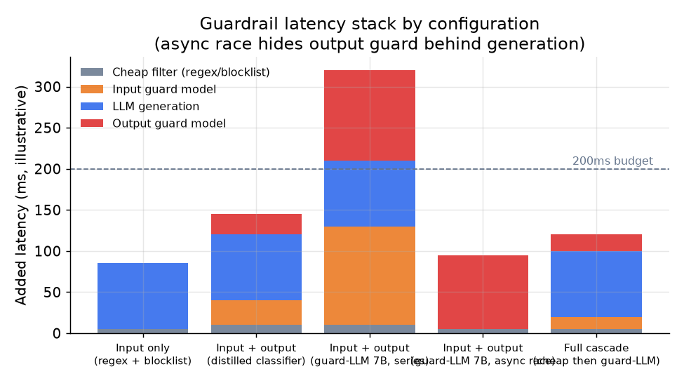

# 6. 服务与扩展

## 延迟这个问题

每加一道 guard，都是往关键路径上加时间。一个总预算 200ms 的对话产品没法把三次模型调用串起来：100ms 的 7B 输入 guard，加一个 30B 主 LLM，再加 100ms 的 7B 输出 guard，主模型还没开跑，200ms 就已经用光了。服务侧的设计不是在琢磨"再加几道 guard"，而是在决定哪些 guard 跑得够快、哪些可以并行、哪些干脆能从关键路径上挪走。

## 级联：从便宜到昂贵

延迟上最关键的杠杆是级联的形状。先跑最便宜的检查，只有扛过廉价层的那一小部分流量才升级到昂贵的 guard。

输入 guard 这边：正则加黑名单在微秒级抓住明显模式。一个小型蒸馏分类器多花 10 到 30ms，抓住下一层。完整的 guard-LLM（80 到 150ms）只看廉价层标为模糊的那点残余。Roblox 的蒸馏分类器在快速层处理掉了它们 750k RPS 中的绝大部分，昂贵的判定只跑在很小一部分流量上。

输出 guard 这边：一个快速微调毒性分类器跑 20 到 40ms。LLM 裁判式的护栏跑 80 到 150ms，只留给边界判定。

级联的期望成本：

$$\mathbb{E}[C] = c_{\text{cheap}} + p_{\text{escalate}} \cdot c_{\text{guardLLM}}$$

```python
def expected_cost(c_cheap, p_escalate, c_guard):   # per-request cost; p_escalate in [0, 1]
    # every request pays the cheap tier; only the escalated fraction also pays the guard-LLM
    return c_cheap + p_escalate * c_guard
# expected_cost(15, 0.05, 120) -> 21.0
```

当 $p_{\text{escalate}}$ 很小（大多数流量在廉价层就过了），昂贵 guard 在总成本里几乎看不见。当 $p_{\text{escalate}}$ 很大，说明级联设计错了：要么廉价层没校准好，要么廉价层的能力配不上这个威胁。

## 异步并行

第二个延迟杠杆是并行。输出 guard 和主 LLM 的生成不一定非得严格串行。如果生成在完成之前不产生可观察的副作用（不发邮件、不调 API、不在流中途触发动作），就可以让 guard 和生成赛跑：

$$T_{\text{total}} = \max\bigl(T_{\text{guard}}, T_{\text{gen}}\bigr) \quad \text{vs series: } T_{\text{guard}} + T_{\text{gen}}$$

OpenAI cookbook 里的模式用 asyncio 让输入 guard 和主补全调用赛跑，谁输了就取消谁。guard 一旦触发，补全被取消；guard 放行，补全其实已经跑完了，guard 的结果直接丢掉。

这里有个要命的前提：只有生成在拦截触发之前没有副作用时，这招才成立。如果模型能在流中途执行工具调用或者发消息，并行就可能在判定落地之前把一个不安全的动作漏出去。异步赛跑是给无副作用生成用的延迟技巧，不是一个通用模式。

## Guard 模型放在哪

| 配置 | 增加的延迟（示意） | 覆盖 | 适合 |
|---|---|---|---|
| 只做输入（正则加黑名单） | 5 到 10ms | 抓明确的策略违规和常见攻击模板；漏掉补全 | 延迟预算极紧；可以接受信任模型自身的输出安全微调 |
| 输入加输出（蒸馏分类器） | 合计 30 到 60ms | 两类攻击都能抓；分类器快到足以扛高 QPS | 高 QPS 的消费级产品；策略分类体系稳定 |
| 输入加输出（7B guard-LLM，串行） | 合计 160 到 300ms | 分类体系完全灵活；召回最高 | QPS 较低的工作流；延迟不关键的异步流水线 |
| 输入加输出（guard-LLM，异步赛跑） | 80 到 150ms（并行后） | 覆盖不变；guard 的延迟藏在生成后面 | 无副作用的生成；150 到 200ms 的延迟预算 |
| 完整级联（先廉价层，模糊的再上 guard-LLM） | 35 到 80ms（大部分流量走廉价层） | 接近完整 guard-LLM 的效果，成本只是零头 | 策略复杂的高 QPS 场景；愿意去调级联阈值 |



*五种配置的延迟栈。当生成没有副作用时，异步赛跑把输出 guard 从关键路径上摘了出去。完整级联让大部分流量留在廉价层，只对模糊输入动用昂贵的 guard。图中数字为示意；实际延迟取决于硬件和模型大小。*

## 扩展 guard 层

在非常高的 QPS 下，guard 模型会和主 LLM 抢 GPU 容量。解法是把 guard 拆成一个独立的服务层，独立地批处理和扩容。NeMo Guardrails 把 LlamaGuard 注册成一个单独的 vLLM 引擎；Roblox 则把它的蒸馏文本分类器和语音分类器放在各自独立的 GPU 池上，按每种模态的 RPS 来定规模。

批处理很关键：一个一次只服务一个请求的 guard 模型是在浪费 GPU。独立的一层可以跨用户攒请求、高效地成批跑，把 GPU 利用率拉上去，同时不给中位数请求增加延迟。

## 瓶颈

| 瓶颈 | 最先出现的迹象 | 修法 | 取舍 |
|---|---|---|---|
| 关键路径上的 guard 模型延迟 | p50 延迟超预算；慢的那一步就是 guard | 做级联，廉价层在前；生成无副作用时用异步赛跑 | 一部分有风险的流量会走到昂贵层；拦截触发前会有一些 token 露出去 |
| guard 和 LLM 抢 GPU | 峰值时延迟和吞吐同时变差 | 拆出独立的 guard 层，配独立 GPU 池和批处理 | 基础设施更多；两层之间多一跳网络 |
| 误报造成用户摩擦 | 关于正当请求被拦的工单变多 | 按类别单独调阈值；边界判定用安全补全代替硬拦截 | 边界有害内容的放行率会略微上升 |
| 大规模场景下经不可信内容注入 | RAG 来源引发的有害输出；用户报告出现被注入的动作 | 结构性隔离（spotlighting、加分隔符）配合代码侧的动作闸门；再加一个概率型检测器 | 设计更复杂；编码花招会增加内容处理开销 |
| 审计日志量 | 10k+ RPS 下全量记录请求的存储成本 | 记 guard 的判定和理由，而不是完整输入；完整输入只按比例抽样 | 被抽样的请求上取证深度变浅 |

**细节。** guard 延迟那一行里的异步赛跑，只有在生成没有副作用时才成立：并行发起 guard 分类器和 LLM，guard 先触发就丢掉这条流；但一个能发邮件或者能发起退款的模型没法赛跑，必须串行把闸门放在前面，这也是取舍那一列提醒"拦截触发前会有一些 token 露出去"的原因。GPU 争抢那一行之所以要把 guard 隔到自己的池子里，正是因为一个小 guard 模型（Llama Guard，Meta）的批处理特性和一个大生成模型完全不同：把它们排在一起调度，长生成会把排在后面、对延迟敏感的 guard 请求堵死。
