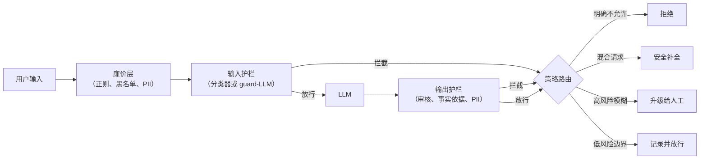

# 安全、内容审核与护栏

> 本章是英文原版的中文译本，原文见 [book/safety/](../../book/safety/)。译文和原文同步维护，发现问题请提 issue。

面试官很少会直接说"设计一个安全层"。他们会说：**"我们要把一个 LLM 放到真实用户面前，
它读的内容我们控制不了。设计一个系统，拦住有害输出，扛得住操纵，同时不把延迟搞垮，
也不惹恼正常用户。"**

这句话已经把全部难点说完了。模型本身是容易的部分。难的是，我们包裹的是一个概率系统，
只要输入凑对了，它就会做出我们不希望它做的事。这场面试考察的信号是：会不会分层思考，
是不是把不可信文本当成不可信的来对待，以及是否尊重延迟预算，而不是一口气挂上五个模型调用。

## 各节内容

1. [澄清需求](01-clarifying-requirements.md)：把问题范围定下来的那段对话，以及随之立刻冒出来的两个推论。
2. [搭出系统骨架](02-frame-the-system.md)：输入过滤、输出过滤、策略路由，三个独立的阶段。
3. [输入护栏](03-input-guardrails.md)：越狱与 prompt 注入防御、PII 检测，以及各自什么时候用。
4. [输出护栏](04-output-guardrails.md)：毒性、事实依据与策略分类器；工作点的算术。
5. [评估](05-evaluation.md)：攻击成功率、误拒率、越狱鲁棒性，以及对抗性评估集。
6. [服务与扩展](06-serving-and-scaling.md)：护栏的延迟链、级联设计、异步并行。
7. [真实团队在生产环境里怎么做](07-how-teams-do-it-in-production.md)：Anthropic、Roblox、Microsoft、Meta、Google、OpenAI、Cloudflare，以及他们为什么各走各的路。
8. [面试问答](08-interview-qa.md)：常见题、刁钻题、常答错的题，附清晰的答案。
9. [小结](09-summary.md)：一页纸回顾、一张 mermaid 流水线图、自测题和延伸阅读。
10. [把它们拼起来：完整的方案](10-putting-it-together.md)：一套默认技术栈，把面试场景从头到尾搭出来并算清延迟和工作点，同一个系统在三组不同约束下的样子，以及最小可运行的护栏流水线。

## 一页看完整个系统

第一次读请按顺序来，各节层层递进。每一节都从面试官真正会问的那个问题开始，然后回答它。

## 姊妹章节

经典 ML 那本姊妹书从另一侧覆盖了同一块内容：
[content-moderation](https://github.com/neurarch-ai/awesome-ml-system-design/tree/main/book/content-moderation/) 是平台规模的内容审核系统，这里的护栏正是从它演化而来：策略分类体系、阈值，以及人工审核闭环。
