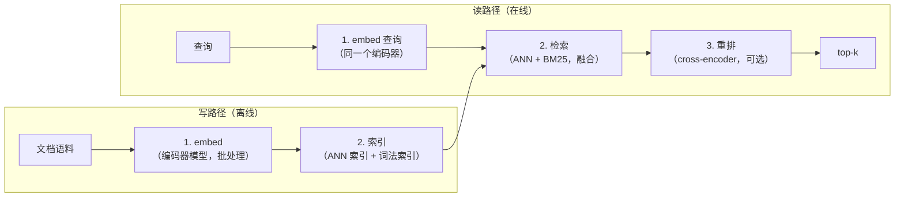

# 2. 搭出系统骨架

## 四个阶段

语义搜索不是一步完成的，它是一条有四个明确阶段的流水线，每个阶段的成本画像不同，召回与精度的权衡也不同。把阶段之间的边界划对，就是整个设计。

**阶段 1：embed。** 编码器模型把文本映射成固定长度的向量。在写路径上，这是一个批量的、受吞吐限制的任务；在读路径上，它是逐查询的、受延迟限制的操作。编码器是独立的一个服务，它的输出维度是决定下游整个成本结构的那一个数字（第 3 节详细讲）。

**阶段 2：索引。** 写路径要建两个索引：一个向量索引，负责稠密语义检索；一个词法索引（倒排表，BM25 或 SPLADE），负责精确词项检索。查询时两个索引各自独立运行，结果再融合。单靠任何一个都有盲区，而另一个恰好能补上。

**阶段 3：检索。** 查询到达时，先做 embedding，然后并行发给两个索引，再把两份结果列表融合（通常用 reciprocal rank fusion，即 RRF）。检索阶段追求的是召回，而且每个条目的开销要低。它必须返回一个足够宽的候选集，哪怕排序不完美，也要把相关文档都盖住。

**阶段 4：重排。** 重排器接过检索阶段的头部候选（比如 100 个），用一个更重的 cross-encoder 模型重新打分，这个模型会把查询和文档放在一起读。它优化的是列表头部的精度。这一步是可选的：如果下游模型反正还会重新打分，或者延迟预算不允许，就跳过。

## 输入和输出

**输入（在线查询路径）：**
- 一段文本查询（自然语言、关键词串，或者结构化表达式）。
- 可选的结构化过滤条件（日期范围、分类、作者等）。
- 一个 k 值（返回多少条结果）。

**输出：**
- 一个有序的 k 个文档 ID 列表，可附带分数和元数据。

**输入（离线写路径）：**
- 一条文档流（插入、更新、删除）。
- 每篇文档有文本内容，可附带结构化字段。

**输出：**
- 在新鲜度 SLA 之内更新完毕的向量索引和词法索引。

## 为什么每个阶段都少不了

最常见的偷懒做法是直接跳到"把所有东西都 embed 一遍，然后做最近邻"。这会漏掉三件事。

第一，词法索引不是可选项。稠密 embedding 抓得住语义，但抓不住精确 token：搜 "OOM-killer error 137"，可能召回一堆语义上相关的讲内存限制的文本，却找不到那个确切的报错页面。BM25 或 SPLADE 不用任何模型就能处理这种情况。

第二，检索和重排要分开，是因为两者的成本画像正好相反。bi-encoder 借助 ANN 索引给一个查询打一亿篇文档的分，每条开销在亚毫秒级。cross-encoder 需要把完整的查询和文档文本放在一起处理，每一对的开销贵上几千倍。在一亿篇文档上跑它不可能，但在 100 篇的短名单上跑它很便宜，而且能让精度明显提升。

第三，索引阶段并不简单。索引结构一旦选定，召回、延迟、内存之间的权衡就在这个服务的整个生命周期里被锁死了，直到下一次重建索引。
