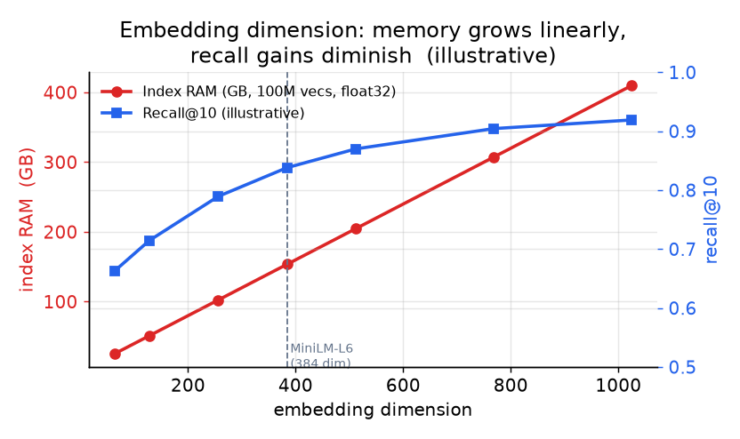

# 3. Embedding 服务

编码器模型是系统里所有向量的源头。它的输出维度、它的延迟、以及一篇文档改动后它多快能重新 embed，都会传导到下游的每一项成本上。在碰索引之前，先把编码器选对，这一点很重要。

## 模型选择

这里有两类模型值得关注。

**Bi-encoder（sentence transformer 一类，比如 BGE、MiniLM、E5、multilingual-e5）。** 它把查询或文档各自独立地编码成一个向量。检索用它是对的，因为文档那一侧可以离线预先算好。查询时只需要在线编码查询，然后和预计算的文档向量做点积（或余弦），这正是 ANN 索引要算的东西。BGE-large-en 和 multilingual-e5-large 是很强的通用基线；内存吃紧时，all-MiniLM-L6（384 维）是标准的小而快的选项。

想从头到尾看看一个纯编码器的 bi-encoder 长什么样：[Model Zoo 里的 all-MiniLM-L6](https://www.neurarch.com/?import=https://raw.githubusercontent.com/neurarch-ai/awesome-llm-model-zoo/main/architectures/all-minilm-l6/model.json)。pooling 层和最终的 embedding 维度，是决定索引 RAM 预算的两个架构旋钮。

**Cross-encoder。** 它把查询和文档放在一起读，输出一个相关性分数，但不产生独立的向量。它更准，但没法离线预计算。把它留给重排阶段，在一个小的短名单上用，不要拿它在全量语料上做检索。

**维度是核心的成本旋钮。** 一亿篇文档用 float32 存，384 维模型的原始向量大约要 153 GB；1024 维模型大约要 409 GB。ANN 索引还要在这之上再加图的边（HNSW）或者编码（PQ）。选能过召回门槛的最小模型，而不是榜单上最大的那个。

*embedding 维度增大时，索引 RAM 线性上涨，召回的增益却越来越平。用 384 维模型代替 1024 维，在大多数语料上内存能省 62%，召回只掉一点点。曲线仅为示意，请在自己的数据上实测。*

有些模型支持 **Matryoshka 表示学习**：向量的前缀（比如 4096 维向量的前 512 维）本身就是一个有效的更短 embedding。LinkedIn 用这个办法，在 2048 维上做便宜的近似 ANN 检索，再把完整的 4096 维向量喂给排序阶段，而这一切只需要训练一次模型。当你想要一个便宜的检索阶段和一个更精确的排序阶段、又不想维护两个独立编码器时，这就是该用的技巧。

## 同一个模型，两种负载

编码器干的是两件很不一样的活，部署方式应该分别与之匹配。

**写路径（批量 embedding）：** 首次加载时 embed 整个语料，之后对改动过的文档重新 embed。这是受吞吐限制的，不是受延迟限制的。batch 要开大（256 或更大），用 GPU 跑吞吐，工作异步流水线化。新鲜度 SLA（本设计里是分钟级）定义了从文档改动到它的向量在索引里更新完毕之间、能容忍的最大滞后。

**读路径（查询 embedding）：** 每个请求 embed 一条查询，受延迟限制。要缓存查询 embedding：同一条或几乎一样的查询常常会反复出现。举个例子，Instacart 的商品双塔模型通过 FAISS ANN 提供服务，索引每天重建一次，把离线的 embedding 工作和在线查询路径分开。50ms 的总预算大概只能留 5ms 给查询 embedding，所以缓存未命中时也必须够快；384 维的 MiniLM-L6 在 CPU 上单线程推理，每条查询大约 5ms。

## 新鲜度

一篇文档被插入或修改后，必须在新鲜度 SLA 之内变得可搜。编码器（异步地）把它 embed，得到的向量 upsert 进索引，文档文本则加进词法索引。这两次写入互相独立，落地时间可能略有先后，只要两个索引都能在 SLA 之内达到最终一致，这是可以接受的。

模型升级是个特例。换了编码器模型，系统里的每一个向量都得重新 embed：新旧向量处在不同的空间里，不能混在一个索引中。模型升级要按一次完整的重建索引事件来规划：在旧索引旁边建新索引，双读做验证，然后切换。这是一次存储和成本事件，不只是一次软件上线。

## 什么时候用哪个模型

| 选它 | 什么时候 | 而不是 |
|---|---|---|
| 小 bi-encoder（MiniLM-L6，384 维） | 内存或延迟是硬约束；领域是通用英文文本 | 一个大模型，只因为某个 benchmark 说"大的赢"，但你的 RAM 账单不同意 |
| 大 bi-encoder（BGE-large-en、E5-large，1024 维） | RAM 够用，而小模型的检索召回够不到门槛 | 同一召回水平下的小模型 |
| 多语言 bi-encoder（multilingual-e5-large） | 查询或文档跨多种语言 | 在多语言数据上用纯英文模型（Dropbox 测出过很大的 MRR 差距） |
| Matryoshka 训练的模型 | 想用一次训练得到检索和排序各用不同维度 | 每个阶段分别训练并维护一个独立编码器 |
| Cross-encoder | 给 100 个候选的短名单做最终排序 | 在全量语料上做检索，cross-encoder 的成本在那里根本不可行 |
| 领域微调模型 | 语料高度专业（代码、生物医学、法律），MTEB 上的模型漏掉关键词项 | 当领域内召回可测量地低于门槛时还坚持用现成模型 |

**工具。** bi-encoder 和 cross-encoder 都通过 sentence-transformers 提供服务，它能加载 MiniLM、BGE、E5、multilingual-e5 的 checkpoint，并从同一套 API 暴露 cross-encoder 重排器。领域微调用的是同一个库的训练循环，而 MTEB benchmark 是在拍板之前比较候选模型的标准方式。有些 checkpoint 用 Matryoshka 表示学习训练，一个模型就能给出多个有效维度；得到的向量最终落进 FAISS（Meta）、Qdrant 或 Weaviate 这样的向量索引里，索引的 RAM 预算直接由所选维度决定。

**出处。** bi-encoder 与 cross-encoder 的划分可以追溯到 Sentence-BERT（UKP Darmstadt，2019），产出的向量则落进 FAISS（Meta）这类索引。

**案例演算。** 一个通用英文语料、50ms 紧预算的搜索产品，会选 384 维的小 MiniLM-L6 bi-encoder 而不是 1024 维模型，因为内存和查询延迟是硬约束，而在通用文本上召回的损失不大。如果实测的检索召回够不到门槛、RAM 又还有余量，它会在同一召回目标下升级到 BGE-large 或 E5-large 这样的大 bi-encoder。当查询和文档开始跨语言，它会换成 multilingual-e5 编码器，而不是拿纯英文模型硬扛多语言数据。cross-encoder 只严格用于给短名单重排，绝不用于全量语料检索；只有当代码或生物医学这类专业语料可测量地漏掉关键词项时，才会去找领域微调模型。
