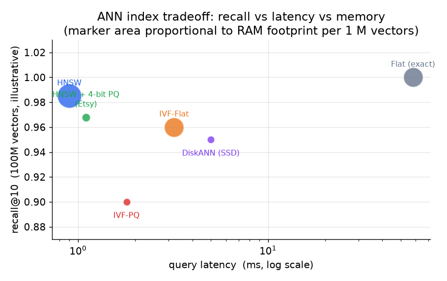

# 4. 向量索引

索引一旦选定，服务在召回、延迟、内存之间的权衡就被锁死了。它不是一个默认值，而是一个必须用语料规模、查询吞吐、内存预算和更新频率来论证的设计决策。

## 为什么要近似搜索

精确最近邻搜索每次查询都要扫一遍全部向量。一亿个向量、每个 1 微秒，一次查询就要 100 秒。改用近似最近邻（ANN）搜索，我们用一点召回损失换来巨大的提速：大多数查询拿到的结果基本一样，少数不一样的交给重排阶段处理。

## 四种主要结构



*Flat（精确）搜索是召回的天花板，也是延迟的地板；在线服务一亿向量它太慢。HNSW 在给定延迟下召回最好，但要存图加完整向量，很吃 RAM。IVF-PQ 大幅削减内存，代价是一些召回，在十亿规模上是务实之选。DiskANN 把向量推到 SSD 上，召回仍有竞争力，同时把 DRAM 成本压得很低。位置仅为示意，请在自己的数据上校准。*

### Flat（暴力精确搜索）

扫全部向量，算精确距离。召回按定义就是 1.0。评估近似索引时，用它来建立召回的真值上限。一亿向量的生产索引绝对不要用它。

### HNSW（分层可导航小世界图）

HNSW 建一个多层图，每个节点是一个向量，边把不同尺度上的近似邻居连起来。查询时，从高层的入口点开始做贪心图遍历，逐层往最近邻下降。召回和延迟由搜索参数 `ef`（遍历时的 beam 宽度）控制：`ef` 越大，召回和延迟一起上升。插入是增量的：新向量直接连进现有的图，不需要全量重建，这正是 HNSW 能应对本设计新鲜度 SLA 所要求的分钟级 upsert 的原因。

内存开销是主要缺点。HNSW 要存全精度向量加图的边：每个向量大约 `(dim * 4 + M * 8)` 字节，其中 `M` 是每个节点的边数（一般 16 到 64）。一亿个向量、dim = 384、M = 32，大约是 178 GB。Spotify 的 Voyager（封装了 hnswlib）把向量压成 8 位浮点（E4M3），报告了 4 倍的内存缩减。

贪心遍历（`ef = 1` 的基础情形，还没有扩展 beam）从入口节点跳到离查询更近的那个邻居，直到没有邻居比当前节点更近为止：

```python
def greedy_search(graph, dist, entry, query):    # graph: node -> list of neighbor ids
    cur = entry                                    # start at a fixed entry point
    while True:
        best = min(graph[cur], key=lambda n: dist(n, query), default=cur)  # closest neighbor
        if best == cur or dist(best, query) >= dist(cur, query):           # no neighbor is closer
            return cur                                                     # local minimum reached
        cur = best                                 # descend toward the query
# on chain 0-1-2-3 with dist(n,q)=abs(n-3): greedy_search({0:[1],1:[0,2],2:[1,3],3:[2]}, lambda n,q: abs(n-3), 0, None) -> 3
```

**频繁变动下的边界情况：删除是 HNSW 的软肋。** 上面说的增量插入只是 upsert 的一半。HNSW 没有干净的删除：大多数实现只把被删向量标成墓碑（tombstone），节点仍然留在图里，因为物理上把节点抠掉会切断其他节点赖以保持可达的邻居链接。在频繁变动下，图里会堆积越来越多的墓碑节点，贪心遍历照样要经过它们，于是活跃集合明明没变，召回却慢慢下滑，延迟慢慢上爬，而且这种退化是无声的，因为没有任何报错。缓解办法有两个：删除时把被删节点的邻居重新连起来（有些库会这么做，代价付在写路径上），以及当墓碑比例超过阈值时安排一次全量重建。一个每天 upsert 几百万篇文档的服务，应该为这次重建留出预算，而不是假设增量插入永远免费。

### IVF-PQ（倒排文件加乘积量化）

IVF-PQ 把向量聚成 `nlist` 个单元（Voronoi 划分）。查询时只搜离查询最近的 `nprobe` 个簇中心，把扫描范围缩到语料的 `nprobe / nlist`。然后乘积量化（量化的意思是用一小组近似编码代替精确的浮点值来省内存）把每个向量压成一个短编码：把向量切成 `m` 个子空间，每个子空间独立量化。编码的字节数是 `m * ceil(b / 8)`，其中 `b` 是每个子空间编码的位数。

容量估算的数学：

$$\text{raw index size} = n \times d \times 4 \quad \text{bytes (float32)}$$

$$\text{PQ code size per vector} = m \times \left\lceil \frac{b}{8} \right\rceil \quad \text{bytes}$$

$$\text{PQ compression ratio} = \frac{d \times 4}{m \times \left\lceil b / 8 \right\rceil}$$

取 `d = 384`、`m = 24`、`b = 8`（每个子空间一个字节），每个向量从 1536 字节压到 24 字节，缩小 64 倍。Meta 的 Faiss 就用这种结构，在可控的 RAM 预算里服务十亿规模的索引。

```python
import math

def pq_sizes(n, d, m, b):            # n vectors, d dims, m PQ subspaces, b bits per subspace code
    raw = n * d * 4                   # float32 raw index size in bytes
    code = m * math.ceil(b / 8)       # PQ code size per vector in bytes
    ratio = (d * 4) / code            # compression ratio vs one float32 vector
    return raw, code, ratio
# pq_sizes(100_000_000, 384, 24, 8) -> (153600000000, 24, 64.0)
```

IVF-PQ 的代价是量化带来的召回损失：压缩后的分数是近似的，所以要加一步重打分（把候选短名单的真实向量调回来），把精度找回来。`nprobe` 和 `m` / `b` 这几个旋钮让你在查询时就能在召回、延迟、内存之间调节，不用重建索引。

### HNSW 加乘积量化（HNSW + PQ）

HNSW 的图边用全精度存，向量载荷用 PQ 压缩。Etsy 在搜索索引上用 HNSW 配 4 位 PQ，用召回换内存，再对短名单做一次全精度重打分把精度找回来。这样既保留了 HNSW 图遍历的优秀召回，RAM 占用又更小。

### DiskANN（Vamana 图，SSD 承载）

DiskANN 建的是 Vamana 图（思路和 HNSW 类似），但完整向量放在 SSD 上，DRAM 里只留压缩编码用于图遍历。查询先用便宜的 DRAM 读在图上路由，最后只为最终候选从 SSD 上调取完整向量。Microsoft 报告在十亿向量上用普通 SSD 硬件做到 95% 召回、约 5ms 延迟，单机装载密度是纯 DRAM 方案的 5 到 10 倍。延迟下限由 SSD 随机读的时间决定，而不是算力。流式变体（FreshDiskANN）支持并发插入和删除，不需要全量重建。

## ScaNN 与 MIPS 的区别

Google 的 ScaNN 面向最大内积搜索（MIPS），也就是用点积相似度做双塔检索时的目标。它的核心洞见是：最小化平均重构误差（PQ 的默认目标）对 MIPS 来说是错的，真正要紧的是保住那些最高的内积，而不是平均值。ScaNN 用一个各向异性的损失项，对平行于查询向量方向的量化误差施加更重的惩罚：

$$\mathcal{L}\_{aniso} = \eta \lVert r_{\parallel} \rVert^{2} + \lVert r_{\perp} \rVert^{2}, \quad r = x - \tilde{x},\quad \eta \gt 1$$

其中 $r_{\parallel}$ 是误差中平行于查询的分量，$r_{\perp}$ 是正交分量。对 $r_{\parallel}$ 罚得更重，就能保住排在最前面的那些高内积。在 CPU 受限的服务场景下，ScaNN 在 ann-benchmarks 上取得了最好的召回对 QPS 表现。**把按欧氏距离调好的量化器直接拿来做内积搜索，会悄悄丢召回；ScaNN 的各向异性损失就是解法。**

```python
import numpy as np

def anisotropic_loss(x, x_hat, q, eta=4.0):   # x: true vec, x_hat: quantized vec, q: query direction, eta>1
    r = x - x_hat                              # quantization residual
    q_unit = q / np.linalg.norm(q)             # unit vector along the query
    r_par = np.dot(r, q_unit) * q_unit         # residual component parallel to the query
    r_perp = r - r_par                         # orthogonal remainder
    return eta * r_par @ r_par + r_perp @ r_perp   # parallel error weighted eta times more
# anisotropic_loss(np.array([1.,0.]), np.array([0.,0.]), np.array([1.,0.]), 4.0) -> 4.0
```

## 什么时候用哪种索引

| 选它 | 什么时候 | 而不是 |
|---|---|---|
| HNSW（Spotify、Vespa） | 语料装得进 RAM，要求给定延迟下最高召回，且需要增量插入 | 内存不是约束、变动又少时用 IVF-PQ |
| IVF-PQ（Meta Faiss） | 十亿规模语料，RAM 有预算限制；量化的召回损失可以接受 | 语料装得进 RAM 且想要最高召回时用 HNSW |
| HNSW + 4 位 PQ（Etsy） | 想要 HNSW 的图质量，但全精度的占用太大 | 内存够用时的全精度 HNSW |
| DiskANN（Microsoft） | 十亿向量必须塞进一台普通机器；SSD 延迟可以接受 | 成本高得离谱时还把完整向量留在 DRAM 里 |
| ScaNN 各向异性 PQ | CPU 受限的服务上做双塔内积搜索（MIPS） | 按欧氏距离调的 PQ，它会悄悄丢掉内积召回 |
| Flat / 暴力搜索 | 语料很小，或者要建立召回上限来衡量 ANN | 一亿规模上线性扫描太慢时的 ANN |

选索引之前要回答的两个设计问题：（1）语料装不装得进 RAM，（2）目录是稳定的还是频繁变动的。稳定且装得进 RAM：HNSW。十亿规模且 RAM 受限：IVF-PQ。十亿向量塞一台机器：DiskANN。目标是 MIPS：ScaNN 或 ScaNN 风格的各向异性损失。这四种覆盖了生产环境里的全部选择空间。

**提供这些索引的工具。** FAISS（Meta）实现了 Flat、IVF-PQ 和 HNSW；hnswlib 是 HNSW 的参考实现库；ScaNN 是 Google 针对 MIPS 调优的索引；DiskANN 是 Microsoft 的 SSD 常驻索引。托管服务方面，Qdrant、Weaviate、Milvus 和 pgvector 默认用 HNSW；Vespa（Spotify 和 Yahoo 在用）大规模运行 HNSW；Pinecone 把索引选择封装在托管 API 后面。

**出处。** HNSW 来自 Malkov 和 Yashunin（2016），IVF-PQ 来自 Jegou 等人（由 Meta 在 FAISS 中实现）。ScaNN 是 Google（2020），DiskANN 是 Microsoft（2019）。Spotify 自家基于树的最近邻库是 Annoy。

**案例演算。** 一个商品搜索团队有 4000 万条商品 embedding（约 60 GB，分几个副本能装进 RAM），每天新进约 5 万条商品，要求 p99 低于 30 ms、recall@10 高于 0.95。两个设计问题指向同一个答案：语料装得进 RAM，而且每天都在变动，所以选 HNSW，因为它在低延迟下召回最高，又支持增量插入、不用全量重建（进程内用 FAISS 或 hnswlib，或者用 Qdrant/Weaviate 托管）。如果这个目录后来涨到 20 亿向量而 RAM 预算不变，同一个团队会转向 IVF-PQ，接受量化的召回损失；如果必须跑在一台机器上，就用 SSD 上的 DiskANN。如果 embedding 是双塔点积向量，MIPS 这个细节就很要紧：优先用 ScaNN 的各向异性 PQ，而不是一个会悄悄丢内积召回的、按欧氏距离调的索引。

## 实现和训练里的坑

向量索引的 bug 都很安静：召回掉了却不报错，所以你是从用户投诉里、而不是从堆栈里得知的。在一个样本上拿 flat 暴力搜索的上限来测召回，这些故障就会现形：

| 问题 | 症状 | 修法 |
|---|---|---|
| ANN 召回对延迟 | 在要求的 p99 下 recall@k 达不到目标 | 调高 `ef`（HNSW）或 `nprobe`（IVF）直到召回达标，再把付得起的延迟换回来；对着 flat 上限校准 |
| MIPS 上的度量不匹配 | 按欧氏距离调的量化器下，内积排序悄悄出错 | 点积检索用 ScaNN 风格的各向异性 PQ，或者做 L2 归一化并把索引切到余弦 |
| 向量没归一化 | 余弦索引吃了原始向量，排序跑偏 | 插入和查询时都做 L2 归一化，让存储的度量和想要的度量一致 |
| 量化召回损失 | IVF-PQ 或 PQ 压缩后的分数把真实 top-k 的顺序打乱 | 为短名单调回全精度向量重打分，把编码丢掉的精度找回来 |
| 分片召回损失 | 语料切到多个分片后，合并的 top-k 丢掉了真正的近邻 | 每个分片都多取 k 条再合并，而不是每片只取 k/分片数 |
| HNSW 内存爆炸 | 索引加载时 OOM | 事先按每个向量 `(dim * 4 + M * 8)` 字节做预算；装不进 RAM 就换 IVF-PQ 或 DiskANN |
| 频繁变动下索引过期 | 新进的条目要等到重建才能搜到 | 用增量 upsert（HNSW 插入、FreshDiskANN）代替周期性全量重建 |
| nprobe 或 ef 设太低 | 不管模型怎么改进，召回都被封顶 | 先调高搜索宽度旋钮；天花板往往是 beam 宽度太小，而不是 embedding |

在把效果差归咎于 embedding 模型之前，先确认索引不是天花板：扫一遍搜索宽度旋钮，对短名单重打分，并在一组留出的查询上和精确搜索做对比。
