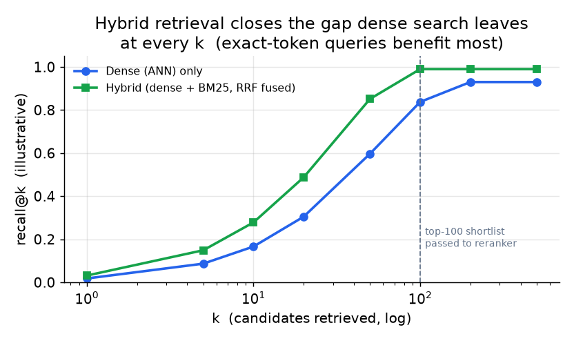
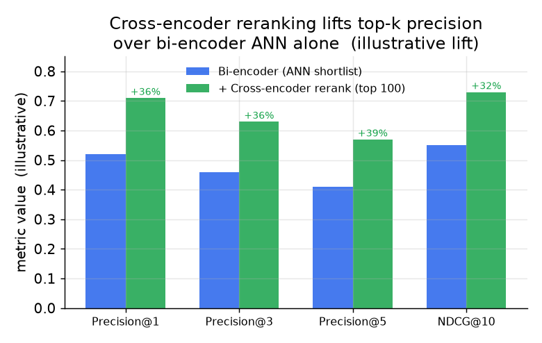

# 5. 混合检索与重排

光靠稠密检索是不够的。这一节讲为什么不够，怎么把稠密信号和词法信号融合起来，以及什么时候在上面再加一层 cross-encoder 重排。

## 为什么纯稠密检索有盲区

bi-encoder 把文本映射到一个连续向量空间。查询向量和文档向量的点积衡量的是从训练语料里学来的语义相似度。这对复述匹配和意图检索很强，但有两种失效模式。

**精确 token 漏检。** 查询里带有罕见 token（商品 SKU、错误码、人名、版本号、技术标识符）时，可能召回的是语义相关、但根本不包含那个 token 的文档。搜 "OOM-killer exit code 137"，可能召回一段讲内存管理的文字，里面从头到尾没出现 "137"。而搜这个码的用户要的就是精确匹配。词法检索不需要模型就能处理这种情况：BM25 按查询与文档之间加权的词项重叠打分，所以文档里的 "137" 对查询 "137" 会得高分。

**领域外词项。** 编码器训练时没见过的 token（新产品名、内部黑话、外语里的生僻词）在 embedding 空间里没有有意义的表示。BM25 或 SPLADE 把它们当普通 token 看待，照样能检索出精确匹配。

混合检索，也就是并行跑稠密和词法两路检索再融合结果，在自然语言问题和精确 token 查询混杂的查询分布上，稳定地优于任何单独一路。



*混合检索（稠密加 BM25，用 RRF 融合）在每个 k 上的召回都高于只用稠密。k 小的时候差距最大，因为精确词项的查询在词法这一路会排在很靠前的位置。仅为示意，差距取决于你的查询分布里精确 token 查询的占比。*

## 词法检索的选项

**BM25（概率词项加权）。** 标准的倒排索引基线。快，不需要模型，精确 token 匹配完美无缺。IDF 给常见词降权，TF 奖励密集提及。它是任何混合系统都要先打败的基线；所有主流搜索引擎都原生支持。

具体来说，BM25 对每个共有词项各算一个分数再求和：一个 IDF 权重（罕见词项分量更重）乘以一个饱和的、按长度归一化的词频。

```python
import math

def bm25_term(f, df, n_docs, dl, avgdl, k1=1.5, b=0.75):   # f: term freq in doc, df: docs holding the term
    idf = math.log((n_docs - df + 0.5) / (df + 0.5) + 1)    # rarer terms (small df) score higher
    tf = (f * (k1 + 1)) / (f + k1 * (1 - b + b * dl / avgdl))  # saturating tf, penalized for long docs
    return idf * tf                                          # one term's contribution; sum over query terms
# round(bm25_term(3, 10, 1000, 90, 100), 2) -> 7.79
```

**SPLADE（稀疏学习模型）。** SPLADE 是一个神经模型，输出的是词表上的稀疏权重向量，形状和 BM25 类似，但它学会了用相关词项扩展查询和文档。查询里的 "memory error" 可能被扩展成同时覆盖 "OOM"、"segfault"、"swap"，这样的检索既有 BM25 的词项精确性，又有语义扩展。SPLADE 向量以倒排表的形式存进现有搜索引擎（Fare 把它架在 Elasticsearch 上）。代价是 SPLADE 会扩大倒排表，索引变大，而且索引时（写路径）和查询时都要跑 SPLADE 模型。

## 比较与对照：BM25 与稠密 embedding 检索

从外面看，两路通道可以互换：都是接一个查询，查一个离线建好的索引，返回一个带相关性分数的有序文档列表。正是这种表面的相似，让不少团队以为一个能替代另一个。但分数是由本质不同的机制产生的，所以它们在不同的查询上失效。

| 维度 | BM25（词法） | 稠密 embedding（bi-encoder） |
|---|---|---|
| 接口 | 查询进，带分数的有序列表出 | 一样：查询进，带分数的有序列表出 |
| 离线建索引、在线查询 | 是（倒排表） | 是（在预计算向量上做 ANN） |
| 分数衡量什么 | 精确词项的加权重叠（IDF 乘饱和 TF） | 两个概括语义的学习向量之间的夹角 |
| 复述的表现 | "OOM" 和 "out of memory" 没有共同词项，匹配不上 | 训练时就把复述映射到相近位置，所以能匹配 |
| 没见过的 token 的表现 | 一个新 SKU 不过是又一条倒排表；精确匹配完美无缺 | 子词回退把这个 token 放到拼写相近、而非身份相近的字符串旁边 |
| 分数性质 | 无上界，尺度依赖于语料 | 有界的余弦范围，尺度依赖于模型 |
| 语料增长时什么会变 | IDF 统计按词项廉价更新 | 向量对给定模型是固定的；换模型就得全部重新 embed |

一旦查询分布同时包含自然语言问题和精确标识符，这种差别就会改变设计：两种机制谁也包不住谁，所以生产环境的答案是两路都跑、按排名融合，这正是本节接下来要搭的东西。

## 融合稠密和词法结果

两路通道各返回一份有序列表。最简单也最稳健的融合方式是 **reciprocal rank fusion（RRF）**：

$$\text{RRF-score}(d) = \sum_{r \in \text{channels}} \frac{1}{k_0 + \text{rank}_r(d)}$$

写成代码就十几行：跨通道对基于排名的倒数求和，任何地方都不做分数归一化。

```python
def rrf(rank_lists, k0=60):        # rank_lists: one ranked list of doc ids per channel
    scores = {}
    for lst in rank_lists:
        for rank, doc in enumerate(lst, start=1):     # rank is 1-based
            scores[doc] = scores.get(doc, 0.0) + 1.0 / (k0 + rank)
    return sorted(scores, key=scores.get, reverse=True)
# a doc ranked 1st in both channels scores 2/(60+1); channels never compare raw scores
```

其中 $k_0$ 是一个小常数（通常取 60）。一篇在两路都排第 1 的文档得分是 $2 / (60 + 1)$；一路排第 10、另一路排第 50 的文档，合并分数就更低。RRF 对通道之间的分数尺度差异很稳健（稠密的余弦相似度和 BM25 分数不在同一个尺度上），不需要调混合权重，而且在检索 benchmark 上表现出稳定的增益。

另一种做法是把每路归一化后的分数用一个调好的混合权重 alpha 线性插值：

$$s(d) = \alpha \cdot s_{\text{dense}}(d) + (1 - \alpha) \cdot s_{\text{BM25}}(d)$$

```python
def linear_fuse(dense, bm25, alpha=0.5):     # dense, bm25: {doc_id: normalized_score in [0,1]}
    docs = set(dense) | set(bm25)            # union of docs seen by either channel
    fused = {d: alpha * dense.get(d, 0.0) + (1 - alpha) * bm25.get(d, 0.0) for d in docs}
    return sorted(fused, key=fused.get, reverse=True)   # best combined score first
# linear_fuse({"a": 0.9, "b": 0.2}, {"b": 0.8, "c": 0.5}, 0.5) -> ['b', 'a', 'c']
```

这种方式对混合比例的控制更细，但需要跨通道校准和归一化分数，而且 alpha 可能得按查询类别分别调。

## Cross-encoder 重排

融合检索返回一个比如 100 个候选的短名单之后，可以用 cross-encoder 把它们重新排序。cross-encoder 在一次前向传播里把查询和文档一起读，输出一个相关性分数。因为它建模的是查询 token 和文档 token 之间的交互（注意力跨越两者），在细粒度的相关性判断上，它比 bi-encoder 准得多。代价是每一对贵上几千倍：cross-encoder 不能用在全量语料上，只能用在短名单上。



*在 top-100 短名单上应用 cross-encoder 重排器，相比只用 bi-encoder，第 1、3、5 位的精度和 NDCG@10 都稳定提升。仅为示意，增益取决于查询分布和模型家族。*

cross-encoder 重排是可选的，要不要加应该由延迟预算决定。决策树是这样：如果这个界面把结果直接展示给一个在乎前 3 条顺序的人，就加重排器；如果短名单是喂给一个反正还会重新打分的下游模型，就跳过。

## 什么时候用哪个

| 选它 | 什么时候 | 而不是 |
|---|---|---|
| 只用稠密（ANN） | 语料干净、领域内文本、没有精确词项查询；查询总是自然语言 | 查询分布里从不出现精确 token 或罕见标识符时还上混合检索 |
| 混合稠密 + BM25（RRF） | 查询混杂自然语言和精确词项（SKU、编码、人名）；在高级别面试里这是默认预期 | 精确词项召回很要紧时还只用稠密 |
| 稠密 + SPLADE | 想要带词法可解释性的语义查询扩展，而且已经有 Elasticsearch 或 OpenSearch 集群 | 问题出在词项不匹配而非语义鸿沟时还去加第二个稠密模型 |
| RRF 融合 | 混合分数尺度不兼容的通道（稠密对 BM25 永远如此） | 需要小心归一化分数、按类别调参的线性插值 |
| Cross-encoder 重排器 | top-k 的顺序对人类读者很要紧；预算允许多花 10 到 30ms；下游模型不会重新打分 | 下游阶段反正要排序时还用 bi-encoder 做最终排序 |
| 跳过重排 | 短名单喂给下游排序器；总延迟预算很紧 | 加一个跟下游已经做过的工作重复的重排器 |

**工具。** BM25 是基于 Lucene 的引擎（Elasticsearch、OpenSearch）和 Tantivy 原生支持的，SPLADE 把学到的稀疏向量以倒排表形式存在同样这些引擎里。Qdrant、Weaviate 和 Vespa 提供内置 RRF 融合的稠密和混合检索，所以两路通道加融合可以放在一个系统里。cross-encoder 重排器来自 sentence-transformers，ColBERT 提供延迟交互（late-interaction）重排，Cohere Rerank 是托管的重排 API。

**出处。** BM25 是 Robertson 和 Walker（1994），Reciprocal Rank Fusion 是 Cormack 等人（2009）。cross-encoder 重排器源自 Sentence-BERT（UKP Darmstadt，2019）；ColBERT（Stanford，2020）是延迟交互的替代方案，Cohere Rerank（Cohere）是托管选项。

**案例演算。** 一个企业 RAG 团队，用户的查询混杂自然语言问题和精确 token 查找（错误码、内部 SKU、黑话），它会跑混合的稠密加 BM25 而不是只用稠密，因为纯稠密检索会漏掉那些 BM25 白送就能抓到的精确 token 和领域外 token。它用 reciprocal rank fusion 而不是线性分数插值来融合两份有序列表，因为稠密余弦和 BM25 分数不在同一个尺度上，而 RRF 不需要按类别调权重。当它想要带词法可解释性的语义查询扩展、而且已经在跑 OpenSearch 集群时，它会加 SPLADE，而不是再立一个稠密模型。因为结果直接展示给一个在乎前几条的人，它在延迟预算内给融合后的短名单加了一个 cross-encoder 重排器；但如果短名单只是喂给一个反正会重新打分的下游排序器，它就会跳过这个重排器。
