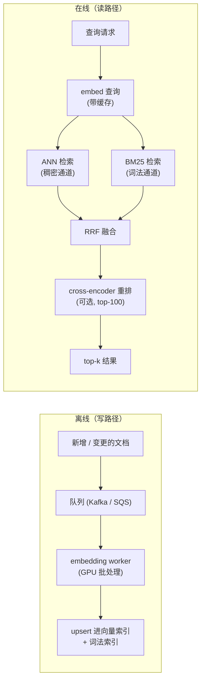

# 6. 服务化与扩展

## 延迟预算

50ms 的 p99 目标覆盖的是整次搜索调用。要把这点预算花在刀刃上，得知道每个阶段各占多少，以及余量藏在哪里。

在线（读）路径一份贴近现实的拆解：

| 阶段 | 典型开销 | 说明 |
|---|---|---|
| 查询 embedding（缓存命中） | 0-1 ms | 直接返回缓存好的向量 |
| 查询 embedding（缓存未命中） | 4-8 ms | 编码器推理；CPU 上跑 384 维的 MiniLM |
| ANN 检索（稠密通道） | 2-15 ms | 取决于索引类型、ef/nprobe、分片方式 |
| BM25 检索（词法通道） | 2-8 ms | 与 ANN 并行；倒排索引查找 |
| RRF 融合 | 1 ms | 快到可以忽略 |
| Cross-encoder 重排（可选） | 10-30 ms | top-100 候选；可以跳过 |
| 网络与其他开销 | 2-5 ms | 服务之间的跳转 |

真正能动的两块成本是稠密 ANN 检索和 cross-encoder 重排。而给重排腾出预算的两个杠杆，是查询 embedding 缓存和两路检索并行执行。

## 离线路径与在线路径

**它是怎么跑的。** 两条路径从不落在同一条关键路径上。离线这边，新增或变更的文档先落到一个持久队列里，这样摄入的尖峰不会把系统堵死；GPU embedding worker 从队列上按批取数据，把模型开销摊薄；产出的向量同时 upsert 进向量索引和词法索引，让两路通道保持同步。在线这边，一次查询只 embed 一遍，中间过一层缓存吸收重复查询，然后这一个查询向量并行扇出到 ANN 稠密通道和 BM25 词法通道。两份有序列表由 RRF 融合合并，不需要共同的分数尺度，只有融合后的短名单（top-100）才会交给可选的 cross-encoder 重排器，最后返回 top-k。这样解耦之后，写路径可以只为吞吐优化，读路径只为延迟优化，重排器看到的也就是一小撮候选而不是整个语料。

## 分片与副本

**为容量做分片。** 如果完整的一亿向量索引装不进一台机器的内存，就切开：分片 1 放文档 0 到 2500 万，分片 2 放 2500 万到 5000 万，以此类推。每次查询并行扇出到所有分片，结果先合并再融合。语料变大时延迟基本不变，因为每个分片搜的都是一个固定大小的子索引。

**为 QPS 做副本。** 每个分片的多个副本一起承接并发查询。一个无状态的 HNSW 副本在启动时把索引加载进内存，之后无共享状态地对外服务（Spotify 用的就是无状态 Kubernetes pod，每个 pod 把索引放在内存里）。

## 过滤：推进索引里做，不要放在后面

查询带属性过滤（时间范围、类目、归属 ID）时，一种偷懒的做法是后过滤：先在全部一亿向量上跑 ANN，再把不满足过滤条件的文档丢掉。如果 99% 的文档都过不了过滤，那 99% 的 ANN 预算就白花了。

**把过滤推进索引里。** IVF 允许在扫码之前限定搜哪些簇：一个类目过滤能直接干掉整批簇，扫描只碰到相关的那个分区。Vespa 的 HNSW-IF 设计天然处理这件事，它把用于稠密检索的 HNSW 图和一个支持属性过滤的倒排文件耦合起来，不用遍历整张图。

如果过滤条件极其严苛（能通过的文档不到 1%），分区策略比 ANN 更划算：给每个过滤值维护一个独立的小索引，带过滤的查询直接路由到对应的子索引。

## 新鲜度：增量 upsert

一亿文档规模上做全量重建索引，又慢又贵。分钟级的新鲜度 SLA 要靠增量 upsert 来满足。

**HNSW** 原生支持增量插入：新向量直接连进已有的图。删除则要靠打墓碑（标记删除、从结果里排除）加定期 compaction 来释放内存。

**IVF-PQ** 把新向量分配给最近的中心点，追加到对应的倒排表上。新向量不需要重建。如果数据分布随时间漂移（出现新的商品类目、季节性变化），中心点会变陈旧，召回也跟着漂移；定期重新聚类（不是全量重建）可以纠正这一点。

**DiskANN**（FreshDiskANN）支持在 SSD 承载的 Vamana 图上并发插入和删除，无需全量重建。

## 瓶颈

| 瓶颈 | 最先看到的症状 | 怎么修 | 代价 |
|---|---|---|---|
| 查询 embedding 延迟（缓存未命中） | 新查询的 p99 冲破预算 | 缓存高频复用的 embedding；换更小的编码器模型 | 小模型带来轻微的召回损失 |
| 索引内存超预算 | 索引节点 OOM | 上 IVF-PQ 或 4-bit PQ 压缩；降低 embedding 维度；分片到更多机器 | 量化带来的召回损失 |
| ANN 检索延迟过高 | ANN 吃掉了延迟预算的大头 | 调低 `ef` / `nprobe`；加分片；换索引结构 | 召回损失 |
| 召回太低（稠密的盲区） | 带精确 token 的查询漏掉相关文档 | 加一路词法通道（BM25 / SPLADE）并融合 | 要维护两路通道 |
| 过滤性能变差 | 带严苛过滤的查询很慢或者漏文档 | 把过滤推进索引里；加按分区拆的子索引 | 要管理更多索引结构 |
| 索引陈旧 | 新文档在 SLA 之内搜不到 | 流式 upsert 流水线；缩短批次间隔 | 写路径变复杂 |
| 重排器的长尾延迟 | 重排一跑 p99 就飙 | 截短重排器的输入；按查询类别决定要不要重排 | 跳过重排的那些查询精度下降 |
| 模型升级要重建索引 | 只有一个索引就不可能零停机 | 新索引和旧索引并存；双读；再切流 | 存储临时翻倍 |

**细节。** ANN 检索延迟那一行的两个旋钮分别来自两个索引家族：ef（ef_search）是 HNSW 的 beam 宽度，也就是沿可导航图下降时保留的候选节点数（Malkov 和 Yashunin，2016）；nprobe 是 IVF-PQ 的单元数，也就是一次查询要扫多少条倒排表（Jegou 等人；FAISS 出自 Meta）。两者都大致以线性的方式拿召回换延迟，所以只有在确认召回还在线以上之后才把它们调低。召回太低那一行之所以要加一路词法通道，是因为稠密向量会把精确 token 糊掉；BM25（Robertson 和 Walker，1994）能把编码器从没学会区分的 SKU、编码和罕见标识符捞回来。
