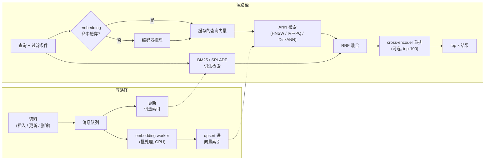

# 9. 小结

## 一页回顾

- **这个系统有两条路径。** 离线：批量编码语料，建 ANN 索引外加一个词法索引。在线：embed 查询，并行搜两个索引，融合结果，可选地对短名单做重排。

- **embedding 维度是最核心的成本旋钮。** 索引内存随维度线性增长，而召回的收益递减。选那个刚好能过你召回线的最小模型。Matryoshka embedding 让一次训练同时供上两档质量（检索和排序）。

- **索引的选择就是在敲定召回、延迟、内存三者的权衡。** 语料装得进内存就用 HNSW 拿最好的召回；十亿级又要控内存预算就用 IVF-PQ；一台普通机器上放十亿向量就用 DiskANN；内积检索就用 ScaNN 的各向异性 PQ。要按内存条件和更新频率来匹配，而不是按某个默认值。

- **混合检索是默认预期，不是可选项。** 稠密 embedding 会漏掉精确 token 类的查询（SKU、错误码、罕见人名）。BM25 或 SPLADE 跟 ANN 并行跑，再用 RRF 融合。在查询类型混杂的场景下，混合稳定优于单独任何一路。

- **压缩后第一阶段的分数是近似的，一定要重打分。** 任何量化（PQ、int8、4-bit）都会让 ANN 分数不精确。把头部候选的全精度向量调回来，重新算精确分数。永远不要把压缩后的分数当成最终结果。

- **模型升级是一次全量重建索引事件。** 新旧向量不能共处同一个空间。新索引在旁边建好，双读验证，再切流。临时预留两倍存储。

- **用 recall@k 评估，k 取你真正往下游传的那个值，用基于时间的划分，然后靠在线 A/B 把关。** 如果你要往下一阶段传 500 个，那离线量 k=10 的召回就是错的。在错误的 k 上做后过滤召回，对下游系统没有意义。

## 一页看完整个系统

## 自测

答案是折叠起来的。每题先自己想一遍再展开。

1. 就算稠密模型又大又新，为什么并行跑稠密 ANN 和 BM25 还是比单独任何一路都好？

   

答案

   因为两路通道失效在不同的查询上，而且把模型做大补不上词法这道缺口。bi-encoder 打的是两个学出来的向量之间的夹角，所以它能匹配复述（"OOM" 和 "out of memory" 没有共同词项，却落在相近的位置），但会把罕见 token 糊掉：搜 "OOM-killer exit code 137"，可能召回一段讲内存管理、通篇没出现 "137" 的文字。BM25 打的是加权的精确词项重叠，所以标识符、SKU、版本串、内部黑话都是白送的完美匹配。哪怕一个毫无瑕疵的编码器，也表示不了一个在它训练数据采集之后才出现的商品编码：分词器会回退到子词片段，把这个编码放到拼写相近的字符串旁边，那是拼写相似伪装成了语义相似。既然两种机制谁也包不住谁，生产环境的答案就是两路并行跑，然后用 **RRF** 按排名融合，它不需要共同的分数尺度，也不用按查询类别调权重。第 [1](01-clarifying-requirements.md) 节已经把查询构成钉成了自然语言加精确编码，这正是第 [5](05-hybrid-and-reranking.md) 节把混合当作默认预期而不是一项优化的原因。

   

2. 你有一亿条 768 维的 float32 向量。估一下原始的索引内存。换成 int8、以及换成 48 个子空间的 4-bit PQ 之后，这个数字会怎么变？

   

答案

   原始存储是 `n * d * 4` 字节，也就是 `100e6 * 768 * 4`，约 **307 GB**，而且这还只是向量本身。**int8** 每一维存一个字节而不是四个：每条向量 768 字节，约 **77 GB**，砍掉四分之三（Spotify 的 Voyager 用 E4M3 8-bit 浮点报出来的正好是 4 倍，Dropbox 用的是 8-bit 加自定义缩放）。**48 个子空间的 4-bit PQ** 把每条向量压到 `m * ceil(b / 8)` 字节，也就是每条 48 字节，约 **4.8 GB**，压缩比是 `(768 * 4) / 48` = 64 倍。这套算术掩盖了两件事。第一，索引不只有 payload：HNSW 每条向量还要加上大约 `M * 8` 字节的图边，M = 32 时又是约 26 GB，这也是为什么本章自己那个 384 维的方案在量化之前，全精度下落在 178 GB 附近。第二，两种压缩形式给出的分数都是近似的，所以必须为短名单把全精度向量调回来重打分；永远不要把压缩后的分数当成最终结果。规模计算见第 [4](04-vector-index.md) 节，维度作为成本旋钮见第 [3](03-the-embedding-service.md) 节。

   

3. 一个过滤条件只放过语料的 0.5%。为什么在 ANN 之后天真地做后过滤会失败，正确的设计是什么？

   

答案

   后过滤之所以失败，是因为 ANN 检索按相似度排序，完全不知道过滤条件的存在，所以能通过的文档在候选列表里出现的比例大致就是过滤的基础通过率。通过率 0.5% 时，一份 top-100 的候选列表里期望只有半篇能通过的文档，于是召回崩掉，很多查询什么都返回不了；而要向索引多要候选来保证凑够 k 个，延迟就要乘上通过率的倒数，这里大约是 200 倍。正确的设计分两档。**把过滤推进索引里**：IVF 可以在碰任何编码之前就限定扫哪些单元，Vespa 的 HNSW-IF 把稠密图和倒排文件耦合起来，让属性过滤不必遍历整张图。**通过率大致低于 1% 时，改用分区**：给每个过滤值维护一个独立的子索引，带过滤的查询直接路由过去。顺带一提，这也正是 HNSW 最吃力的场景，因为图要靠走过一批本身过不了过滤的踏脚石节点才能到达目标区域：跳过它们路径可能断掉，留着它们预算就花在了永远不会被返回的节点上。见第 [6](06-serving-and-scaling.md) 节和第 [8](08-interview-qa.md) 节。

   

4. 什么时候你会选 DiskANN 而不是 HNSW，什么时候会选 ScaNN 而不是 IVF-PQ？

   

答案

   **语料装不进 DRAM 时选 DiskANN 而不是 HNSW**，具体来说就是十亿向量必须放在一台普通机器上、而 SSD 的延迟可以接受的时候。DiskANN 让 Vamana 图能靠常驻 DRAM 的压缩码来遍历，只有最终候选才从 SSD 调全精度向量；Microsoft 报告在十亿向量上约 5ms 达到 95% 召回，单机的装载密度高出 5 到 10 倍，延迟下限由 SSD 随机读时间而不是算力决定，FreshDiskANN 还补上了并发插入和删除。如果语料装得进内存、你又想在给定延迟下拿到最好的召回并且白送增量插入，那就留在 HNSW。**相似度目标是最大内积检索时选 ScaNN 而不是 IVF-PQ**，双塔点积检索就属于这种情况。普通 PQ 最小化的是平均重建误差，这个目标是按欧氏距离调的，拿它来做 MIPS，会悄无声息地在内积最高的那批物品上损失召回；ScaNN 的各向异性损失修正了这一点，在 glove-100-angular 上报告同等召回下 QPS 翻倍，在 ann-benchmarks 的 CPU 服务场景下召回与 QPS 的曲线也最好。整个决策可以归结为第 [4](04-vector-index.md) 节的两个问题：语料装不装得进内存，度量是内积还是欧氏。第 [7](07-how-teams-do-it-in-production.md) 节展示了真实部署里同样的这条分界线。

   

5. 一个团队升级了 embedding 模型，紧接着线上召回就掉了。最可能的原因是什么？

   

答案

   新旧向量被混在了同一个索引里。新编码器产出的向量处在**另一个空间**，所以旧模型写下的文档向量和新模型产出的查询向量之间的距离毫无意义，索引里凡是没被重新 embed 的那部分，检索返回的就是近乎随机的邻居。整个过程不会报任何错，这也是为什么症状是召回下滑而不是服务失败。第 [3](03-the-embedding-service.md) 节的规矩是：模型升级是一次**全量重建索引事件，不是滚动发布**，系统里的每一条向量都必须重新 embed。安全的做法是新索引和旧索引并存，在标注集上验证召回，双读一段时间，再切流，并且为这段重叠期预留两倍存储。如果重建索引确实是全量做完的，那就查另外两个次高概率的原因：查询侧和文档侧跑的已经不是同一个编码器了，或者搜索宽度的旋钮（`ef`、`nprobe`）从来没有针对新维度重新调过，而第 [8](08-interview-qa.md) 节提到，这一点足以让召回封顶，模型再好也没用。

   

6. 解释一下为什么平行于查询向量方向的量化误差比正交方向的误差更伤 MIPS 召回，以及哪个系统明确处理了这件事。

   

答案

   因为 MIPS 是按与查询的点积排序的，而量化残差里只有沿查询方向的那个分量才会改变这个点积。把残差 $r = x - \tilde{x}$ 拆成平行分量 $r_{\parallel}$ 和正交分量 $r_{\perp}$：内积上的误差恰好就是平行分量，正交误差对排序完全不可见。标准的乘积量化最小化的是平均重建误差，它给两个分量一样的权重；这对欧氏最近邻是对的目标，对 MIPS 却是错的，于是码本把预算花在缩小那些根本改变不了排序的误差上，反而把平行误差留给了内积最大的那批物品，而那批恰恰是应该排在最前面的。**Google 的 ScaNN** 用一个各向异性损失明确处理了这件事，
   $\eta \lVert r_{\parallel} \rVert^{2} + \lVert r_{\perp} \rVert^{2}$
   其中 $\eta > 1$，给平行分量更重的惩罚。第 [4](04-vector-index.md) 节给出的实际警告是：把按欧氏距离调过的量化器拿来做内积检索，召回会悄无声息地损失，不报错，也不告警。两个修法是用 ScaNN 那种各向异性 PQ，或者把向量做 L2 归一化并把索引切到余弦，因为只有在单位范数向量上，MIPS 和欧氏最近邻才重合（第 [8](08-interview-qa.md) 节）。

   

## 延伸阅读

- 收官之作：[完整的方案](10-putting-it-together.md)，本章的每一个选择都在那里针对场景一次性敲定、算好规模、在另外两组约束下重做一遍，最后压缩成一个可运行的单文件 ANN 索引。
- 密集参考（对比、数学、全部案例研究）：[topics/08-semantic-search-and-embeddings.md](../../topics/08-semantic-search-and-embeddings.md)。
- 按公司拆解和面试题库：[tools/teardowns/08.md](../../tools/teardowns/08.md) 和 [tools/comparisons/08.md](../../tools/comparisons/08.md)。
- 端到端追踪一个真实的 bi-encoder，看看 pooling 层和那个决定你索引内存的 embedding 维度：[Model Zoo 里的 all-MiniLM-L6](https://www.neurarch.com/?import=https://raw.githubusercontent.com/neurarch-ai/awesome-llm-model-zoo/main/architectures/all-minilm-l6/model.json)。
- 多模态 embedding（文本和图像在同一个空间里）：[Model Zoo 里的 CLIP ViT-B/32](https://www.neurarch.com/?import=https://raw.githubusercontent.com/neurarch-ai/awesome-llm-model-zoo/main/architectures/clip-vit-b32/model.json)。
