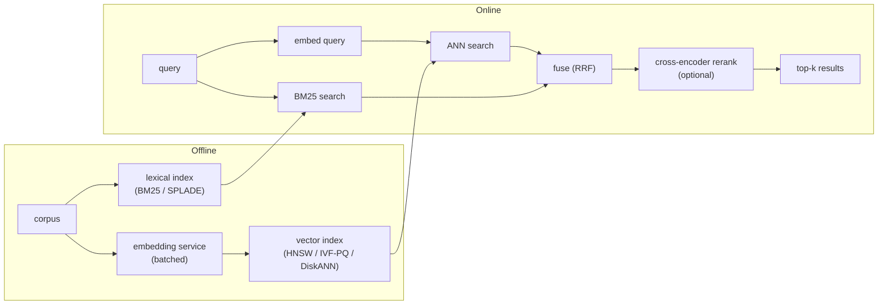

# 语义搜索与 Embedding 服务

> 本章是英文原版的中文译本，原文见 [book/semantic-search/](../../book/semantic-search/)。译文和原文同步维护，发现问题请提 issue。

面试官很少直接说"设计一个向量数据库"。他们会说：**"设计一个搜索服务，从一亿篇文档里找出最相关的 100 篇，50 毫秒以内返回。"** 这就是一个语义搜索与 embedding 服务：一个把文本变成向量的编码器，一个能快速找到相似向量的索引，再加一条把稠密语义匹配和词法信号融合起来的流水线，让两边的盲区都不至于把产品搞砸。

本章从头到尾把这个服务搭起来，并展示 Spotify、LinkedIn、Etsy、Instacart、Meta、Google、Microsoft 等团队实际是怎么上线的。

## 各节

1. [澄清需求](01-clarifying-requirements.md)：一段在动手设计之前划定问题边界的对话。
2. [搭出系统骨架](02-frame-the-system.md)：四个阶段（embed、索引、检索、重排），以及它们之间流动的是什么。
3. [Embedding 服务](03-the-embedding-service.md)：模型选择、批处理、把维度当成本旋钮、以及新鲜度。
4. [向量索引](04-vector-index.md)：flat、IVF、HNSW、PQ 的对比，召回、延迟、内存三者的权衡，以及背后的数学。
5. [混合检索与重排](05-hybrid-and-reranking.md)：为什么光靠稠密向量不够，BM25/SPLADE 融合，以及 cross-encoder 重排。
6. [服务化与扩展](06-serving-and-scaling.md)：延迟预算、过滤、分片、新鲜度，以及瓶颈表。
7. [真实团队在生产环境里怎么做](07-how-teams-do-it-in-production.md)：真实设计在哪里分道扬镳，以及第一手的技术文章。
8. [面试问答](08-interview-qa.md)：常考的、有坑的、经常答错的，配上清楚的答案。
9. [小结](09-summary.md)：一页回顾、mermaid 全景图、自测题。
10. [把它们拼起来：完整的方案](10-putting-it-together.md)：一套默认技术栈，把场景连同内存和延迟的计算从头到尾做一遍，同一个系统在三组不同约束下的样子，以及一个最小可运行的 ANN 索引。

## 一页看完整个系统

第一遍请按顺序读，每一节都建立在前一节的基础上。

## 姊妹章节

经典 ML 那本姊妹书从另一个方向讲了同一块内容：[candidate-retrieval](https://github.com/neurarch-ai/awesome-ml-system-design/tree/main/book/candidate-retrieval/) 讲的是同一种索引被用作推荐系统的召回阶段，只不过那里的查询是一个用户，而不是一段文本。
