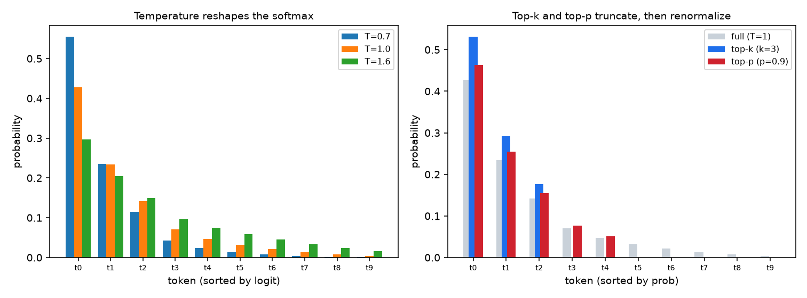
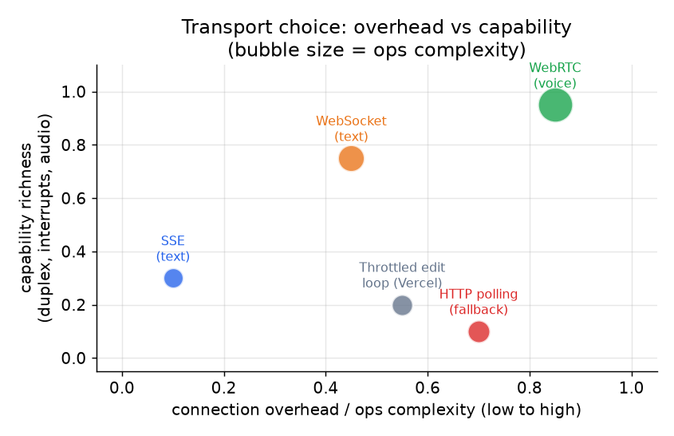
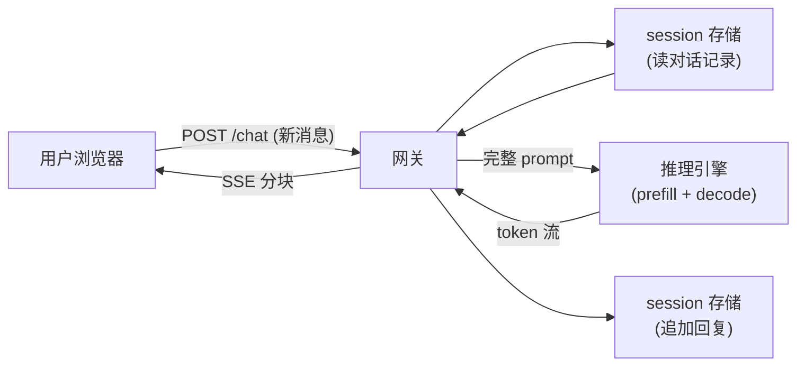
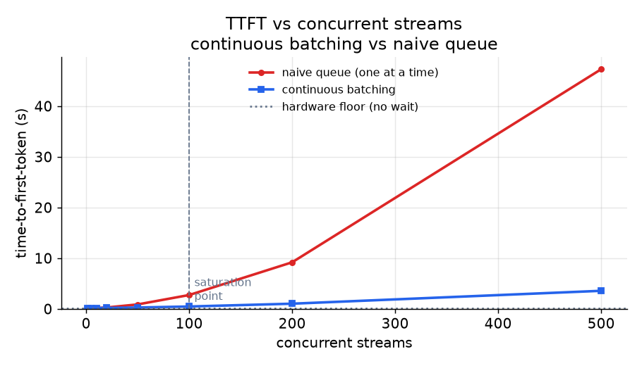

# 2. 流式模型

## 为什么要流式输出

语言模型不是一口气把回复吐出来的。它一次 decode 一个 token，每个 token 都以前面的 token 为条件。
这意味着 prefill 一结束，第一个 token 几乎立刻就有了，而最后一个 token 要在几秒之后才到。

流式输出利用的就是这一点。与其把整条回复攒齐了再一次性发出去，不如模型每吐出一个 token 就立刻推给客户端。
用户看到回复实时地一点点长出来，哪怕整次生成要花好几秒，产品也显得很快。

用户在意的指标是**首 token 延迟（time-to-first-token，TTFT）**：从发出消息到看见第一个字符出现之间的那段间隔。
TTFT 主要由 prefill（读入 prompt 并算出 KV cache）决定，而不是 decode。回复剩余部分的体感延迟取决于 decode 速度，
对一个中等规模的模型跑在现代 GPU 上，这个速度足够快，逐 token 的显示看起来是流畅的。

公式是：

$$T_{\text{felt}} = T_{\text{TTFT}} + (N - 1) \cdot t_{\text{inter}}$$

其中 $N$ 是生成的 token 数，$t_{\text{inter}}$ 是相邻 token 间隔。用户评判的是 $T_{\text{TTFT}}$；
后面那一长串则取决于每个 token 的那一项。

只有当 decode 一步加上一跳传输的时间保持在每 token 大约 20 到 40 ms 以内，流才显得顺滑，这差不多是人的阅读速度。

## 输入与输出

**流式层每一轮的输入：**
- Session id（把请求路由到正确的副本）
- 新的用户消息（文本）
- 认证 token

**流式层每一轮的输出：**
- 一串 token 事件，增量送达
- 结尾处一个完成事件（或错误事件）
- 可选：每个分块附带的元数据（token id、结束原因、用量计数）

对话记录由 session 存储负责；客户端每次请求不发历史。网关从存储里读出对话记录，拼在新消息前面，
把完整 prompt 提交给推理引擎，再把 token 流原样接回客户端。

## 控制输出：temperature、top-k、top-p

每个流式送出的 token 都是从模型的下一 token 分布里采样出来的，请求上有三个旋钮可以塑造这个分布。
它们就是产品用来调"有创意"还是"确定性"的那几个参数，所以值得搞清楚每一个到底对概率做了什么。

- **Temperature** $T$ 在 softmax 之前把 logits 除一下：$p_i = \text{softmax}(z_i / T)$。$T < 1$ 把分布往最高的那个 token 上收紧（更确定）；$T > 1$ 把它拉平（更多样）；$T \to 0$ 就是贪心 argmax。
- **Top-k** 只保留概率最高的 $k$ 个 token 再重新归一化，砍掉那条低概率（往往也不连贯）token 的长尾。
- **Top-p（nucleus）** 保留累计概率刚好达到 $p$ 的最小 token 集合，再重新归一化。和 top-k 不同，它是自适应的：模型有把握的一步只留几个 token，没把握的一步会留很多。



*左图：temperature 重塑 softmax，T=0.7 把概率质量集中到最高的 token 上，T=1.6 把它摊向长尾。
右图：在同一个 T=1 的分布上，top-k（k=3）硬截断到三个 token，而 top-p（p=0.9）保留了累计概率达到 0.9 的
五个 token 组成的核，两者都重新归一化。logits 为示意值。*

生产环境里常见的默认值是 top-p 取 0.9 到 0.95 左右，配一个适中的 temperature；top-k 和 top-p 经常一起用
（两个过滤都做，然后采样）。

## SSE 对比 WebSocket

文本流式输出主要有两种传输方式：

**Server-sent events（SSE）** 跑在一条普通的 HTTP 连接上。服务端开一个分块响应，发送格式为 `data: ...` 的行，
客户端通过浏览器的 `EventSource` API 或者普通的 fetch 流来读。SSE 是单向的：只能服务端发给客户端。
送 token 只需要这个。SSE 能穿过标准的 HTTP 代理和负载均衡器，不需要特殊握手，运维起来很简单。

每个 token 变成一个 SSE 事件：若干 `data:` 字段行，以一个空行结束，可选地带 `event:` 事件名和 `:` 注释行
（用来发心跳）：

```python
def sse_frame(data, event=None):        # SSE wire format: field lines, blank line ends the event
    lines = []
    if event is not None:
        lines.append(f"event: {event}")          # optional event name
    for line in data.split("\n"):                 # a multi-line payload becomes several data: fields
        lines.append(f"data: {line}")
    return "\n".join(lines) + "\n\n"              # trailing blank line dispatches the event
# sse_frame("hi") -> "data: hi\n\n"; sse_frame("[DONE]", event="done") -> "event: done\ndata: [DONE]\n\n"
```

**SSE 白送的续传细节，以及里面的坑。** 浏览器的 `EventSource` 客户端在连接断开时会自动重连，
重连时会把它看到的最后一个事件的 id 放在 `Last-Event-ID` 请求头里重新发过来，前提是服务端给事件打了 `id:` 字段。
这就是内置的机制，用来在不稳定的网络上续传 token 流而不用重新生成。坑在于，它只在服务端缓存了那个 id 之后
吐出的 token 时才管用：LLM 的 decode 是不可重放的，所以一个不给每条流留缓冲的网关，要么丢掉断线期间生成的 token，
要么被迫从头重新生成，用户看到的就是流回来的时候从一个词的中间接上，中间还缺了一块。要么给事件打上 id，
并按 session 保留一个存放最近 token 的短环形缓冲；要么关掉自动重连，把断线当成完整的断连来处理（第 04 节）。
没有服务端缓冲就依赖 `EventSource` 的重连，是一个悄无声息的正确性 bug，不是什么韧性特性。

**WebSocket** 在一次 HTTP upgrade 握手之后建立一条持久的全双工连接。双方随时都能发。当客户端需要在流进行到一半时
给服务端发信号，这条双工通道就派上用场了：实时打断（"停掉这次生成"）、语音插话，或者在一条连接上复用多个并发请求
（Cloudflare 的 AI Gateway 给每条消息打 `eventId` 就是为了这个）。WebSocket 运维更重，不是所有代理都能透明穿过，
而且很多条流共用一个 socket 时需要显式的关联 id。

### 对比：SSE vs WebSocket

这两个很容易混，因为从客户端的角度看，它们对聊天做的事一样：保持一条长连接，token 一产出就推过来，不用轮询。
底下的机制在方向性、协议身份，以及连接断掉时会发生什么这几方面分道扬镳。

| 维度 | SSE | WebSocket |
|---|---|---|
| 推送模型 | 服务端通过一条保持打开的连接推送事件 | 一样：服务端通过一条保持打开的连接推送帧 |
| 以 HTTP 请求开始 | 是，而且始终是普通 HTTP（一个分块响应） | 是，但随后 upgrade 离开 HTTP，变成另一种带帧的协议 |
| 方向性 | 只有服务端到客户端；客户端输入要走另一个普通 HTTP 请求 | 一个 socket 上全双工；客户端可以在流中途发信号 |
| 重连 | 标准内置：`EventSource` 自动重连并重发 `Last-Event-ID` | 协议里没有；重连、退避、续传都得自己做 |
| 基础设施路径 | 任何会说 HTTP 的东西（代理、负载均衡器、CDN）都原样放行 | 中间设备必须支持 upgrade；有些代理和企业中间盒子不支持 |
| 消息分帧 | 带 `data:` 行的文本事件；面向文本 | 二进制或文本帧；多条流复用需要自己的关联 id |

这种差别在两个时刻会改变设计：当客户端必须在生成过程中说话（插话、实时打断、音频帧），双工 socket 就不再是可选项；
当不稳定的网络很要紧时，SSE 标准化的按 id 续传意味着恢复方案主要就是服务端缓冲，而一个 WebSocket 产品得把
整个这一套循环从零设计出来。

**什么时候用哪个。**

| 选用 | 场景 | 替代的是 |
|---|---|---|
| SSE | 普通 HTTP 上的单向 token 送达（文本聊天的常见默认） | WebSocket，除非真的需要双工 |
| WebSocket | 流中途的双工信号：实时打断、多流复用、通过子协议做认证（Cloudflare DO、Slack、Discord） | 通道只有服务端到客户端时用 SSE |
| WebRTC over UDP | 语音音频，避免丢包时的队头阻塞 | 基于 TCP 的音频传输 |
| 限流编辑循环 | 无法原生流式输出的平台（Teams、Discord 的某些模式）、Vercel 的兜底路径 | 平台支持时用原生流式 |

**来源。** Server-Sent Events 是 W3C/WHATWG 的 Web 标准（长连接 HTTP 响应之上的 HTML `EventSource` 接口），
所以普通 HTTP 负载均衡器和浏览器不需要额外配置就认得它；WebSocket、WebRTC 和限流编辑循环则是 SSE 的单向模型
不够用时的备选方案。



*各种传输方式按连接开销和能力丰富度排布。气泡大小代表运维复杂度。SSE 处在低开销、低能力的位置：它就是为单向
token 送达专门造的，别的什么都不干。WebSocket 以更高的开销换来双工能力。WebRTC 最丰富也最重，只在 UDP 真正重要的
语音场景里值得用。限流编辑循环（Vercel 的兜底）开销高（反复调 API）能力却最低，只在目标平台不支持原生流式时才用。
示意图。*

文本默认用 SSE。SSE 的模型和 token 送达的模式严丝合缝，调试更简单，HTTP 负载均衡器不用配置就认得它。
只有产品需要双工信号时才去用 WebSocket。

## 流式路径的细节



**工作过程。** 一轮就是一个 POST，只带新消息和一个 session id，不带整份对话记录。网关先从 session 存储里
读出之前的对话记录，和新消息拼在一起，把完整 prompt 交给推理引擎；推理引擎把 prompt prefill 成一份 KV cache，
然后逐 token decode。每吐出一个 token，它就流回网关，以 SSE 分块的形式写给客户端，于是用户看到回复实时长出来，
而不是干等整次生成结束。decode 结束（或被取消）时，网关把完成的回复追加到 session 存储，客户端因此得以保持无状态，
下一轮也能从持久化的历史接着来。网关是唯一一个碰到每一跳的组件；存储持有状态，推理引擎持有临时的 KV cache。

网关是这里唯一有状态的代理。它读对话记录，分发给推理引擎，生成结束（或取消）后把完成的回复写回存储。

## TTFT 与并发流数



*首 token 延迟随并发流数增长而上升。没有连续批处理时，每条新流都要等一个推理槽位空出来，TTFT 随负载大致线性增长。
连续批处理（见 [topic 04](../../topics/04-inference-serving-at-scale.md)）让很多条 decode 同时共享一块 GPU，
在硬件真正饱和之前 TTFT 曲线平得多。饱和点以下，TTFT 本质上就是 prefill 的开销。饱和点以上，排队占主导。示意图。*

这张图的关键结论：一旦越过饱和点，TTFT 就由队列长度决定，和模型、硬件都没关系了。连续批处理把饱和点往后推；
过了那个点，剩下的杠杆只有队列管理和基础设施扩容。
