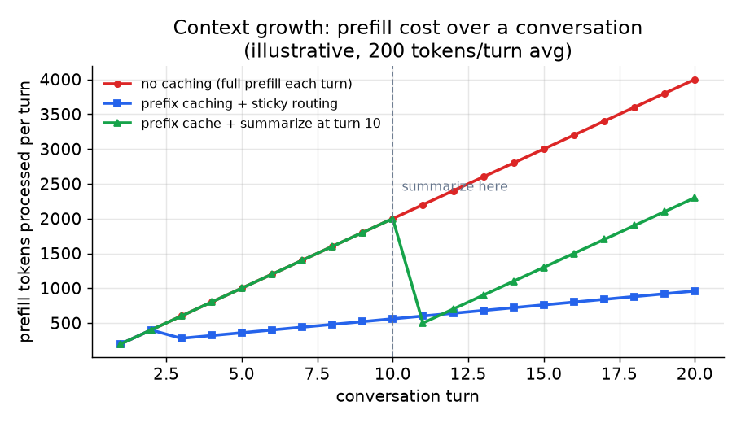

# 3. Session 与记忆

## 上下文越来越长的问题

语言模型的每一条回复都以前面的全部内容为条件。在多轮对话里，"前面的全部内容"就是完整的对话记录，
而它每一轮大约要长一条用户消息加一条助手回复。这带来两个具体的问题：

**每一轮的成本都在涨。** 每一轮开始的 prefill 阶段，模型都要把整份对话记录重新读一遍。prefill 的开销随上下文长度
增长，所以第五轮比第一轮贵，第二十轮比第五轮贵。对一个日活几百万的产品来说，这是真金白银的基础设施账单。

**迟早会撞上上下文上限。** 每个模型都有最大上下文窗口。一个超出上限的长 session，要么在对话中途报错，
要么悄悄丢掉早先的轮次，哪一种都不好。

这两个问题都有实用的缓解办法。理解这些办法和它们各自的取舍，就是一个好答案和一个泛泛答案的区别。

## 状态放哪：最根本的选择

第一个设计决策是对话记录放在哪。

**客户端保存（无状态服务端）。** 客户端保存对话记录，每次请求把完整历史发过来。服务端无状态：接一个 prompt，
生成一条回复，返回。这种设计横向扩展毫不费力，不需要 session 亲和。代价是客户端要背着越来越大的载荷，
服务端没法做服务端摘要，而且恶意客户端可以发一份任意大的对话记录。

**服务端保存（有状态服务端）。** 服务端把对话记录放在 session 存储里。客户端只发新消息。服务端从存储读历史，
跑模型，把回复写回去。服务端状态让服务端可控的摘要、更严的安全、更小的单次请求载荷都成为可能。
代价是后续轮次必须路由到正确的副本（粘性路由，下面讲）。

大多数 session 很长或者安全要求很高的生产聊天产品，选的都是服务端状态。

## 前缀缓存与粘性路由

前缀缓存是多轮对话在延迟和成本上最大的一笔收益。思路是：系统 prompt 和对话的开头部分在各轮之间是完全相同的，
它们是一段公共前缀。如果推理引擎已经算好了这段前缀的 KV cache，它就可以直接复用，不用从头再做一遍 prefill。
只有新消息（真正新出现的后缀）需要一次新的 prefill。

问题在于：前缀缓存只在后续轮次落到**同一个副本**上时才有用，也就是那个已经持有缓存 KV 状态的副本。
换一个副本来处理请求，cache 就是冷的，省下的东西全没了。

所以前缀缓存和粘性路由是一对，缺一不可。按 session id 把一个 session 始终路由到它的副本，同时把 cache 当成
优化提示而不是硬性绑定：副本挂了或者过载时，热 session 必须还能挪走。

## 摘要与截断

一旦 session 拉得很长，前缀缓存和粘性路由都挡不住上下文最终撞上模型的上限。缓解办法是限制增长：

**摘要。** 对话记录超过阈值时，对最早的那些轮次跑一次便宜的摘要调用，用摘要把它们换掉。对话继续，
摘要作为压缩后的前言。这会丢掉一些原话的细节，但能让 session 活下去，成本也可控。

**截断。** 窗口满了就丢掉最早的轮次。比摘要简单，但信息丢得很硬：长对话早期提到的某件事会无声无息地消失。

**滑动窗口。** 只保留最近的 $k$ 轮。成本有上限，行为可预测，最适合早期上下文很少用到的短记忆聊天机器人。

*三种策略下每一轮要处理的 prefill token 数。不缓存时，成本随轮数线性增长。前缀缓存加粘性路由让边际成本
保持在新消息的大小附近，直到上下文长过缓存的前缀。在第 10 轮加入摘要后，上下文长度被重置，并在这个 session
余下的时间里保持有界。示意图，平均每轮 200 token。*

## 什么时候用哪种 session 策略

| 选用 | 场景 | 替代的是 |
|---|---|---|
| 客户端保存对话记录 | 简单 bot、无状态的边缘部署、没有长 session 需求 | 服务端状态，当需要摘要或更小载荷时 |
| 服务端存储（Redis、Postgres） | 长 session、服务端可控的摘要、多设备连续性 | 客户端保存，当简单比可控更重要时 |
| 前缀缓存加粘性路由 | 每轮 prefill 成本随历史攀升的多轮 session | 无状态路由，每一轮都是完整 prefill 的 cache miss |
| 阈值触发的摘要 | 必须在几百轮之后还活着的 session | 截断，当能接受彻底丢掉早期上下文时 |
| 滑动窗口 | 短记忆 bot、成本有上限的产品 | 摘要，当早期上下文确实无关紧要时 |

**工具。** 服务端的对话记录存储通常是热路径、低延迟用 Redis，持久历史用 PostgreSQL，两者都很容易按 session id 做 key。前缀缓存是现代推理引擎的内置功能：vLLM 和 SGLang 都提供自动前缀缓存，复用共享对话开头的 KV 状态，再配上网关或负载均衡器里的 session 亲和层来做粘性路由。摘要和滑动窗口缓冲在 LangChain 和 LlamaIndex 里都有现成的记忆抽象，所以阈值触发的摘要或者最近 k 轮的窗口是一个配置选项，不用自己写代码。

**实例。** 一个 session 很长、还要跨设备的聊天产品，选择把状态放在服务端的 Redis 里而不是客户端的对话记录，因为它需要服务端可控的摘要，也不能信任客户端发来一份无上限的历史。它在推理引擎里打开前缀缓存，并加上按 session id 的粘性路由，让每一个后续轮次都落到已经持有热 KV cache 的那个副本上，而不是无状态路由下每一轮都是完整 prefill 的 miss。当 session 跑到几百轮时，它在阈值处对最早的轮次做摘要而不是截断，这样早期的某个引用不会悄无声息地丢掉。同一个产品里还有一个轻量的陪伴 bot，只有最近的上下文才重要，它就用一个普通的滑动窗口，成本有界又可预测。

## Session 可恢复

我们的需求里包括 session 在关闭浏览器和切换设备之后可以恢复。这意味着：

- session id 必须是持久的，绑定在用户账号上，而不是绑定在浏览器标签页或某条连接上。
- 完整的对话记录（或它的摘要）必须持久化在 session 存储里（Redis 或数据库），不能只放在内存里。
- 重连时，网关从存储读出对话记录，并挑一个对这个 session id 持有热 cache 的副本（如果有的话）。

粘性路由的 key 就是 session id。cache 是尽力而为的：没有热副本可用时，这一轮就用冷 cache 跑，付完整的 prefill 开销。
这是正确且预期之内的行为，不是故障。
