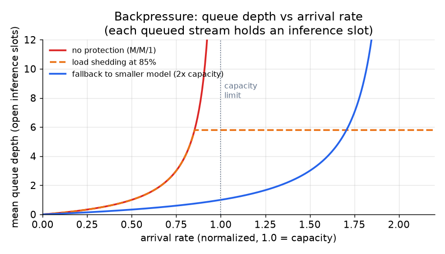

# 4. 背压与并发

## 为什么推理槽位才是稀缺资源

在流式对话系统里，GPU 容量的硬约束不是每秒请求数，而是**同时在跑的并发流数**。每一条打开的流在整个 decode
期间都钉着一个推理槽位：一次跑十秒的生成就占十秒的槽位，不管客户端实际读了多少 token。这和每个请求都很短的
无状态请求型负载有本质区别。

后果是：一个消费得很慢的客户端、一个开了标签页就走开的用户、一次被丢下不管的生成，都在悄悄吃掉 GPU 容量，
直到槽位被明确释放为止。规模一大，几千条无主的流就能把正常流量挤出去。

这一节里的每一个设计决策都从这一个事实出发。

## 取消：停止按钮是一种容量机制

用户点下停止按钮时，正确的响应不只是"别再给客户端发 token 了"，而是：

1. 关闭客户端连接。
2. 给推理引擎发一个取消信号。
3. 释放推理槽位。

跳过第 2 步，模型就会继续对着空气 decode。在一个繁忙的部署里，这就是一个本可以服务真实请求的槽位。
把取消传播到引擎在实践中并不简单（它要求推理服务支持生成中途打断，vLLM 和 TGI 都支持），但规模上去之后这不是可选项。

## 断线检测

关掉浏览器标签页的客户端不会发显式的取消。网关必须自己检测出这条死掉的连接，并中止对应的生成。做法是在下一个
token 到来时盯着写操作有没有报错：写失败了，说明连接已经没了，生成就该中止。

从客户端掉线到检测出来并中止，间隔通常是一个 token 间隔。按 30 token/秒的 decode 速率，大约是 33 ms，可以接受。
真正的风险是客户端在 TCP 层挂住却没有干净地关闭，把掉线掩盖了。在 SSE 通道上加心跳（周期性发一行 `:ping` 注释），
可以保证即使 TCP 没有发出信号，网关也能检测出死连接。

## 背压

背压说的是模型产 token 比客户端消费得快时会发生的事。网关和客户端之间的网络缓冲填满；写操作开始阻塞；
如果没有东西给它兜底，网关线程就会挂在那儿等客户端把缓冲读空。

正确的策略是有界缓冲：网关给每条流维护一个最多 $B$ 个 token 的缓冲。如果客户端还没读空缓冲就满了：

- **阻塞 decode 循环**（最简单，但这会占着推理槽位）。
- **丢 token**（有损，只在音频这类流畅比完整更重要的非文本媒体上可以接受）。
- **中止这条流**（把一个慢得没救的消费者当作断线处理）。

对文本聊天来说，大多数情况下阻塞 decode 循环是正确答案，因为丢 token 会产生乱掉的输出。缓冲要足够小，
这样真正死掉的消费者能很快被 TCP 层的写失败检测出来。

## 公平调度

多条流通过连续批处理共享一块 GPU 时，一次跑得很长的生成不应该把短的饿死。实践中连续批处理天然就处理了这件事：
调度器把 decode 步骤在所有在跑的请求之间交错执行，所以短的生成早早结束并释放槽位，不用等长的跑完。

剩下的公平性问题在排队的时候：所有槽位都被占满，新请求就要排队。公平调度的意思是，排在一个特别大的生成后面的
请求不会被饿死。简单的 FIFO 队列在这个意义上就是公平的，不过加一个优先级队列（比如 Pro 用户排在免费用户前面）也很容易。

## 队列深度与饱和点

$$\text{mean queue depth} = \frac{\rho}{1 - \rho}, \quad \rho = \frac{\lambda}{\mu}$$

其中 $\lambda$ 是流的到达率，$\mu$ 是完成率（每秒释放的槽位数），$\rho$ 是利用率。$\rho = 1$ 以下队列有界。
$\rho = 1$ 时队列无限增长。$\rho \gt 1$ 时系统过载。

*三种策略下平均队列深度随到达率的变化。没有任何保护时，队列深度在利用率接近 1 时发散。负载卸除在 85% 利用率处
把队列封顶，对超出的请求返回一个重试响应（HTTP 429 或者一条看得见的"忙碌"提示）。回退到更小的模型实际上把吞吐
翻了一倍，把饱和点往后推，在更高的到达率下也能让队列保持很浅。示意用的 M/M/1 模型。*

## 什么时候用哪种并发策略

| 选用 | 场景 | 替代的是 |
|---|---|---|
| 断线即取消，加有界缓冲 | 永远：每一个生产环境的流式部署。无主的流会悄悄吃掉容量 | 无视断线，导致槽位逐渐耗尽 |
| 慢消费者直接中止 | 消费者落后得没救了，缓冲已满 | 无限期阻塞，占着推理槽位 |
| 带明确重试信号的负载卸除 | 过载是暂时的，客户端可以重试 | 静默排队，在用户看来就像卡死 |
| 回退到更小的模型 | 流量尖峰期间，质量下降比白屏可接受 | 硬失败，对用户来说永远更糟 |
| 优先级队列（Pro 排在免费前面） | 不同用户层级需要区分延迟 | 所有用户 SLA 相同时用 FIFO |
| 横向扩容 | 批处理和回退都吸收不了的持续过载 | 无界排队，掩盖了结构性的容量问题 |

**工具。** 生成中途取消和连续批处理由推理引擎自己提供：vLLM、Hugging Face TGI 和 SGLang 都支持中止在跑的请求，并在多条流之间交错执行 decode 步骤来做公平调度。负责监测断线、执行每条流有界缓冲、通过 SSE 推流的网关通常是 FastAPI 或 Node 这类异步服务，前面挡一个 NGINX 或 Envoy 之类的反向代理，可以用 HTTP 429 卸载负载并按优先级路由。横向扩容由 Kubernetes 编排，horizontal pod autoscaler 按在跑的流数而不是原始的每秒请求数来触发。

**实例。** 一个聊天产品把断线即取消加有界缓冲当作不可商量的底线，因为否则每一个被丢下的标签页都会钉着一个推理槽位，直到有人告诉引擎中止。当 decode 甩开一个慢得没救的消费者、缓冲填满时，它中止那条流，而不是无限期阻塞 decode 循环、把槽位扣作人质。流量尖峰期间，它先用一个看得见的重试信号卸掉多余负载而不是静默排队，然后回退到更小的模型，让用户看到的是质量下降而不是白屏。它把 Pro 用户走优先级队列排在免费流量前面，只有在过载持续、批处理和回退都吸收不了时才去横向扩容。
