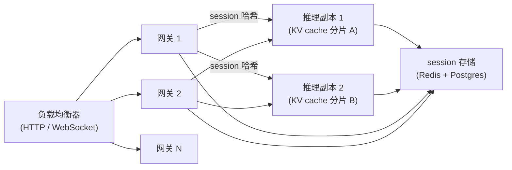
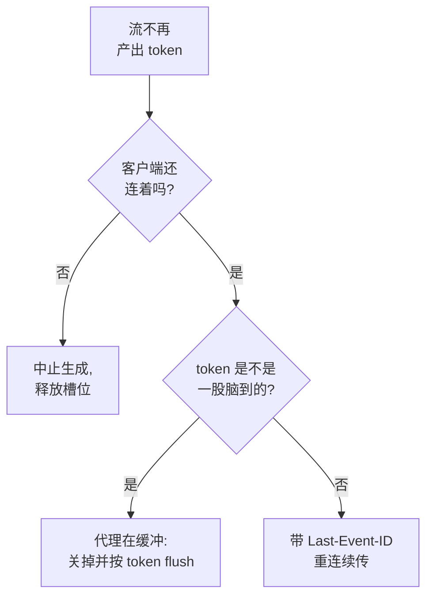

# 6. 服务与扩展

## 三个层

一套生产级的流式对话系统有三个界限分明的服务层，各自的扩展特性都不一样：

**网关层**负责接受客户端连接、鉴权、读取 session 状态、把 token 推回去。对模型权重来说它是无状态的，
但对流式连接来说它是有状态的。网关实例按连接数水平扩展。粘性路由的要求意味着：一个 session 的连接应该优先落到
那个和"持有热 KV cache 的推理副本"有亲和性的网关节点上，不过这只是软亲和，任何一个网关都能连到任何一个推理副本。

**推理层**跑模型，是受 GPU 约束的那部分资源。并发流数是真正的硬约束。连续批处理（continuous batching）让推理引擎
把很多条在途的流的 decode 步骤交错起来跑，把有效吞吐翻上去。横向扩展就是加 GPU 副本；session 应该优先路由到
缓存着自己 KV 的那个副本。

**session 存储**保存对话记录、摘要和路由元数据。每一轮都要读，每轮结束时要写。常见选择是 Redis（延迟低，TTL 好管）。
如果 session 必须扛得住 Redis 的驱逐，就再拿一个关系型数据库做持久化后端。

## 瓶颈与扩展手段

| 瓶颈 | 最先冒出来的信号 | 解法 | 代价 |
|---|---|---|---|
| 首 token 延迟高 | 负载还不大，p95 TTFT 就超标了 | 前缀缓存 + 粘性路由；减少 prefill（把历史摘要掉） | 路由变复杂；摘要会损失保真度 |
| 槽位耗尽 | 队列深度往上走；新的流要等好几秒才出第一个 token | 加 GPU 副本；还没开连续批处理就开上；丢负载或降级到更小的模型 | 成本；降级后质量下滑 |
| 跨轮次 cache miss | 并发很低的时候 TTFT 也高 | 强制 session 粘性路由；盯住命中率 | 路由约束会限制负载均衡的灵活度 |
| 无主的流占着槽位 | 槽位利用率很高，但用户 QPS 很低 | 掉线即取消；心跳 + 服务端超时 | 需要推理引擎支持中断 |
| session 存储延迟 | 网关卡在读对话记录上 | 换 Redis；把读操作和鉴权检查流水线化 | Redis 的成本和运维 |
| 长 session 的成本 | 单 session 的 LLM 花费随轮数一路往上爬 | 摘要；截断；滑动窗口 | 保真度损失 |
| 过载尖峰 | 流量突增时 TTFT 飙起来，重试又放大了负载 | 带 retry-after 的负载丢弃；降级到更小的模型 | 质量下滑 |

**展开说说。** "TTFT 高"这一行之所以能靠前缀缓存解决，是因为多轮对话每一轮都把整份对话记录重发一遍，
推理引擎可以直接复用共享前缀那部分的 KV 状态，不用重算它的 prefill，于是每轮的 prefill 就压缩到只有新消息那么长。
坑在于：这份收益只有在粘性路由把后续轮次送回那个已经握着热缓存的副本时才拿得到，所以 cache miss 那一行和
粘性路由这个解法本来就是一枚硬币的两面。"无主的流"那一行值得重视，是因为一个断掉的 SSE 客户端不会自己把 decode
槽位释放掉：TCP 关闭可能要等到下一次往 socket 写数据时才暴露出来，所以正确的做法是服务端心跳加超时，
再配上一次推理引擎的 abort 调用；引擎层面如果不支持中断，这个槽位就会被整整一次生成钉死在那儿。

## 容量计算

一套部署能承载的并发流数是：

$$N_{\text{streams}} = \frac{G \cdot \text{tok/s/GPU}}{\bar{t}_{\text{decode}} \cdot f_{\text{batch}}}$$

其中 $G$ 是 GPU 副本数，$\bar{t}_{\text{decode}}$ 是每条流的平均 decode 吞吐（token 每秒），
$f_{\text{batch}}$ 是连续批处理的效率系数（相对单流吞吐通常是 1.5 到 3 倍）。
真正卡住的是显存带宽而不是算力：大模型在小 batch 下受显存带宽限制，所以每条流只能拿到峰值 FLOP/s 的一小部分。

推论是：GPU 数量翻倍，并发流容量也翻倍。降级到参数量只有一半的模型，decode 速度大致翻倍
（每个 token 要读的显存少了），不加硬件也能把并发流的天花板抬上去。

## 网关到推理的亲和性

粘性路由的 key 是 session id。网关的负载均衡器对 session id 做哈希来挑推理副本。用一致性哈希的好处是：
加一个或者摘掉一个副本，只会让一小部分 session 重新落位，而不是全部。

某个副本挂掉时，一致性哈希环会把它身上的 session 分给相邻节点。这些 session 会付出一轮的 cache miss（冷 prefill），
然后在新副本上把缓存捂热。这就是应该有的行为：正确性不受影响，只是有一轮的延迟高一点。

## 部署拓扑

任何网关都能连到任何推理副本（保证正确性），但哈希会优先把一个 session 路由到握着它那份热缓存的副本上
（保证性能）。session 存储是共享的，它才是这段对话的持久记录。

## 实现与训练中的坑

流式对话坏掉的方式，请求响应式服务永远遇不到：连接会悄没声地死掉，代理会把你辛苦 flush 出去的流又缓冲起来，
掉线的客户端还在烧着一个 GPU 槽位。服务链路上反复出现的故障有这些：

| 问题 | 症状 | 解法 |
|---|---|---|
| 无主的流钉住槽位 | 槽位利用率很高，用户 QPS 却很低 | 掉线即取消，用心跳加服务端超时，并调用推理引擎的 abort，让 decode 槽位真的释放掉 |
| 半开的 TCP 没被发现 | 客户端已经掉了，要到下一次往 socket 写数据才察觉 | 服务端定时发心跳或者 ping，并强制一个空闲超时，别指望 socket 状态靠得住 |
| SSE 重连丢内容或者重复 | 重连的客户端丢了 token，或者从头把回复重放一遍 | 给事件分配幂等的 id，认 Last-Event-ID，服务端留一个短的重放缓冲，让流从断掉的地方接上 |
| 会缓冲的代理把流式给毁了 | token 不是逐步到达，而是最后一股脑全来 | 关掉代理缓冲（比如 X-Accel-Buffering: no），按 token 或者按小批 flush |
| 粘性路由 cache miss | 并发很低的时候 TTFT 也高 | 用 session id 做一致性哈希，路由到握着热 KV cache 的副本，并盯住命中率 |
| 重试风暴放大 | 一次 TTFT 尖峰触发客户端重试，重试又把负载翻倍，尖峰更深 | 用 Retry-After 丢负载，并要求客户端做带抖动的指数退避 |
| session 存储被驱逐 | 一次缓存驱逐之后，对话记录在半途凭空消失 | 给 Redis 的 TTL 兜一个持久化存储，让 session 扛得住驱逐 |
| 槽位耗尽 | 新的流要排队好几秒才出第一个 token | 加 GPU 副本，开连续批处理，压力大时降级到更小的模型 |

把每一条流都当成随时可能在任意一个 token 上断掉的东西来对待：掉线就释放槽位，重连要能续传，
别让代理把你费劲流出去的输出又缓冲回来。
