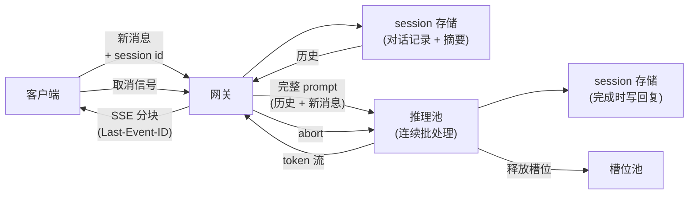

# 9. 小结

## 一页回顾

- **流式吐 token，是因为感知延迟就是 TTFT。** 模型一次解码一个 token，每个 token 一出来就送走。
  用户评判的是第一个字出现之前的那段空白，不是总生成时间。

- **文本用 SSE，语音用 WebRTC。** SSE 是单向的 HTTP，为送 token 而生，运维简单。
  当你需要在流的中途做双工信令时，WebSocket 才是该伸手去拿的那个。
  语音必须上基于 UDP 的 WebRTC：TCP 的队头阻塞会在丢包时把音频卡住，
  而 SSE 丢一个文本 token 根本不会造成那种后果。

- **状态放在服务端，就带出了粘性路由的要求。** 前缀缓存复用对话里那段稳定开头的 KV cache，
  砍掉多轮的 prefill 成本和延迟。它只有在后续轮次落到同一个副本上时才生效。
  粘性是尽力而为的，正确性不能依赖它。

- **并发流数就是容量单位。** 每一条打开的流，在它整个 decode 期间都钉着一个推理槽位。
  无主的流（掉线的客户端、被放弃的生成）会悄悄吃掉 GPU。掉线就取消，给缓冲设上限，
  并把取消一路传到推理引擎。这是容量管理，不是"讲究卫生"。

- **上下文会长，而且是你在付钱。** 在撞上上下文上限之前就摘要或者截断，不要等它出事之后。
  稳定的开头交给前缀缓存，尾巴交给摘要。不给增长设上限，一个长会话要么报错，要么贵到不能接受。

- **过载时要明明白白地降级。** 排队就把等待时间显示出来，丢负载就给清楚的重试信号，
  压力大就降级到更小的模型。无声的卡死永远比一个诚实的报错更糟。

## 整个系统一页看完

## 自测

答案是折叠的。每道题都先自己答一遍再展开。

1. 从用户的角度看，为什么 TTFT 比总生成时间更重要？这对服务层该怎么优化意味着什么？

   

答案

   用户感受到的是那块空白的屏幕，不是总时间。感知延迟可以拆成
   $T_{\text{felt}} = T_{\text{TTFT}} + (N - 1) \cdot t_{\text{inter}}$，
   而人们评判的是第一项：一条五秒的回复，如果 300ms 就开始出字，比一条两秒但生成完之前什么都不显示的回复感觉更快。
   注意流式*换不来*什么：decode 吞吐和到最后一个 token 的时间都没变，所以收益全在响应感上（见第
   [8](08-interview-qa.md) 节）。对服务层来说，这把活儿一分为二。
   **TTFT 主要由排队加 prefill 决定**，所以改善它靠前缀缓存、粘性路由和分块 prefill；
   **token 间延迟由 decode 吞吐决定**，所以改善它靠批处理策略和硬件，
   而当 decode 加上一跳传输能稳定在每 token 大约 20 到 40 ms 以内时，这条流读起来才是顺的（见第
   [2](02-the-streaming-model.md) 节）。别把它们糅成一个延迟数字，
   因为把 batch 上限调高会降低单 token 成本，同时让 token 间延迟变差，而 TTFT 基本不动。
   而且过了饱和点，这两个杠杆都不起作用了：那时 TTFT 由队列长度决定，剩下的旋钮只有丢负载、降级和加副本。

   

2. 你想用前缀缓存来砍多轮延迟。要让缓存真的有用，路由上必须成立的那条不变式是什么？它被破坏时会发生什么？

   

答案

   后续这一轮必须落到**已经握着这段对话前缀的 KV cache 的那个推理副本**上，
   实践中就是从网关到副本对 session id 做一致性哈希（见第 [3](03-session-and-memory.md) 节和第
   [6](06-serving-and-scaling.md) 节）。不变式被破坏时缓存是冷的，这一轮要对整份对话记录重新付一次完整 prefill，
   于是并发很低的时候 TTFT 也高。这是**性能故障，不是正确性故障**：session 存储里还有对话记录，
   所以这一轮答得是对的，只是慢。要区分这两种原因，看命中率曲线：
   掉一下、一两轮内就恢复的，是扩容或者副本掉线之后的一致性哈希重新平衡，因为 miss 的这一轮本身就把新副本捂热了；
   而一直低着，说明是路由 bug，每一轮都把同一个 session 送到不同的地方。
   把粘性设计成尽力而为而不是硬绑定，因为那些会打断它的事件（重启、扩容、故障切换）
   恰好扎堆出现在压力最大的时刻，所以一个只在热路径上正确的系统，偏偏会在故障期间失效。

   

3. 一个用户为同一个 session 开了两个浏览器标签页。两个标签页同时发消息，说说会发生什么。
   最先坏的是哪一个：session 存储、粘性路由，还是槽位记账？

   

答案

   **最先坏的是 session 存储。** 两个标签页 POST 的是同一个 session id，
   所以一致性哈希把它们送到同一个副本，粘性路由没问题；槽位记账也没问题，
   因为两条流占两个槽位，各自在完成、取消或者掉线时释放（见第 [4](04-backpressure-and-concurrency.md) 节）。
   出事的是围绕对话记录的那次读改写：两轮读到同一份历史，从同一段前缀 prefill，
   然后各自在完成时写回自己那条助手回复，于是第二次写落到了一份和它生成时所依据的内容已经不一致的记录上，
   一轮的上下文就这么无声无息地丢了。幂等在这里救不了你，因为第 [5](05-reliability.md) 节里的请求 id 去重
   是为了把同一条消息的*重试*折叠掉，而这里是两条真正不同的消息。
   修法是在存储前面加一个按 session 的锁或者串行点，这正是 Vercel 的 Chat SDK 要去用 Redis 或者 Postgres
   分布式锁的原因（见第 [7](07-how-teams-do-it-in-production.md) 节）；
   另一条路是让其中一个标签页的这轮等着，或者等第一轮提交之后才接受第二轮。
   这里还有一份次要成本：一个 session 上两轮并发，意味着对同一段前缀做了两次 prefill，
   所以前缀缓存只有在引擎已经把第一次的缓存写完时，才帮得到第二次。

   

4. 你的推理池利用率到了 90%，流量又涨了 30%。你按什么顺序做哪些事，每一步的代价是什么？

   

答案

   先把算术读明白：$\rho = 0.9$ 时平均队列深度是 $0.9 / 0.1 = 9$，再涨 30% 会把 $\rho$ 推到 1.17 附近，
   已经越过了 $\rho = 1$ 这个队列会无界增长的点（见第 [4](04-backpressure-and-concurrency.md) 节）。
   第零步，而且它是免费的：看看是不是槽位利用率很高但用户 QPS 很低，那说明是无主的流钉住了槽位，
   真正的修法是掉线即取消加上 SSE 心跳，不是加容量。
   **第一步，带着清楚的重试信号丢负载**：超过阈值就返回 HTTP 429 加 `Retry-After`，
   代价是让一部分用户拿到一个诚实的报错，但换来的是避免那个重试放大的螺旋：
   被默默排进队列的请求会超时，然后把自己复制一份。
   **第二步，降级到更小的模型**：参数量减半，decode 速度大致翻倍，同一批机器能扛大约两倍的流，
   代价是肉眼可见的质量下滑，但那仍然好过一块空白屏幕。
   **第三步，横向扩容**：加 GPU 副本，要花钱，要几分钟，而且会让一致性哈希环重新平衡，
   一部分 session 要付一轮冷 prefill。
   把 Pro 用户排在免费流量前面的优先级队列和这几步并列，但它是策略选择，不是容量修法（见第
   [6](06-serving-and-scaling.md) 节）。

   

5. 解释一下为什么 WebSocket 是语音音频的错误传输选择，你会换成什么。把故障模式说具体。

   

答案

   用**基于 UDP 的 WebRTC**，不是 WebSocket。故障模式是 **TCP 队头阻塞**：
   WebSocket 跑在 TCP 上，而 TCP 靠重传丢失的包来保证有序投递，
   于是所有已经排在这次丢包后面的帧都得等着重传完成。
   对一个文本 token 来说这只是没人察觉的一点延迟；对音频来说，大约 200ms 的重传卡顿是一段听得见的空白，
   对话的流畅感就毁了。UDP 把这个取舍反过来：丢了一个 20ms 的帧就直接丢掉，几乎听不出来，
   而且 WebRTC 还额外自带抖动缓冲、回声消除、拥塞控制和 NAT 穿透（LiveKit，见第
   [7](07-how-teams-do-it-in-production.md) 节）。背压策略也随着传输一起翻转：
   音频要丢掉迟到的帧，因为流畅比完整重要；文本则要把 decode 循环阻塞住，因为丢 token 会让回复变成乱码（见第
   [10](10-putting-it-together.md) 节）。这点余量之所以关键，是因为语音的预算早就花在别处了：
   $L_{\text{voice}} = L_{\text{STT}} + L_{\text{turn}} + L_{\text{LLM}} + L_{\text{TTS}} + L_{\text{net}}$
   在有 300ms endpointing 下限的情况下，网络还没算进去就已经超过一秒，再也吸收不了一次传输层的卡顿了。
   第 [8](08-interview-qa.md) 节把"语音选 WebSocket"称为这类面试里最常见的传输选型错误。

   

6. 一个用户聊到第 50 轮，上下文窗口快撑不住了。你有哪些选择，每个选择会损失什么，各自在什么时候触发？

   

答案

   四个选择，触发规则都一样：在撞上上下文上限*之前*的某个阈值就动手，而不是等它聊到一半报错（见第
   [3](03-session-and-memory.md) 节）。**前缀缓存加粘性路由**其实不算一个选择，而是前提：
   它让那段稳定的开头不必每轮重算，但它拦不住对话记录变长，所以它管的是成本，不是上限。
   **摘要**对最老的那些轮次跑一次便宜的调用，用一段压缩过的前言把它们替换掉；
   损失的是对原始措辞的保真度，它是长会话（用户会回来接着聊的那种）的正确默认，在记录越过 token 阈值时触发。
   **截断**直接扔掉最老的轮次，更简单，但信息是硬丢、无声地丢，早先提到过的某个东西就这么消失了。
   **最近 $k$ 轮的滑动窗口**给出有界、可预测的成本，适合那种早期上下文确实不相关的短记忆机器人。
   不该做的是把存下来的上下文越堆越多，指望模型"更聪明"：多存的每一个 token 下一轮 prefill 都要再读一遍，
   而且旧的轮次会和当前问题争抢注意力，所以一份有界的、摘要过的上下文常常不只是更便宜，还答得更好（见第
   [8](08-interview-qa.md) 节）。

   

## 延伸阅读

- capstone：[完整的方案](10-putting-it-together.md)，本章的每一个选择都在那儿为这个场景一次性定下来、算清容量、
  在另外两组约束下重搭一遍，最后压缩成一个能跑的单文件流式实现。
- 更密的参考资料（对比表、数学、全部案例）：
  [topics/10-realtime-streaming-chat.md](../../topics/10-realtime-streaming-chat.md)。
- 流后面那个解码器（真正在产 token 的模型）：
  [Llama-3 8B 实时图](https://www.neurarch.com/?import=https://raw.githubusercontent.com/neurarch-ai/awesome-llm-model-zoo/main/architectures/llama3-8b/model.json)。
  注意力块正是 KV cache 增长和前缀缓存复用发生的地方。分组 query 注意力让 KV cache 的显存占用
  在上下文变长时依然不大；前缀缓存框住的是每轮的 prefill 成本。这两件事要分开看。
- 相关主题：[topic 02](../../topics/02-long-context-and-kv-cache.md)（KV cache 的数学）、
  [topic 04](../../topics/04-inference-serving-at-scale.md)（连续批处理）。
