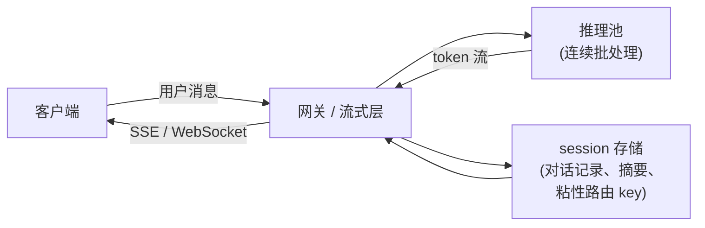

# 实时流式对话

> 本章是英文原版的中文译本，原文见 [book/streaming-chat/](../../book/streaming-chat/)。译文和原文同步维护，发现问题请提 issue。

面试官很少会直接说"设计一个 SSE"。他们会说：**"给一个多轮流式对话产品设计服务层和应用层。
讲讲 token 是怎么送到用户面前的，对话状态怎么管，以及系统在高负载和断线的情况下怎么撑住。"**

这就是本章要讲的东西。它讲的是包在模型外面的一切：把 token 送到客户端的传输层、跨轮次保存上下文的
session 存储、保护 GPU 容量的背压逻辑，还有流量突增时让产品依然有响应的优雅降级路径。

模型内部、KV cache 的显存计算、连续批处理这些，在 [topic 02](../../topics/02-long-context-and-kv-cache.md)
和 [topic 04](../../topics/04-inference-serving-at-scale.md) 里已经讲过。本章从它们收尾的地方接着往下讲。

## 各节内容

1. [澄清需求](01-clarifying-requirements.md)：一段对话，把问题的范围定下来。
2. [流式模型](02-the-streaming-model.md)：token 流式输出、首 token 延迟、SSE 对比 WebSocket。
3. [Session 与记忆](03-session-and-memory.md)：对话状态、上下文窗口管理、前缀缓存。
4. [背压与并发](04-backpressure-and-concurrency.md)：背压、取消、公平调度。
5. [可靠性](05-reliability.md)：重连、部分输出、幂等。
6. [服务与扩展](06-serving-and-scaling.md)：并发流、瓶颈表。
7. [真实团队在生产环境里怎么做](07-how-teams-do-it-in-production.md)：分歧对比表，附一手资料链接。
8. [面试问答](08-interview-qa.md)：常考的、有坑的，以及常被答错的。
9. [小结](09-summary.md)：回顾、mermaid 图、自测题、延伸阅读。
10. [把它们拼起来：完整的方案](10-putting-it-together.md)：一套默认技术栈，把本章场景从头到尾搭一遍并算清容量和 TTFT，同一个系统在三组不同约束下的变化，以及一个最小的可运行流式输出。

## 整个系统一页看完

第一次读请按顺序读。每一节都从面试官真正会问的那个问题开头，然后用能直接搬进真实系统的方式回答它。
