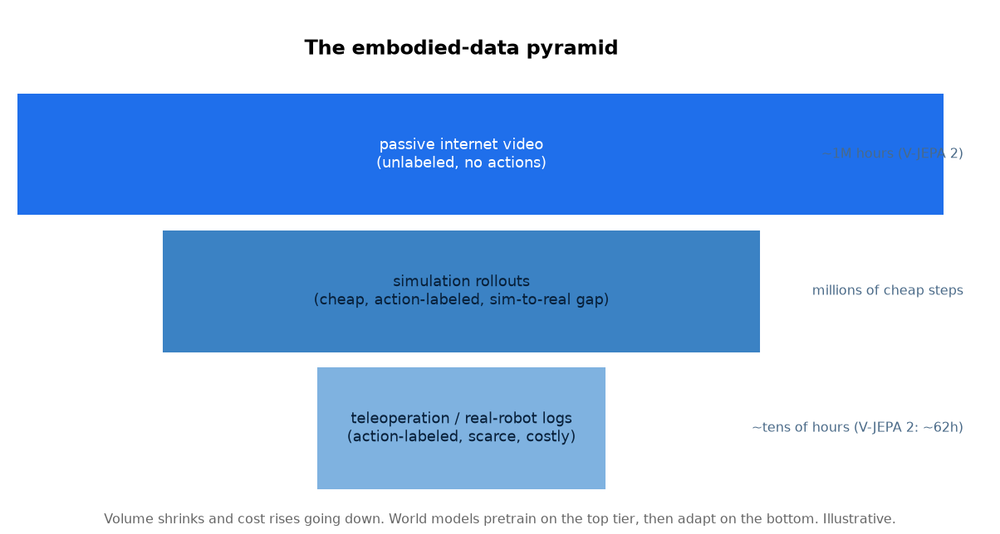

# 3. 数据

具身世界模型在数据上最核心的事实是：最要紧的地方最缺数据。被动视频几乎免费、取之不尽；
带动作标注的机器人数据又贵又少。整个训练策略都是从这个不对称里推出来的。

*沿金字塔往下走，数据量缩小，成本上升。世界模型在管够的顶层预训练，学会世界是怎么动的，
再在稀缺的、带动作标注的底层做适配，让模型变得可控。数量级仅作示意；
V-JEPA 2 报告的是大约一百万小时的视频预训练，之后在数十小时量级的机器人录像上做适配。*

## 三个层级

**被动的互联网视频（顶层，管够）。** 没有标注的、记录世界如何运动的片段：
有人在做饭，东西掉下来，车在开。没有动作标注，所以模型学到的是*动力学*
（接下来通常会发生什么），而不是*控制*（如果我这么做会发生什么）。
世界模型之所以可行，靠的就是这一层：你没法采集一百万小时的机器人遥操作数据，
但这么多视频本来就存在。问题在于被动视频展示的是没有 agent 干预时世界的演化，
所以它教的是预测，还不是可控性。

**仿真 rollout（中层，便宜且带动作标注）。** 物理仿真器能以接近零的边际成本生成
无限多带动作标注的轨迹，并且状态完全可见，方便监督。问题是 **sim-to-real 差距**：
接触动力学、摩擦、传感器噪声和光照都跟现实不一样，一个过拟合了仿真器怪癖的模型
上了硬件就不行。标准的缓解手段是域随机化（在仿真中随机变化纹理、质量和动力学参数）。

**遥操作和真机日志（底层，稀缺且精确）。** 人来操控机器人，或者机器人记录自己的尝试，
这是唯一既带动作标注又来自真实部署分布的数据。它是金标准，也是瓶颈：
每一小时都很贵，所以要把它花在适配和评估上，而不是从零训练一个模型。

## 先预训练、再适配的配方

这个金字塔决定了现代系统普遍采用的配方：**先在巨量的被动视频层上自监督地预训练动力学**，
模型在这里学会掉落的东西会往下落、被推的东西会滑动；然后**在小小的机器人数据层上做动作条件化的适配**，
模型在这里学会*自己的动作*会怎样改变世界。仿真夹在中间，既是可扩展的带动作标注数据来源，
更关键的是，也是持续评估的环境（第 5 节）。

## 具身场景特有的数据风险

- **按本体划分的分布漂移。** 在一条机械臂上采的数据，未必能迁移到另一条运动学不同的机械臂上。
  要说明数据覆盖了哪些本体。
- **被动视频里的因果混淆。** 被动视频没有动作，模型可能只学到相关性（"杯子动了"）
  而没学到原因（"一只手推了它"）。动作条件化的适配正是用来解开这个纠缠的。
- **遥操作偏差。** 人类演示者的动作平滑、接近最优，模型因此很少见到从错误中恢复的过程。
  混入自主（包括失败的）rollout，才能覆盖部署后的策略真正会碰到的那些状态。
- **仿真真实度预算。** 仿真越真实，sim-to-real 差距越小，但算力开销越大；
  域随机化牺牲一点平均真实度，换来好得多的最坏情况迁移效果。
