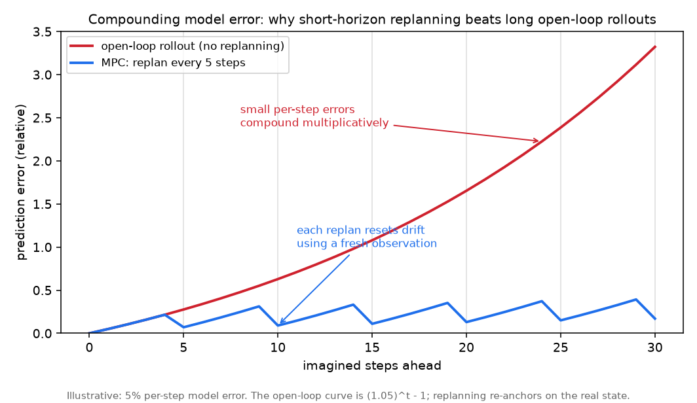
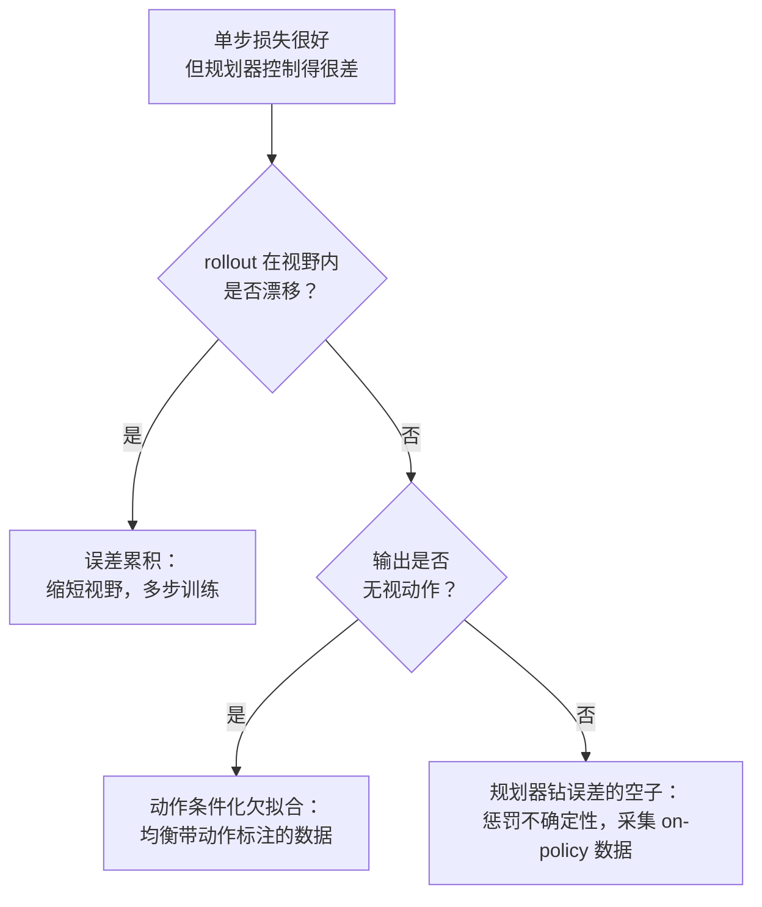

# 4. 模型开发

三个架构决策定义了一个世界模型：状态是什么、转移怎么参数化、动作从哪里进来。
然后还有第四块，规划器，它把训练好的预测器变成一个控制器。

## 状态表征

- **token 网格（生成式）。** 观测被切成 patch 做 token 化（跟视觉 transformer 一样），
  模型自回归地或者用扩散方式预测下一帧的 token。人能看懂、贵、保真度高。
- **循环隐变量（隐空间动力学）。** 一个紧凑向量承载状态；一个循环核心
  （Dreamer 这条线里的循环状态空间模型）预测下一个隐变量。rollout 便宜，
  这正是"在想象中学习"能落地的原因。
- **联合嵌入（JEPA）。** 编码器把观测映射成 embedding，预测器预报*未来的 embedding*，
  训练目标是跟编码器在真实未来上的输出对齐。不重建任何像素，
  省掉了给无关视觉细节建模的开销。

## 动作条件化

一个能预测世界的模型还不是可控的。让它可控的办法是把动作喂进转移函数，
$\hat{s}_{t+1} = f_\theta(s_t, a_t)$，然后在带动作标注的数据上训练，
让模型学会每个动作的*效果*。这正好对应"先预训练、再适配"的划分：
被动视频预训练学的是 $f_\theta(s_t, \cdot)$ 这个通用动力学，动作条件化的适配
（比如 V-JEPA 2 的动作条件化版本）学的是对 $a_t$ 的依赖。
无条件模型能做出合理的梦；只有动作条件化的模型才能回答"如果我这么做会怎样"。

## 规划器：把预测变成控制

有了动作条件化的模型，规划就是在动作序列上做搜索：给每个候选序列想象一条 rollout，
按目标打分，执行最优序列的第一个动作，然后重新规划（模型预测控制）。
**交叉熵方法（cross-entropy method，CEM）** 是标准的采样式规划器：
采样一批动作序列，按想象回报保留精英部分，把采样分布重新拟合到精英上，重复。

```python
import numpy as np
def cem_plan(state, dynamics, reward, horizon=5, n=200, elite=20, iters=3, act_dim=2, seed=0):
    r = np.random.default_rng(seed)
    mu, sig = np.zeros((horizon, act_dim)), np.ones((horizon, act_dim))
    for _ in range(iters):
        acts = mu + sig * r.standard_normal((n, horizon, act_dim))   # sample action sequences
        rets = np.zeros(n)
        for i in range(n):
            s = state
            for t in range(horizon):
                s = dynamics(s, acts[i, t])       # imagined rollout inside the world model
                rets[i] += reward(s)
        idx = rets.argsort()[-elite:]             # keep the elite sequences
        mu, sig = acts[idx].mean(0), acts[idx].std(0) + 1e-6   # refit toward the elites
    return mu[0]                                  # execute the first action, then replan (MPC)
# point mass at (5,5), dynamics s'=s+a, reward=-dist(origin): cem_plan returns an action with both
# components negative, i.e. a step toward the goal.
```

规划器是世界模型真正回本的地方：同一个训练好的 $f_\theta$，能支持任何写得成奖励的目标，
不需要重新训练。它也是延迟预算最吃紧的地方，因为每个控制步的开销大致是
`n * horizon * iters` 次模型评估（第 6 节）。

**为什么规划器是自己模型的对手，以及为什么短视野会赢。**
CEM 循环是一个优化器，而一个对着学出来的奖励做优化的优化器，会找到模型在乐观方向上出错的所有地方。
在几千条采样序列里，精英集合偏向那些被模型*高估*的序列，所以规划器会系统性地
搜寻模型的盲区（基于模型的控制里所谓的"优化器诅咒"）。有两个机制能让它保持诚实。
第一，在一个*概率集成*上做规划，每条序列的得分取它在所有集成成员上的回报，
这样只有一个模型看好的轨迹会被其他模型的分歧压下去；这就是 PETS 的做法
（Chua 等，2018），也是采样式 MPC 的经典鲁棒基线。第二，把视野压短，每一步都重新规划：
单步误差大致相互独立，一旦自我反馈就会超线性地累积，所以超过某个视野之后，
想象回报和真实回报就不再相关了；每个控制步都用一个真实观测重新锚定状态，
就能把这种累积清零。这就是为什么即使模型是按预测长序列训练的，
短视野 MPC 也比一条长的开环 rollout 更好，理由很具体。

## 各范式的训练目标

- **生成式：** 下一帧似然（对视觉 token 的自回归交叉熵）或者扩散去噪损失。
- **隐空间动力学：** 一个重建项或奖励预测项，加一个隐变量转移（KL）项；
  之后策略通过对想象 rollout 反向传播来训练。
- **JEPA：** 预测未来的 embedding，最小化它与（停止梯度的）编码器在真实未来上的 embedding 之间的距离，
  并配一个防坍缩机制，免得编码器输出一个常数。

三种范式共同的失效模式是**误差累积（compounding error）**：一个单步准确的模型，
在长的想象 rollout 里会因为小误差自我反馈而漂移。这就是为什么短视野加频繁重规划
通常胜过长的开环预测，也是为什么第 5 节要直接测多步 rollout 的漂移。



*示意图，假设每步模型误差为 5%：开环 rollout 的误差按乘法累积（红色曲线是 $(1.05)^t - 1$），
而模型预测控制每隔几步就用一个新的真实观测重新锚定，把漂移清零（蓝色锯齿线）。
两条曲线之间的面积，就是规划器要把视野压短、频繁重规划的原因。*

## 实现与训练中的坑

一个世界模型可以在留出集上的单步预测表现极好，对控制却毫无用处，
因为规划器查询它的地方远在训练分布之外，视野又长到误差会累积。反复出现的失效：

| 问题 | 症状 | 修法 |
|---|---|---|
| 误差累积 | 单步精度很高，但长的想象 rollout 漂成一团乱麻 | 缩短视野并频繁重规划（MPC）；在多步 rollout 上训练，让模型见过自己的预测作为输入 |
| 表征坍缩（JEPA） | 编码器输出几乎恒定的 embedding，预测器轻松匹配，损失看起来很漂亮 | 防坍缩机制：停止梯度的目标、EMA 目标编码器，以及方差或协方差正则 |
| 规划器钻模型误差的空子 | 规划器找到很高的想象回报，到真实系统上就失败 | 在得分里惩罚模型不确定性（集成分歧），并把动作约束在模型可信的区域内 |
| 动作条件化欠拟合 | 不管喂什么动作，模型做的梦都一样 | 在均衡的带动作标注数据上训练，并检查动作敏感度；只靠被动视频预训练学得到动力学，学不到动作的效果 |
| 暴露偏差 | teacher forcing 训练和推理时的自回归 rollout 不匹配 | scheduled sampling：训练时逐步把模型自己的预测喂回给它 |
| on-policy 分布差距 | 在日志数据上准确，策略一旦走到新状态就失败 | 迭代采集 on-policy 数据，让模型见过自己的规划器会到达的状态 |
| 想象里的奖励作弊 | 想象回报一路上涨，真实任务表现却停滞 | 把奖励锚定在可验证的信号上，并拿测得的真实回报去校验想象回报 |
| 隐变量转移过度正则化 | 动力学丢掉了区分不同结果所需的细节 | 调 KL 或转移正则的权重，用 free-bits 让隐变量保留有信息量的容量 |



按规划器使用它的方式来验证模型：测多步 rollout 漂移和 on-policy 行为，
而不只是留出集上的单步损失，否则规划器会很乐意对着模型的盲区去优化。
