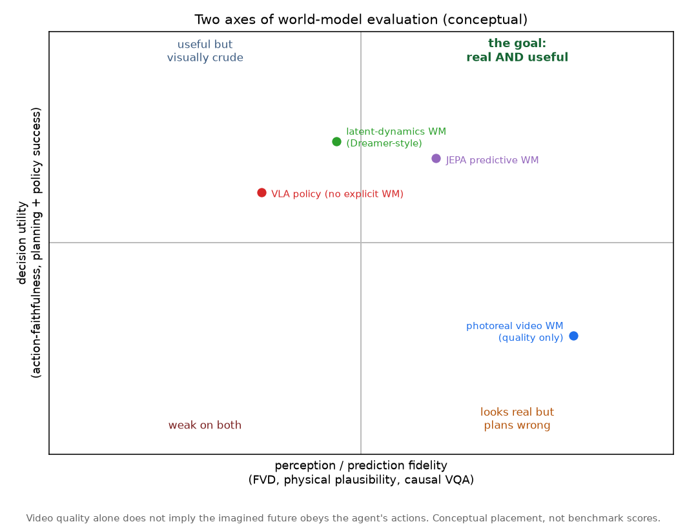
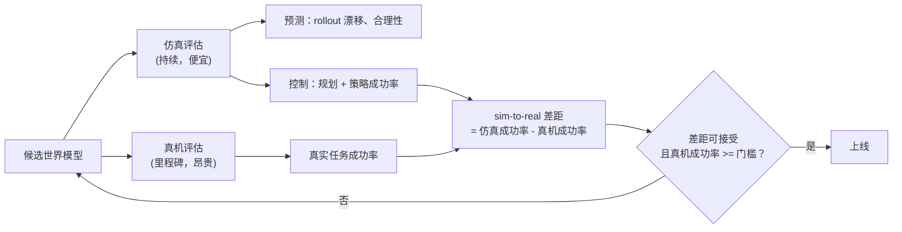

# 5. 评估

这一节才是面试真正在考的东西，也是大多数候选人答错的地方。一个世界模型要在两件互相独立的事上做好，
只优化第一件不管第二件，得到的模型看着唬人，控制起来一塌糊涂。



*两条轴互相独立。横轴是感知保真度：预测出的未来看起来对不对
（Frechet Video Distance、物理合理性测试、因果视频问答）。纵轴是决策效用：
用这个模型是否真的帮 agent 行动得更好（动作忠实度、规划成功率、下游策略成功率）。
一个照片级真实的视频模型可能落在右下角，也就是"看着真、规划错"的象限。
交付物要落在右上角。这是概念上的定位，不是 benchmark 分数。*

## 轴 1：感知与预测保真度

衡量预测出的未来像不像现实。

- **Frechet Video Distance（FVD）：** 生成视频和真实视频特征之间的分布距离。
  生成式世界模型的标准指标，单独拿出来看对控制是个很弱的代理指标。
- **物理合理性：** 预测是否遵守物理规律。Meta 随 V-JEPA 2（arXiv:2506.09985）
  一起发布的 IntPhys 2 就是专门干这个的（区分合理和不合理的场景）。
- **因果理解：** 给定一个场景和一次干预，模型能否预测出正确的后果
  （Meta 的 CausalVQA 和 Minimal Video Pairs 这两个 benchmark）。
- **开环 rollout 漂移：** 往前预测得越远，想象轨迹偏离真实轨迹的速度有多快。
  在所有保真度指标里，这一个最直接地预示控制质量，因为破坏规划的正是误差累积。

```python
import numpy as np
def rollout_error(model, s0, actions, true_states):
    # model(s, a) -> predicted next state. Imagine forward with NO ground-truth
    # correction and measure how far the imagined trajectory drifts from reality.
    s, err = s0, 0.0
    for t, a in enumerate(actions):
        s = model(s, a)                              # roll the world model forward open-loop
        err += np.linalg.norm(s - true_states[t])    # drift versus the true state at step t
    return err / len(actions)
# a perfect model returns 0.0; a model biased by 0.1 per step over 3 steps returns 0.2
# (the drift accumulates, which is exactly the compounding error that breaks long horizons).
```

## 轴 2：决策效用（真正算数的那条）

衡量用这个模型的 agent 能不能成功。

- **动作忠实度：** 想象出的未来是否正确响应 agent 选择的动作，
  而不是给出一个合理但跟动作无关的续写。近期的立场论文认为，对具身模型来说
  重要的是这个性质而不是视频质量（arXiv:2606.15032；WorldArena benchmark，
  arXiv:2602.08971，评的就是功能效用而不是像素质量）。
- **规划成功率：** 把模型放进规划器（比如第 4 节的交叉熵方法）里用时，解决的任务占比。
- **下游策略成功率：** 用模型训练或规划出一个策略，然后测任务成功率。这是北极星。

## 评估管线：仿真持续跑，真机按里程碑跑



**它是怎么跑的。** 两条评估轨道以不同节奏运行，因为花费不一样。仿真轨道每个候选模型都跑：
便宜，可以在 GPU 上并行，所以能持续报告预测指标（rollout 漂移、合理性）和控制指标
（规划和策略成功率），很快就能抓到回归。真机轨道只在里程碑上跑，因为每一次试验都要花人的时间、
磨损硬件；它测的是物理任务的成功率。两个数字合在一起，才是真正决定能不能发布的那个指标：
**sim-to-real 差距**（仿真成功率减去真实硬件成功率）。一个模型可以在仿真里看着很棒，
上了硬件就崩，只有这个差距能把它暴露出来。门控只在真机成功率过线*并且*差距小到便宜的仿真数字
以后可以当作可信代理时，才放模型出去。

## sim-to-real 差距

具身评估里最重要的一个数字。一个模型在仿真里 90%，在硬件上 40%，差距就是 50 个点，
意味着仿真器不是可信的代理，所有仿真结果都值得怀疑。两种环境下的成功率和差距都要明确报出来；
差距小，才能放心地在仿真里便宜地迭代并信任结果。域随机化和更真实的接触物理能缩小差距；
过拟合仿真器的伪影会把它拉大。

## 不要做的事

不要只报一个生成指标（FVD）就说评估完了。不要只报仿真成功率。
产品是闭环控制的时候，不要去评开环视频质量。面试里反复出现的失败，
就是把一个好看的预测当成了一个有用的预测。
