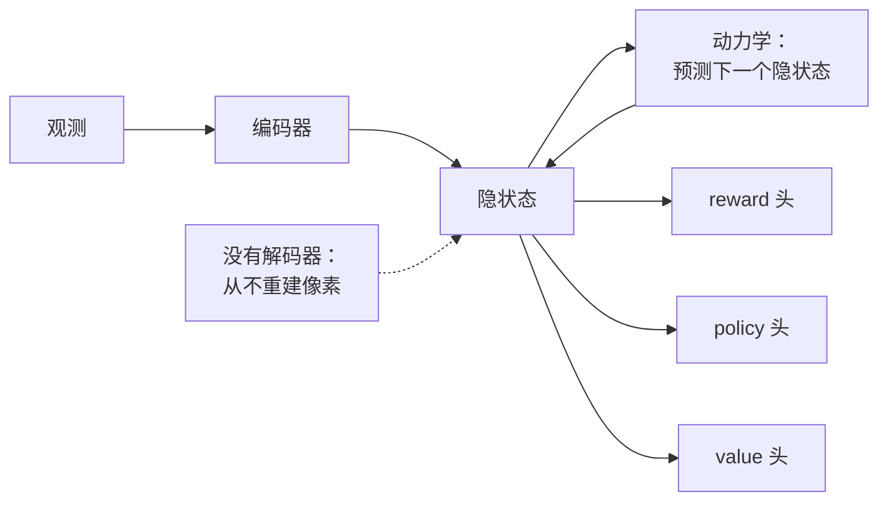

# 8. 面试问答

## 常问的

**问：一句话说清楚什么是世界模型？**
一个学出来的预测器，给定当前状态和一个动作，预测环境接下来怎么变，
这样 agent 就能在真正行动之前先想象出一个计划的后果。

**问：为什么不直接用强化学习训一个策略？**
因为真实世界里带动作标注的数据很稀缺，而真机 rollout 又慢又有风险。
有了世界模型，就能在管够的被动视频上先把动力学预训练出来，再在便宜的想象 rollout 里做规划
或者学策略，把宝贵的真实数据花在适配和评估上，而不是从零开始训练。

**问：为什么动作条件化是关键的一步？**
不带条件的模型学到的是"通常会发生什么"；只有以 agent 的动作为条件的模型，
才学得到"*如果我这么做*会发生什么"。控制需要的是后者。这也是为什么这些系统要先在被动视频上
预训练通用动力学，再在带动作标注的数据上做适配，把模型变成可控的。

## 有坑的

**问：你的视频世界模型 FVD 是 SOTA。它是个好的世界模型吗？**
不一定。FVD 衡量的是生成视频看起来有多真实，那是感知这条轴。一个模型可以照片级真实，
却在决策这条轴上不及格，只要它预测出来的未来对 agent 的动作没有正确响应就行。
要报动作忠实度和下游任务成功率，别只报 FVD。
**为什么这两条轴能背离得这么彻底：** FVD 比的是生成未来的分布和真实未来的分布，
而一个模型完全无视自己的动作输入，也照样能对上这个分布，因为预测出最典型的那种续写，
往往就是让画面显得真实的最省事的办法。规划问的恰恰是相反的问题：未来在不同动作下会怎么变，
而这正是一个以"典型性"为导向的目标函数从来不会奖励的信号。

**问：你的模型在仿真里规划得很好。为什么到了真机上可能就废了？**
sim-to-real 差距。仿真里的接触动力学、摩擦、传感器噪声和光照都跟现实不一样，
所以一个过拟合了仿真器怪癖的模型迁移得很差。两种设定下的成功率以及它们之间的差距都要报出来；
域随机化和更真实的接触物理能把差距缩小。
**为什么模型会揪着仿真器的怪癖不放：** 仿真器里的那些规律（理想化的摩擦、无噪声的传感器、
重复的贴图）比真实物理更容易学，而训练目标里没有任何东西能把它们和真实动力学区分开。
域随机化之所以管用，是因为它让这些怪癖在一堆随机化出来的世界里变得不可靠，
于是训练下来能活下去的预测器，只剩下你本来就想让模型学到的那套物理。

**问：更长的规划 horizon 看得更远，为什么反而偏好短的？**
误差累积。一个单步很准的模型，在长的想象 rollout 里会漂，因为小误差会反馈回自己身上，
所以一个长的开环规划往往还不如短 horizon 加频繁重规划准，而且每个控制步花的算力更多。
**为什么误差是累积而不是互相抵消：** 过了第一步，模型是拿自己上一步的输出来做预测的，
而那些状态它在训练时从没见过，于是每一步的误差既加了噪声，又把 rollout 推得离分布更远，
而在那里模型更不准；增长方式更接近相乘而不是相加。频繁重规划之所以管用，
是因为每一次新规划都重新锚定在一个真实观测上，把累积的漂移清零。

**问：基于模型和无模型的 RL 最后都会得到一个最大化同一个 reward 的策略；这个区别什么时候才真的重要？**
两者都从交互中学习，极限情况下都能达到同样的最优行为；在一个便宜又快的仿真器上，
它们看起来可以互相替代。区别在于每一次交互被花在了哪里。无模型方法把 reward 信号直接推进策略
或价值估计里，所以每一点提升都要消耗新的环境采样；基于模型的方法把采样花在把转移函数学明白这一件事上，
学完之后就能从里面无限地造出想象经验。当真实采样昂贵、缓慢或者危险的时候（机器人、驾驶），
这个区别才真的重要，而那也正是世界模型值得付出这份复杂度的地方。反过来也成立：
学出来的模型成了优化目标的一部分，所以一个在想象里训出来的策略，
只要模型的破绽可以被利用，它就会去利用；而当一个近乎完美的仿真器本来就很便宜时，
无模型方法不受模型偏差拖累这一点，反倒可能是更好的选择。

**问：MuZero 从不重建环境的观测也能规划。那它到底学了个什么样的模型？**
MuZero（DeepMind）端到端地训练一个隐空间动力学模型，只预测规划需要的那些量：
从编码后的状态出发，它学一个转移函数，外加 reward、policy、value 三个头，
而优化的唯一标准是让预测出的 reward、policy 和 value 与真实轨迹上实际发生的对得上。
它没有解码器，从不试图还原像素，所以隐状态可以放心丢掉一切视觉上显眼但与决策无关的东西，
它的树搜索完全在这个学出来的隐空间里进行。对世界模型的启示是：
一个模型完全可以在控制上出色，同时作为视频生成器一无是处，因为重建和决策效用是两个不同的目标。
V-JEPA 2（Meta，2025）这类 JEPA 预测式模型背后也是同一个分野，它们预测的是 embedding 空间
而不是像素空间。

*MuZero 只学规划需要的那些量（下一个隐状态、reward、policy、value），从不重建观测，
所以它的状态是为决策优化的，不是为了看起来真实。*

## 常答错的

**问：世界模型应该跑在机器人上还是数据中心里？**
只回答"跑在机器人上"只对了一半。在机器人上，你在控制回路里跑一个状态廉价的模型
（隐变量或 embedding），受硬性延迟预算约束。在数据中心里，你成批地跑那个（往往更重的、生成式的）
模型，去造合成数据和评估策略。很多生产项目从离线这个角色上拿到的价值，比在线那个更大。
**为什么这个分工是被约束逼出来的：** 控制回路每步有硬性延迟预算，重的生成式模型根本达不到；
而合成数据生成和策略评估是吞吐问题，完全没有延迟约束，所以它们可以在便宜的闲时算力上
批量地跑手头最好的模型。同一个模型家族最后落到两种部署里，是因为这两件事卡在不同的资源上。

**问：你怎么评估它？**
错的答案是拿一个生成指标交差。对的答案是两条轴，感知保真度（rollout 漂移、合理性、因果预测）
和决策效用（动作忠实度、规划与策略成功率），在仿真里持续测，到里程碑时上真实硬件测，
并把 sim-to-real 差距明确报出来当作发布门槛。
**为什么一个指标顶不了两条轴：** 感知保真度和决策效用是由不同的目标函数产生的，
所以其中一条改善了，对另一条毫无佐证；一个只建在单条轴上的门禁，
会放过那些在它从没测过的那条轴上退化了的模型，而这种退化只会在硬件上暴露出来，
那是发现它代价最高的地方。

**问：视觉语言动作模型算世界模型吗？**
它本身不算。VLA 把观测加目标映射成动作；它是在反应。只有当你给它接上一个显式的预测模型，
让它能想象和规划而不只是反应时，它才成为一个世界*动作*模型。
**为什么这个区分不只是术语之争：** 一个反应式映射只能复现和插值它的演示里已有的行为，
因为它内部没有任何东西能给一个从没被标注过的动作打分；而预测模型让系统可以按想象出的后果
去评估候选动作，那正是新情况所要求的、光靠模仿供不上的能力。

**问：能生成逼真长视频的模型，就是世界模型吧？**
光凭这个不是。世界模型必须是动作条件化的：给定当前状态和一个动作，它预测下一个状态，
这样规划器才能问"如果我这么做会怎样？"纯视频生成器给出的是一个合理的续写，
而不是不同动作下的反事实未来，而后者恰恰是规划需要的。这就是让 Genie（DeepMind，2024）
成为世界模型的那个差别：它学出了一个隐动作空间，生成的画面因此会对选定的动作作出响应，
而不是自顾自往前推演一段不带条件的续写。真实感（FVD）测的是感知这条轴；
动作条件化才买来决策那条轴。一个没有动作输入的生成器，充其量是个数据源，
不是一个你能拿来规划的东西。
