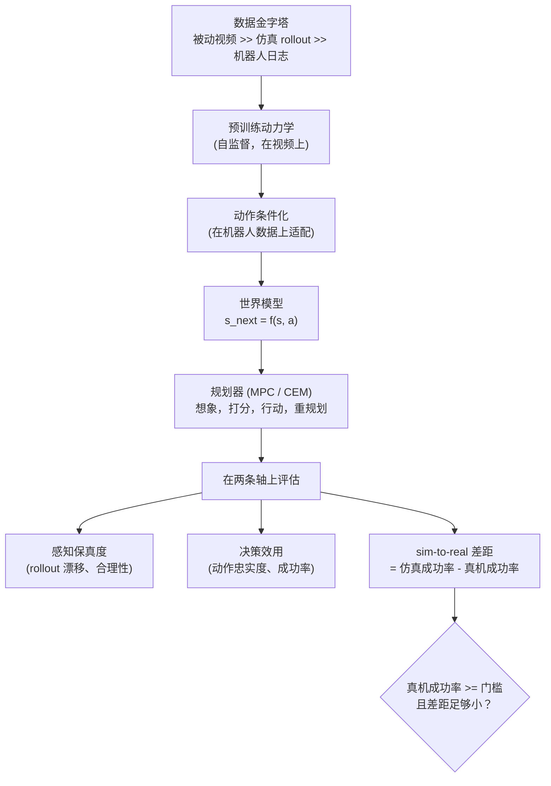

# 9. 小结

世界模型是一个学出来的预测器，预测环境在 agent 的动作下如何演化。它存在的意义，
是让 agent 在行动之前先想象后果；而它凭以立足的，是下游任务成功率，
不是预测画面有多照片级真实。

## 一页纸回顾

- **先把任务框清楚**：是预测还是行动，用像素还是隐变量，只跑仿真还是仿真加真机。
  北极星通常是控制，于是指标就是成功率。
- **四种范式：** 生成式视频（保真度、合成数据）、隐空间动力学（廉价控制）、
  JEPA 预测式（高效的自监督规划），以及 VLA / 世界动作模型（端到端策略）。
- **数据**是一座金字塔：在管够的被动视频上预训练，在稀缺的带动作标注的机器人数据上适配，
  仿真则充当便宜的中间层和持续评估的环境。
- **在两条互相独立的轴上评估**，感知保真度和决策效用，仿真里持续测、真实硬件上按里程碑测，
  并把 sim-to-real 差距作为门槛明确报出来。视频质量不等于控制质量。
- **两种服务场景：** 状态廉价的模型在延迟预算下于机器人本体上做规划；
  更重的生成式模型在离线跑，用来造合成数据和评估策略。

## 自测

答案是折叠的。每道题先自己答一遍再展开。

1. 说出四种世界模型范式，各举一个系统。

   

答案

   **生成式 / 视频**（直接预测未来的帧；状态是 token 网格或者扩散状态）：
   DeepMind 的 Genie、Wayve 的 GAIA-1、NVIDIA Cosmos。**隐空间动力学 / 基于模型的 RL**
   （一个紧凑的循环隐状态，策略靠在里面想象 rollout 学出来）：DreamerV3，
   或者只对规划所需的量建模的 MuZero。**JEPA 预测式**（预测未来的 *embedding* 而不是像素，
   因此没有重建开销）：Meta 的 V-JEPA 2。**VLA / 世界动作模型**
   （观测加语言目标直接映射成动作）：OpenVLA、Physical Intelligence 的 pi-0、
   NVIDIA Isaac GR00T。它们的区别在于 $s$ 活在什么空间里、$f_\theta$ 怎么被监督，
   而这个选择决定了开销的形状：视频模型照片级真实但昂贵，基本只能离线；
   隐变量和 JEPA 模型便宜到可以在控制回路里往前推演；
   VLA 则是一次固定的前向，压根没有想象出来的未来。第
   [2](02-frame-as-ml-task.md) 节把四种范式和各自的适用场合都摊开讲了。

   

2. 为什么数据金字塔逼出了"先预训练再适配"这套配方？

   

答案

   因为教物理的那一层和教控制的那一层不是同一层，而且谁也干不了对方的活。
   顶层是被动的互联网视频：管够而且几乎免费，但它**没有动作标注**，
   所以它教的是动力学（接下来通常会发生什么），不是可控性（我这么做会发生什么）。
   底层是遥操作和真机日志：带动作标注，而且来自真正的部署分布，
   但少到根本没法从零教会物理。所以做法是在巨大的视频层上自监督地预训练动力学，
   再在很小的机器人层上做动作条件化的适配，仿真则是那个便宜的、带动作标注的中间层，
   同时也是持续评估的环境。V-JEPA 2 是这个比例的公开实例：
   大约一百万小时的视频预训练，然后在几十小时量级的机器人录像上适配。
   这套配方是被逼出来的，不是挑出来的（第 [3](03-data.md) 节和第
   [10](10-putting-it-together.md) 节）。

   

3. 什么是动作忠实度，为什么一个 FVD 很高的模型仍然可能过不了这一关？

   

答案

   **动作忠实度**指的是想象出的未来是否*对 agent 选定的动作作出了正确响应*，
   而不是给出一个合理但与动作无关的续写。它在决策效用那条轴上；FVD 在感知那条轴上，
   而第 [5](05-evaluation.md) 节整节就是围绕"这两条轴互相独立"这件事写的。
   一个模型可以霸占 FVD 榜首，同时完全无视自己的动作输入，
   因为 FVD 比的是生成未来的*分布*和真实未来的分布，
   而预测最典型的那种续写往往就是让画面显得真实的最省事的办法。
   规划问的是相反的问题：未来在不同动作下会怎么*变*，
   这是一个以典型性为导向的目标函数永远不会奖励的。那就是"看着真、规划错"的那个象限，
   也是本章拒绝把单个生成指标当成评估的原因（第 [8](08-interview-qa.md) 节）。

   

4. 写出交叉熵方法规划器每个控制步的开销，并说出两个降低它的办法。

   

答案

   每个控制步的模型调用次数是 $n \times \text{horizon} \times \text{iters}$，
   其中 $n$ 是采样出的动作序列条数，iters 是 CEM 细化的轮数。本章算过的那组数字：
   200 个采样、horizon 为 5、3 轮迭代，机器人每走一个动作就是大约 3,000 次世界模型评估，
   而 10 Hz 的控制回路只给这些留了约 100 毫秒。有三个手段能降开销，答出其中任意两个即可。
   **廉价的状态表示：** 往前推演的是一个小的隐向量或 embedding，不是一整帧，
   这也是实时控制被隐空间动力学和 JEPA 模型占住的原因。**批量 rollout：**
   那 $n$ 条序列彼此独立，所以合成一次批量的 GPU 前向来算，别写 Python 循环。
   **缩短 horizon、多重规划几次：** 更便宜*而且*更准，因为预测误差会累积。参见第
   [4](04-model-development.md) 节和第 [6](06-serving-and-scaling.md) 节。

   

5. 什么是 sim-to-real 差距，为什么它是发布门槛？

   

答案

   **sim-to-real 差距**是仿真成功率减去真实硬件成功率，第 [5](05-evaluation.md) 节
   称它是具身评估里最重要的一个数字。一个模型在仿真里 90%、在硬件上 40%，差距就是 50 个点，
   意味着仿真器不是可信的代理，你手上所有的仿真结果都值得怀疑。
   它之所以能卡住发布，是因为两条评估轨道出于成本原因跑在不同的节奏上：
   仿真持续在跑，在 GPU 并行仿真器上基本等于免费；真机试验要花人的时间、磨损硬件，
   所以只在里程碑上跑。因此门禁只在真机成功率过线*并且*差距小到那个便宜的仿真数字
   往后可以当作可信代理时，才放模型出去。差距扩大是一个早期预警，
   说明模型学到的是仿真器的怪癖（理想化的摩擦、无噪声的传感器、重复的贴图）而不是物理；
   域随机化和更真实的接触物理能把它收窄。

   

6. 世界模型什么时候在离线比在机器人上更有价值？

   

答案

   只要模型重到达不到控制回路每步的延迟预算，而它擅长的那件事又完全没有延迟约束，
   就是这种情况。有两件离线的活能把自己挣回来：**生成合成数据**，
   造出带动作标注的轨迹以及那些在硬件上采集成本很高的罕见或危险场景；
   还有**批量策略评估**，在碰真实硬件之前，让候选策略对着模型或者用它搭出来的仿真器跑上几千次。
   两件都是吞吐问题，所以做法是在 GPU 并行的基础设施上开大 batch，
   而不是去优化尾延迟。NVIDIA 的 Cosmos 恰恰就定位在这里，第 [6](06-serving-and-scaling.md) 节
   也提到，离线这个场景在生产里往往价值更高。第 [10](10-putting-it-together.md) 节里
   车队那一列是极端情况：完全没有在线规划器，世界模型交付的全部产品，
   就是车队从来没记录到过的那部分场景覆盖。

   

## 延伸阅读（一手资料）

- 本章的收尾：[完整的方案](10-putting-it-together.md)，本章的每一个选择都在那里为场景敲定一次、
  算清成本、在另外两组约束下重搭一遍，并压缩成一个可运行的单文件规划器。
- World Models, Ha and Schmidhuber, 2018：[arXiv:1803.10122](https://arxiv.org/abs/1803.10122)。
- DreamerV3, Mastering Diverse Domains through World Models：[arXiv:2301.04104](https://arxiv.org/abs/2301.04104)。
- MuZero, planning with a learned model：[arXiv:1911.08265](https://arxiv.org/abs/1911.08265)。
- Meta V-JEPA 2：[arXiv:2506.09985](https://arxiv.org/abs/2506.09985)。
- DeepMind Genie：[arXiv:2402.15391](https://arxiv.org/abs/2402.15391)。
- Wayve GAIA-1：[arXiv:2309.17080](https://arxiv.org/abs/2309.17080)。
- OpenVLA：[arXiv:2406.09246](https://arxiv.org/abs/2406.09246)。
- NVIDIA Cosmos：[nvidia.com/en-us/ai/cosmos](https://www.nvidia.com/en-us/ai/cosmos/)。
- WorldArena 具身世界模型 benchmark：[arXiv:2602.08971](https://arxiv.org/abs/2602.08971)。
- 世界动作模型阅读清单：[Awesome-WAM](https://github.com/OpenMOSS/Awesome-WAM)。

姊妹书覆盖了经典 ML 的那一半，在
[ML System Design Interview](https://github.com/neurarch-ai/awesome-ml-system-design)
这个仓库里。由 [Neurarch](https://www.neurarch.com) 打造。
