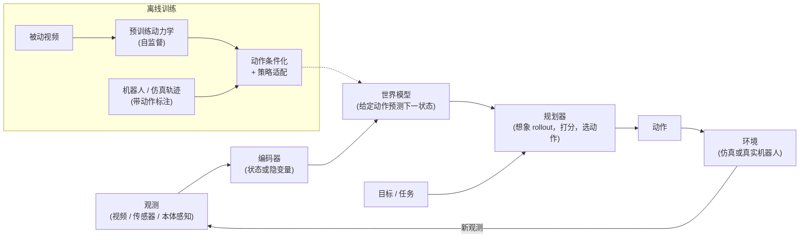

# 世界模型与具身智能体

> 本章是英文原版的中文译本，原文见 [book/world-models/](../../book/world-models/)。译文和原文同步维护，发现问题请提 issue。

> **写法说明。** 这是一章前沿内容。它沿用全书"先讲清楚再谈方案"的写法、
> 候选人/面试官的对话体，以及"搭骨架、数据、模型、评估、服务"的推进顺序，
> 但主题本身（一个可供 agent 在里面做规划的、学出来的环境模型）更偏向机器人和强化学习，
> 而不是生产环境的 LLM 服务。设计视角不变：造什么、怎么训练，
> 最重要的是怎么知道它管用，最后落到仿真里和真实硬件上的具身智能体身上去检验。

前沿实验室的面试官很少会说"做一个世界模型"。他们会说：
**"我们想要一个模型，能预测物理世界接下来会发生什么；评判标准是，
用它的机器人能不能在仿真和真实硬件上完成从没见过的任务。"**
这就是世界动作模型（world-action model），而这里的坑是拿视频生成质量
（预测出来的画面有多逼真）去回答。真正的信号是明白：世界模型的价值在于
**动作忠实度（action-faithfulness）**（想象出来的未来是不是服从 agent 的动作）
和下游任务成功率，而不是像素。

**世界模型**是一个学出来的预测器，预测环境如何演化，可以选择以 agent 的动作作为条件。
给它当前状态和一个候选动作，它返回最可能的下一个状态，这样 agent 就能在真实世界里
真正执行之前，先在脑子里推演一个计划的后果。如果同一个模型还负责输出动作，
它就是**世界动作模型（world-action model，WAM）**。

## 各节内容

1. [澄清需求](01-clarifying-requirements.md)：一段对话，弄清楚到底要做的是哪一种世界模型。
2. [搭成 ML 任务](02-frame-as-ml-task.md)：四种范式（生成式视频、隐空间动力学、JEPA 预测式、VLA / 世界动作模型），以及各自适用的场合。
3. [数据](03-data.md)：具身数据金字塔：管够的被动视频、便宜的仿真 rollout、稀缺的带动作标注的机器人日志。
4. [模型开发](04-model-development.md)：tokenizer 加 transformer、循环隐状态、联合嵌入预测器三条路线，动作条件化，以及规划循环。
5. [评估](05-evaluation.md)：两条轴（感知保真度与决策效用）、仿真 benchmark、真机成功率，以及 sim-to-real 差距。本章的核心。
6. [服务与扩展](06-serving-and-scaling.md)：规划时的算力、机器人本体上的延迟，以及离线用世界模型生成合成数据和评估策略。
7. [真实团队在生产环境里怎么做](07-how-teams-do-it-in-production.md)：Meta、NVIDIA、DeepMind、Wayve 和 Physical Intelligence，附一手资料链接。
8. [面试问答](08-interview-qa.md)：常问的、有坑的、常答错的。
9. [小结](09-summary.md)：一页纸回顾、全系统图和自测题。
10. [把它们拼起来：完整的方案](10-putting-it-together.md)：一套默认技术栈，把场景从头到尾搭起来并算清数据量和规划开销，同一套技术在三组不同约束下的样子，以及一个最小的可运行规划器。

## 一页看懂整个系统

**它是怎么跑的。** 这个循环本质上是闭环控制，只不过中间包了一个学出来的预测器。
编码器把原始观测变成模型推理所用的状态（隐空间动力学模型和 JEPA 用紧凑的隐变量，
生成式视频模型用 token 网格）。世界模型在候选动作下把这个状态往前推演，
规划器拿目标给想象出来的 rollout 打分，挑出最好的下一步动作，
环境（开发阶段是仿真器，部署时是真实机器人）返回下一个观测，重新进入循环。
训练是离线的，分两个阶段：先在管够的被动视频上预训练动力学，学会世界是怎么动的；
再在稀缺的带动作标注的轨迹上做适配，让模型变得可控。
图里那条虚线是连接两边的唯一纽带：在线规划器查询的正是适配后的模型。

姊妹章节[Agent 编排](../agents/)讲的是在工具上做规划的软件 agent，而不是物理动力学；
本章是它在具身领域的对应物。另见[多模态服务](../multimodal/)，那里讲这些模型复用的
视觉语言编码器；以及[LLM 系统评估](../evaluation/)，那里讲的离线加在线评估纪律，
第 5 节把它扩展到了仿真和真机。
