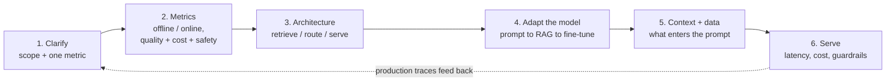

# 0. The method: how to approach an LLM system design interview

Every chapter in this book applies the same playbook to a different system. This page
teaches the playbook itself, so you carry a repeatable method into a question you have
never seen rather than a memory of 16 specific systems. When the interviewer says
"design X with an LLM," walk these six steps in order. Skipping a step is the most
common way strong candidates still lose the room.

## 1. Clarify the problem (do not skip to a model)

Turn a vague prompt into a scoped task. Pin: who the user is and what the output feeds;
the scale (queries per second, context length, concurrency); the latency budget
(interactive chat versus batch); and the one metric that defines success. The strongest
opening move is to decide **whether you even need to train anything**: most LLM problems
are solved by prompting or retrieval, not fine-tuning, and saying so up front (then
justifying when you would climb to SFT or preference tuning) is the senior signal. State
the framing out loud and commit.

## 2. Define metrics before architecture

LLM systems are judged on three axes at once, and naming all three early separates
people who have operated a system from people who have only prompted one.

|  | Offline (before shipping) | Online (in production) |
|---|---|---|
| **Quality** | a golden set scored by exact-match, task metrics, or a calibrated LLM-as-judge | live thumbs, task completion, human review of sampled traces |
| **Cost** | tokens per request, cache hit rate, model tier mix | dollars per thousand requests, GPU utilization |
| **Safety / reliability** | jailbreak and injection eval suites, groundedness/hallucination rate | guardrail block rate, incident and refusal rates |

The point of the axes: a system that is high quality but too expensive or unsafe does
not ship. Offline suites let you iterate; only the online A/B and trace review decide
the launch.

## 3. Sketch the end-to-end architecture

Draw the whole request path, not one model call. Most LLM systems are a small pipeline:
optional **retrieval** (embed the query, fetch and rerank context), an optional
**router or cascade** (send easy queries to a cheap model, hard ones to a strong one),
the **generation** call, and **guardrails** on input and output. For anything that
serves at scale, name the serving substrate too (continuous batching, the KV cache,
prefill/decode). Explaining why each stage exists (retrieval for freshness and
grounding, routing for cost, guardrails for safety) is what turns a box diagram into a
design.

## 4. Adapt the model: climb the ladder only as far as needed

There is a cost ladder of ways to specialize a model, and you climb it only when the
rung below plateaus. Prompting and few-shot come first; then **retrieval-augmented
generation** when the problem is missing knowledge or freshness; then **fine-tuning**
(LoRA/SFT) when the problem is a persistent behavior or format the model will not adopt
from context; then **preference tuning** (DPO/RLHF/GRPO) when the problem is a
comparative judgment, or **continued pretraining** for a whole new domain. Name which
rung the problem lives on and why the cheaper rung is insufficient.

## 5. Context and data: what actually enters the prompt

For a retrieval system this is chunking, the embedding model, the index, reranking, and
context assembly; for a fine-tuned system it is the instruction/preference dataset and
its curation (dedup, decontamination, quality filtering). Two rules carry most of the
credit: keep the training and serving prompt format byte-identical (no template skew),
and never let evaluation data leak into training or retrieval (decontamination), or your
metrics lie.

## 6. Serve: latency, cost, and guardrails are part of the design

An LLM answer is not done until it is served within budget and safely. Name the levers:
the KV cache and continuous batching for throughput, quantization and speculative
decoding for latency and cost, routing and caching for spend, and input/output
guardrails for safety. Stating the serving-time tradeoffs (a bigger model is better per
token but blows the latency and cost budget) is what a production interview is really
testing.

## The loop, not the line

These steps are a loop, not a one-way list. Production traces (step 2) reveal where the
system is weak, which sends you back to better context/data (step 5), a different
adaptation rung (step 4), or a cheaper serving path (step 6). Closing with "here is how
I would iterate after launch, driven by traces" is what finishes a strong answer.

Each chapter that follows is this method applied once. Read a few and the shape becomes
automatic, which is the entire point: the interview rewards the method, not the
memorized system.
