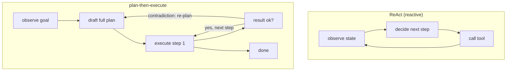

# 3. Planning and tools

## Two planning styles

The first design decision after framing the loop is how the agent decides what
to do next. There are two main patterns, and the choice changes cost, latency,
and reliability.

**Reactive (ReAct-style).** The model decides the next single action on each
iteration, informed only by what has happened so far. There is no upfront plan.
This is flexible for open-ended goals where the path cannot be known in advance,
but it can wander: a model that is not sure what to do next will sometimes call
the same tool twice or take a detour that inflates step count.

**Plan-then-execute.** Before touching any tools, the model drafts a sequence
of steps. It then executes them one at a time, re-planning only when a tool
result contradicts an assumption in the original plan. Cost is more predictable
because the total step count is bounded by the plan length. For our support
agent, the workflow almost always has a known shape: look up account, check
order, assess eligibility, act, reply. Plan-then-execute is the better fit.

## Tool schemas

A tool is a function the model can call by name with typed arguments. The schema
is the model's contract with that function: the model reads the schema to know
what arguments are required, what types they must be, and what the tool does.
A well-written schema is as important as the tool itself. Anthropic's production
findings show that investing in tool descriptions, adding argument-level
examples, and testing descriptions the way you test prompts meaningfully raises
task success rates.

Good tool schema properties:

- **Narrow scope.** One tool does one thing. A `lookup_order` tool returns order
  status; it does not also check refund eligibility. Narrow tools are easier for
  the model to pick correctly and easier for the gate to validate.
- **Typed arguments.** Every argument has a type and, where helpful, an enum of
  allowed values. This makes schema checking in the gate trivial.
- **Poka-yoke arguments.** Make it hard to call the tool wrong. If a refund
  amount must be in cents to avoid floating-point issues, the schema says so.
- **Clear failure modes.** Document what the tool returns on error so the model
  knows how to handle a timeout or a not-found result without hallucinating.

## Single agent vs multi-agent

Multi-agent systems get a lot of attention. The honest framing is that they
solve a real problem (genuinely separable subtasks that each need their own
context) but carry a real cost (token multiplication and harder debugging). For
a support agent that handles one ticket at a time, a single well-tooled agent
almost always wins.

The Anthropic multi-agent research system uses parallel subagents for breadth-
first research across many independent searches, each with its own context
window. That design beat a single agent by 90% on their benchmark, but at
roughly 15 times the token cost. Cognition argues the opposite direction:
single-threaded agents are more coherent because parallel subagents make
implicit decisions the coordinator cannot reconcile.

For this support problem, default to a single agent. Add orchestrator plus
subagents only if one ticket can have genuinely separable work streams that
must run concurrently and cannot share context. That is rare in support.

## When to use which

| Reach for | When | Instead of |
|---|---|---|
| Plan-then-execute | The task has a known shape and cost predictability matters | ReAct, when the path is unknowable before the first tool call |
| Reactive (ReAct) | The goal is open-ended and the step sequence depends entirely on what tools return | Plan-first, which pays re-planning cost on every surprise |
| Single well-tooled agent | One context holds the job; decisions form a coherent chain | Multi-agent, whose roughly 15x token multiple buys nothing if the task is not separable |
| Orchestrator with parallel subagents | Subtasks are genuinely separable, each needs an isolated context window, and wall-clock latency is the bottleneck | A single thread, when fan-out adds tokens and debugging complexity without cutting latency for this task |
| Narrow, typed tools | The gate needs to validate calls deterministically | Wide tools that accept arbitrary JSON, where validation becomes guesswork |
| Reflexion self-critique | There is a clear success signal the agent can learn from across retries | One-shot planning, when retries add cost without a verifiable stopping criterion |

**Provenance.** The reactive loop is ReAct (Princeton and Google, 2022), whose interleaved reason-then-act step builds on chain-of-thought prompting (having the model write out intermediate reasoning steps before its answer) (Google, 2022). Model-driven tool calling traces to Toolformer (Meta, 2023), and the typed-tool interface here follows the Model Context Protocol (Anthropic, 2024).

**Tools.** Both planning styles are expressible in the common agent frameworks: LangGraph and LangChain model plan-then-execute and ReAct loops explicitly, LlamaIndex offers agent runners for either, and multi-agent orchestration with parallel subagents is the core of AutoGen (Microsoft) and CrewAI. Tool schemas are typically JSON Schema definitions, and the Model Context Protocol (MCP) is a shared way to expose typed tools to a model with descriptions and enums the gate can validate. Reflexion-style self-critique is a prompting pattern layered on top rather than a separate library.

**Worked example.** An enterprise-RAG team building a support agent picks plan-then-execute over reactive ReAct because a ticket has a known shape (look up account, check order, assess eligibility, act, reply) and bounded step count keeps cost predictable, whereas ReAct would risk wandering and calling the same tool twice. They keep a single well-tooled agent rather than an orchestrator with parallel subagents, since one ticket rarely splits into separable concurrent work streams and the roughly 15x token multiple of fan-out would buy nothing. Every tool is narrow and typed with enums and cents-not-dollars arguments so the validation gate can check calls deterministically instead of guessing over arbitrary JSON. They add Reflexion self-critique only where a clear success signal exists to justify the retry cost.
