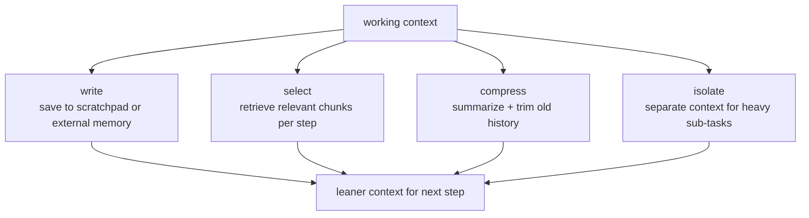

# 4. Memory and state

## The context window is a balance sheet

Every token in the context window costs money at prefill time on every
subsequent step. Short-term working state (the ticket, tool results so far) must
live there because the model needs it to decide what to do next. Long-term facts
(customer history, company policy, past resolutions) should not live there by
default, because stuffing everything in balloons cost and can distract the model
with irrelevant history.

## Short-term memory: the working transcript

The working transcript is the model's scratchpad. It contains the ticket, the
model's reasoning, every tool call the model has made, and every result it
received. It grows monotonically as the loop runs, because each new action and
observation is appended.

The problem is that the model re-reads the entire transcript at every step
during prefill. A 20-step loop on a verbose ticket can push the transcript to
tens of thousands of tokens, and the prefill cost for each step includes all of
that prior history. Without intervention, this makes the per-step cost grow
linearly in step number (and the total task cost grow roughly quadratically).

Three mitigations:

**Summarization / compression.** At a token threshold, replace the oldest part
of the transcript with a compressed summary that preserves decisions and events
but discards the raw tool payloads. Claude Code's auto-compact does this near
the context limit. A dedicated compression model (Cognition's approach) can be
more faithful than a heuristic trim.

**Prefix caching.** The system prompt and the initial ticket are stable for many
steps. If the model provider supports KV-cache prefix reuse, the static prefix
is paid for once and the incremental cost per step is only the new tokens.
Anthropic's extended prompt caching applies here; cache reads are typically
much cheaper than cache writes.

**Model tiering.** Cheap models pay cheaper prefill rates per token. Routing
simple steps (lookup dispatch, templated reply assembly) to a small, fast model
keeps the transcript cost low for those steps.

## Long-term memory: retrieval over external stores

Long-term memory holds facts that outlive a single conversation: a customer's
entire order history, company refund policy documents, past resolution patterns.
The right approach is retrieval: store the facts externally and pull in only the
relevant pieces for each step, rather than stuffing the whole store into the
context at the start.

This is exactly RAG applied at the agent level. For our support agent, the
knowledge base (policy documents, FAQ) is the long-term memory. At the start of
a ticket the agent retrieves the policy sections relevant to the ticket type and
adds them to the working context. Customer history is fetched by the
`lookup_account` tool and scoped to what the current step needs.

## Context engineering strategies

LangChain's context engineering framework names four strategies that apply
directly here:

**Write:** Save intermediate results to a scratchpad outside the window (within
the session) or to a memory store (across sessions) rather than keeping raw
payloads in the transcript.

**Select:** At each step, retrieve only the relevant slice of long-term memory
rather than pre-loading everything. When the tool set grows large, retrieve a
relevant tool subset per step rather than exposing all tools every turn.

**Compress:** Summarize old transcript history when the context fills. Preserve
decisions and events; discard raw API response bodies.

**Isolate:** For sub-tasks with large intermediate artifacts (image data, long
document bodies), run them in a separate context window or sub-agent rather than
loading the artifact into the main context.

## When to use which

| Reach for | When | Instead of |
|---|---|---|
| Short-term working transcript | The model needs prior tool results to decide the next step (always true for agents) | Stateless calls, which lose the reasoning chain |
| Compression (summarization) | The transcript is approaching the context limit or per-step cost is growing visibly | Blind truncation of oldest messages, which drops load-bearing decisions |
| Prefix caching | The system prompt and initial ticket are stable across many steps | Paying full prefill each turn on content that does not change |
| Long-term retrieval (RAG) | Customer history, policy docs, or past patterns exceed what belongs in the context for any single ticket | Stuffing all history in at the start, which bloats cost and can mislead the model |
| External scratchpad (write strategy) | Intermediate results are verbose (long JSON payloads, raw API responses) | Keeping raw payloads in the transcript and re-reading them every step |
| Isolated sub-context | A sub-task has a token-heavy artifact or genuinely does not need shared context | Splitting a coherent decision chain into isolated agents, which destroys coherence |
