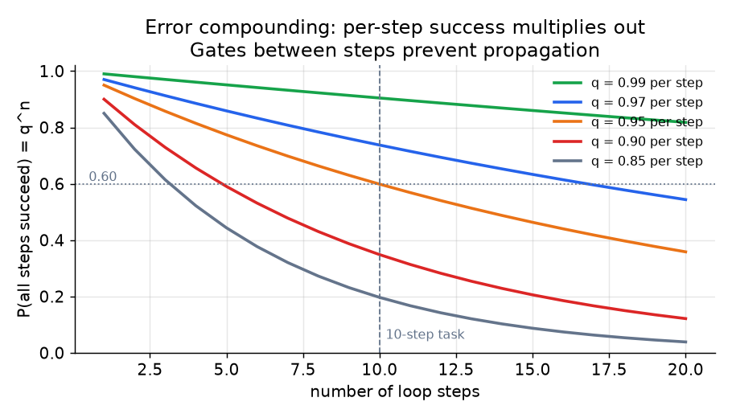
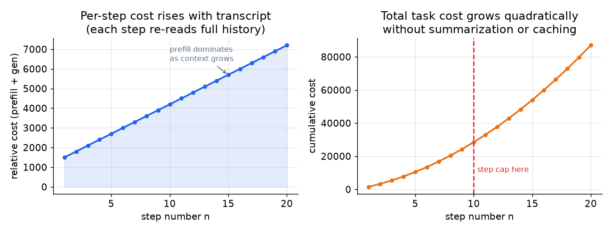
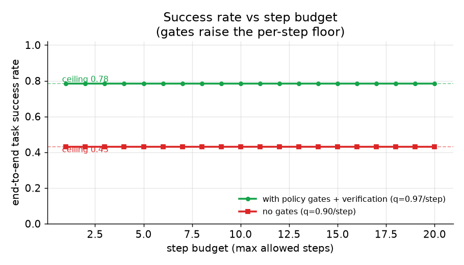

# 5. Reliability and cost

## Error compounding: why loops fail quietly

The most underappreciated property of a multi-step loop is that per-step
failures multiply. If each step succeeds with probability $q$, then an
$n$-step task succeeds with probability:

$$P_{\text{ok}}(n) = q^{\,n}$$

At $q = 0.95$ per step (already quite high), a 10-step task has about a 60%
end-to-end success rate:

$$P_{\text{ok}}(10) = 0.95^{10} \approx 0.60$$

The implication is not "use fewer steps" (the task may require them), but
"place gates between steps so a bad result does not propagate to the next."
Without a gate, one wrong lookup result can corrupt every downstream decision.

*At 0.95 per step, success below 0.60 at step 10. Gates and verification passes
raise the per-step floor, shifting the curve upward. Illustrative.*

## The cost of a growing transcript

The per-turn cost of a running agent is not flat. Let $T_{n-1}$ be the total
token count in the context at the start of step $n$, $p$ be the prefill price
per token, and $g$ be the generation price per token. Then the cost of step $n$
is approximately:

$$C_n = p \cdot T_{n-1} + g \cdot o_n$$

where $o_n$ is the output tokens generated. The transcript grows by roughly
$a_n + r_n$ tokens per step (the model's action text plus the tool result), so:

$$T_n = T_0 + \sum_{i=1}^{n}(a_i + r_i)$$

Substituting, the total task cost over $S$ steps is:

$$C_{\text{total}} = \sum_{s=1}^{S}\Bigl(p\,\bigl(T_0 + \textstyle\sum_{i=1}^{s-1}(a_i + r_i)\bigr) + g\,o_s\Bigr)$$

The outer sum over the inner sum makes the total cost grow **quadratically in
$S$** if steps are not compressed. This is the cost driver interviewers probe.
The fix is summarization (compressing the transcript to remove old raw payloads)
and prefix caching (paying for the stable prefix once).

*Left: each step re-reads the full transcript at prefill; per-step cost rises
linearly with step number. Right: cumulative cost accelerates. A hard step cap
and compression keep both curves bounded. Illustrative.*

*Allowing more steps raises success rate up to the per-step accuracy ceiling
($q^{\text{steps needed}}$). Gates raise $q$ per step, shifting the ceiling upward.
Without gates (red), the ceiling is lower no matter how large the budget. Illustrative.*

## Hard limits

Two limits are non-negotiable:

**Step cap.** Max $N$ tool calls per ticket, then escalate to a human. This is
the backstop for a wandering loop. It must be enforced in the orchestration
layer, not in the prompt. For this support agent, $N = 10$ is a reasonable
starting ceiling: lookup (1), eligibility check (1-2), action (1), reply (1),
with room for re-tries.

**Token budget.** A ceiling on total tokens across all steps for a single
ticket. At a $0.10 cost ceiling and a blended rate of roughly $\$10$ per
million tokens, the budget is about 10,000 total tokens. A ticket that would
exceed this is escalated before it completes.

## Guardrails: where they sit

Guardrails are checks that prevent the agent from doing something harmful or
incorrect. There are three layers:

1. **Pre-call (the gate).** Schema and policy checked before any tool executes.
   This is synchronous and on the critical path, so it must be fast (a
   deterministic code check, not a model call).

2. **Post-call (output check).** After the agent's final reply is drafted, a
   lightweight check scans for policy violations or prohibited content before
   the reply is sent. Airbnb runs this in parallel to the reply generation to
   avoid adding latency.

3. **Async audit.** After the fact, a separate job reviews logged actions for
   patterns the real-time checks might miss (e.g., an agent that is
   consistently pushing the refund limit). This does not block the live path.

## Retries

Tool calls can fail for transient reasons (API timeout, network error). The
retry policy should live in the Tool Manager or executor layer, not in the
prompt. The model should not decide whether to retry; it should receive either
a result or a structured error it can act on.

Pattern: exponential backoff with a fixed retry cap (e.g., 3 attempts). On
persistent failure, return a structured error to the model so it can escalate
or pick a fallback tool. The model must not hallucinate a result when a tool
times out; it must acknowledge the failure and handle it.

## Model tiering

Not all steps in a support loop require the same model. A step that dispatches
the ticket to a category (billing, shipping, technical) is a routing task; a
cheap, fast model handles it well. A step that weighs competing policy
interpretations is a reasoning task; the expensive model earns its cost there.

The rule: use the cheapest model that can handle the step reliably. The
per-step model is set by the orchestrator based on a step-type classifier, not
by the agent itself.

## When to use which

| Reach for | When | Instead of |
|---|---|---|
| Hard step cap (in code) | Always: runaway loops are the default failure mode | A prompt instruction like "stop after 10 steps," which the model can ignore |
| Token budget per task | Always: cost per ticket must be bounded for the economics to work | Paying per-task cost post hoc and hoping it averages out |
| Pre-call policy gate in code | Any write action that touches money, accounts, or irreversible state | A prompt-side policy reminder, which prompt injection bypasses |
| Post-call output check (parallel) | Reply quality and compliance must be verified without adding serial latency | A serial post-check, which doubles the reply latency |
| Exponential-backoff retry in the executor | Transient tool failures (network, timeout) | Letting the model decide whether to retry, which it handles inconsistently |
| Model tiering (cheap for routing, expensive for reasoning) | Most loop steps are routing, not reasoning; tiering cuts per-step cost | Using the expensive model for every step, which the cost ceiling cannot sustain |
| Verification retry (Reflexion-style) | A clear end-to-end success signal exists (run tests, check refund ledger) | Adding retries without a signal, which multiplies cost with no quality gain |

**Tools.** The step cap, token budget, and per-step model routing live in the orchestration layer, which frameworks like LangGraph and LlamaIndex expose as explicit graph limits and node-level model selection rather than prompt instructions. Policy gates and output checks are built with guardrail libraries such as Guardrails AI and NeMo Guardrails (NVIDIA), which run deterministic schema and content checks off the model's critical path. Transient tool retries are handled by a backoff library like tenacity in the executor, not by the model, and verification retries reuse whatever real success signal exists (a test runner, a ledger check) as the stopping criterion.

**Worked example.** An enterprise-RAG team running a support agent enforces a hard step cap and a per-ticket token budget in code, because a prompt instruction like stop after ten steps is something the model can ignore and the economics require a bounded cost per ticket. Any write action that touches refunds or accounts passes a pre-call policy gate implemented as a deterministic code check, since a prompt-side reminder would be bypassed by prompt injection, and a post-call output check runs in parallel with reply generation so compliance is verified without doubling latency. Transient API timeouts are retried with exponential backoff in the executor rather than letting the model decide inconsistently. Routing steps go to a cheap model and only genuine policy-reasoning steps pay for the expensive one, and verification retries are added only where a clear end-to-end success signal justifies the extra cost.
