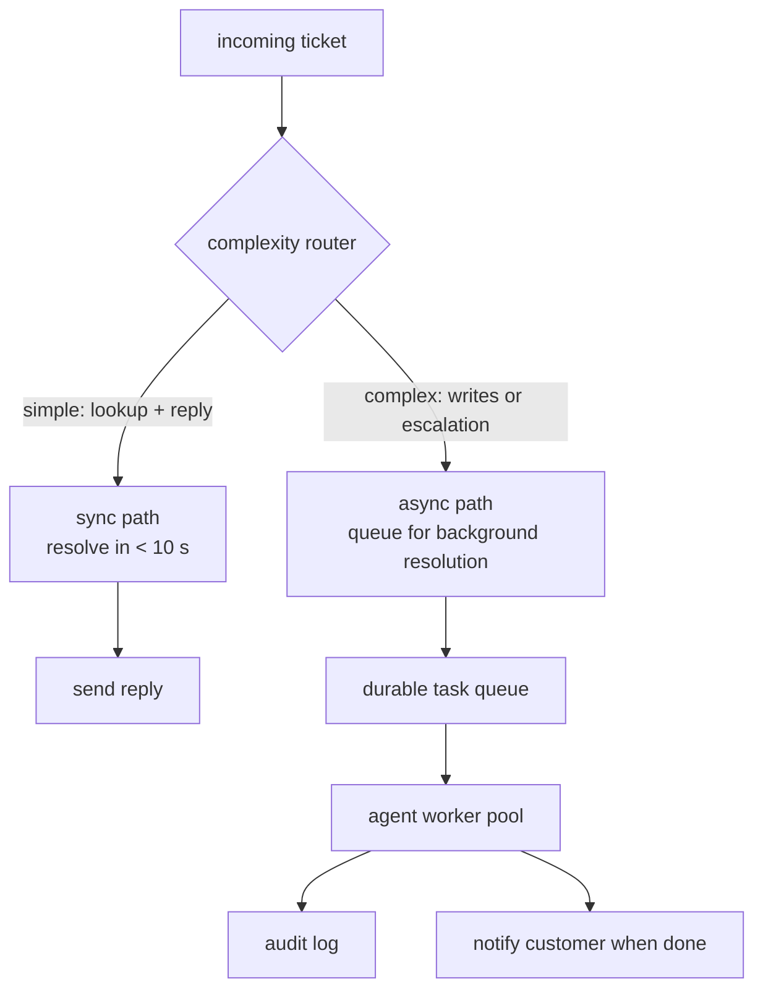

# 6. Serving and scaling

## Two execution modes: synchronous and async

The support agent has two natural execution paths depending on ticket complexity.

**How it works.** An incoming ticket first meets a complexity router that reads
the request and decides which of two paths it takes. Simple tickets (a lookup
plus a reply) go down the synchronous path and resolve in seconds while the user
waits, ending in a reply sent inline. Anything involving writes or a likely
escalation goes down the asynchronous path: it is placed on a durable task queue
rather than blocking the caller, so a slow ticket never holds the fast path
hostage. A pool of agent workers pulls from that queue, runs the full loop, and
hands off two side outputs: an entry to the audit log for every step and a
notification to the customer once the work completes. The queue is the seam that
lets the fast and slow paths scale independently.

The complexity router is itself a cheap model call or a rule-based classifier.
Its purpose is to keep the fast path fast: simple tickets never wait behind
long-running ones.

## Concurrency and the model tier

At 50,000 tickets per day, that is about 35 tickets per minute, or roughly
0.6 per second. Each ticket runs a loop of up to $N$ steps. The model tier
must handle $0.6 \times N$ in-flight requests at any moment, plus bursty
peaks.

Two throughput constraints interact:

1. **Model throughput.** The model provider (API or self-hosted) has a tokens
   per minute limit. A 10-step ticket at 1,000 tokens per step consumes
   10,000 tokens. At 50,000 tickets per day that is roughly 500 million tokens
   per day across all steps.

2. **Tool throughput.** Each tool call hits a back-end service (CRM, OMS,
   policy search). These must be provisioned for the concurrency the agent
   generates, not just for direct user traffic.

Parallel tool calls (where steps are independent) cut wall-clock latency for
complex tickets. Looking up account details and order status at the same time
saves roughly one round-trip. This is a scheduling decision in the orchestrator,
not a model decision.

## Streaming and partial outputs

For the synchronous path, users expect feedback before the full reply is ready.
Streaming the reply token by token (standard for chat models) handles this. The
agent can also stream intermediate "thinking" states (e.g., "Checking your order
status...") as structured progress events rather than raw model tokens, which
gives a cleaner UX without exposing internal reasoning.

## Bottlenecks

| Bottleneck | First sign | Fix | Tradeoff |
|---|---|---|---|
| Model throughput exhausted | Queue depth grows, p99 latency spikes | Increase model tier capacity; route simple steps to a smaller, faster model | Cost per token rises with capacity headroom |
| Tool back-end overloaded | Tool call error rate rises; agent retries compound the load | Rate-limit agent tool calls per back-end; add caching for read tools (account lookup results are stable within a ticket) | Stale cached reads; must invalidate after writes |
| Context cost dominates | Cost per ticket climbs above budget as ticket complexity grows | Compress transcript at a token threshold; prefix-cache the system prompt | Compression adds a model call; prefix caching requires API support |
| Step cap hit before resolution | Escalation rate rises for moderate-complexity tickets | Raise $N$ carefully (cost grows); add parallelization of independent steps to do more within the cap | More parallel calls raise tool back-end load |
| Runaway tickets (step cap not enforced) | Cost anomalies in billing; one ticket consumes disproportionate budget | Enforce the cap in the orchestration layer, not in the prompt | None; this is always the right fix |
| Audit log write-ahead bottleneck | Log durability becomes a tail-latency contributor | Write audit events asynchronously to a durable queue (Kafka) before the ticket closes | Slight risk of missing the last event if the process crashes; acceptable for audit, not for billing |

**More detail.** Two rows hide sharper failure modes. The tool-back-end row compounds because agent retries are correlated: one downstream timeout makes every in-flight ticket retry at nearly the same instant, so a per-back-end concurrency ceiling caps load more reliably than a per-ticket rate limit. The context-cost row is driven by attention that grows with sequence length, so the compression threshold should fire on cumulative prefill tokens rather than message count; prefix caching only covers the stable head of the prompt, and any edit above the cache boundary invalidates the entire cached prefix and forces a full prefill.
