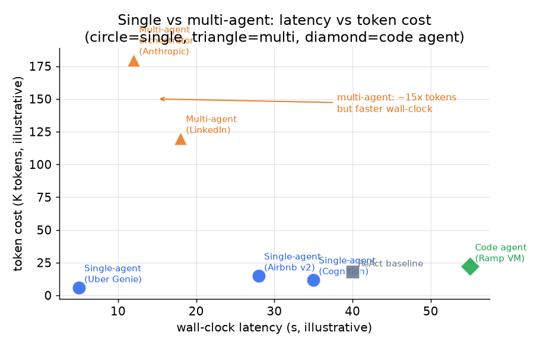

# 7. How teams do it in production

Every production agent converges on the same loop skeleton: decompose the goal,
call a tool, observe the result, update the context, repeat until done or a hard
limit is hit. What actually differs is where teams land on four orthogonal
decisions: **topology** (single vs multi-agent), **planning style** (reactive
vs plan-first), **tool interface** (JSON calls vs code execution), and **context
strategy** (compress vs retrieve vs isolate).

Knowing these divergences is what separates a candidate who has studied agents
from one who has shipped them.

## Where the real designs diverge

*Multi-agent topologies (triangles) cut wall-clock latency by parallelizing
independent subtasks, but at roughly 15x the token cost of a comparable
single-agent (circles). Code agents (diamonds) trade setup complexity for
fewer round-trips on tool-heavy work. Illustrative, based on published figures.*

| System | Topology | Planning style | Tool interface | Context strategy | When it wins | Watch out for |
|---|---|---|---|---|---|---|
| Anthropic multi-agent research | Orchestrator plus parallel subagents | Lead agent uses extended thinking upfront; subagents reactive | JSON tool-calls | Isolate: each subagent owns its context window | Breadth-first research where subtasks are genuinely separable | Token spend roughly 15x single-agent; join step is hard to debug; subagents can overlap on the same source |
| Cognition single-threaded | Single, linear | Implicit reactive loop | JSON tool-calls | Compress: a dedicated distiller model compacts the transcript when it nears the limit | Tasks that need one coherent decision chain; no implicit conflicts between parts | No parallelism; long transcripts still hit the limit without the compressor |
| Airbnb Automation Platform v2 | Single (hybrid: LLM for novel; deterministic workflow for known paths) | Chain-of-thought plan each turn; re-plan on contradiction | JSON via Tool Manager with retry logic | Select: Context Loader fetches account, intent, and trip data per turn | Known-shape support flows where keeping old workflows for fixed paths avoids LLM cost | Guardrails run in parallel to avoid serial overhead; if the parallel rail is slow, safety lags the action |
| Ramp Inspect (coding agent) | Single, async closed loop | Reactive: act then self-verify | Code execution in a sandboxed Modal VM | Isolate: each session gets its own VM and SQLite; write results to a PR | Long-running coding tasks where correctness is verifiable by running tests | Per-job VM isolation is infrastructure cost; async means not suitable for interactive turns |
| LangChain context engineering | Any topology | Any | Any | All four: write, select, compress, isolate, applied per step | When context cost or quality degrades as the loop grows; the strategies are composable | Over-engineering: applying all four to a short-horizon simple agent adds complexity with no benefit |
| Uber Genie (on-call RAG) | Single, effectively one-shot per question | None: RAG lookup then generate | Retrieval over a vector DB (Sia) | Select: retrieve relevant doc chunks per question | High-volume read-only Q&A where the answer is in existing docs | Not a true loop; Genie does not take actions, only answers questions from retrieved docs |
| LinkedIn multi-agent orchestration | Orchestrator with registered subagents over a messaging platform | Orchestrator decomposes and routes; subagents reactive | gRPC / messaging bus (not direct JSON) | Isolate: siloed memory stores per agent | Enterprise-scale multi-agent systems where reusing existing messaging infra is cheaper than new plumbing | Registry and lifecycle service add operational complexity; cross-agent state sync requires explicit policy |
| ReAct baseline (Yao et al.) | Single | Fully reactive, one step at a time | JSON tool-calls | None built in; transcript grows unchecked | Simple, flexible tasks with a small tool set and a short horizon | No step cap means it can wander; no context strategy means cost grows with transcript length |
| Reflexion (Shinn et al.) | Single with retry episodes | Self-critique on prior episode outcome | JSON tool-calls | Isolated episodes; each retry starts from a fresh context | Tasks with a clear verifiable outcome the agent can learn from across retries | Each retry episode multiplies token cost; useless when the feedback signal is absent or noisy |

The core dividing line: **single-threaded agents are cheaper, more coherent,
and easier to debug when one context holds the job.** Multi-agent fan-out is
justified only when subtasks are genuinely separable, each needs its own context
window, and wall-clock latency is the bottleneck that matters.

## The systems (first-party links)

- **Anthropic** [Building effective agents](https://www.anthropic.com/research/building-effective-agents): five composable orchestration patterns (chaining, routing, parallelization, orchestrator-workers, evaluator-optimizer) and when to use each.
- **Anthropic** [How we built our multi-agent research system](https://www.anthropic.com/engineering/multi-agent-research-system): orchestrator-worker pattern with parallel subagents; 90.2% lift over single agent at roughly 15x tokens.
- **Cognition** [Don't build multi-agents](https://cognition.com/blog/dont-build-multi-agents): the counter-case for single-threaded agents; why parallel subagents produce incoherent outputs and how a compression model fixes the context limit.
- **Ramp** [Why we built our own background agent](https://builders.ramp.com/post/why-we-built-our-background-agent): closed-loop coding agent on isolated Modal VMs; pre-built repo snapshots cut session startup latency.
- **LangChain** [Context engineering for agents](https://www.langchain.com/blog/context-engineering-for-agents): the write-select-compress-isolate framework for keeping context lean as loops grow.
- **OpenAI** [A practical guide to building agents](https://cdn.openai.com/business-guides-and-resources/a-practical-guide-to-building-agents.pdf): orchestration patterns, guardrails, and single vs multi-agent guidance from production deployments.
- **Anthropic** [Writing effective tools for agents, with agents](https://www.anthropic.com/engineering/writing-tools-for-agents): designing and evaluating tool definitions to raise agent task success rates.
- **Anthropic** [Code execution with MCP](https://www.anthropic.com/engineering/code-execution-with-mcp): how code execution over MCP cuts tokens and latency relative to JSON tool-call round-trips.
- **Uber** [Genie: Uber's GenAI on-call copilot](https://www.uber.com/en-US/blog/genie-ubers-gen-ai-on-call-copilot/): RAG-based copilot serving 45k engineer questions per month with Kafka-backed eval feedback.
- **Airbnb** [Automation Platform v2](https://medium.com/airbnb-engineering/automation-platform-v2-improving-conversational-ai-at-airbnb-d86c9386e0cb): LLM reasoning engine with chain-of-thought tool orchestration, hybrid LLM-plus-workflow design, and parallel guardrails.
- **LinkedIn** [Extending the GenAI tech stack to build AI agents](https://www.linkedin.com/blog/engineering/generative-ai/the-linkedin-generative-ai-application-tech-stack-extending-to-build-ai-agents): multi-agent orchestration over messaging infra; agent registry, lifecycle service, siloed memory, OpenTelemetry observability.
- **Hugging Face** [Introducing smolagents](https://huggingface.co/blog/smolagents): the case for code-writing agents over JSON tool-calls; sandboxed execution cuts round-trips on multi-step tool use.
- **Replit** [Agent 3 self-test at scale with REPL verification](https://replit.com/blog/automated-self-testing): REPL plus browser verification lets the agent autonomously self-test before closing a task.
- **GitHub** [Evaluating the Copilot agentic harness](https://github.blog/ai-and-ml/github-copilot/evaluating-performance-and-efficiency-of-the-github-copilot-agentic-harness-across-models-and-tasks/): benchmarking a multi-model agent harness on resolution rate and token cost across models.
- **Salesforce** [Inside the Atlas Reasoning Engine](https://engineering.salesforce.com/inside-the-brain-of-agentforce-revealing-the-atlas-reasoning-engine/): model-agnostic reasoning and planning engine driving enterprise agent actions at scale.
- **Yao et al.** [ReAct: synergizing reasoning and acting in language models](https://arxiv.org/abs/2210.03629): the foundational pattern interleaving reasoning traces with tool actions.
- **Shinn et al.** [Reflexion: language agents with verbal reinforcement learning](https://arxiv.org/abs/2303.11366): agents self-reflect on feedback to improve across retries without weight updates.
- **Wu et al.** [AutoGen: next-gen LLM apps via multi-agent conversation](https://arxiv.org/abs/2308.08155): a framework for multi-agent systems via customizable conversable agents.
