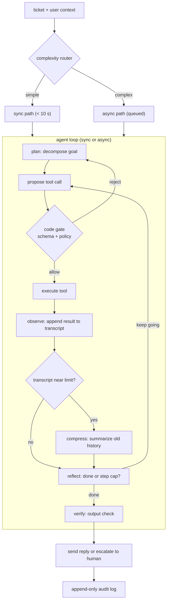

# 9. Summary

## One-page recap

- **An agent is a controlled loop around a model that can call tools.** The loop
  runs plan-act-observe until the task is resolved or a hard limit is hit. The
  hard limit is non-negotiable; it lives in code, not in the prompt.

- **The gate is the safety seam.** Before any tool executes, a deterministic
  code check validates schema, policy, and authorization. This cannot be
  bypassed by prompt injection. Policy in code is a guarantee; policy in a
  prompt is a suggestion.

- **Error compounding is the reason loops fail quietly.** Per-step success
  below 1 multiplies out ($q^n$): ten steps at $q = 0.95$ is already below
  60%. Gates between steps prevent one bad result from propagating; a step cap
  prevents infinite looping.

- **Cost grows quadratically without compression.** The prefill term for step
  $n$ includes the full prior transcript. Without summarization or prefix
  caching, total task cost grows as $O(S^2)$ in step count. Control it with
  compression at a token threshold, prefix caching of the stable system prompt,
  and model tiering (cheap model for routing steps, expensive one only for
  reasoning steps).

- **Default to a single well-tooled agent.** Multi-agent fan-out cuts
  wall-clock latency but multiplies tokens by roughly 15x and makes debugging
  harder. Reach for it only when subtasks are genuinely separable, each needs
  an isolated context window, and latency is the bottleneck.

- **Long-term memory is retrieval, not stuffing.** Bring in customer history,
  policy documents, and past resolutions via retrieval (RAG) per step rather
  than loading everything into the system prompt. Only the working state for
  the current step belongs in the context window.

## The system on one page

## Test yourself

1. Why must the policy gate live in code rather than in the system prompt, and
   what attack does this defend against?
2. A 12-step loop with per-step success $q = 0.92$ has what end-to-end success
   rate? What does placing a gate after each step actually change?
3. Why does per-step prefill cost rise as the loop progresses, and what are the
   three mechanisms that keep it bounded?
4. When is multi-agent fan-out worth the token cost, and what is Anthropic's
   measured token multiplier?
5. Describe the difference between compression and isolation as context
   strategies, and give a concrete trigger for each.
6. Your agent is consistently calling the same tool twice in a row. What are the
   two mechanisms you add, and at which layer does each live?

## Further reading

- Dense reference (comparison tables, math, full case study list):
  [topics/03-agent-orchestration.md](../../topics/03-agent-orchestration.md)
- Comparison across production systems (all divergence tables):
  [tools/comparisons/03.md](../../tools/comparisons/03.md)
- Per-company teardowns (interview questions per system):
  [tools/teardowns/03.md](../../tools/teardowns/03.md)
