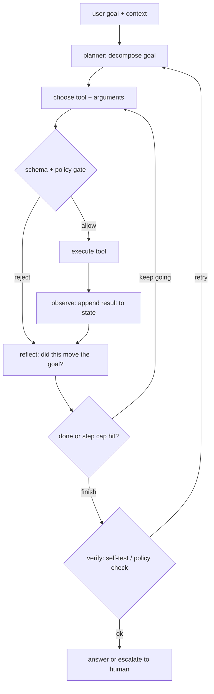

# Agent Orchestration

An interviewer rarely says "design a ReAct agent." They say **"design a system
that reads a customer support ticket, looks up the account, checks order status,
issues a refund if policy allows, and replies, reliably and at bounded cost."**
That is agent orchestration: a controlled loop around a model that calls tools,
manages state, and stops before it costs too much or does something irreversible.

This chapter builds it end to end, and shows how Anthropic, Cognition, Airbnb,
Ramp, LinkedIn, Uber, and others actually ship it.

## Sections

1. [Clarifying the requirements](01-clarifying-requirements.md) - the dialogue
   that pins down autonomy, tool surface, latency, cost, and failure cost.
2. [Framing the system](02-frame-the-system.md) - the tool-calling loop,
   plan-act-observe, input and output.
3. [Planning and tools](03-planning-and-tools.md) - ReAct vs plan-and-execute,
   tool schemas, single vs multi-agent.
4. [Memory and state](04-memory-and-state.md) - short vs long-term memory,
   context growth, and the strategies that keep it bounded.
5. [Reliability and cost](05-reliability-and-cost.md) - retries, guardrails,
   step limits, cost control, and the math behind both.
6. [Serving and scaling](06-serving-and-scaling.md) - concurrency, streaming,
   and the bottlenecks table.
7. [How teams do it in production](07-how-teams-do-it-in-production.md) -
   where named systems diverge and the first-party links.
8. [Interview Q&A](08-interview-qa.md) - commonly asked, tricky, and commonly
   answered wrong, with clear answers.
9. [Summary](09-summary.md) - the one-page recap, mermaid diagram, and
   self-test questions.

## The agent loop on one page

Read the sections in order the first time; each one builds on the previous.
Every section opens with the question an interviewer actually asks, then
answers it precisely.
