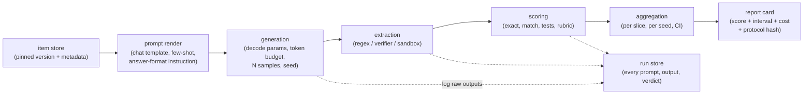

# 3. The harness: where the number is actually made

## The pipeline, stage by stage



The stage nobody plans for is the run store. Keeping every rendered prompt, raw
completion, extracted answer, and per-item verdict is what makes a surprising
result debuggable, and it is the difference between "the model got 71" and "the
model got 71, and 4 points of the 29 it lost were truncations, not wrong answers."
Budget the storage; it is small compared to the compute that produced it.

## The knobs that move the number more than the model does

This table is the heart of the topic. An interviewer asking "walk me through the
pipeline" is checking whether you know that each of these exists.

| Knob | What goes wrong | Typical swing | What to do |
|---|---|---|---|
| Chat template | Applying the instruct template to a base model, or none to an instruct model; wrong role tags or a missing generation prompt | Large, up to near-chance on some suites | Render with the model's own template, from the tokenizer config, and store the exact rendered string |
| System prompt | An unstated helpful-assistant preamble that one vendor's published number used and you did not | Several points | Pin it, empty by default, and report it |
| Few-shot count and order | 0-shot vs 5-shot changes both format and difficulty; example order changes answers | Several points | Fix k per benchmark, fix the shot pool and order by seed |
| Scoring mode | Log-likelihood ranking over options vs generating an answer and parsing it are different measurements | Large; a model can look random under one and fine under the other | Choose per benchmark and report which; do not mix modes across candidates |
| Length normalization | Raw log-likelihood favors short options; byte-length-normalized accuracy is a different metric | Several points | Report which normalization; keep it identical across candidates |
| Answer-format instruction | "Put your final answer in a box" vs nothing changes parseability, not just formatting | Several points, mostly through parse failures | Standardize one instruction; measure the parse-failure rate |
| Parser strictness | A correct answer written as "0.5" scored wrong against "1/2"; a refusal parsed as answer A | Several points, one-directional | Equivalence-aware matching, plus a manual audit of a sample of parse failures |
| Max output tokens | A reasoning model truncated mid-derivation is scored as wrong | Very large on reasoning suites | Set a budget that clears the observed distribution; report the truncation rate |
| Temperature and top-p | Greedy for one candidate, sampled for another; vendor-recommended settings differ per model | A few points, plus variance | One decode policy per benchmark, applied to all candidates; report it |
| Number of samples and seeds | A single run on a 30-item benchmark is a coin flip | Double-digit swings on small reasoning sets | Multiple seeds, report mean and spread ([A Sober Look at Progress in Language Model Reasoning](https://arxiv.org/abs/2504.07086)) |
| Serving stack and precision | Different inference engines, quantization, or batch sizes give different tokens | Small but enough to flip close calls | Pin the engine version, precision, and container digest |
| Provider | The same open-weight model served by two providers differs in quantization, template, and throughput | Several points | Treat provider as part of the candidate identity |
| Tool and sandbox environment | Network access, package versions, or time limits differ from the reference container | Large on agentic suites | Use the benchmark's official image, pinned by digest |

The canonical write-up of this whole class of problems is
[Lessons from the Trenches on Reproducible Evaluation of Language Models](https://arxiv.org/abs/2405.14782)
from the maintainers of the LM Evaluation Harness, which documents cases where
prompt format alone moves a model between near-random and competent on the same
items. The practical implication for an interview answer: **when someone's number
does not match yours, the prior is protocol difference, not model difference, and
you should be able to list the six places to look in order.**

## Scoring mode: log-likelihood vs generative

Two ways to score a multiple-choice item, and they measure different things.

**Log-likelihood ranking.** Score each option by the model's log probability of the
option text given the question, and pick the argmax. Cheap (one forward pass per
option, no sampling), deterministic, and immune to parse failures. Requires token
log-probabilities, which many API models no longer expose, and it measures a
discrimination ability the product never uses.

$$\hat{y} = \arg\max_{o \in \text{options}} \frac{\log p(o \mid x)}{|o|_{\text{bytes}}}$$

The byte-length normalization in the denominator is a choice, not a law: raw
log-likelihood systematically prefers short options, normalized log-likelihood
over-corrects on some suites, and the two are reported under different metric names
in the same harnesses (accuracy versus normalized accuracy). Comparing your
normalized number against someone's unnormalized number is a silent protocol bug.

**Generative scoring.** Let the model produce free text, extract the answer, and
compare against the reference. This matches how the model is used, works on
API-only models, and is the only option for open-ended tasks. It costs sampling and
it introduces a parser, which is now part of your measurement instrument.
Documented inconsistencies in how multiple-choice answers get extracted from
generated text are large enough to change model rankings
([Right Answer, Wrong Score](https://arxiv.org/abs/2503.14996)).

Rule of thumb: use generative scoring plus answer matching for anything you will
make a claim about, keep log-likelihood scoring for cheap high-frequency training
telemetry on base models, and never compare across the two.

## Reasoning models break three assumptions

Models with a variable thinking budget invalidate habits built on single-pass
models.

1. **Token budget is a capability knob.** Score against budget, not at one budget.
   The honest artifact is a small curve: score at low, medium, and high effort, with
   the mean output tokens at each point. A single number hides that you gave one
   candidate 10 times the compute.
2. **Truncation is the leading false negative.** If the budget cuts off the
   derivation, the item is scored wrong for a reason unrelated to ability. Track
   truncation rate as a first-class metric and treat any suite with a nonzero rate
   as unreported until it is fixed or disclosed.
3. **Vendor-recommended decoding differs per model.** Forcing greedy decoding on a
   model whose recommended sampling settings are non-greedy penalizes it; letting
   each model use its own settings makes runs non-comparable in a different way.
   Pick one policy, state it, and check both ways on a subset when a decision is
   close.

## Determinism is not free, even at temperature zero

Greedy decoding is not reproducible in a serving system, because kernels for
normalization, matrix multiplication, and attention are not batch-invariant: the
floating-point reduction order changes with batch composition, so the same prompt
can produce different tokens depending on what else was in flight. Thinking Machines
Lab documented the mechanism and shipped batch-invariant kernels that make outputs
bit-identical across repeated runs at a throughput cost
([Defeating Nondeterminism in LLM Inference](https://thinkingmachines.ai/blog/defeating-nondeterminism-in-llm-inference/)),
and SGLang has published deterministic-inference support on the same idea
([Towards Deterministic Inference in SGLang](https://www.lmsys.org/blog/2025-09-22-sglang-deterministic/)).

For an eval pipeline the practical stance is: do not claim determinism you cannot
demonstrate. Either run with batch-invariant kernels and verify by re-running a
subset, or accept run-to-run variance and measure it, which you need anyway for the
statistics in [section 6](06-statistics-and-leaderboards.md). The failure mode to
avoid is reporting a single-run number as exact and then being unable to reproduce
it in front of the person who asked.

## The protocol record: what must be logged

Treat this as the acceptance criterion for the pipeline. A run is reportable when
the record contains:

```text
model:      id, revision or snapshot date, provider, serving engine + version,
            precision / quantization, container digest
protocol:   harness commit, benchmark name + version + item count,
            prompt template hash, system prompt, few-shot k + shot-pool seed,
            answer-format instruction, parser version
decoding:   temperature, top-p, max output tokens, stop sequences,
            samples per item, seeds, reasoning-effort setting
results:    per-item verdict, per-slice score, aggregate score + interval,
            parse-failure rate, truncation rate, refusal rate
cost:       input tokens, output tokens, wall clock, dollars
```

Hash the protocol block and print the hash next to the score. Two numbers with
different hashes are not comparable, and saying so in an interview is worth more
than any individual metric.

## Running it at scale

At one benchmark and one model, the harness is a script. At a dozen benchmarks by a
dozen candidates by several seeds, it is a service with a queue, and the design
questions are the ordinary ones.

- **Parallelism.** Items are independent, so throughput is bounded by provider rate
  limits for API candidates and by GPU count for hosted ones. Shard by item, not by
  benchmark, so one slow suite does not serialize the run.
- **Caching, keyed correctly.** The cache key is the full protocol hash plus item id
  plus sample index. Keying on prompt text alone silently serves stale results after
  a template change, which is the worst possible bug because it looks like a null
  result.
- **Idempotent retries with accounting.** Provider 5xx and container flakes are
  routine. Retry, but record how many items needed retries: a suite where 5 percent
  of the agentic items were retried is reporting an environment number as a model
  number.
- **Sandboxing for code and agents.** Untrusted model output executes in the
  benchmark's own container image, network-isolated unless the benchmark requires
  network, with a wall-clock cap per item. Pin the image by digest; agentic scores
  drift when base images move underneath.
- **Cost accounting per run.** Tokens in, tokens out, dollars, and GPU-hours, stored
  next to the score. Cost is not overhead here, it is one of the two axes any real
  model-selection decision sits on.

**Tools.** [LM Evaluation Harness](https://github.com/EleutherAI/lm-evaluation-harness)
(EleutherAI) is the reference implementation for static suites and the source of the
lessons paper above; [HELM](https://crfm.stanford.edu/helm/) (Stanford CRFM)
standardizes multi-scenario reporting; [Inspect](https://inspect.aisi.org.uk/) (UK
AI Security Institute) is built for agentic and safety evaluations with tool
sandboxes and a solver abstraction;
[simple-evals](https://github.com/openai/simple-evals) (OpenAI) is the minimal
generative-scoring reference whose value is that the prompts and parsers are readable;
SWE-bench, LiveCodeBench, and tau-bench ship their own harnesses and containers,
which you should use rather than reimplement.

## Implementation pitfalls

| Symptom | Likely cause | Check |
|---|---|---|
| Score far below the published number | Chat template or system prompt mismatch | Print one rendered prompt and compare against the harness reference |
| Score near chance on a suite the model should pass | Log-likelihood scoring on a chat model, or option-order formatting bug | Switch to generative scoring on 50 items and compare |
| Reasoning suite unexpectedly weak | Output-token budget truncating derivations | Plot the output-length distribution against the cap; report truncation rate |
| Two runs of the same candidate differ | Sampling without a fixed seed, batch-invariance nondeterminism, or provider-side model update | Re-run a 50-item subset twice; if it still moves, the stack is the variable |
| Agentic score dropped after an infra change | Base image, package version, or network policy drift | Diff the container digest against the last good run |
| A fine-tune improves only on one benchmark | Format overfitting to that benchmark's answer style | Run the same construct in a different format (free-form instead of multiple choice) |
| Everything got 3 points better after a "harness cleanup" | The cleanup changed the parser | Diff the parse-failure rate before and after; re-score old outputs with the new parser |

That last row is the reason to keep raw outputs: re-scoring stored completions with
a new parser is cheap, and it separates a scoring change from a model change without
re-running the models.
