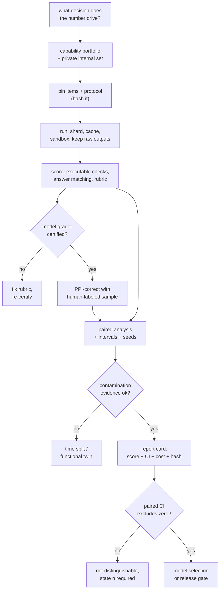

# 9. Summary

## One-page recap

- **A benchmark score is a construct, an item population, and a protocol.** Most
  disagreements about scores are really disagreements about one of the three. Name
  which one before arguing about the number.

- **The protocol moves the number more than the model does.** Chat template, system
  prompt, few-shot count, scoring mode, length normalization, answer-format
  instruction, parser strictness, output-token budget, decode parameters, seeds,
  serving stack, and provider each shift results, several of them by more than a
  model generation. Pin them, hash them, print the hash next to the score.

- **Re-run every baseline yourself.** Published numbers came from a different
  pipeline, usually a favorable one. One harness, one protocol, all candidates,
  compared paired per item.

- **Contamination has five kinds and deduplication catches one.** Verbatim,
  near-duplicate, format, distillation, and selection leakage. The verifiable
  defenses are black-box: post-cutoff time splits, live and time-gated benchmarks,
  functional twins, and a private internal set whose no-leak story you can prove.

- **Broken items cap what you can measure.** Label errors on classic multiple-choice
  suites and weak outcome validation on agentic ones both inflate or scramble
  rankings. Audit passing agent trajectories by hand before publishing an agentic
  number.

- **Scoring is an instrument with its own error rate.** Executable checks first,
  answer matching for short free-form, expert rubrics for open-ended. When a model
  grades, certify it against human labels, probe it with degenerate inputs, and then
  correct its residual bias with prediction-powered inference rather than trusting
  it.

- **Analyze evals like experiments.** Paired differences, Wilson or bootstrap
  intervals at small $n$, clustered errors for grouped items, multiple seeds on
  reasoning suites, false-discovery control across the grid. On a 200-item benchmark
  a 3-point gap from one run is not resolvable, and saying so is the correct answer.

- **Report cost with quality.** Test-time compute makes quality a curve. Score,
  interval, tokens, dollars, latency, and effort setting travel together, or the
  comparison silently rewards whoever spent more.

- **Benchmarks pick a model; they never gate a feature.** The feature gate is the
  golden set, the certified judge, and the online loop in the
  [evaluation chapter](../evaluation/).

## The system on one page

## Test yourself

Answers are collapsed. Attempt each before opening one.

1. A vendor reports 78 on a benchmark; your harness gives that model 66 on the same
   benchmark. List the checks in the order you would run them, and say why that
   order.

   

Answer

   In descending order of typical effect size, because the goal is to find the one
   knob that explains 12 points rather than to audit everything
   ([3](03-the-harness.md)). **First, the chat template and system prompt**: applying
   the wrong template, or omitting a preamble the vendor used, can drop a model
   toward chance on some suites. **Second, scoring mode**: log-likelihood ranking
   over options and generative-plus-parser are different measurements, and a chat
   model scored by log-likelihood can look nearly random. **Third, the
   output-token budget**: check the truncation rate, since a reasoning model cut off
   mid-derivation is scored wrong for a reason unrelated to ability. **Fourth,
   few-shot count and order and the answer-format instruction**, which change both
   difficulty and parseability. **Fifth, decode parameters and sample count**, then
   **benchmark version and item subset**. The diagnostic that short-circuits most of
   this is printing one rendered prompt and one raw completion and reading them; the
   bug is usually visible. The conclusion is not to reconcile with the published
   number but to re-run every candidate, baseline included, under your own protocol
   ([1](01-clarifying-requirements.md)).

   

2. Two models on a 500-item benchmark: A scores 71.0, B scores 69.0. Per item, A
   wins 25 that B loses, and B wins 15 that A loses. Is A better?

   

Answer

   Not established. The paired difference is $(25-15)/500 = 2$ points with standard
   error $\sqrt{25+15}/500 \approx 1.3$ points, so McNemar's
   $z = 10/\sqrt{40} \approx 1.6$, which does not clear 1.96
   ([6](06-statistics-and-leaderboards.md)). Note how much the pairing bought: the
   unpaired interval on each score alone is about 4.4 points, which would have made
   the comparison look hopeless, while paired it is merely inconclusive and you can
   compute exactly what would settle it. At a discordance rate of $40/500 = 0.08$
   and a 2-point target, $n \approx 0.08 \cdot 7.85 / 0.02^2 \approx 1{,}570$ items.
   So the correct report is "not distinguishable at this sample size, about 1,600
   items needed," plus a check of seed variance, which on small suites often exceeds
   the effect under discussion.

   

3. Your grader is a model. You have budget for 300 human labels but the benchmark
   has 5,000 items. What do you do with the 300, and why is that better than
   labeling 300 items and reporting those?

   

Answer

   Use them as the correction term in a prediction-powered estimate rather than as a
   standalone sample ([5](05-scoring-and-autoraters.md)). Run the grader on all
   5,000, run humans on 300 that the grader also scored, and report
   $\hat\theta = \text{mean}(\text{judge over } 5{,}000) + \text{mean}(\text{human} - \text{judge over } 300)$.
   The second term is an unbiased estimate of the grader's systematic error, so the
   result is unbiased no matter how biased the grader is, while the first term
   contributes the precision of 5,000 items. Reporting the 300 alone throws away the
   other 4,700 and gives a much wider interval; reporting the grader alone is
   precise and biased. Stratify the 300 across slices rather than sampling uniformly,
   and oversample near the decision boundary when you are also certifying the grader.
   Two disciplines come with it: report the grader's own error rate, since no
   comparison finer than that rate is supportable, and re-collect labels when the
   distribution moves.

   

4. A benchmark suite you inherited scores an agent as passing 68 percent of tasks.
   What do you check before that number leaves the room?

   

Answer

   Four things, in order ([4](04-contamination-and-validity.md),
   [3](03-the-harness.md)). **Outcome validation**: manually audit a sample of
   passing trajectories, because audits of widely used agentic benchmarks found test
   suites weak enough to accept incorrect solutions and criteria that can score
   inaction as success, which inflates scores substantially. **Environment
   provenance**: is the container pinned by digest, is the network policy the
   benchmark's own, and how many items needed retries; a suite with a material retry
   rate is reporting infrastructure. **The metric**: 68 percent per attempt is not 68
   percent as experienced if the user gets one shot, so report pass^k alongside, and
   note that $0.68^3$ is about 31 percent. **Cost**: steps, tokens, and dollars per
   task, since an agent that succeeds by brute-forcing 200 tool calls is a different
   product decision from one that succeeds in 8.

   

5. Leadership wants one headline number across 15 benchmarks. What do you build, and
   what do you refuse?

   

Answer

   Build a normalized, explicitly weighted index with a bootstrap interval on both
   the index and the rank, drop the saturated components, and keep the
   per-benchmark table adjacent ([6](06-statistics-and-leaderboards.md)). Refuse the
   naive average of raw percentages: chance floors differ (25 percent on a 4-option
   set versus 0 percent free-form) and ceilings differ, so it weights by scale rather
   than importance, and it hides which capability moved. Also refuse to publish the
   index without the rank interval, because rank stability is what readers consume
   and it is usually far weaker than the point estimates suggest. The honest framing
   for leadership is that the index is a screening device and the internal benchmark
   is the decision-maker of record.

   

6. Someone proposes evaluating on your test set weekly during a training run, and
   picking the checkpoint that scores best. What is wrong, and what do you propose
   instead?

   

Answer

   That is selection leakage: nothing entered the training data, but the reported
   number becomes a maximum over many looks rather than an unbiased estimate, and
   the gap grows with the number of looks ([4](04-contamination-and-validity.md)).
   The proposal instead is the standard three-way split adapted to evals: a
   development set you may query freely for checkpoint selection, and a sealed slice
   with an explicit query budget, logged, where each look is recorded and a
   checkpoint chosen on it consumes a look. Report the final number from the sealed
   slice with its query count attached. This is the same discipline that makes
   leaderboard best-of-N submission a known bias ([The Leaderboard
   Illusion](https://arxiv.org/abs/2504.20879)): the number of variants tried before
   publishing one is part of the result.

   

## Further reading

- The capstone: [the complete build](10-putting-it-together.md), where the whole
  pipeline is decided once, costed, re-derived under three constraint sets, and
  compressed into a runnable statistics reference.
- Reproducibility and protocol: [Lessons from the Trenches on Reproducible Evaluation of Language Models](https://arxiv.org/abs/2405.14782).
- Statistics: [Adding Error Bars to Evals](https://arxiv.org/abs/2411.00640) and [Don't Use the CLT in LLM Evals With Fewer Than a Few Hundred Datapoints](https://arxiv.org/abs/2503.01747).
- Reasoning-suite variance: [A Sober Look at Progress in Language Model Reasoning](https://arxiv.org/abs/2504.07086).
- Contamination: [Recent Advances in LLM Benchmarks against Data Contamination](https://arxiv.org/abs/2502.17521) and [A Careful Examination of LLM Performance on Grade School Arithmetic](https://arxiv.org/abs/2405.00332).
- Agentic rigor: [Establishing Best Practices for Building Rigorous Agentic Benchmarks](https://arxiv.org/abs/2507.02825).
- Judge correction: [Stratified Prediction-Powered Inference](https://arxiv.org/abs/2406.04291) and [How to Correctly Report LLM-as-a-Judge Evaluations](https://arxiv.org/abs/2511.21140).
- Format validity: [Answer Matching Outperforms Multiple Choice](https://arxiv.org/abs/2507.02856).
- The product-side companion: [evaluating LLM systems](../evaluation/).
