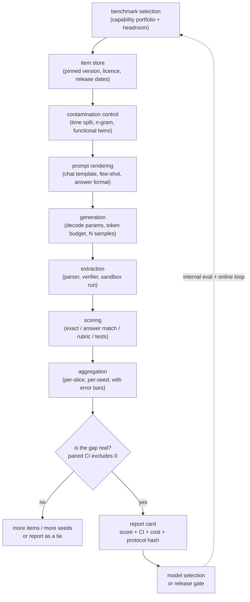

# Benchmarking a Model: The Evaluation Pipeline End to End

The companion [evaluation chapter](../evaluation/) answers "is my *feature* good?"
This chapter answers the other question labs and platform teams actually get asked:
**"here is a model. Produce a number I can bet a launch on, and defend every step of
how you got it."**

An interviewer rarely says "design a benchmark harness." They say something like:
**"We are choosing between three candidate models and we also fine-tuned our own.
Walk me through the whole evaluation pipeline. How do you know the numbers mean
anything?"** The follow-ups are always the same three: *why does your number differ
from the published one, how do you know a 2-point gap is real, and how do you know
the model has not already seen the test set.*

That is a systems question, not a metrics question. A benchmark score is the output
of a pipeline with roughly a dozen knobs, most of which move the number by more than
the model difference you are trying to measure.

## Sections

1. [Clarifying the requirements](01-clarifying-requirements.md) - the dialogue that scopes what decision the number drives, and the two consequences that fall out.
2. [Framing the benchmark](02-frame-the-benchmark.md) - construct, item population, protocol; the 2026 benchmark families; saturation, headroom, and construct validity.
3. [The harness](03-the-harness.md) - the whole pipeline mechanically: prompt rendering, decoding, answer extraction, scoring, provenance, determinism, and running it at scale.
4. [Contamination and item validity](04-contamination-and-validity.md) - leakage types, detection methods (n-gram, Min-K%, time splits, functional twins), live benchmarks, and broken items.
5. [Scoring and autoraters](05-scoring-and-autoraters.md) - answer matching vs multiple choice, rubric grading, pass@k vs pass^k, certifying a model grader, and bias-corrected estimation.
6. [Statistics and leaderboards](06-statistics-and-leaderboards.md) - error bars, paired tests, seed variance, multiple comparisons, aggregation, arena ranking, and cost-matched comparison.
7. [How teams do it in production](07-how-teams-do-it-in-production.md) - where real eval stacks diverge; named comparison with first-party links.
8. [Interview Q&A](08-interview-qa.md) - commonly asked, tricky, and commonly answered wrong.
9. [Summary](09-summary.md) - one-page recap, mermaid, test-yourself questions, further reading.
10. [Putting it together: the complete build](10-putting-it-together.md) - a default stack, the full run costed, the same system under three constraint sets, and a runnable zero-dependency statistics reference.

## The pipeline on one page

Every arrow in that diagram is a place a number goes wrong, and the interview lives
in the arrows, not the boxes.

## Companion chapters

- [Evaluating LLM systems](../evaluation/) is the product-side loop: golden sets, LLM-as-judge calibration, regression gates, online A/B. Benchmarks feed the *model selection* step upstream of it; they never gate a feature.
- [Data curation and pretraining](../data-and-pretraining/) owns training-side decontamination, which is the only place contamination can actually be fixed.
- [Continued pretraining and long context](../continued-pretraining/) covers long-context evaluation in the context of extending a model.
- The classic-ML companion book covers the statistics of online comparison in [experimentation](https://github.com/neurarch-ai/awesome-ml-system-design/tree/main/book/experimentation/).
