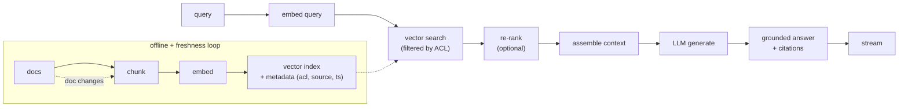

# Chapter 1: Serving Retrieval-Augmented Generation

Retrieval-Augmented Generation, or RAG, is the pattern that lets a large language model answer questions over a body of documents it was never trained on: a company wiki, a ticket queue, a pile of design docs. Instead of hoping the answer is baked into the model's weights, we retrieve the relevant passages at query time and hand them to the model as context, so the answer is grounded in real sources and can cite them. It is the most common LLM system-design problem in production today, and it is also the one where naive implementations most often go shallow, drawing "embed, retrieve, generate" in thirty seconds and stopping there. The real work is in retrieval quality, freshness, access control, and knowing that the system actually works.

In this chapter, we will build a mental model of a production RAG system by working through a concrete scenario: answering employee questions over an internal knowledge base of roughly 50 million documents, where answers must cite their sources and stay current as documents change. We will separate the offline write path from the online read path, treat chunking and embedding as real design decisions rather than defaults, size a vector index at scale, add re-ranking as a precision lever, and close the loop with evaluation. Along the way we will open two validated reference architectures, the embedding encoder and the generator, so you can trace the actual layers rather than reason about a box labeled "model."

In this chapter, we will cover the following main topics:

- Scoping a RAG system and its requirements
- The offline write path and the online read path
- Chunking as a design decision
- The embedding service and tracing the encoder architecture
- Vector indexing at 50-million scale
- Re-ranking for precision
- Prompt assembly and the generator
- Failure modes, safety, and evaluation

## Technical requirements

To follow along you need a modern web browser to open the validated reference graphs used as figures in this chapter. These are not screenshots: they are shape-checked architecture graphs from the Neurarch model zoo, and each one opens live in the editor so you can inspect real dimensions layer by layer.

The two architectures we open in this chapter are:

- **all-MiniLM-L6**, the encoder-only embedding model: [open it live](https://www.neurarch.com/?import=https://raw.githubusercontent.com/neurarch-ai/awesome-llm-model-zoo/main/architectures/all-minilm-l6/model.json)
- **Llama-3 8B**, the decoder-only generator: [open it live](https://www.neurarch.com/?import=https://raw.githubusercontent.com/neurarch-ai/awesome-llm-model-zoo/main/architectures/llama3-8b/model.json)

The full collection of 92 validated reference graphs lives in the [Model Zoo repository](https://github.com/neurarch-ai/awesome-llm-model-zoo), with a browsable [gallery](https://neurarch-ai.github.io/awesome-llm-model-zoo). It is built by [Neurarch](https://www.neurarch.com).

Conceptually you will also want to be aware of the tooling classes we name but do not install here: an approximate-nearest-neighbor index such as HNSW or IVF-PQ (the retrieval layer), a cross-encoder re-ranker, and a metadata store holding access-control lists, source, and timestamps. No datasets are required to read the chapter; the running example is an internal 50-million-document corpus of mixed formats.

## Scoping a RAG system and its requirements

Before drawing any boxes, we scope the problem, because the answers change the architecture. For our internal knowledge base we assume around 10,000 employees, peak load near 20 queries per second with headroom to 100, and an interactive chat latency budget: streaming the first token in under about 1.5 seconds, with the full answer following in a few seconds. Documents change daily, so a newly edited doc should become answerable within minutes to an hour, not next week. The quality bar is that answers must be grounded in retrieved documents and cite them, and abstaining ("I could not find this") is better than being confidently wrong. The corpus is 50 million documents of mixed formats with a heavily skewed length distribution, one-line tickets sitting next to 80-page design docs.

Writing these out as functional and non-functional requirements gives us:

**Functional**

- Retrieve relevant passages for a query
- Generate a grounded answer with citations
- Abstain when retrieval is weak
- Keep the index current as documents change

**Non-functional**

- p99 first-token latency under about 1.5 seconds
- Around 20 QPS sustained, with headroom to 100
- Freshness under 1 hour
- Cost per query low enough for unlimited internal use
- Access control: a user must not retrieve documents they cannot read

The non-functional requirement that quietly dominates here is **access control**, because it constrains retrieval itself. Get it wrong and the system leaks. We flag it early and return to it, because the scariest RAG bug is a correct, well-cited answer sourced from a document the user should never have seen.

## The offline write path and the online read path

A production RAG system is really two pipelines that share an index. We keep them separate in our heads and in our diagrams.

The **offline (write) path** turns documents into searchable vectors. It runs on initial ingest and again whenever a document changes. A document update re-chunks and re-embeds only the changed document, then upserts it into the index. That incremental upsert is what buys us freshness under an hour without rebuilding 50 million vectors nightly.

The **online (read) path** turns a query into a grounded answer. We embed the query, run a vector search filtered by the user's access-control list, take the top-k chunks, optionally re-rank them, assemble a tight prompt, and stream the model's answer with citations.

*Figure 1.1: The full RAG pipeline, offline indexing feeding the online read path*

The rest of the chapter walks the stages of this diagram in the order a query flows through them, pausing where a stage hides a real design decision.

## Chunking as a design decision

The first place engineers reach for a default and pay for it later is chunking. Naive fixed-size chunking, say a hard cut every 512 tokens, splits mid-sentence and mid-table and quietly destroys retrieval quality. We have better options, in increasing order of sophistication:

- **Recursive or structural chunking:** split on document structure first (headings, paragraphs, code blocks), then apply a size cap. This keeps semantically whole units together.
- **Overlap:** use a sliding window with overlap so an answer that spans a chunk boundary is still retrievable inside a single chunk.
- **Contextual chunking:** prepend a short document or section summary to each chunk, so a standalone chunk still carries its context, for example "This is from the Q3 billing design doc, section on refunds: ...".

Chunk size trades recall against precision and prompt cost. Smaller chunks retrieve more precisely but you need more of them to cover an answer; larger chunks carry more context but dilute the embedding, because a single vector now has to summarize more text. The move in an interview and in production is the same: state the tradeoff, pick a sensible default, and move on. A reasonable default is structural chunks capped at around 500 tokens with about 50 tokens of overlap.

## The embedding service and tracing the encoder architecture

Every chunk on the write path and every query on the read path passes through an **embedding model**, a text encoder that maps text to a single vector. This is the only place a true encoder enters RAG, and it deserves more than a labeled box. The key decisions are:

- **Model choice:** embedding dimension (typically 384 to 1536), domain fit, and cost. A larger dimension improves recall slightly but costs more storage and search time. For 50 million chunks, the dimension drives your index memory budget directly, so this is a load-bearing choice, not a detail.
- **It is its own service.** The encoder is a transformer stack like the generator, just used to produce a pooled vector rather than to generate text. It needs its own batching and autoscaling on the write path, where you bulk-embed 50 million chunks, and on the read path, where one latency-sensitive query embedding is produced per request.
- **Cache query embeddings.** Repeated and near-repeated queries are common on an internal tool, and a cache hit skips the encoder entirely.

To ground this, it helps to open a real encoder stack rather than picturing an abstraction. all-MiniLM-L6 is a small, widely used sentence-embedding encoder from the sentence-transformers lineage. Its whole job is text in, one vector out.

*Figure 1.2: all-MiniLM-L6, an encoder-only embedding model, text in and one pooled vector out*

You can [open this graph live](https://www.neurarch.com/?import=https://raw.githubusercontent.com/neurarch-ai/awesome-llm-model-zoo/main/architectures/all-minilm-l6/model.json) and trace how the stack pools its per-token hidden states into a single vector, and note the embedding dimension: that number is the one that drives your whole index memory budget in the next section.

## Vector indexing at 50-million scale

Retrieval is a **search problem**, not a model. Nothing reasons during retrieval; we embed the documents into vectors, store them in a vector index, and at query time run an approximate **k-nearest-neighbor (KNN or ANN)** lookup to pull the most similar chunks out of the knowledge base. Exact nearest-neighbor over 50 million vectors per query is too slow, so we use an **approximate** index. The two mainstream families are:

- **HNSW:** a navigable-graph index with excellent recall and latency, at a higher memory cost.
- **IVF-PQ:** an inverted file with product quantization that compresses the vectors, giving much lower memory at some recall loss. At 50 million-plus vectors this is often the pragmatic choice.

We shard the index to fit memory and spread load, and replicate shards for QPS. The critical correctness rule is to **filter by access-control list inside the search**, not after it. Post-filtering both leaks (you retrieve, then hope to hide) and wastes recall, because filtering after the top-k can empty your result set when a user's readable documents fall outside the unfiltered top-k. Push the ACL predicate into the search itself.

## Re-ranking for precision

Vector search is tuned for cheap, high recall: get the right chunk somewhere in the top 50. It is not tuned for precision, which passage is actually best. A **cross-encoder re-ranker** closes that gap. Unlike the embedding encoder, which sees the query and a chunk separately, a cross-encoder scores a query and a candidate chunk jointly, reading them together, which is far more accurate but far more expensive per pair. We run it only on the small candidate set, scoring the top 50 or so and keeping the best 5. It is the standard precision lever, and we make it optional behind a latency budget so it can be dialed back under load.

## Prompt assembly and the generator

With a handful of high-quality chunks in hand, we assemble the prompt: system instructions, then the retrieved chunks tagged with their source IDs, then the query. Two things must be right:

- **Citations:** instruct the model to cite chunk IDs, and then verify that each cited chunk actually exists in the prompt before returning the answer. This is cheap insurance against fabricated citations.
- **Context budget:** we cannot stuff 50 chunks into the prompt. Re-ranking plus a token budget keeps it tight. More context is not free: it raises latency and cost, and it can *lower* quality by burying the relevant passage in the middle of a long prompt, the "lost in the middle" effect.

The generator itself is a standard decoder-only LLM. For RAG specifically, note that long retrieved contexts make the **prefill** large, so the up-front cost of processing the prompt matters more here than in short-prompt chat. This is also where grouped-query attention earns its place. In grouped-query attention the $H$ query heads are partitioned into $G$ groups that share one key/value head, so the number of KV heads is $G$ with $1 \le G \le H$, sitting between full multi-head attention and multi-query attention:

$$\text{MQA} \;(G=1) \;\le\; \text{GQA} \;(1 < G < H) \;\le\; \text{MHA} \;(G=H)$$

The KV cache size scales with the number of KV heads and the sequence length, and its bytes are:

$$\text{KV bytes} = 2 \times n_{\text{layers}} \times n_{\text{kv}} \times d_{\text{head}} \times n_{\text{seq}} \times b$$

where the leading $2$ counts $K$ and $V$, $n_{\text{kv}}$ is the number of KV heads, $d_{\text{head}}$ the per-head dimension, $n_{\text{seq}}$ the sequence length, and $b$ the bytes per element. Cutting from $H$ heads to $G$ shrinks the cache, and the bandwidth cost of reading it at every decode step, by a factor of roughly $H/G$. That is exactly what keeps the KV cache affordable when we feed the model the long retrieved contexts RAG produces.

Opening a real generator makes the point concrete. Llama-3 8B is a decoder-only LLM that ships grouped-query attention.

*Figure 1.3: Llama-3 8B, a decoder-only generator using grouped-query attention*

You can [open this graph live](https://www.neurarch.com/?import=https://raw.githubusercontent.com/neurarch-ai/awesome-llm-model-zoo/main/architectures/llama3-8b/model.json) and locate the grouped-query attention, the piece that keeps the KV cache affordable under long context. The full pipeline, then, is these two models bracketing a search: the embedding model builds the vectors, KNN or ANN search over the index retrieves the relevant chunks, and the generator writes the grounded answer. The two figures are the two models; the retrieval between them is a vector-search layer, not a model.

## Bottlenecks and scaling

As load and corpus grow, five bottlenecks tend to surface in a predictable order. It is worth memorizing the first sign of each and the fix, because they map directly onto the stages above:

| Bottleneck | First sign | Fix | Tradeoff |
|---|---|---|---|
| Query embedding latency | p99 creeps up | Cache; smaller encoder | Slight recall loss |
| Vector search at scale | Search dominates latency | IVF-PQ, sharding | Recall vs memory |
| Prefill cost (long context) | Cost per query high | Re-rank harder, fewer chunks | Recall vs cost |
| Generator throughput | Queue backs up | Continuous batching, replicas | Cost |
| Re-index lag | Stale answers | Incremental upsert on change | Write-path complexity |

## Failure modes, safety, and evaluation

A RAG system fails in ways a plain chatbot does not, because it ingests untrusted documents and enforces access boundaries. We plan for four categories:

- **Hallucination and weak grounding:** abstain when the top re-rank score falls below a threshold, and verify that citations point to chunks actually present in the prompt.
- **Prompt injection from documents:** the corpus is not fully trusted. A wiki page can contain "ignore previous instructions." We treat retrieved text as data, never as instructions. This is a real and underrated RAG attack surface.
- **Access control:** enforce it at retrieval, and test it. As flagged in scoping, a correct, well-cited answer sourced from a document the user should never see is the worst failure mode this system has.
- **Evaluation:** build two evals and wire both into a regression gate before any change to chunking, embedding, or prompt ships. A **retrieval eval** measures recall@k against labeled query-document pairs. An **answer eval** measures groundedness and correctness, usually LLM-as-judge plus a human sample. Retrieval recall is typically the ceiling on end-to-end quality, so we measure it separately: if the right chunk never gets retrieved, no amount of generator quality recovers it.

## Summary

In this chapter we scoped a production RAG system over a 50-million-document internal knowledge base and worked through it stage by stage. We separated the offline write path, which chunks, embeds, and indexes documents with an incremental freshness loop, from the online read path, which embeds the query, searches an approximate vector index under access control, optionally re-ranks, assembles a tight grounded prompt, and streams a cited answer. We treated chunking and embedding-model choice as real design decisions rather than defaults, sized an HNSW or IVF-PQ index at scale, added a cross-encoder re-ranker as the precision lever, and saw why grouped-query attention keeps the generator's KV cache affordable under the long contexts RAG produces. We opened two validated reference architectures, the all-MiniLM-L6 encoder and the Llama-3 8B generator, to ground the two models that bracket the vector search. Finally we covered the failure modes that are specific to RAG: hallucination, prompt injection from the corpus, access-control leaks, and the two-part evaluation that gates every change.

In the next chapter, *Semantic search and embeddings*, we go deeper into the retrieval half itself: how embedding models are trained, how similarity is scored, and how hybrid lexical-plus-semantic search improves the recall that, as we saw here, sets the ceiling on everything downstream.

## Questions

1. Why does an internal RAG system split into a separate offline write path and online read path, and what does the incremental upsert on the write path buy you?
2. What are the failure modes of naive fixed-size chunking, and how do structural chunking, overlap, and contextual chunking each address them?
3. How does chunk size trade recall against precision and prompt cost, and what makes a reasonable default?
4. Why is the embedding model treated as its own service with distinct read-path and write-path scaling needs, and how does the embedding dimension affect your index memory budget?
5. Compare HNSW and IVF-PQ for a 50-million-vector index. What does each optimize, and why is IVF-PQ often the pragmatic choice at that scale?
6. Why must an access-control filter be applied inside the vector search rather than after it?
7. How does a cross-encoder re-ranker differ from the embedding encoder, and why is it run only on a small candidate set?
8. Write the KV-cache memory formula and explain why grouped-query attention reduces it. Why does this matter more for RAG than for short-prompt chat?
9. Why does a longer retrieved context raise prefill cost, and how can too much context lower answer quality?
10. What are the two evaluations a production RAG system should gate changes on, and why is retrieval recall usually the ceiling on end-to-end quality?

## Further reading

Each of the following is a first-party engineering writeup that ships the patterns in this chapter. Read them for what an interview answer skips: who the system serves, the product design, the eval bar, and the deployment shape.

- [From RAG to Richness: How Ramp Revamped Industry Classification](https://builders.ramp.com/post/industry_classification): embedding-model selection plus two-prompt retrieval over NAICS codes with precomputed embeddings.
- [Enhanced Agentic-RAG: near-human precision for chatbots (Uber)](https://www.uber.com/blog/enhanced-agentic-rag/): pre-retrieval query agents, doc loaders, metadata enrichment, and LLM-as-judge evaluation.
- [GraphRAG: unlocking LLM discovery on narrative private data (Microsoft Research)](https://www.microsoft.com/en-us/research/blog/graphrag-unlocking-llm-discovery-on-narrative-private-data/): knowledge-graph retrieval beats vector-only RAG on multi-hop private-data queries.
- [Path to high-quality LLM-based Dasher support automation (DoorDash)](https://careersatdoordash.com/blog/large-language-modules-based-dasher-support-automation/): a RAG support bot with an LLM guardrail and judge, reporting 90% fewer hallucinations.
- [Building Dash: how RAG and AI agents meet business needs (Dropbox)](https://dropbox.tech/machine-learning/building-dash-rag-multi-step-ai-agents-business-users): hybrid lexical plus chunking plus rerank retrieval balancing latency, freshness, and cost.
- [Embedding Tradeoffs, Quantified (Vespa)](https://blog.vespa.ai/embedding-tradeoffs-quantified/): INT8 and binary quantization plus hybrid BM25 quality-versus-latency tradeoffs.
- [Asymmetric Retrieval: spend on docs, embed queries for free (Vespa)](https://blog.vespa.ai/asymmetric-retrieval-spend-on-docs-queries-for-free/): a big model for documents and a tiny local model for queries, to cut serving cost.
- [How a reranking microservice improves retrieval accuracy and cost (NVIDIA)](https://developer.nvidia.com/blog/how-using-a-reranking-microservice-can-improve-accuracy-and-costs-of-information-retrieval/): two-stage embed-then-rerank, with fewer chunks sent to the LLM to cut cost.
- [Why vector search isn't enough for enterprise RAG (Glean)](https://www.glean.com/blog/hybrid-vs-rag-vector): enterprise RAG needs hybrid search plus a knowledge graph and permissions.
- [Creating High Quality RAG Applications with Databricks](https://www.databricks.com/blog/building-high-quality-rag-applications-databricks): real-time serving, model selection and evaluation, and quality monitoring for RAG.
- [Improving Post Search at LinkedIn](https://www.linkedin.com/blog/engineering/search/improving-post-search-at-linkedin): layered first- and second-pass rankers with separate relevance, quality, and freshness models.
- [How we built Text-to-SQL at Pinterest](https://medium.com/pinterest-engineering/how-we-built-text-to-sql-at-pinterest-30bad30dabff): RAG table retrieval grounds LLM SQL generation over thousands of warehouse tables.
- [Introducing AutoRAG: managed RAG on Cloudflare](https://blog.cloudflare.com/introducing-autorag-on-cloudflare/): a managed pipeline with async indexing, Vectorize storage, and query-time retrieval plus generation.
- [Unlocking knowledge sharing for videos with RAG (Vimeo)](https://medium.com/vimeo-engineering-blog/unlocking-knowledge-sharing-for-videos-with-rag-810ab496ae59): video Q&A over transcript chunking, multi-size context windows, and vector retrieval.
- [RAG pipelines in production (Elastic)](https://www.elastic.co/search-labs/blog/rag-in-production): operationalizing RAG with hybrid retrieval, reranking, monitoring, and benchmarking.
- [Building RAG-based LLM Applications for Production (Anyscale)](https://www.anyscale.com/blog/a-comprehensive-guide-for-building-rag-based-llm-applications-part-1): an end-to-end RAG system built, evaluated, and served at scale with Ray Serve.
- [What is retrieval-augmented generation? (GitHub)](https://github.blog/ai-and-ml/generative-ai/what-is-retrieval-augmented-generation-and-what-does-it-do-for-generative-ai/): how Copilot Enterprise grounds answers via internal code search and semantic retrieval.
- [RAGO: systematic performance optimization for RAG serving (Google / ETH Zurich)](https://arxiv.org/abs/2503.14649): a serving framework raising QPS per chip 2x and cutting time-to-first-token 55%.
- [Evidently AI ML system design database](https://www.evidentlyai.com/ml-system-design): the broadest curated index, 800 case studies from 150-plus companies, for going beyond the cases listed here.
