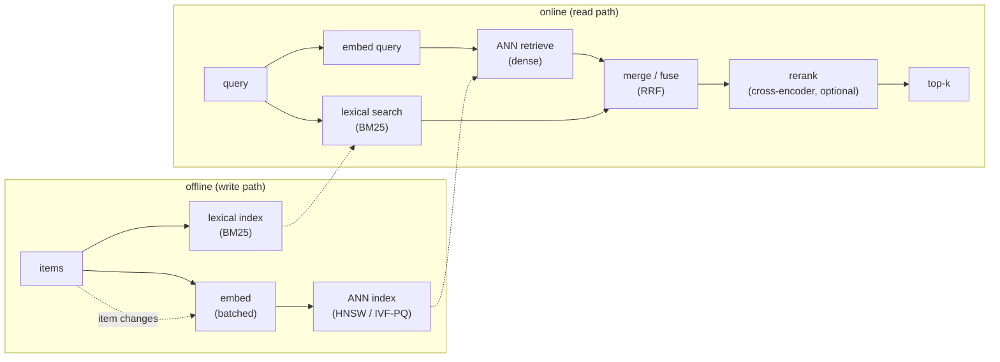

# Chapter 2: Semantic Search and Embedding Services

In the previous chapter we built a Retrieval-Augmented Generation system and saw that retrieval recall sets the ceiling on everything downstream: if the right passage never gets retrieved, no amount of generator quality recovers it. This chapter zooms into that retrieval half and treats it as a service in its own right. The scenario is a semantic search service over a large corpus, say 100 million items, that must return the most relevant results for a query in tens of milliseconds. This is the search engine other systems call, the thing that sits under RAG, recommendations, and product search, not the full answer pipeline.

The classic mistake, in an interview and in production, is to say "embed and do nearest neighbor" and stop. The depth is elsewhere: in the embedding model as a service with two very different workloads, in the approximate index that makes 100-million-vector search fast enough, in knowing that pure dense search has real blind spots that a lexical channel fixes, and in the reranker that buys precision at the top. Along the way we will open two validated reference architectures, a text embedding encoder and a shared text-and-image encoder, so you can trace the layers that produce the vectors rather than reason about a box labeled "embedder."

In this chapter, we will cover the following main topics:

- Scoping a semantic search service and its requirements
- The offline write path and the online read path
- The embedding model as a service, and tracing an encoder
- Vector indexing at 100-million scale: HNSW versus IVF-PQ
- Hybrid search: why pure dense is not enough
- Reranking for precision
- Multimodal search and the shared embedding space
- Freshness, incremental indexing, and embedding drift
- Bottlenecks, failure modes, and evaluation

## Technical requirements

To follow along you need a modern web browser to open the validated reference graphs used as figures in this chapter. These are not screenshots: they are shape-checked architecture graphs from the Neurarch model zoo, validated end to end at real dimensions, and each one opens live in the editor so you can inspect the layers and the embedding dimension yourself.

The two architectures we open in this chapter are:

- **all-MiniLM-L6**, an encoder-only text embedding model: [open it live](https://www.neurarch.com/?import=https://raw.githubusercontent.com/neurarch-ai/awesome-llm-model-zoo/main/architectures/all-minilm-l6/model.json)
- **CLIP ViT-B/32**, a shared text-and-image embedding model: [open it live](https://www.neurarch.com/?import=https://raw.githubusercontent.com/neurarch-ai/awesome-llm-model-zoo/main/architectures/clip-vit-b32/model.json)

The full collection of 92 validated reference graphs lives in the [Model Zoo repository](https://github.com/neurarch-ai/awesome-llm-model-zoo), with a browsable [gallery](https://neurarch-ai.github.io/awesome-llm-model-zoo). It is built by [Neurarch](https://www.neurarch.com).

Conceptually you will also want to be aware of the tooling classes we name but do not install here: an approximate-nearest-neighbor index such as HNSW or IVF-PQ (the retrieval layer), a lexical index such as BM25 (the keyword channel), and an optional cross-encoder reranker. No datasets are required to read the chapter; the running example is a 100-million-item corpus with a tens-of-milliseconds latency budget.

## Scoping a semantic search service and its requirements

Before drawing any boxes, we scope the problem, because the answers change the architecture. Five questions do most of the work:

- **What is being searched?** Documents, products, images, or code decides the embedding model and whether we need a multimodal encoder at all.
- **Scale and growth?** 100 million items now, growing how fast, sets the index type and the re-indexing strategy.
- **Latency target?** Tens of milliseconds for the search itself is typical when it feeds a larger pipeline. Stating it constrains the index.
- **Recall bar?** Feeding a human means precision at the very top matters most; feeding a downstream ranker means recall in the top few hundred matters most.
- **Freshness?** Must a new item be searchable in seconds, or is hourly fine? This decides whether we lean on incremental upserts or can tolerate periodic rebuilds.

Writing these out as functional and non-functional requirements gives us:

**Functional**

- Map queries and items to vectors with an embedding model
- Find the nearest items to a query vector at scale
- Combine semantic and lexical signals (hybrid search)
- Optionally rerank the top candidates for precision
- Keep the index current as items change

**Non-functional**

- Search latency in the tens of milliseconds at p99
- High recall@k against a labeled set
- Index memory cost that fits the budget at 100 million-plus vectors
- Freshness target met without full rebuilds

The requirement that quietly dominates cost here is the pair of index memory and search latency, and both are driven by a single number set way back at the embedding model: the vector dimension. We flag it now and return to it, because picking the biggest embedding model by default is the most common way this system blows its RAM budget.

## The offline write path and the online read path

A semantic search service is really two pipelines that share an index, and every production system in this space runs the same two-path skeleton. We keep them separate in our heads and in our diagrams.

The **offline (write) path** turns items into searchable vectors. It bulk-embeds the whole corpus and re-embeds on change, then builds or upserts the vector index. In parallel it builds a lexical (BM25) index over the same items so we can fuse keyword and semantic signals later. This path is throughput bound, so we batch aggressively and can run it asynchronously on cheaper hardware.

The **online (read) path** turns a query into a ranked result set. We embed the query, run an approximate-nearest-neighbor search for the dense channel, run a lexical search in parallel, fuse the two result lists, optionally rerank the fused top candidates with a heavier model, and return the top-k. This path is latency bound: one query embedding per request, then a search that must finish inside the tens-of-milliseconds budget.

*Figure 2.1: The two-path semantic search skeleton, offline indexing feeding the online query path with a fused lexical channel*

The rest of the chapter walks the stages of this diagram in the order a query flows through them, pausing where a stage hides a real design decision. The interesting variation between real systems is not this skeleton but four knobs: which ANN structure, how aggressively vectors are compressed, whether a lexical channel runs alongside the dense one, and whether a heavier reranker reorders the shortlist.

## The embedding model as a service, and tracing an encoder

The encoder that maps text (or images) to a vector is its own service, and it deserves more than a labeled box, because it carries two very different workloads:

- **Write path:** bulk-embed the whole corpus and re-embed on change. This is throughput bound. We batch aggressively, run on cheaper hardware, and let it be asynchronous.
- **Read path:** embed one query per request, latency bound. Because repeated and near-repeated queries are common, we cache query embeddings so a hit skips the encoder entirely.

**Dimension is a real cost knob.** A larger embedding dimension, say 1024 rather than 384, can lift recall slightly, but it scales index memory and search time linearly. The rough memory of a flat set of $N$ float vectors of dimension $D$ at $b$ bytes each is

$$\text{index bytes} \approx N \times D \times b$$

At $N = 10^8$ that linear factor is the whole game: doubling $D$ doubles the RAM bill. So we do not pick the biggest model by default; we pick the smallest that clears the recall bar. Some models support shortening the vector after the fact (dimension truncation, as in Matryoshka-style embeddings), which lets us trade recall for cost without re-embedding the corpus, so we can serve a shorter prefix of each vector when memory tightens.

To ground this, it helps to open a real encoder stack rather than picturing an abstraction. all-MiniLM-L6 is a small, widely used sentence-embedding encoder from the sentence-transformers lineage. Its whole job is text in, one pooled vector out, and it is exactly the kind of model a real search service runs on the write path.

*Figure 2.2: all-MiniLM-L6, an encoder-only text embedding model, text in and one pooled vector out*

You can [open this graph live](https://www.neurarch.com/?import=https://raw.githubusercontent.com/neurarch-ai/awesome-llm-model-zoo/main/architectures/all-minilm-l6/model.json) and trace how the encoder-only stack pools its per-token hidden states into a single vector, and note where the embedding dimension is set. That number is the one that drives your whole index memory budget in the next section.

Similarity between a query vector $q$ and an item vector $d$ is almost always cosine similarity, the dot product of the L2-normalized vectors:

$$\text{sim}(q, d) = \frac{q \cdot d}{\lVert q \rVert \, \lVert d \rVert}$$

Normalizing once at index time means the online search reduces to a plain dot product, which is what the ANN index is built to do fast.

## Vector indexing at 100-million scale: HNSW versus IVF-PQ

Retrieval is a **search problem**, not a model. Nothing reasons during retrieval; we embed items into vectors, store them in a vector index, and at query time run a nearest-neighbor lookup to pull the most similar items out. Exact nearest neighbor over 100 million vectors per query is too slow, so we use an **approximate nearest neighbor (ANN)** index and accept a small recall loss. The two mainstream families are:

- **HNSW (graph-based):** a navigable small-world graph with excellent recall and latency, but high memory because it stores the graph edges plus the full vectors. It is the right choice when memory is not the binding constraint.
- **IVF-PQ (inverted file plus product quantization):** clusters vectors into cells and compresses them with product quantization, so memory drops by a large factor. It pays some recall loss from the quantization. At 100 million-plus vectors this is often the pragmatic choice.

Both expose a query-time knob that trades recall against latency without a rebuild: HNSW has `ef` (how wide the graph search beam is) and IVF has `nprobe` (how many cells to scan). Raising them lifts recall and costs latency; lowering them does the reverse. Because the knob is per query, we can tune it per query class: scan harder for high-value queries, back off under load.

We **shard** the index to fit memory and spread the corpus, and **replicate** shards to serve QPS. Searching shards in parallel and merging their partial results keeps latency roughly flat as the corpus grows, so scale becomes a capacity question rather than a latency one.

## Hybrid search: why pure dense is not enough

Dense embeddings capture meaning, but they miss things that lexical search nails, and this is the single most important point to raise unprompted:

- **Exact matches:** product SKUs, error codes, names, and rare tokens. A vector can rank a semantically similar item above the exact one the user typed, which is a bad miss for product and code search.
- **Out-of-domain terms:** words the embedding model never learned well simply are not placed usefully in the vector space.

So we run the **dense and lexical (BM25) channels in parallel and fuse their results**. A simple, robust fusion is reciprocal rank fusion, which scores each item by the reciprocal of its rank in each list, so an item ranked well by either channel surfaces:

$$\text{RRF}(d) = \sum_{r \in R} \frac{1}{k + \text{rank}_r(d)}$$

where $R$ is the set of result lists (dense and lexical), $\text{rank}_r(d)$ is the item's rank in list $r$, and $k$ is a small constant that damps the influence of the very top ranks. Hybrid search reliably beats either channel alone, and it is the expected senior answer, so we design it in from the start rather than bolting it on after a recall regression.

## Reranking for precision

ANN search is tuned for cheap, high recall over the whole corpus: get the right item somewhere in the top 100. It is not tuned for precision, which item is actually best. A **cross-encoder reranker** closes that gap. Unlike the embedding encoder, which sees the query and an item separately and only compares their finished vectors, a cross-encoder reads the query and a candidate together in one forward pass and scores them jointly, which is far more accurate but far more expensive per pair. We run it only on the small fused candidate set (say the top 100), keeping the best few.

We make it optional behind the latency budget. When the search feeds a downstream ranker that will re-score everything anyway, we skip the reranker; when the search feeds a human and precision at the top is what matters, we spend on it. This is the same lever the RAG chapter used, applied here to the search service in isolation.

## Multimodal search and the shared embedding space

Everything so far assumed a single modality. The moment the requirement becomes "let a text query retrieve images," the encoder changes: we need a model that maps two modalities into one shared vector space, so a text vector and an image vector are directly comparable by the same cosine similarity we already use. CLIP is the canonical example: a text encoder and an image encoder trained so that a caption and its image land close together in one space.

*Figure 2.3: CLIP ViT-B/32, two encoders mapping text and images into one shared embedding space*

You can [open this graph live](https://www.neurarch.com/?import=https://raw.githubusercontent.com/neurarch-ai/awesome-llm-model-zoo/main/architectures/clip-vit-b32/model.json) and see how the two encoders, a Transformer text tower and a ViT image tower, produce vectors of the same dimension in one space. The rest of the search stack is unchanged: we embed images offline into the same index, embed the text query online, and run the same ANN search. Only the encoder is different; the retrieval layer does not care which modality produced a vector, as long as they share a space.

## Freshness, incremental indexing, and embedding drift

A full rebuild of a 100-million-vector index is slow and expensive, so we support **incremental upserts**: a changed item re-embeds and updates in place. The index family matters here. HNSW handles inserts well, adding a node to the graph. IVF may need periodic re-clustering as the vector distribution drifts, because its cells were fit to the old distribution and gradually stop partitioning the space evenly. So we state the freshness target up front and pick the index accordingly.

There is a sharper, structural version of this problem: **embedding drift on model upgrade**. If we change the embedding model, every vector must be re-embedded, because old and new vectors do not live in the same space and cannot be compared. There is no gradual migration where half the index is new: mixing spaces silently corrupts similarity. So an embedding-model upgrade is planned as a full re-index. The zero-downtime recipe is to build the new index alongside the old, dual-read during a validation window, then cut over once the new index clears the recall bar.

## Bottlenecks, failure modes, and evaluation

As load and corpus grow, the bottlenecks surface in a predictable order, and each maps onto a stage above. It is worth memorizing the first sign of each and the fix:

| Bottleneck | First sign | Fix | Tradeoff |
|---|---|---|---|
| Query embedding latency | p99 creeps up | Cache; smaller encoder; truncate dimension | Slight recall loss |
| Index memory at scale | RAM cost balloons | IVF-PQ compression; smaller dimension | Recall loss |
| Search latency | Search dominates the budget | Shard and parallelize; lower `nprobe`/`ef` | Recall loss |
| Recall too low | Misses exact matches | Add lexical, fuse (hybrid) | More moving parts |
| Rerank cost | Tail latency spikes | Rerank fewer candidates; gate by budget | Precision loss |
| Re-index lag | Stale results | Incremental upsert; periodic re-cluster | Write-path complexity |

The failure modes worth planning for are:

- **Recall blind spots:** dense-only search missing exact terms. Hybrid search is the fix, and the way to catch it before users do is to evaluate specifically on queries with rare tokens, SKUs, and error codes, not only on well-behaved natural-language queries.
- **Embedding drift:** covered above. The trap is assuming you can hot-swap the model; you cannot, and every vector must move together.

For evaluation, the two numbers that gate any change are **recall@k** against labeled query-item pairs and **latency at p99** under realistic QPS. Recall@k is the ceiling on everything downstream, exactly as in the RAG chapter, so we measure it separately and gate index or model changes behind both metrics. When someone reports low recall, the order of investigation is: embedding-model fit and a missing lexical signal first, and only then the index parameters, because a wrong model or a missing keyword channel cannot be tuned away with `ef` or `nprobe`.

## Summary

In this chapter we scoped a semantic search service over a 100-million-item corpus with a tens-of-milliseconds latency budget, and worked through it as a service in its own right. We separated the offline write path, which bulk-embeds the corpus and builds an ANN and a lexical index, from the online read path, which embeds one query, retrieves approximate neighbors, fuses a lexical channel, optionally reranks, and returns the top-k. We treated the embedding model as its own service with two workloads, and saw that its output dimension is the load-bearing cost knob that sets the whole index memory budget. We compared HNSW and IVF-PQ at scale and their per-query recall-versus-latency knobs, argued that hybrid dense-plus-lexical search with reciprocal rank fusion beats either channel alone, added a cross-encoder reranker as the precision lever, extended the encoder to a shared text-and-image space for multimodal search, and planned for freshness through incremental upserts and for embedding drift through a full re-index on model upgrade. We opened two validated reference architectures, the all-MiniLM-L6 text encoder and the CLIP ViT-B/32 multimodal encoder, to ground the models that produce the vectors.

In the next chapter, *Long-Context Inference and the KV Cache*, we move from retrieval to generation and look at what it costs to feed a model a long prompt: why prefill compute grows quadratically with context length while the KV cache grows linearly, and the attention and cache techniques that keep both affordable.

## Questions

1. Why is the embedding model treated as its own service, and how do its write-path and read-path workloads differ in what they optimize for?
2. Explain why embedding dimension is a cost knob. How does it affect index memory and search time, and what does dimension truncation buy you?
3. Why is exact nearest neighbor infeasible over 100 million vectors, and what does an approximate index trade to become fast enough?
4. Compare HNSW and IVF-PQ. What does each optimize, and why is IVF-PQ often the pragmatic choice at 100-million scale?
5. What do the `ef` and `nprobe` knobs control, and why is it useful that they trade recall against latency per query without a rebuild?
6. Why does pure dense search have blind spots, and what specific query types does a lexical channel recover?
7. Write the reciprocal rank fusion score and explain how it combines the dense and lexical result lists.
8. How does a cross-encoder reranker differ from the embedding encoder, and why is it run only on a small candidate set and gated behind a latency budget?
9. What changes in the stack when you must support text-to-image search, and what stays the same?
10. Why can you not mix vectors from an old and a new embedding model in one index, and what is the zero-downtime procedure for upgrading the model?

## Further reading

Each of the following is a first-party engineering writeup that ships the patterns in this chapter. Read them for what an interview answer skips: who the system serves, the product design, the eval bar, and the deployment shape.

- [Introducing Voyager: Spotify's new nearest-neighbor search library (Spotify)](https://engineering.atspotify.com/2023/10/introducing-voyager-spotifys-new-nearest-neighbor-search-library): an HNSW ANN library, with the recall-versus-speed-versus-memory tradeoffs and 8-bit compression.
- [Billion-scale vector search using hybrid HNSW-IF (Vespa)](https://blog.vespa.ai/vespa-hybrid-billion-scale-vector-search/): in-memory HNSW plus disk-backed inverted files hitting 90% recall under 50ms, cheaply.
- [Semantic Search for AI Agents at Scale (LinkedIn)](https://www.linkedin.com/blog/engineering/ai/semantic-search-for-ai-agents-at-scale-retrieval-and-ranking-for-linkedins-hiring-assistant): two-stage ANN retrieval plus a ranker over 1B-plus profiles using Matryoshka embeddings.
- [Advancements in Embedding-Based Retrieval at Pinterest Homefeed (Pinterest)](https://medium.com/pinterest-engineering/advancements-in-embedding-based-retrieval-at-pinterest-homefeed-d7d7971a409e): two-tower embedding retrieval with multi-embedding ANN and interest filters.
- [Faiss: a library for efficient similarity search (Meta)](https://engineering.fb.com/2017/03/29/data-infrastructure/faiss-a-library-for-efficient-similarity-search/): a GPU-accelerated billion-scale similarity search library powering retrieval.
- [Announcing ScaNN: efficient vector similarity search (Google Research)](https://research.google/blog/announcing-scann-efficient-vector-similarity-search/): anisotropic quantization winning recall-versus-QPS on ann-benchmarks.
- [DiskANN: vector search for all (Microsoft Research)](https://www.microsoft.com/en-us/research/project/project-akupara-approximate-nearest-neighbor-search-for-large-scale-semantic-search/): SSD-backed ANN reaching billion vectors, 95% recall, about 5ms latency.
- [Embedding-based Retrieval in Facebook Search (Meta)](https://arxiv.org/abs/2006.11632): a unified embedding framework for personalized social search.
- [How Instacart uses embeddings to improve search relevance (Instacart)](https://company.instacart.com/how-its-made/how-instacart-uses-embeddings-to-improve-search-relevance): a two-tower items model served via FAISS ANN with daily indices.
- [Unified Embedding Based Personalized Retrieval in Etsy Search (Etsy)](https://arxiv.org/abs/2306.04833): graph, transformer, and term embeddings combined with HNSW and 4-bit product quantization.
- [Applying Embedding-Based Retrieval to Airbnb Search (Airbnb)](https://arxiv.org/abs/2601.06873): embedding-based retrieval for a two-sided marketplace, with A/B-tested booking gains.
- [Scaling Multilingual Semantic Search in Uber Eats (Uber Eats)](https://arxiv.org/abs/2603.06586): multilingual retrieval across stores, dishes, and grocery in six markets.
- [Semantic Retrieval at Walmart (Walmart)](https://arxiv.org/abs/2412.04637): hybrid inverted-index plus neural retrieval aimed at tail product queries.
- [Selecting a model for semantic search at Dropbox scale (Dropbox)](https://dropbox.tech/machine-learning/selecting-model-semantic-search-dropbox-ai): benchmarking 11 embedding models on MTEB to pick multilingual-e5-large.
- [Inside Copilot's new code embedding model (GitHub)](https://github.blog/news-insights/product-news/copilot-new-embedding-model-vs-code/): a custom code embedding model lifting Copilot retrieval quality 37.6% at lower latency.
- [Beyond BM25 and dense embeddings: smart, interpretable retrieval (Faire)](https://craft.faire.com/beyond-bm25-and-dense-embeddings-841a7b18ce27): SPLADE sparse neural retrieval giving interpretable semantics over Elasticsearch.
- [Embedding-based Retrieval with Two-Tower Models in Spotlight (Snap)](https://eng.snap.com/embedding-based-retrieval): two-tower user and video embeddings for real-time short-form recommendation retrieval.
- [Yelp Content As Embeddings (Yelp)](https://engineeringblog.yelp.com/2023/04/yelp-content-as-embeddings.html): shared low-dimensional embeddings of reviews, businesses, and photos as a ranking baseline.
- [Vector databases in generative AI applications (Stack Overflow)](https://stackoverflow.blog/2023/10/09/from-prototype-to-production-vector-databases-in-generative-ai-applications/): a self-hosted Weaviate vector database on Azure for production semantic search.
- [Domain-Aware Text Embeddings for C2C Marketplaces (Mercari)](https://arxiv.org/abs/2512.21021): domain-aware text embeddings improving search for Japan's largest C2C marketplace.
- [Semantic Product Search (Amazon)](https://arxiv.org/abs/1907.00937): a KDD 2019 two-tower model with kNN retrieval over precomputed catalog embeddings.
- [Evidently AI ML system design database](https://www.evidentlyai.com/ml-system-design): the broadest curated index, 800 case studies from 150-plus companies, for going beyond the cases listed here.
