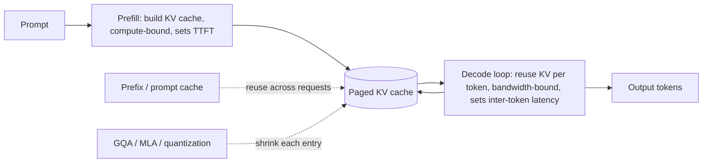

# Chapter 3: Long-Context Inference and the KV Cache

When teams first put a large language model into production, the model itself is rarely the thing that hurts. The bill and the tail latency come from something more mundane: the data structure a transformer builds while it generates. That structure is the key-value cache, and it is the hinge on which almost every serving decision turns. Once contexts stretch into the tens or hundreds of thousands of tokens, the cache, not the weights, is what fills your GPU memory, caps your batch size, and sets your p99. This is also the topic that separates engineers who have served a model from engineers who have only called an API, which is exactly why it comes up in interviews.

In this chapter we build the mental model that lets you reason from a cost formula all the way to an architecture choice. We start with the two phases of inference and why they have opposite hardware profiles, derive the KV-cache memory formula and treat it as the thing every optimization attacks, then walk the attention variants (MHA, MQA, GQA, MLA) that shrink it. Along the way we open validated architecture graphs from a live model zoo so the dimensions in the formula are real numbers you can read off a diagram rather than claims copied from a blog post. By the end you will be able to answer the canonical serving question: given a workload, are you memory-bound or compute-bound, and which lever do you pull first.

In this chapter, we will cover the following main topics:

- The two phases of inference: why prefill is compute-bound and decode is memory-bandwidth-bound
- The KV-cache memory formula and why it dominates long-context serving
- Attention variants that attack the cache: MHA, MQA, GQA, and Multi-head Latent Attention
- Serving-level levers: continuous batching, paged attention, prefix caching, and quantization
- Reducing decode steps with speculative decoding, and reducing compute per token with mixture-of-experts
- Putting it together: reasoning from the roofline to a concrete architecture decision

## Technical requirements

The only hard requirement for this chapter is a browser. Every architecture we discuss is available as a validated, shape-checked graph in the Neurarch model zoo, and the whole point of opening them is that the numbers in the KV-cache formula are the argument. A claim like "the latent is 512 dimensions" is wrong about half the time it gets copied between blog posts, so we read it off the graph instead.

Open these three graphs before you start, keep them in tabs, and refer back to them as each section calls them out:

- **GQA baseline (Llama-3 8B):** [open it live](https://www.neurarch.com/?import=https://raw.githubusercontent.com/neurarch-ai/awesome-llm-model-zoo/main/architectures/llama3-8b/model.json). Find the attention block and compare the number of query heads to the number of KV heads. That ratio is the cache saving we derive later.
- **MLA plus MoE (DeepSeek-V3):** [open it live](https://www.neurarch.com/?import=https://raw.githubusercontent.com/neurarch-ai/awesome-llm-model-zoo/main/architectures/deepseek-v3/model.json). The 60-odd identical transformer blocks are folded into one with a "x N" badge, so the latent attention and the expert routing are actually visible instead of buried in a hundred-layer scroll. Trace the RoPE-versus-latent head split.
- **MoE routing on its own (Mixtral block):** [open it live](https://www.neurarch.com/?import=https://raw.githubusercontent.com/neurarch-ai/awesome-llm-model-zoo/main/architectures/mixtral-block/model.json) to see the router send each token to a top-k of experts.

A good exercise before an interview: open DeepSeek-V3, swap MLA back to plain GQA, and watch the KV-cache estimate change. The graphs carry real dimensions, shape-checked end to end. All 92 architectures live in the [Model Zoo](https://github.com/neurarch-ai/awesome-llm-model-zoo) ([gallery](https://neurarch-ai.github.io/awesome-llm-model-zoo)), built by [Neurarch](https://www.neurarch.com). No local GPU, Python environment, or downloads are needed to follow along; the graphs render in the browser.

## The two phases of inference

Serving a transformer is not one workload but two, and they have opposite hardware profiles. Getting this distinction right is the foundation for everything else in the chapter, so we say it out loud.

**Prefill** processes the whole prompt at once. It is a big matrix-matrix multiply: every prompt token is pushed through the weights in parallel, so each loaded weight is reused across hundreds or thousands of tokens. That reuse pushes the arithmetic intensity high enough to saturate the tensor cores, which makes prefill compute-bound. Prefill is what sets your first-token latency, and because it is an $O(n^2)$ attention over the whole prompt, a prompt that is twice as long costs roughly four times the attention FLOPs.

**Decode** generates output one token at a time. Each step multiplies a batch of just a few token vectors against the full weight matrices, so you stream every weight from high-bandwidth memory (HBM) to do a tiny amount of matrix-vector work. This is memory-bandwidth-bound, not compute-bound. Decode sets your inter-token latency and dominates cost whenever outputs are long.

The formal way to say this uses arithmetic intensity, the ratio of useful math to memory traffic:

$$\text{arithmetic intensity}=\frac{\text{FLOPs performed}}{\text{bytes moved from memory}}$$

When intensity is low, the compute units sit idle waiting on memory, and the step time is set by bytes divided by bandwidth:

$$t_\text{decode step}\approx\frac{\text{weight bytes}}{\text{bandwidth}}$$

This is why halving the model's bytes with quantization speeds decode almost linearly, while prefill time tracks raw FLOPs and time-to-first-token (TTFT) scales with prompt length. The reason decode is bandwidth-bound at all comes down to what it has to re-read on every step: the entire model plus the entire KV cache. That cache is the subject of the rest of the chapter.

The two-phase skeleton, and where each optimization bolts on, looks like this:

A request is prefilled once to build its cache, then decode reuses that cache one token at a time, appending a new key and value each step. Every optimization in this chapter attaches to this loop: page the cache so many sequences share GPU memory, shrink each entry with an attention variant or quantization, and reuse the prefill work whenever a prefix repeats across requests.

## The KV cache and why it dominates long-context memory

When a transformer generates token by token, it caches the keys and values of every past token so it does not recompute them on the next step. That cache grows with sequence length, batch size, and model depth. The size in bytes is worth memorizing, because it is the formula every attention variant in this chapter is designed to attack:

$$\text{KV bytes}=2\times n_\text{layers}\times n_\text{kv-heads}\times d_\text{head}\times \text{seq}\times \text{batch}\times \text{bytes}$$

The leading $2$ counts keys and values separately. Read the formula as a product of independent multiplicative factors: it is linear in sequence length and batch, completely separate from and additive to the static weight footprint. For a long context, $\text{seq}$ can reach tens or hundreds of thousands, so the per-request cache climbs into many gigabytes and quickly exceeds the weights themselves. That is why long-context serving is capacity-limited by KV memory rather than by model size, and why the achievable batch size (and therefore throughput) is set by how much cache you can fit.

The three factors you can attack architecturally are right there in the formula: $n_\text{kv-heads}$ (via the attention variants below), $d_\text{head}$, and the dtype $\text{bytes}$ (via KV-cache quantization). Everything that follows is a way of shrinking one of these terms. A worked exercise: plug in a 100k-token context, count the layers and KV heads off the Llama-3 graph you opened, and you can estimate the GPU memory a single long conversation costs. Being able to do that arithmetic out loud is exactly the signal an interviewer is looking for.

## Attention variants that attack the cache

All four attention variants compute the same scaled dot-product attention,

$$\text{Attention}(Q, K, V) = \text{softmax}\!\left(\frac{Q K^\top}{\sqrt{d_k}}\right) V$$

and differ only in how many distinct key/value projections exist, which is precisely the $n_\text{kv-heads}$ term in the cache formula.

**Multi-head attention (MHA)** gives every query head its own key and value head. This is maximum representational capacity and maximum cache, the baseline the others optimize against.

**Multi-query attention (MQA)** collapses all query heads to a single shared key/value pair, shrinking the cache by a factor of the head count. It boosts decode throughput the most but can degrade quality and destabilize training.

**Grouped-query attention (GQA)** sits between the two. The $H$ query heads are partitioned into $G$ groups, and each group shares one key/value head, so the number of KV heads is $G$ with $1 \le G \le H$:

$$\text{MQA} \;(G=1) \;\le\; \text{GQA} \;(1 < G < H) \;\le\; \text{MHA} \;(G=H)$$

If you have 32 query heads and 8 KV heads, you have cut the KV cache by roughly $H/G = 4\times$ with little quality loss. Crucially, GQA can be produced by uptraining an existing MHA checkpoint with a short amount of extra training rather than pretraining from scratch, which lowered its adoption cost. That combination of near-MHA quality, close-to-MQA decode speed, and cheap conversion is why it is the mainstream default in Llama 2/3, Mistral, and most modern decoder LLMs.

*Figure 3.1: Llama-3 8B, a production GQA architecture. Open the graph and compare the query-head count to the KV-head count in the attention block; that ratio is the cache saving.*

Open it live: [Llama-3 8B](https://www.neurarch.com/?import=https://raw.githubusercontent.com/neurarch-ai/awesome-llm-model-zoo/main/architectures/llama3-8b/model.json). The heads are real dimensions on the graph, not a stylized picture, so the ratio you read is the ratio the model ships.

**Multi-head latent attention (MLA)** is DeepSeek's approach and a notch sharper than GQA. Instead of shrinking $n_\text{kv-heads}$, it does not cache keys and values at all. It caches a single low-rank latent vector per token and reconstructs the per-head keys and values from it on the fly:

1. Project the token down into a small latent (a down-projection to, say, 512 dimensions).
2. Cache only that latent.
3. At attention time, up-project the latent back into keys and values for all heads.

The keys and values you attend over are never stored at full width; you store the compressed version and pay a tiny matmul to expand it. The KV cache shrinks by roughly an order of magnitude, and long-context serving stops being dominated by cache memory. There is one wrinkle worth naming, because it signals real depth: rotary position embeddings (RoPE) do not commute cleanly with this compression, since RoPE is applied per position and the latent is position-free. DeepSeek's answer is to split the head dimension, so part of it carries RoPE the normal way and part goes through the compressed latent path. Each head is effectively two concatenated pieces, one positional and one latent. This is the detail most casual diagrams of DeepSeek-V3 quietly skip.

*Figure 3.2: DeepSeek-V3, folding MLA and mixture-of-experts routing into a repeated block. The identical transformer blocks collapse under a "x N" badge so the latent attention and expert routing are visible rather than buried in a hundred-layer scroll.*

Open it live: [DeepSeek-V3](https://www.neurarch.com/?import=https://raw.githubusercontent.com/neurarch-ai/awesome-llm-model-zoo/main/architectures/deepseek-v3/model.json). Trace the RoPE-versus-latent head split on the graph and confirm the latent width for yourself rather than trusting a number copied from a blog post.

The tradeoff axis across all four is quality versus KV-memory versus throughput. The table summarizes when each applies:

| Variant | KV heads | KV-cache size | Quality | When to use |
| --- | --- | --- | --- | --- |
| MHA | $h$ (one per query head) | Largest ($\propto h$) | Best | Small models, short context, quality-critical |
| MQA | $1$ (shared) | Smallest ($\propto 1$) | Weakest, can destabilize | Extreme memory/throughput pressure |
| GQA | $g$ groups ($1 < g < h$) | Medium ($\propto g$) | Near-MHA | Default: uptrain from MHA, balanced |
| MLA | Latent (rank $r$) | Below MQA in practice | MHA-like or better | Long-context pretraining you control |

The interview-ready rule: GQA is the simpler drop-in and the safe default, and it wins when you want to uptrain from an existing MHA model; MLA wins when the KV cache is the binding constraint at long context and you control pretraining.

## Serving-level levers: batching, paging, prefix caching, and quantization

The attention variant is the deepest lever, but it is not the first one you reach for, because it requires changing or retraining the model. The serving stack has cheaper wins that stack on top of any architecture.

**Continuous batching** is the single biggest throughput win. Static batching groups a fixed set of requests, runs them together, and cannot start new work until the slowest sequence in the batch finishes, so short requests are held hostage by long ones and the GPU idles as sequences complete at different times. Continuous (in-flight) batching operates at the granularity of a single decode step: after each step it evicts finished sequences and admits waiting ones into the freed slots, keeping the batch dimension full every iteration. This raises GPU utilization and therefore throughput, and it cuts queueing delay. The cost is that the cache now holds many sequences at once, so memory becomes the binding constraint, which motivates everything below.

**Paged attention** removes the memory waste that continuous batching exposes. Naive KV allocation reserves a contiguous block sized to the maximum sequence length per request, so most of it sits empty and fragmentation wastes large amounts of HBM. Paged attention (the idea behind vLLM) stores the cache in fixed-size, non-contiguous blocks with a lookup table, like operating-system virtual memory, allocating pages only as tokens are generated. This near-eliminates fragmentation, letting far more sequences share the GPU, and it enables cheap prefix sharing by letting multiple sequences point at the same physical pages. Its contribution is to memory efficiency and therefore effective batch size, not to single-token latency.

**Prefix caching** reuses prefill work across requests. In chat and RAG, many requests share a prefix: a long system prompt, few-shot exemplars, or a shared document. Prompt caching stores the KV cache computed for that prefix so a later request sharing it skips recomputing prefill and jumps straight to decoding the new suffix. What is reused is the per-token keys and values of the shared span, not the output tokens, so the saving is prefill FLOPs, which directly cuts TTFT. The reuse is exact and lossless because the KV vectors for a fixed prefix are deterministic given the weights, and paged attention makes it cheap.

**Quantization** attacks the dtype $\text{bytes}$ term directly. Quantizing weights to 8-bit or 4-bit shrinks the static footprint and speeds the memory-bound decode step by reducing bytes streamed per token. Quantizing the KV cache is a separate decision: weights are a static tensor quantized once offline, whereas the cache is a growing, activation-like tensor produced at runtime, so they have different error characteristics. KV-cache quantization is a clean win for long-context memory pressure, though the cache is more sensitive at very low bit-widths because error accumulates over every future attention lookup, so it is often kept at 8-bit even when weights go to 4-bit. In all cases the quality hit must be measured behind an eval, never assumed.

The map of which technique moves which metric is worth internalizing, because interviewers probe whether you know that a "faster serving" change might do nothing for the metric that actually hurts:

| Technique | Throughput | TTFT | Inter-token latency | Memory | Cost / token |
| --- | :---: | :---: | :---: | :---: | :---: |
| GQA / MQA | up (bigger batch) |  |  | up | up |
| Paged attention | up (less waste) |  |  | up | up |
| KV-cache quantization | up (bigger batch) |  |  | up | up |
| Weight quantization | up | up | up (fewer bytes streamed) | up | up |
| Speculative decoding |  |  | up | down (draft + KV) | mixed |
| Prefill-decode disaggregation | up | up (stable) | up (less jitter) |  |  |
| Continuous batching | up |  | down (step contention) |  | up |

The KV-memory techniques raise achievable batch size, so they lift throughput and cost efficiency without directly lowering single-request latency. Weight quantization is the unusual one that helps both latency and memory, since it reduces the bytes streamed on every decode step.

## Fewer decode steps and fewer parameters per token

Two more levers sit on the same GPU bill but attack a different term than the cache.

**Speculative decoding** cuts the number of expensive decode steps. A small, cheap draft model proposes $k$ tokens autoregressively, then the large target model verifies all $k$ in a single parallel forward pass, which is cheap because verification is compute-bound rather than memory-bound per token. A modified rejection-sampling rule accepts each drafted token with probability

$$p_\text{accept}=\min\!\left(1,\ \frac{p_\text{target}(x)}{p_\text{draft}(x)}\right)$$

and, on the first rejection, resamples from an adjusted residual distribution, which is mathematically equivalent to sampling directly from the target model. So the output distribution is identical to plain target decoding: no quality is traded away, only latency is saved. With per-token acceptance probability $\alpha$ and $k$ drafted tokens, the expected number of tokens accepted per target pass is

$$\mathbb{E}[\text{tokens per pass}]=\frac{1-\alpha^{\,k+1}}{1-\alpha}$$

so speedup grows with acceptance. It helps most at low batch sizes where decode is memory-bound and the target has spare compute to absorb parallel verification for free; at large batch sizes the system is already compute-saturated and the extra verification FLOPs compete with real work, so the benefit shrinks. It trades compute, which is cheap when idle, for latency.

**Mixture-of-experts (MoE)** cuts the compute and bandwidth per token. An MoE model has many feed-forward experts but routes each token to only a couple of them, so the active parameter count per token is a fraction of the total. Mixtral and DeepSeek-V3 both do this. It keeps the model's total capacity high while paying for only a slice of it on each token, at the cost of memory (all experts live on the GPU) and routing complexity. This is orthogonal to the KV cache: MoE attacks compute per token, the attention variants attack memory per token.

*Figure 3.3: A Mixtral block, isolating MoE routing. The router sends each token to a top-k subset of the feed-forward experts.*

Open it live: [Mixtral block](https://www.neurarch.com/?import=https://raw.githubusercontent.com/neurarch-ai/awesome-llm-model-zoo/main/architectures/mixtral-block/model.json) and follow the routing path from the gate to the selected experts.

## Putting it together: reason from the roofline to the architecture

The unifying lens is the roofline model. Achievable throughput is capped by whichever of compute or bandwidth you hit first:

$$\text{achievable FLOPs/s}=\min\big(\text{peak FLOPs/s},\ \ I\times\text{bandwidth}\big)$$

The two regimes meet at the ridge point, the intensity where a bandwidth-limited machine first reaches its compute ceiling. Small-batch decode has intensity near $1$, so it lives far to the left on the roofline, memory-bandwidth-bound, with speed equal to bandwidth divided by bytes. Prefill and large-batch decode reuse each loaded weight across many tokens, pushing intensity past the ridge into the compute-bound region. Raising batch size or verifying multiple speculative tokens per pass is really moving rightward on the roofline, converting idle bandwidth-bound time into useful compute, and the ceiling is twofold: KV-cache memory eventually leaves no room for more concurrent sequences, and past the ridge point further batching stops adding throughput while it keeps adding latency.

That is what lets you give the strong closing synthesis to the interview question. Start with continuous batching and paged attention for throughput. Add prefix caching because RAG prompts share a long instruction block. If memory is still the wall on long contexts, quantize the KV cache and consider a model with GQA or latent attention rather than full MHA. If compute per token is the wall, an MoE model gives capacity without paying for every parameter on every token. Pick based on whether you are memory-bound or compute-bound, which you would confirm by profiling prefill versus decode. The signal that wins the interview is not naming the techniques; it is reasoning from the cost model to the architecture.

## Summary

We built the serving mental model from the ground up. Inference is two phases with opposite hardware profiles: prefill is a compute-bound matrix-matrix burst that sets TTFT, and decode is a memory-bandwidth-bound tail that sets inter-token latency and dominates long-output cost. The reason decode is bandwidth-bound is the KV cache, whose size is linear in sequence length, batch, depth, KV-head count, head dimension, and dtype bytes. Every optimization we covered attacks one term of that formula: the attention variants (MHA to MQA to GQA to MLA) shrink the head factor, KV-cache quantization shrinks the dtype factor, and paged attention plus continuous batching turn the freed memory into a bigger batch and more throughput. Prefix caching reuses prefill work to cut TTFT, speculative decoding cuts the number of decode steps without changing the output distribution, and MoE cuts compute per token on the orthogonal axis. The roofline ties it together: knowing whether you are left or right of the ridge point tells you which lever to pull first.

You opened three validated graphs and read the dimensions that make these tradeoffs concrete rather than abstract, which is the habit that keeps interview answers honest.

In the next chapter, *Serving LLM Inference at Scale*, we move from the single-node cost model to the distributed serving stack: continuous batching schedulers, prefill-decode disaggregation across GPU pools, tensor versus pipeline parallelism, and cache-aware routing when prefix caching has to work across a cluster instead of one instance.

## Questions

1. Why is autoregressive decode memory-bandwidth-bound while prefill is compute-bound? Frame your answer in terms of arithmetic intensity.
2. Write the KV-cache memory formula and explain why the cache, rather than the weights, dominates long-context memory.
3. Walk through MHA, MQA, GQA, and MLA. What do all four share, and what is the core tradeoff axis between them?
4. Why has GQA become the default compromise in modern LLMs, and what makes it cheaper to adopt than pretraining a new attention scheme from scratch?
5. What exactly does MLA compress, what does it buy over GQA, and why does RoPE need special handling under it?
6. How does continuous (in-flight) batching beat static batching, and which metric does it move?
7. Why does paged attention matter, and which metric does it improve? Why is it not a single-token latency optimization?
8. Explain speculative decoding and why it preserves the target model's output distribution. When does it help and when does it hurt?
9. Why is KV-cache quantization a separate decision from weight quantization, and why is the cache often kept at a higher bit-width?
10. Using the roofline model, explain why raising batch size helps decode throughput and what two things cap that benefit.

## Further reading

The following are first-party engineering writeups that ship the patterns in this chapter. Read them for what an interview answer skips: who the system serves, the eval bar, and the deployment shape.

- **vLLM (UC Berkeley), [Efficient Memory Management for LLM Serving with PagedAttention](https://arxiv.org/abs/2309.06180):** OS-style KV-cache paging cuts fragmentation and boosts throughput 2x to 4x. The canonical reference for the paged-attention lever.
- **Character.AI, [Optimizing AI Inference at Character.AI](https://blog.character.ai/optimizing-ai-inference-at-character-ai-2/):** MQA, hybrid local/global attention, and cross-layer KV sharing cut serving cost 33x. A full-stack case study of stacking the levers.
- **DeepSeek, [DeepSeek-V2: A Strong, Economical, and Efficient MoE Language Model](https://arxiv.org/abs/2405.04434):** introduces Multi-head Latent Attention, compressing the KV cache into a latent vector for roughly a 93% reduction.
- **Google Research, [GQA: Training Generalized Multi-Query Transformer Models](https://arxiv.org/abs/2305.13245):** the grouped-query attention paper, including the uptraining-from-MHA recipe that made it cheap to adopt.
- **NVIDIA, [5x Faster Time to First Token with TensorRT-LLM KV Cache Early Reuse](https://developer.nvidia.com/blog/5x-faster-time-to-first-token-with-nvidia-tensorrt-llm-kv-cache-early-reuse/):** early KV reuse, flexible block sizing, and smart eviction to cut TTFT.
- **NVIDIA, [Optimizing Inference with NVFP4 KV Cache](https://developer.nvidia.com/blog/optimizing-inference-for-long-context-and-large-batch-sizes-with-nvfp4-kv-cache/):** a 4-bit KV cache halves memory versus FP8, doubling servable context at under 1% quality loss.
- **Databricks, [Accelerating LLM Inference with Prompt Caching](https://www.databricks.com/blog/accelerating-llm-inference-prompt-caching-open-source-models-databricks):** automatic prefix KV reuse for 2.5x throughput and 3x lower P50 latency.
- **LMSYS / SGLang, [Fast and Expressive LLM Inference with RadixAttention](https://www.lmsys.org/blog/2024-01-17-sglang/):** a radix-tree KV cache that enables automatic cross-request prefix reuse.
- **Hugging Face, [Unlocking Longer Generation with KV Cache Quantization](https://huggingface.co/blog/kv-cache-quantization):** per-token int4 KV quantization for roughly 2.5x memory savings, with the residual full-precision window trick.
- **MIT / Meta, [Efficient Streaming Language Models with Attention Sinks](https://arxiv.org/abs/2309.17453):** the attention-sink insight that lets fixed-window models stream to millions of tokens at bounded memory.
- **Anthropic, [Prompt Caching with Claude](https://claude.com/blog/prompt-caching):** caches reused context across API calls, cutting cost up to 90% and latency up to 85%, the production framing of the prefix-caching lever.
- **Colfax / Together, [FlashAttention-3: Fast and Accurate Attention with Asynchrony and Low Precision](https://arxiv.org/abs/2407.08608):** Hopper-optimized exact attention via warp specialization and FP8, 1.5x to 2x faster.
- **Together AI, [Serving MiniMax-M3: 1M-Token Context Without Regrets](https://www.together.ai/blog/serving-minimax-m3-for-efficient-inference-unlocking-1m-token-context-and-multimodality-without-regrets):** paged sparse attention and KV-block-major kernels that make 1M-token serving practical.

For a broader index, the [Evidently AI ML system design database](https://www.evidentlyai.com/ml-system-design) collects 800 case studies from 150+ companies; the list above pulls the ones that map directly onto long-context inference and the KV cache.
