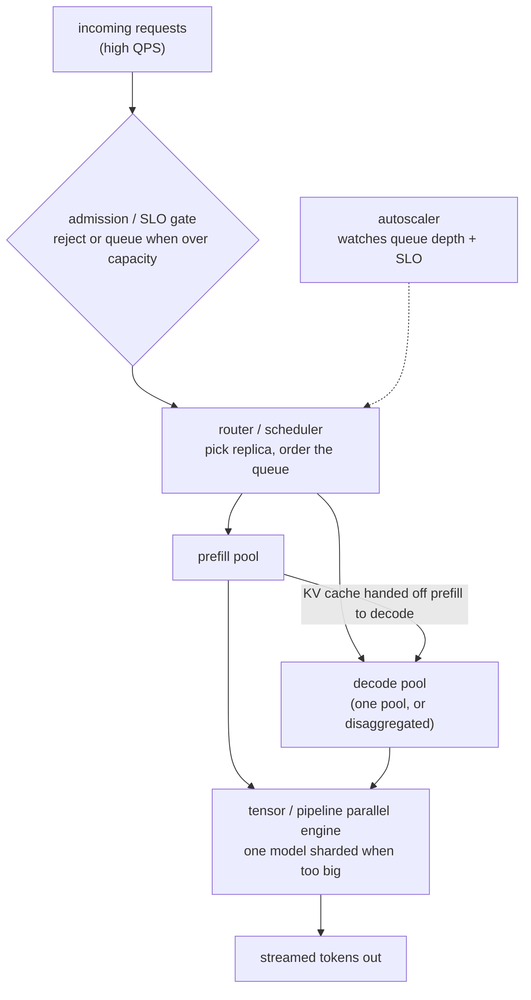

# Chapter 4: Serving LLM Inference at Scale

Once a model works, the next problem is serving it: an LLM sits behind an API at high queries per second, and the job is to maximize throughput per GPU while holding tail latency under control. Those two goals pull against each other, because the way you squeeze more tokens out of a GPU is by packing more requests into each step, and packing more requests into each step is exactly what makes any single request wait longer. Everything in a serving stack is a negotiation between that throughput number and that latency budget. Naive answers stop at "batch the requests"; the real work is in which requests run together, where prefill and decode live, how a model bigger than one GPU gets split, and what the system does when it runs out of room.

In this chapter, we will build a mental model of a production inference stack by working through a concrete scenario: serving a decoder-only LLM at high QPS with a per-GPU cost target and a strict tail-latency SLO. We will treat the two phases of generation, prefill and decode, as the physically different workloads they are, derive why decode is bound by memory bandwidth rather than compute, and use that one fact to explain continuous batching, speculative decoding, quantization, and disaggregated serving. We will size the KV cache, split a model across GPUs three different ways, and close with the admission control and autoscaling that keep the tail intact under load. Along the way we open two validated reference architectures, a grouped-query attention model and a large mixture-of-experts model, so you can read the real dimensions that every one of these levers bottoms out in.

In this chapter, we will cover the following main topics:

- Scoping the serving problem and its requirements
- The serving stack, phase by phase
- Prefill versus decode and the arithmetic-intensity argument
- Continuous batching and chunked prefill
- Speculative decoding
- Splitting a model: tensor, pipeline, and expert parallelism
- Quantization and KV-cache memory for throughput
- Scheduling, SLO-aware admission, and autoscaling
- Failure modes, safety, and evaluation

## Technical requirements

To follow along you need a modern web browser to open the validated reference graphs used as figures in this chapter. These are not screenshots: they are shape-checked architecture graphs from the Neurarch model zoo, and each one opens live in the editor so you can inspect real dimensions layer by layer. That matters here more than anywhere, because every serving lever in this chapter is really a statement about a number in the graph: how many KV heads decode has to read, how wide each layer is for tensor parallelism, how many experts there are to shard. Those are exactly the numbers that get miscopied from a blog's recollection.

The two architectures we open in this chapter are:

- **Llama-3 8B**, a grouped-query attention model that fits on one GPU, the baseline for single-GPU serving: [open it live](https://www.neurarch.com/?import=https://raw.githubusercontent.com/neurarch-ai/awesome-llm-model-zoo/main/architectures/llama3-8b/model.json)
- **gpt-oss-120b**, a large sparse mixture-of-experts model, the case for expert parallelism: [open it live](https://www.neurarch.com/?import=https://raw.githubusercontent.com/neurarch-ai/awesome-llm-model-zoo/main/architectures/gpt-oss-120b/model.json)

The full collection of 92 validated reference graphs lives in the [Model Zoo repository](https://github.com/neurarch-ai/awesome-llm-model-zoo), with a browsable [gallery](https://neurarch-ai.github.io/awesome-llm-model-zoo). It is built by [Neurarch](https://www.neurarch.com).

Conceptually you will also want to be aware of the tooling classes we name but do not install here: an inference engine with continuous batching and paged KV memory (vLLM or TensorRT-LLM are the reference points), a draft model for speculative decoding, and a scheduler or router with an admission gate in front of the engine. No datasets or GPUs are required to read the chapter; the running example is a single high-QPS API serving one model.

## Scoping the serving problem and its requirements

Before drawing any boxes, we scope the problem, because the answers change the architecture. The first question is always the SLO, stated precisely, because throughput per GPU and latency trade off directly and there is more than one latency. Ask whether the target is on the first token, **time-to-first-token (TTFT)**, or on the gap between output tokens, **time-per-output-token (TPOT)**, also called inter-token latency. They are different knobs driven by different phases, and conflating them means optimizing the wrong stage.

The second question is workload shape. Long prompts and short answers (retrieval, classification) are prefill-heavy; short prompts and long answers (code, agents) are decode-heavy. This decides where the bottleneck lives and how the fleet gets split. The third is whether the model even fits on one GPU: if it does, you replicate whole copies for throughput; if it does not, you must shard it with tensor or pipeline parallelism before you can serve at all. The last is the traffic profile, steady versus bursty, which decides how aggressive autoscaling has to be and how much cold-start pain you eat on spikes.

Writing these out as functional and non-functional requirements gives us:

**Functional**

- Accept requests at high QPS, run prefill then decode, and stream tokens back
- Serve models that may be too large for a single GPU
- Support a mix of prompt and output lengths in the same fleet

**Non-functional**

- Maximize throughput per GPU, since tokens per second per GPU is the cost metric
- Hold p99 TTFT and p99 TPOT under the SLO, especially under load
- Degrade gracefully when overloaded rather than collapsing every request
- Scale with traffic without paying for idle GPUs or eating cold starts on spikes

The non-functional requirement that quietly dominates is the pairing of a per-GPU cost target with a tail-latency SLO. The cost number is throughput, tokens per second per GPU, and you raise it by batching harder. The SLO is a tail number, p99, and batching harder is exactly what threatens it. We flag this tension early and return to it throughout, because almost every technique in this chapter is a way to buy back one side without paying too much of the other.

## The serving stack, phase by phase

A production inference service is a pipeline with a scheduler at its heart. A request lands, an admission gate decides whether the system can take it at all, a scheduler picks a replica and orders the queue, and then the request runs its two phases, prefill and then decode, on an engine that may be sharding one model across several GPUs. An autoscaler watches the queue and the SLO and adds or removes replicas underneath.

*Figure 4.1: The serving stack, from admission through the parallel engine to streamed output*

The interesting decisions are all in this diagram: which requests run together (batching), where prefill and decode live (co-located or disaggregated), how a model bigger than one GPU is split (parallelism), and what the gate does under overload (admission). The rest of the chapter walks these in the order the physics forces on us, which means starting with why the two phases behave so differently.

## Prefill versus decode and the arithmetic-intensity argument

Everything downstream follows from one fact: prefill and decode have opposite hardware appetites. Prefill processes the whole prompt at once as a big matrix-matrix multiply, reusing each loaded weight across hundreds or thousands of tokens, so it is compute-bound and it sets TTFT. Decode generates one token at a time, multiplying a handful of token vectors against the full weight matrices, so it streams every weight out of memory to do a tiny amount of work, which makes it memory-bandwidth-bound and sets inter-token latency.

The precise way to say this is with **arithmetic intensity**, the FLOPs performed per byte moved from memory:

$$\text{arithmetic intensity} = \frac{\text{FLOPs performed}}{\text{bytes moved from memory}}$$

Decode at small batch has intensity near $1$, because each weight byte feeds a single multiply-accumulate, so the compute units sit idle waiting on memory and the step time is set by weight bytes over bandwidth:

$$t_\text{decode step} \approx \frac{\text{weight bytes}}{\text{bandwidth}}$$

The roofline model makes the ceiling explicit. Achievable throughput is capped by the smaller of the compute peak and what bandwidth can feed at the current intensity:

$$\text{achievable FLOPs/s} = \min\big(\text{peak FLOPs/s},\ I \times \text{bandwidth}\big)$$

and the two regimes meet at the ridge point, the intensity where a bandwidth-limited machine first hits its compute ceiling:

$$I_\text{ridge} = \frac{\text{peak FLOPs/s}}{\text{bandwidth (bytes/s)}}$$

Below $I_\text{ridge}$ you are memory-bound; above it, compute-bound. This single picture unifies the chapter. Decode at small batch lives far to the left, bandwidth-bound, which is why halving the model bytes with quantization speeds decode almost linearly, and why batching more requests together (reusing each streamed weight across more token vectors) moves you rightward and up the slope toward the ridge. Prefill and large-batch decode already sit near or past the ridge, compute-bound, where those same tricks stop helping. The whole serving craft is moving each phase to the right spot on the roofline.

Because the two phases have different bottlenecks, end-to-end latency for generating $N$ output tokens decomposes cleanly, and the two terms respond to different fixes:

$$t_\text{e2e} \approx \underbrace{t_\text{TTFT}}_{\text{prefill, compute-bound}} + \underbrace{(N-1)\times t_\text{inter-token}}_{\text{decode, bandwidth-bound}}$$

The first term is paid once and scales with prompt length; the second scales with how many tokens you generate. A long-prompt, short-answer retrieval call is dominated by prefill, so you attack TTFT with prompt caching, chunked prefill, and disaggregation. A short-prompt, long-answer chatbot is dominated by the decode sum, so you attack inter-token latency with quantization, grouped-query attention, and speculative decoding. Averaging both kinds of traffic into one latency number hides which term you should be spending engineering effort on.

## Continuous batching and chunked prefill

The single biggest throughput win in decode-heavy serving is **continuous (in-flight) batching**, and it is worth understanding why the naive alternative fails. Static batching groups a fixed set of requests, runs them all to completion, then starts the next batch. The problem is that requests in a batch finish at different times: one generates ten tokens, another generates eight hundred, so the whole batch is held hostage by its longest member and the GPU sits half-idle as members complete.

Continuous batching schedules at the token step, not the request. After every decode step the scheduler retires finished sequences and admits waiting ones into the freed slots, so the batch composition changes every iteration and the batch dimension stays full. This lifts GPU utilization and therefore throughput (tokens per second and requests per second), and it cuts queueing delay because a new request does not wait for a whole batch to drain. The cost is scheduler complexity and the need for paged KV memory so slots can be reclaimed and reused mid-flight.

The subtlety is mixing prefill and decode in the same engine. A new request needs a prefill pass (compute-heavy, the whole prompt at once) while existing requests need decode steps (one token each). If you run a big prefill, every in-flight decode stalls for that step, and you get a TPOT spike that shows up directly in p99. The fix is **chunked prefill**: break a long prompt's prefill into smaller chunks and interleave them with ongoing decode steps, so a single huge prompt cannot freeze the decode stream. This is the lever that keeps inter-token latency smooth under mixed load, and it is why continuous batching, which raises throughput, can nudge per-request latency up unless chunked prefill absorbs the step contention.

## Speculative decoding

Decode is the expensive phase and it is sequential: one token per forward pass, each pass reading the entire model from memory. Speculative decoding breaks the one-token-per-pass limit by exploiting the arithmetic-intensity gap we just derived. A small, cheap **draft model** proposes $k$ tokens autoregressively, then the large **target model** verifies all $k$ in a single parallel forward pass. That verification is nearly free in wall-clock terms because decode is memory-bandwidth-bound: reading the weights once to score $k$ positions costs almost the same as reading them to emit one token, so every accepted draft token rides along at little extra cost.

The reason this is a latency optimization and not a quality trade is the acceptance rule. Each drafted token is accepted with probability

$$p_\text{accept} = \min\!\left(1,\ \frac{p_\text{target}(x)}{p_\text{draft}(x)}\right)$$

and on the first rejection the system resamples from the adjusted residual distribution $p_\text{resid}(x) \propto \max\!\big(0,\ p_\text{target}(x) - p_\text{draft}(x)\big)$, which is mathematically equivalent to sampling directly from the target model. So the output distribution is exactly what the target would have produced; done correctly, speculative decoding is provably distribution-preserving.

The win depends on the acceptance rate. With per-token acceptance probability $\alpha$ and $k$ drafted tokens, the expected number of tokens emitted per target pass is

$$\mathbb{E}[\text{tokens per pass}] = \frac{1 - \alpha^{\,k+1}}{1 - \alpha}$$

so the speedup grows with $\alpha$ and saturates as $k$ increases. A good draft on predictable text lands several tokens per verification; a bad draft, or hard-to-predict output, wastes draft compute for one or two tokens and can drop below plain decoding. It helps most at low batch sizes, where decode is memory-bound and the target has spare compute to absorb the parallel verification for free. At very large batch sizes the GPU is already compute-saturated, so the extra verification FLOPs compete with real work and the benefit shrinks. Variants worth naming are a separate small draft model, and self-speculation where the model predicts several tokens ahead from its own hidden states (Medusa-style heads), which avoids hosting a second model at all.

## Splitting a model: tensor, pipeline, and expert parallelism

When a model does not fit on one GPU (weights plus KV cache exceed memory), you shard it, and there are three axes you should know cold.

**Tensor parallelism (TP)** splits each layer's matrices across GPUs. Every GPU holds a slice of every layer, they compute one layer cooperatively, and they exchange activations with an all-reduce at each layer boundary. Because that communication happens on every layer for every token, TP needs very fast interconnect (NVLink within a node) and is normally kept inside a single node. It reduces per-GPU memory and can cut latency for a single request, at the cost of constant cross-GPU traffic.

**Pipeline parallelism (PP)** splits the model by layers: GPU 0 holds the first block of layers, GPU 1 the next, and so on, with activations passing from stage to stage. Communication is only at stage boundaries, far less than TP, so PP tolerates slower links and stretches across nodes. The catch is the **pipeline bubble**: naively, later stages sit idle waiting for earlier ones, which hurts single-request latency. You hide the bubble by keeping many microbatches in flight, which is fine for throughput serving but does not help a single request.

The rule of thumb to say out loud is: **tensor parallel within a node for latency and to make the model fit, pipeline parallel across nodes for scale when you run out of GPUs in a node, and replicate whole copies for throughput once a single copy fits.** Real fleets combine all three.

The third axis is specific to mixture-of-experts models. A large MoE has many feed-forward experts but routes each token to only a few, so the experts are too numerous to fit per GPU. **Expert parallelism** shards the experts across GPUs and routes each token to whichever GPU holds its chosen expert. This adds an all-to-all communication step (tokens flying to their experts and results coming back) and a load-balance problem: if routing is skewed, some expert GPUs are hot and others idle, which is why a large MoE forces both expert sharding and attention to load balancing, not just plain TP.

This is the case worth making concrete with a real graph. gpt-oss-120b is a large sparse MoE, and its shape is exactly what decides how you would split it.

*Figure 4.2: gpt-oss-120b, a sparse mixture-of-experts model, the concrete case for expert parallelism*

You can [open this graph live](https://www.neurarch.com/?import=https://raw.githubusercontent.com/neurarch-ai/awesome-llm-model-zoo/main/architectures/gpt-oss-120b/model.json) and trace the expert routing and the layer widths: the many feed-forward experts are what you shard with expert parallelism, and the dense matrices are what you shard with tensor parallelism. Because it is sparse, its active parameters per token are a fraction of the 120B total, which is how a model this large can still run on a single high-memory GPU; the genuinely cannot-fit case is a dense or very large model where the weights alone exceed one GPU. A useful pre-interview exercise is to open this graph, count the experts and the hidden width, and work out how you would split it across, say, 8 GPUs: which axis shards what, and where the all-to-all communication lands.

## Quantization and KV-cache memory for throughput

At high concurrency the binding memory constraint is usually not the weights but the KV cache, and its size is worth carrying in your head:

$$\text{KV bytes} = 2 \times n_\text{layers} \times n_\text{kv-heads} \times d_\text{head} \times \text{seq} \times \text{batch} \times \text{bytes}$$

where the leading $2$ counts both keys and values. It is linear in sequence length and batch, and it is additive to the static weight footprint, so at long context the per-request cache grows into gigabytes and caps how many concurrent sequences fit on a GPU. Since larger batches are what convert idle memory bandwidth into throughput, every multiplicative factor in that formula is a throughput lever. Grouped-query attention (GQA) attacks the $n_\text{kv-heads}$ term directly: the $H$ query heads are partitioned into $G$ groups sharing one key/value head, sitting between full multi-head attention and multi-query attention,

$$\text{MQA} \;(G=1) \;\le\; \text{GQA} \;(1 < G < H) \;\le\; \text{MHA} \;(G=H)$$

so cutting from $H$ heads to $G$ shrinks the cache, and the bandwidth cost of reading it at every decode step, by a factor of roughly $H/G$.

Quantization attacks the memory-bandwidth bound from the weight side. Because decode is bandwidth-bound, fewer bytes read per step is directly more tokens per second: lowering weight precision speeds decode almost linearly. Eight-bit is a routine, low-risk win on modern kernels; four-bit weight quantization pushes further and is common for fitting bigger models on fewer GPUs. The techniques differ in where they drop quality. Int8 uses a uniform integer grid and is robust for weight-only inference, but activation outliers can blow up its scale, since a uniform scale must cover the largest magnitude,

$$\text{scale} = \frac{\max_i |x_i|}{2^{b-1} - 1}$$

so a handful of outlier channels force a coarse grid that crushes the many normal channels. FP8 keeps a floating exponent, covering a wider dynamic range at the same 8 bits, which is why it is the practical choice for weight-and-activation quantization. Four-bit weight-only methods like GPTQ (Hessian-aware rounding) and AWQ (scaling salient channels before rounding) squeeze memory hardest but degrade on harder reasoning tasks and need calibration data. This is also why weight-only quantization is much easier than activation quantization: weights lack the pathological outlier structure that activations have.

KV-cache quantization is a separate decision from weight quantization, because the cache is a growing, dynamic tensor rather than a static one, and its errors accumulate over every future attention lookup. Quantizing the KV cache lets you hold more concurrent sequences, which raises the batch size continuous batching can sustain, which raises throughput again, but it is more sensitive at very low bit-widths, so it is often kept at 8-bit even when weights go to 4-bit. The non-negotiable across all of these: every precision drop goes behind a quality eval before it ships, never on assumption.

The single-GPU baseline is worth opening as a real graph, because the ratio that drives all of this is right there in the attention block.

*Figure 4.3: Llama-3 8B, a grouped-query attention model, the single-GPU serving baseline*

You can [open this graph live](https://www.neurarch.com/?import=https://raw.githubusercontent.com/neurarch-ai/awesome-llm-model-zoo/main/architectures/llama3-8b/model.json) and find the attention block, then read the query-head to KV-head ratio. That ratio is the $H/G$ factor above: it is how much KV cache each decode step has to move, which sets how many concurrent sequences one GPU can batch, which sets your throughput ceiling. One number in the graph, the whole capacity budget downstream.

Two more moves become available once the GPU cache runs out, both trading a different resource. **Paged attention** stores the cache in fixed-size non-contiguous blocks with a lookup table, like OS virtual memory, allocating pages only as tokens are generated; this near-eliminates the reservation waste and fragmentation of contiguous allocation, letting far more sequences share the GPU, and it enables cheap prefix sharing by letting multiple sequences point at the same physical pages. **Offloading** moves the cache of paused sequences to CPU RAM or NVMe and brings it back on resume, trading interconnect bandwidth for GPU memory, which is good for many bursty sessions but risky on the hot path. And **prefix caching** across requests, keeping one copy of a shared system prompt's KV, is the cleanest of all, because it removes prefill work entirely rather than relocating it, which is exactly what cuts TTFT for long shared prompts.

## Scheduling, SLO-aware admission, and autoscaling

At high QPS you cannot run everything immediately, so the scheduler decides order and the admission gate decides what even enters. A short request should not sit behind a 100k-token prefill, so schedulers prioritize by predicted cost, cap the number of concurrent prefills, and reserve a KV-cache budget per admitted sequence so that admitting new work cannot OOM the sequences already running.

The move that separates someone who has been paged from someone who has not is **SLO-aware admission**. When the system is saturated, admitting more work makes every request miss its SLO, and then retries pile on and it spirals. It is better to shed load: reject or queue new requests with a clear 429-style signal and a retry hint, so the in-flight ones still hit their latency target. Under overload, controlled rejection protects p99 for everyone admitted; trying to serve all of it is how the tail explodes. Separate queues or token budgets per tenant or priority class stop one heavy user from starving everyone, which is also how a paying tier earns a reserved slice of capacity.

Throughput per GPU only matters if you are not paying for idle GPUs, so you autoscale, and the wrinkle that bites LLM serving is the **cold start**. Spinning up a replica means scheduling a GPU node, pulling a multi-gigabyte model, loading weights into VRAM, and warming the engine, which can take minutes, useless for a spike that arrives in seconds. The mitigations are to scale on a leading signal (queue depth or wait time predicts an SLO violation before latency actually breaks, unlike lagging CPU), to keep a small warm buffer of pre-warmed replicas that absorb spikes while new ones boot, and to speed the boot itself by caching the model image on the node, streaming weights rather than copy-then-load, and snapshotting a warmed process. Scale to zero only for cold paths where first-request latency is acceptable, never for the hot path.

## Bottlenecks and scaling

As load and model size grow, a predictable set of bottlenecks surfaces, and each maps onto a stage above. It is worth memorizing the cause and the fix, because this table is most of what an interviewer is probing for:

| Bottleneck | Cause | Fix |
|---|---|---|
| Low GPU utilization | Static batching, idle slots | Continuous (in-flight) batching |
| TPOT spikes under mixed load | Long prefill stalls in-flight decode | Chunked prefill, disaggregate prefill/decode |
| KV cache OOM at high concurrency | Many long sequences in GPU memory | Paged cache, KV quantization, offload to CPU/NVMe |
| Model does not fit on one GPU | Weights plus cache exceed VRAM | Tensor parallel (in node), pipeline parallel (across nodes) |
| MoE expert imbalance | Skewed routing, hot expert GPUs | Expert parallelism plus load-balancing loss / capacity factor |
| Decode latency floor | One token per sequential forward pass | Speculative decoding (draft plus verify) |
| Tail latency under overload | Admitting more than capacity | SLO-aware admission, shed or queue load |
| Spike latency | Cold-start boot time on new replicas | Warm buffer, leading-signal autoscale, fast weight load |
| Memory bandwidth on decode | Full-precision weight reads per step | Weight and KV quantization |

The disaggregation row deserves a note, because it is the advanced pattern the table compresses. **Disaggregated serving** puts prefill and decode in separate pools, often on separate GPUs: a request prefills in the prefill pool, its KV cache is transferred to a decode worker, and decode runs there. You can then size and scale each pool independently and tune different parallelism for each, and prefill bursts stop poisoning decode latency, which stabilizes TTFT and cuts inter-token jitter. The cost is the KV-cache transfer between pools, which needs fast interconnect or it becomes the bottleneck it was meant to remove. For a single small model at moderate QPS, one pool with chunked prefill is simpler and usually enough; you disaggregate when prefill and decode SLOs genuinely conflict.

## Failure modes, safety, and evaluation

A serving system fails in ways a single-request benchmark never shows, because the failures are all about contention and overload. We plan for five categories:

- **Cascading overload.** When saturated, a naive system admits everything, misses every SLO, and then retries pile on and it spirals. The admission gate plus backpressure (a 429 with a retry hint) is the circuit breaker. Bring this up unprompted; it is the mark of someone who has run a fleet.
- **KV-cache OOM mid-decode.** A new admission consumes cache that the running sequences needed. Reserve a cache budget per admitted sequence so the scheduler never overcommits memory.
- **Disaggregation transfer stall.** If the prefill-to-decode KV hand-off rides a slow link, it becomes the bottleneck it was meant to remove. Size the interconnect or do not disaggregate.
- **Speculative-decoding silent quality drift.** Speculation is only safe if verification preserves the target distribution. A buggy accept rule degrades quality invisibly, so verify output parity, not just speed.
- **Quantization regression.** Every precision change goes behind an eval set before it ships. Measure, never assume.

For evaluation, track the numbers that describe a fleet, not a single call: tokens per second per GPU (the cost number), p50 and p99 of both TTFT and TPOT (the SLO numbers), goodput (requests that actually met their SLO, not just requests served), and cost per million tokens. The one that catches teams out is goodput, because a system can serve a high raw request rate while most of those requests miss the SLO, which the average latency hides. Load-test at and beyond peak QPS so you see the overload behavior, the shed-versus-collapse decision, before production does.

## Summary

In this chapter we scoped a production inference service around the one tension that governs it: raising throughput per GPU means batching harder, and batching harder threatens the tail-latency SLO. We grounded every lever in a single physical fact, that decode is memory-bandwidth-bound while prefill is compute-bound, and used the roofline and arithmetic-intensity picture to explain why. From there the techniques fell out in order: continuous batching to keep the GPU saturated, chunked prefill to stop long prompts from spiking inter-token latency, speculative decoding to emit several tokens per bandwidth-bound target pass without changing the output distribution, tensor, pipeline, and expert parallelism to split a model that does not fit, and weight, GQA, and KV-cache quantization to shrink the bytes moved per step so batches can grow. We closed with the SLO-aware admission and leading-signal autoscaling that protect p99 under overload and spikes. We opened two validated reference architectures, Llama-3 8B for the single-GPU GQA baseline and gpt-oss-120b for the expert-parallelism case, so the query-head ratio and the expert count, the numbers these levers actually depend on, are real rather than remembered.

In the next chapter, *Real-Time Streaming Chat*, we build on this serving foundation to design the interactive layer on top of it: how tokens stream to a user in real time, how multi-turn conversation state and its growing KV cache are managed across a session, and how the TTFT and inter-token budgets we defined here become the felt responsiveness of a live chat.

## Questions

1. Why is autoregressive decode memory-bandwidth-bound while prefill is compute-bound, and what does arithmetic intensity have to do with it?
2. Write the KV-cache memory formula and explain why it, rather than the model weights, dominates memory at long context and high concurrency.
3. How does continuous (in-flight) batching beat static batching, and which metric does it move? What is the cost that makes chunked prefill necessary alongside it?
4. Explain speculative decoding and why it preserves the target model's output distribution. Given a per-token acceptance rate, how many tokens do you expect per target pass?
5. When does speculative decoding help and when does it hurt, and why does batch size change the answer?
6. Give the roofline or arithmetic-intensity intuition for LLM inference, and explain why raising batch size and verifying multiple speculative tokens are the same move on that picture.
7. When should you use tensor parallelism versus pipeline parallelism, and where does expert parallelism enter for a mixture-of-experts model?
8. What is prefill-decode disaggregation, which metrics does it target, and what is the cost that can make it a net loss?
9. Compare int8, fp8, and 4-bit GPTQ or AWQ quantization, and explain why weight-only quantization is easier than activation quantization. Why is KV-cache quantization a separate decision?
10. Under overload, why does SLO-aware admission (shedding load) protect p99 for everyone admitted, and why does trying to serve all of it make the tail explode?

## Further reading

Each of the following is a first-party engineering writeup that ships the patterns in this chapter. Read them for what an interview answer skips: who the system serves, the product design, the eval bar, and the deployment shape. Underneath the branding these systems share one skeleton (a router, a continuous-batching scheduler, prefill then decode, optional speculation, streamed output, an SLO-driven autoscaler); what differs is which stage each team pushed hardest on.

- [How continuous batching enables 23x throughput in LLM inference (Anyscale)](https://www.anyscale.com/blog/continuous-batching-llm-inference): iteration-level scheduling plus PagedAttention beat static batching up to 23x. *(deployment)*
- [Optimizing AI Inference at Character.AI](https://blog.character.ai/optimizing-ai-inference-at-character-ai/): MQA, cross-layer KV sharing, and int8 quantization cut serving cost 13.5x. *(deployment)*
- [Accelerating LLM inference with speculative decoding (LinkedIn)](https://www.linkedin.com/blog/engineering/ai/accelerating-llm-inference-with-speculative-decoding-lessons-from-linkedins-hiring-assistant): n-gram speculative decoding gave 4x throughput and 66% lower P90 latency. *(eval bar)*
- [How we built BEI: high-throughput embedding, reranker, classifier inference (Baseten)](https://www.baseten.co/blog/how-we-built-bei-high-throughput-embedding-inference/): batching, backpressure, FP8, and TensorRT-LLM for 2x higher-throughput serving. *(deployment)*
- [NVIDIA Dynamo: a low-latency distributed inference framework](https://developer.nvidia.com/blog/introducing-nvidia-dynamo-a-low-latency-distributed-inference-framework-for-scaling-reasoning-ai-models/): disaggregated serving with prefill and decode separation and routing. *(deployment)*
- [ATLAS: runtime-learning speculative decoding (Together AI)](https://www.together.ai/blog/adaptive-learning-speculator-system-atlas): speculative decoding that adapts to live traffic for large speedups. *(product design)*
- [FireOptimizer: customizing latency and quality (Fireworks AI)](https://fireworks.ai/blog/fireoptimizer): adaptive speculative decoding and per-workload config tuning. *(product design)*
- [High-performance LLM inference (Modal)](https://modal.com/docs/guide/high-performance-llm-inference): engine choice, quantization, CUDA graphs, and snapshots for throughput. *(deployment)*
- [LLM inference performance engineering: best practices (Databricks)](https://www.databricks.com/blog/llm-inference-performance-engineering-best-practices): prefill and decode, batching, hardware selection, and latency metrics. *(eval bar)*
- [Fast inference from transformers via speculative decoding (Google)](https://arxiv.org/abs/2211.17192): draft-then-verify decoding, 2-3x speedup with identical outputs. *(product design)*
- [The Baseten inference stack](https://www.baseten.co/resources/guide/the-baseten-inference-stack/): multi-cloud autoscaling, routing, custom kernels, and speculation. *(deployment)*
- [Mooncake: a KVCache-centric disaggregated architecture (Moonshot AI)](https://arxiv.org/abs/2407.00079): Kimi's prefill/decode-disaggregated serving with a pooled CPU/DRAM/SSD KV cache. *(deployment)*
- [Splitwise: efficient generative LLM inference using phase splitting (Microsoft)](https://arxiv.org/abs/2311.18677): splits prefill and decode onto separate machines for cost and throughput. *(deployment)*
- [DistServe: disaggregating prefill and decoding (Peking University / UCSD)](https://arxiv.org/abs/2401.09670): disaggregates prefill and decode across GPUs to optimize goodput under SLOs. *(deployment)*
- [Sarathi-Serve: taming the throughput-latency tradeoff (Microsoft Research)](https://arxiv.org/abs/2403.02310): chunked prefills and stall-free scheduling balance throughput against latency. *(deployment)*
- [Arctic Inference with Shift Parallelism (Snowflake)](https://www.snowflake.com/en/blog/engineering/arctic-inference-shift-parallelism/): a vLLM plugin with dynamic shift parallelism adapting to real traffic. *(deployment)*
- [Evidently AI ML system design database](https://www.evidentlyai.com/ml-system-design): the broadest curated index, 800 case studies from 150-plus companies, for going beyond the cases listed here.
