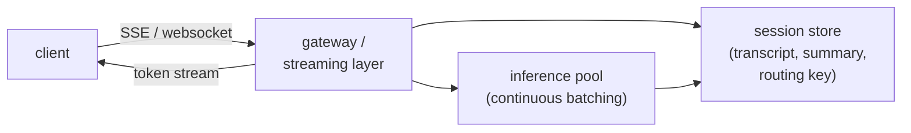
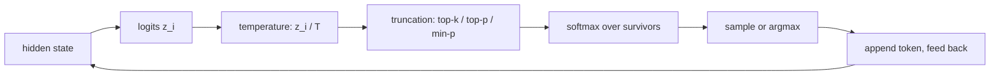
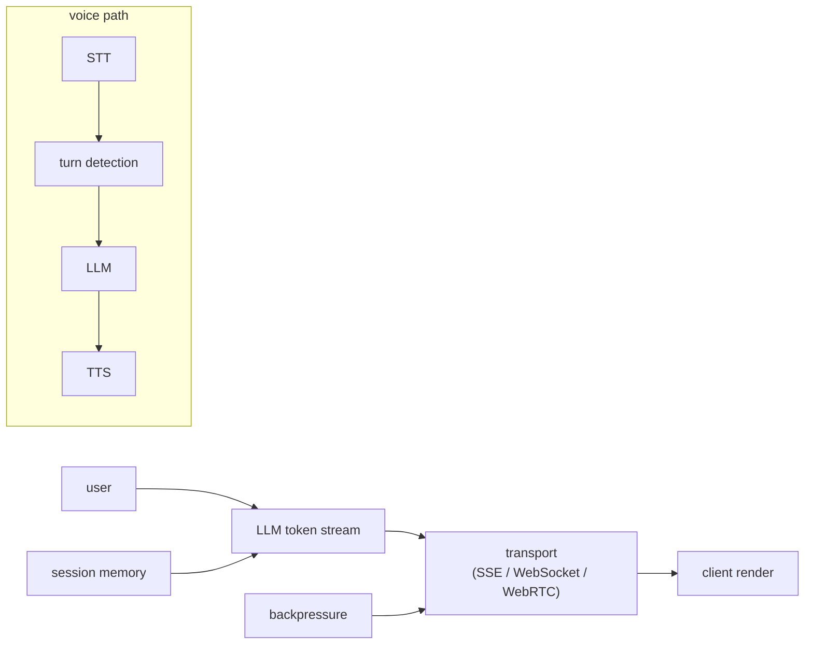

# Chapter 5: Real-Time Streaming Chat

Streaming chat is the interface most people mean when they say "an LLM product": you type, and words appear a fraction of a second later, flowing out as they are generated rather than arriving all at once. This chapter is about everything wrapping the model to make that happen, not the model internals. It is where backend engineering meets LLM serving: how tokens reach the user, how conversation state is managed, and how the system holds up under load and disconnects. The model itself is a box that emits tokens; the interesting design work is the transport, the session state, the sticky routing, the backpressure, and the graceful degradation around it. The cost model from long-context serving shows up here as a product problem, because the transcript grows every turn and someone has to pay for it.

In this chapter, we will build a mental model of a production streaming chat system by working through the serving and application layer for a multi-turn chat product. We will scope the problem, separate the transport question (how tokens reach the client) from the state question (where the conversation lives), and treat both as real design decisions rather than defaults. We will size the per-turn cost with the same serving math that governs any decoder, see why prefix caching plus sticky routing is the single biggest multi-turn win, walk the decoding step that turns logits into the tokens we stream, and handle the messy realities of cancellation, disconnects, and overload. We will open a validated reference architecture, the Llama-3 8B decoder, so you can trace the actual layers whose attention block builds the KV cache this whole chapter manages. Finally we will follow the same skeleton into its harder cousin, the live voice pipeline, where the transport moves to WebRTC and a turn-detection stage joins the loop.

In this chapter, we will cover the following main topics:

- Scoping a streaming chat product and its requirements
- The streaming data flow: transport versus state
- Why we stream, and choosing the transport
- Conversation state and the growing-context cost
- Sticky routing for cache reuse
- Serving the token stream: prefill, decode, and continuous batching
- The decoding step: turning logits into streamed tokens
- Backpressure, cancellation, and graceful degradation
- The voice path: STT, turn detection, and TTS

## Technical requirements

To follow along you need a modern web browser to open the validated reference graph used as a figure in this chapter. It is not a screenshot: it is a shape-checked architecture graph from the Neurarch model zoo, and it opens live in the editor so you can inspect real dimensions layer by layer.

The architecture we open in this chapter is:

- **Llama-3 8B**, the decoder-only model behind the stream: [open it live](https://www.neurarch.com/?import=https://raw.githubusercontent.com/neurarch-ai/awesome-llm-model-zoo/main/architectures/llama3-8b/model.json)

The full collection of 92 validated reference graphs lives in the [Model Zoo repository](https://github.com/neurarch-ai/awesome-llm-model-zoo), with a browsable [gallery](https://neurarch-ai.github.io/awesome-llm-model-zoo). It is built by [Neurarch](https://www.neurarch.com).

Conceptually you will also want to be aware of the infrastructure classes we name but do not install here: a streaming transport (server-sent events, WebSockets, or WebRTC), an inference pool running continuous batching, a session store holding the transcript, summary, and routing key, and, for the voice path, a speech-to-text front end, a turn-detection model, and a text-to-speech back end. No datasets are required to read the chapter; the running example is a multi-turn streaming chat product under real concurrency.

## Scoping a streaming chat product and its requirements

Before drawing any boxes, we scope the problem, because the answers change the architecture. The questions worth asking an interviewer, or yourself, are these:

- **Conversation length.** A few turns or long sessions? This decides how hard the growing-context problem bites, because every turn re-processes the history.
- **Latency target.** Time-to-first-token is the number users feel in chat, so state a target, for example under 1 second at p95 to the first token. The full answer can take several seconds and still feel fast if the first words land quickly.
- **Scale and concurrency.** Peak concurrent streams, not just queries per second. A streaming connection holds an inference slot for the whole generation, which changes the capacity math.
- **Statefulness.** Does the server hold conversation state, or does the client send the full transcript each turn? Both are valid and trade differently.
- **Multi-device and resumable.** Does a session need to survive a reconnect or move between devices?

Writing the answers out as functional and non-functional requirements gives us:

**Functional**

- Stream tokens to the client as they are generated
- Maintain multi-turn conversation context
- Let the user cancel a generation mid-stream
- Handle disconnects and, optionally, resume

**Non-functional**

- Low time-to-first-token at p95
- High concurrent-stream capacity per GPU
- Bounded cost per conversation as it grows
- Graceful degradation under overload rather than hard failures

The non-functional requirement that quietly dominates is **concurrent-stream capacity**, because each active stream holds an inference slot for its entire duration. Unlike a stateless request that occupies a worker for milliseconds, a streaming generation can hold its slot for many seconds, so the binding constraint is not requests per second but how many generations the pool can carry at once. We flag it early and return to it, because most of the failure modes in this system trace back to slots that are held longer than they should be.

## The streaming data flow: transport versus state

A production streaming chat system has two concerns that are easy to conflate and worth keeping separate in our heads and our diagrams: the **transport**, which is how tokens reach the client, and the **state**, which is where the conversation lives between turns. The transport is a connection question; the state is a storage and routing question. They meet at a gateway that sits in front of the inference pool.

*Figure 5.1: The streaming chat data flow, a gateway bracketing the inference pool and the session store*

The client opens a connection to the gateway. On a new turn the gateway loads the session state, hands the assembled prompt to the inference pool, and relays the pool's token stream straight back down the open connection to the client, updating the session store as it goes. The rest of the chapter walks this diagram: first the transport edge (the client-to-gateway connection), then the state (the session store and the routing that makes it cheap), then the pool (the serving math and the decoding step), and finally the operational realities that live at the gateway.

## Why we stream, and choosing the transport

We stream because **perceived latency** is dominated by time-to-first-token. A model that takes several seconds to finish its answer feels fast if the first words appear in well under a second, and feels broken if the user stares at a spinner for the same total time. Streaming converts a single long wait into an immediate trickle, which is almost entirely a perception win but a decisive one for chat. The transport is the main design fork, and there are three options in rising order of capability and operational cost:

- **Server-sent events (SSE).** One-way, server to client, running over plain HTTP. It is simple, and it is a natural fit because token output is one-directional: the server has something to say and the client only needs to listen. This is the common default for text chat.
- **WebSockets.** Full duplex over a single persistent connection. Worth the extra operational weight when you need rich client-to-server signaling mid-stream: live interrupts, collaborative state, or audio frames flowing up while tokens flow down.
- **WebRTC.** The transport of choice for live voice, covered at the end of this chapter. It is built for real-time media and tolerates packet loss and jitter in a way that ordered TCP delivery cannot, because for audio a late-but-perfect packet is worse than a dropped one.

Default to SSE for text chat unless you genuinely need duplex signaling, in which case reach for WebSockets, and move to WebRTC only when you are carrying live audio. Each step up buys capability and costs operational complexity, so match the transport to what the product actually signals mid-stream.

## Conversation state and the growing-context cost

Every turn, the model must see the conversation so far, and that transcript grows with each message. This has two consequences that dominate the economics of multi-turn chat.

First, **cost grows per turn**. Each turn re-processes the entire history in the prefill phase, so a long chat gets more expensive with every message. To see why, recall that the per-turn work has two parts. Prefill reads the whole prompt at once as a compute-bound matrix-matrix multiply and sets the time-to-first-token, while decode emits one token at a time and is memory-bandwidth-bound. The end-to-end latency for generating $N$ output tokens decomposes cleanly:

$$t_\text{e2e}\approx \underbrace{t_\text{TTFT}}_{\text{prefill, compute-bound}}+\ \underbrace{(N-1)\times t_\text{inter-token}}_{\text{decode, bandwidth-bound}}$$

The prefill term is paid once per turn and scales with prompt length, so as the transcript grows the prefill grows with it, and turn five genuinely costs more than turn one because it re-reads four turns of history.

Second, you eventually hit the context limit and the conversation errors out mid-flow. Both problems have the same two mitigations:

- **Prefix caching.** The system prompt and the stable head of the conversation repeat every turn, so we cache their computed keys and values and reuse them instead of recomputing prefill. What is reused is the per-token $K$ and $V$ vectors of the shared prefix, not any output tokens, so the saving is exactly the prefill FLOPs for the cached span, and the reuse is lossless because those vectors are deterministic given the weights. This is the single biggest win for multi-turn cost and latency.
- **Summarization or truncation.** Once the history is long, summarize older turns or drop the least relevant ones to bound growth. State the tradeoff plainly: you lose some fidelity to save cost and stay under the limit.

Where the state lives is itself a design choice. A **stateless server**, where the client sends the full transcript each turn, is simple and horizontally trivial to scale but pushes cost and trust onto the client. A **stateful server**, where a session store holds the transcript, enables server-side summarization and smaller request payloads but needs the routing we turn to next. The trade is simplicity versus control, and most products that care about cost and summarization end up stateful.

It helps to open the actual model the stream is carrying, because the KV cache this section keeps talking about is built by a specific block inside it. Llama-3 8B is a decoder-only LLM that ships grouped-query attention, and its attention block is precisely what builds the KV cache whose reuse (prefix caching) and growth (summarization) this whole chapter is about.

*Figure 5.2: Llama-3 8B, the decoder-only model behind the stream, whose attention block builds the KV cache*

You can [open this graph live](https://www.neurarch.com/?import=https://raw.githubusercontent.com/neurarch-ai/awesome-llm-model-zoo/main/architectures/llama3-8b/model.json) and find the attention block. Its grouped-query attention keeps the KV cache **memory** small as context grows, by partitioning the $H$ query heads into $G$ groups that share one key/value head, so the number of KV heads is $G$ with $1 \le G \le H$:

$$\text{MQA} \;(G=1) \;\le\; \text{GQA} \;(1 < G < H) \;\le\; \text{MHA} \;(G=H)$$

The cache size follows directly from the KV-head count and the sequence length:

$$\text{KV bytes}=2\times n_\text{layers}\times n_\text{kv}\times d_\text{head}\times \text{seq}\times \text{batch}\times \text{bytes}$$

where the leading $2$ counts $K$ and $V$. Cutting from $H$ heads to $G$ shrinks the cache, and the bandwidth cost of reading it at every decode step, by a factor of roughly $H/G$. Keep two things distinct, though: grouped-query attention bounds the KV cache **memory** as context grows, while the per-turn **prefill cost** of re-reading the transcript is bounded by prefix caching and summarization, not by GQA. They attack different axes of the same growing-context problem, and conflating them leads to reaching for the wrong lever.

## Sticky routing for cache reuse

Prefix caching only helps if the follow-up turn lands on the **same replica** that holds the cached KV state. If turn two is routed to a different replica than turn one, the cache is cold there and you pay full prefill again, so the biggest multi-turn optimization silently evaporates. The fix is to route a session consistently to its replica using a sticky routing key, so successive turns reuse the warm cache.

The tension is with load balancing. A hot session pinned hard to one replica can overload it, so we treat the cache as an optimization rather than a hard pin: the session prefers its replica but stays movable, and when a replica is saturated the session can migrate and pay one cold prefill to rebalance. Sticky-but-movable is the stance, because a strict pin trades a cache-miss problem for a hot-shard problem.

## Serving the token stream: prefill, decode, and continuous batching

Inside the inference pool, the reason many concurrent streams can share a handful of GPUs at all is **continuous batching**. Static batching groups a fixed set of requests, runs them together, and cannot start new work until the slowest sequence finishes, so short chats are held hostage by long ones and the GPU idles as sequences complete at different times. Continuous, or in-flight, batching operates at the granularity of a single decode step: after each step it evicts finished sequences and admits waiting ones into the freed slots, keeping the batch dimension full every iteration. This is what turns a pile of independent streaming connections into high GPU utilization, and it is the precondition for everything else in this section.

Batching pays off because of the shape of decode. Decode generates one token at a time, multiplying a few token vectors against the full weight matrices, so it streams every weight from memory to do a tiny amount of arithmetic. Its arithmetic intensity, defined as

$$\text{arithmetic intensity}=\frac{\text{FLOPs performed}}{\text{bytes moved from memory}}$$

is very low, so the step time is set by weight bytes divided by memory bandwidth:

$$t_\text{decode step}\approx\frac{\text{weight bytes}}{\text{bandwidth}}$$

Adding requests to a decode step reuses each streamed weight across more token vectors, amortizing that fixed weight-loading cost over more useful work, which is exactly why batching raises tokens per second. The ceiling is twofold: KV-cache memory grows linearly with batch and eventually leaves no room for more concurrent sequences, and once intensity crosses the compute-bound regime, further batching stops adding throughput while it keeps adding per-request latency. That first ceiling is why the KV-memory techniques from the previous section (grouped-query attention, prefix caching) indirectly raise the throughput ceiling: every byte saved in the cache is a byte available for one more concurrent stream.

The two latency numbers respond to different levers, and conflating them optimizes the wrong stage. Time-to-first-token is dominated by prefill plus any queueing before the request is scheduled, so it is a FLOPs-and-admission problem attacked by prompt caching and chunked prefill. Inter-token latency is the steady-state decode step time above, largely independent of prompt length once decoding starts, attacked by quantization and higher batch efficiency. For chat specifically, prompt caching is the lever that most directly cuts time-to-first-token, because the long shared prefix (system prompt plus history) is reused across every turn rather than recomputed.

## The decoding step: turning logits into streamed tokens

The tokens we stream do not come straight out of the network. At each position the model produces a vector of logits $z \in \mathbb{R}^{|V|}$, one per vocabulary entry, and a decoding policy turns those logits into the single token we append and send down the wire. The policy is layered on top of the same probabilities, so we can change the character of the output substantially without touching the weights:

Temperature $T$ divides the logits before the softmax, giving

$$p_i=\frac{\exp(z_i/T)}{\sum_j\exp(z_j/T)}$$

with two limiting cases: as $T \to 0$ the distribution collapses onto $\arg\max_i z_i$ so sampling becomes greedy, and as $T \to \infty$ it flattens toward a uniform $p_i \to 1/|V|$. Truncation then trims the tail before we sample. Top-k keeps a fixed count of the highest-probability tokens; top-p (nucleus) keeps the smallest set whose cumulative probability reaches $p$, so the admitted set adapts, staying small on a peaked step and widening on a flat one; min-p keeps tokens with $p_i \ge \text{min-p}\cdot\max_i p_i$, anchoring the cutoff to the model's confidence so it holds up better at high temperature. For open-ended chat the adaptive samplers (top-p, min-p) are the usual reach, because a fixed top-k either starves flat steps or admits junk on peaked ones.

Two decoding facts matter specifically for a streaming product. First, **the token is emitted the instant it is chosen**, so the decoding policy sits directly on the inter-token latency path; there is no buffering a full answer to post-process it. Second, sampled decoding is nondeterministic by design, so bug reports and evals must log the seed and sampling settings, or a "non-reproducible" result is expected behavior rather than a defect. Even greedy decoding, which is deterministic in principle because $\arg\max$ is a fixed function of the logits, can differ across GPU runs: floating-point reductions in matmuls and layer norms are not associative, so batching the same prompt alongside different peers can take a different kernel path, nudge a logit, and flip a near-tied argmax, after which autoregression amplifies the divergence. In a continuously batched server, where a request's batch neighbors change constantly, this is worth knowing before you promise bitwise reproducibility.

For latency-sensitive chat there is also a way to emit several tokens per expensive step. **Speculative decoding** pairs a small draft model, which proposes $k$ tokens autoregressively, with the large target model, which verifies all $k$ in a single parallel forward pass and accepts the longest prefix consistent with its own distribution, resampling at the first rejection. A modified rejection rule accepts each drafted token with probability

$$p_\text{accept}=\min\!\left(1,\ \frac{p_\text{target}(x)}{p_\text{draft}(x)}\right)$$

which makes the accepted tokens distributed exactly as if they came from the target model alone, so quality is unchanged. The win comes from arithmetic intensity: since decode is memory-bandwidth-bound, verifying $k$ tokens costs almost the same wall-clock as emitting one, so every accepted draft token is nearly free. It pays off when the acceptance rate is high and the GPU is otherwise underutilized (low batch size), and it can hurt at large batch sizes where the extra verification FLOPs compete with real work.

## Backpressure, cancellation, and graceful degradation

A streaming generation holds an inference slot for its entire duration, so freeing slots promptly is a capacity issue, not just hygiene. Three operational realities live at the gateway:

- **Cancellation.** When the user clicks stop, propagate the cancel to the inference engine and free the slot immediately. Continuing to generate tokens nobody will read burns a slot another user is waiting for.
- **Disconnect detection.** If the client drops mid-stream, detect the closed connection and abort the generation. Orphaned streams silently eat capacity: the server keeps generating into a socket that is gone, holding a slot for output that reaches no one.
- **Backpressure.** If the client cannot consume tokens as fast as they are produced, you need bounded buffering and an explicit policy for a slow consumer, rather than an unbounded queue that grows until it falls over.

When the inference pool saturates, because concurrent streams are the binding constraint, degrade **visibly** rather than hanging:

- **Queue** with an honest wait surfaced to the user, instead of a silent spinner that looks like a hang.
- **Shed load** with a clear retry signal rather than timing out silently.
- **Fall back** to a smaller, cheaper model to keep the product responsive under spikes, accepting a quality dip during the surge.

The failure modes to plan for are the mirror image of these fixes. Orphaned generations from undetected disconnects, cache stampede on a hot session pinned too hard to one replica, unbounded history that climbs until the context limit errors out mid-conversation, and silent overload that hangs instead of queuing. Each one is a slot held longer than it should be, or a cost left unbounded, which is the recurring theme of this system.

## The voice path: STT, turn detection, and TTS

Live voice is the same skeleton as text chat with the transport swapped and one stage added. Every system here carries the same shape: an LLM emits tokens, a transport streams them to the client, the client renders incrementally, and session memory feeds history back into the next turn. Voice forks in two places. The transport moves to WebRTC because ordered TCP delivery stalls audio on packet loss, and the LLM is wrapped in a speech-to-text front end and a text-to-speech back end, with a **turn-detection** (endpointing) stage in front that decides when the user has finished speaking so the model can start.

*Figure 5.3: The shared streaming skeleton, with the voice path adding STT, turn detection, and TTS around the LLM*

Turn detection is the stage with no text-chat analogue, and it is where the latency budget is won or lost. Wait too long after the user stops and the assistant feels sluggish; cut in too early and it interrupts. The production answers range from voice-activity detection and fixed endpointing timers of a few hundred milliseconds, to small semantic turn-detection models that judge whether an utterance is actually complete, to eager strategies that start the LLM on a medium-confidence transcript to overlap model work with the tail of the user's speech. On the output side, streaming text-to-speech is judged on time-to-first-byte, the audio analogue of time-to-first-token, so the same "stream early" instinct that governs text chat governs voice, just with tighter numbers because a human ear notices a gap a reader would never see.

## Summary

In this chapter we scoped the serving and application layer for a multi-turn streaming chat product and worked through it as two separable concerns: the transport, which is how tokens reach the client, and the state, which is where the conversation lives between turns. We chose the transport (SSE by default, WebSockets for duplex signaling, WebRTC for live audio) by what the product signals mid-stream, and we treated conversation state as a real decision between a simple stateless server and a stateful one that enables summarization. We saw why cost grows every turn, because prefill re-reads the whole transcript, and why prefix caching plus sticky routing is the single biggest multi-turn win, with summarization to bound growth. We opened the Llama-3 8B decoder to ground the KV cache the whole chapter manages, keeping the memory axis (grouped-query attention) distinct from the per-turn prefill axis. We covered the serving math that lets many streams share a GPU (continuous batching, the memory-bound decode step, the split between time-to-first-token and inter-token latency), walked the decoding policy that turns logits into the tokens we stream, and handled cancellation, disconnect detection, backpressure, and visible degradation under overload. Finally we followed the same skeleton into the live voice pipeline, where WebRTC replaces the transport and turn detection joins the loop.

In the next chapter, *Agent Orchestration*, we move from streaming a single model's tokens to coordinating many model calls into a plan: tool use, multi-step reasoning, and the control loop that decides what to call next and when the task is done.

## Questions

1. Why is autoregressive decode memory-bandwidth-bound while prefill is compute-bound, and which fixes target each?
2. Write the KV-cache memory formula and explain why it dominates long-context memory. Which factors in it are the levers people pull?
3. How does continuous (in-flight) batching beat static batching, and which metric does it move?
4. Why does prompt caching cut time-to-first-token, and what exactly is being reused across turns of a chat?
5. Why does sticky routing matter for multi-turn cost, and what breaks without it? How do you keep a hot session from overloading its replica?
6. Explain speculative decoding and why it preserves the target model's output distribution. When does it help and when does it hurt?
7. What does temperature do mathematically, and what are its limiting cases as $T \to 0$ and $T \to \infty$?
8. Compare top-k, top-p, and min-p sampling. Why do the adaptive samplers hold up better on open-ended chat?
9. If greedy decoding is deterministic in principle, why can it still produce different outputs across runs on a GPU, and why is a continuously batched server a common trigger?
10. What limits time-to-first-token, and how is it different from inter-token latency? Why does conflating them lead to optimizing the wrong stage?

## Further reading

Each of the following is a first-party engineering writeup that ships the patterns in this chapter. Read them for what an interview answer skips: who the system serves, the product design, the eval bar, and the deployment shape. The text systems appear first, then the voice pipeline.

- [Musings on building a Generative AI product (LinkedIn)](https://www.linkedin.com/blog/engineering/generative-ai/musings-on-building-a-generative-ai-product): end-to-end token streaming and progressive parsing to cut perceived latency.
- [Durable Objects for WebSockets and auth in AI Gateway (Cloudflare)](https://blog.cloudflare.com/do-it-again/): scaling persistent WebSocket connections for concurrent AI inference streams.
- [Chat SDK brings agents to your users (Vercel)](https://vercel.com/blog/chat-sdk-brings-agents-to-your-users): streaming responses cross-platform via native streaming versus a throttled fallback.
- [Real-time Messaging (Slack)](https://slack.engineering/real-time-messaging/): a stateful WebSocket gateway and channel servers deliver messages globally in about 500ms.
- [How Discord Scaled Elixir to 5,000,000 Concurrent Users (Discord)](https://discord.com/blog/how-discord-scaled-elixir-to-5-000-000-concurrent-users): Elixir GenServer sessions and Manifold fan-out for millions of concurrent WebSockets.
- [Updates for developers building with voice (OpenAI)](https://developers.openai.com/blog/updates-audio-models): new audio model snapshots for STT, TTS, and realtime speech-to-speech.
- [Why WebRTC beats WebSockets for realtime voice AI (LiveKit)](https://livekit.com/blog/why-webrtc-beats-websockets-for-voice-ai-agents): WebRTC handles packet loss, jitter, and congestion better than TCP.
- [Why you shouldn't build voice agents directly on model APIs (LiveKit)](https://livekit.com/blog/real-time-voice-agents-vs-model-apis): model APIs lack transport, echo cancellation, and turn detection.
- [Optimize voice agent latency with eager end of turn (Deepgram)](https://developers.deepgram.com/docs/flux/voice-agent-eager-eot): start the LLM on medium-confidence transcripts to overlap with speech.
- [Universal-Streaming: ultra-fast speech-to-text for voice agents (AssemblyAI)](https://www.assemblyai.com/blog/introducing-universal-streaming): immutable streaming transcripts in about 300ms with intelligent endpointing.
- [Enhancing conversational AI latency with efficient TTS (ElevenLabs)](https://elevenlabs.io/blog/enhancing-conversational-ai-latency-with-efficient-tts-pipelines): reducing streaming TTS time-to-first-byte for responsive conversation.
- [Announcing Sonic: a low-latency voice model (Cartesia)](https://cartesia.ai/blog/sonic): a state-space TTS hitting 135ms model latency for streaming voice agents.
- [A 6M-weight turn-taking model for voice AI agents (Krisp)](https://krisp.ai/blog/turn-taking-for-voice-ai/): a tiny CPU turn-detection model deciding when agents speak, listen, or wait.
- [Introducing Media Streams (Twilio)](https://www.twilio.com/en-us/blog/media-streams-public-beta): forks raw call audio over WebSockets for real-time bidirectional voice apps.
- [How we built Vapi's voice AI pipeline, part 2 (Vapi)](https://vapi.ai/blog/how-we-built-vapi-s-voice-ai-pipeline-part-2): VAD, endpointing, streaming STT, and inference coordination for low-latency voice.
- [Benchmarking LLMs for voice agent use cases (Daily)](https://www.daily.co/blog/benchmarking-llms-for-voice-agent-use-cases/): an open benchmark for latency, tool calling, and instruction adherence in voice.
- [Smart Turn v3, with CPU inference in 12ms (Daily / Pipecat)](https://www.daily.co/blog/announcing-smart-turn-v3-with-cpu-inference-in-just-12ms/): an open-source semantic-VAD turn-detection model, 8MB, 23 languages, CPU-friendly.
- [Evidently AI ML system design database](https://www.evidentlyai.com/ml-system-design): the broadest curated index, 800 case studies from 150-plus companies, for going beyond the cases listed here.
</content>
</invoke>
