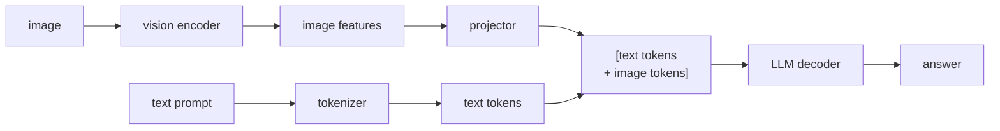

# Chapter 7: Multimodal Serving

Multimodal serving is the pattern that lets a language model answer questions about things that are not text: a user uploads a photo and asks what is wrong with the wiring, or hands the model a scanned invoice and asks for the total. On the surface it looks like a small addition, just staple an image onto the prompt, but the serving economics are different in a way that catches people out. An image does not cost one token, it costs many, and those tokens land in the most expensive part of the pipeline. The signal an interviewer is looking for is whether you understand the vision-language architecture well enough to reason about the image-token budget and the heterogeneous workload it creates, rather than drawing a box labeled "vision-language model" and stopping there.

In this chapter, we will build a mental model of a production multimodal service by working through a concrete scenario: a visual question-answering service where a user uploads an image plus a text prompt and the model returns a grounded, streamed answer, served efficiently at scale. We will scope the problem, lay out the three-part vision-language architecture, treat the image-token budget as the single number that governs cost, expose resolution as a quality-cost knob, split the vision encoder from the decoder as two independently scaled workloads, cache repeated image embeddings, and close with the failure modes and evaluation that are specific to images. Along the way we will open two validated reference architectures, a full vision-language model and the vision encoder underneath it, so you can trace the projector that bridges them rather than reason about a hand-waved connector.

In this chapter, we will cover the following main topics:

- Scoping a multimodal service and its requirements
- The vision-language architecture: encoder, projector, decoder
- The image-token budget as the whole cost story
- Resolution versus token count, and tiling as a knob
- Heterogeneous serving: splitting the vision tier from the decoder
- Caching image embeddings and generalizing to other modalities
- Tracing the vision-language and encoder architectures
- Bottlenecks, failure modes, safety, and evaluation

## Technical requirements

To follow along you need a modern web browser to open the validated reference graphs used as figures in this chapter. These are not screenshots: they are shape-checked architecture graphs from the Neurarch model zoo, and each one opens live in the editor so you can inspect real dimensions layer by layer, including the projector block that casual box diagrams skip.

The two architectures we open in this chapter are:

- **LLaVA-1.5 7B**, a full vision-language model (vision encoder, projector, and LLM decoder): [open it live](https://www.neurarch.com/?import=https://raw.githubusercontent.com/neurarch-ai/awesome-llm-model-zoo/main/architectures/llava-1.5-7b/model.json)
- **CLIP ViT-B/32**, the vision-encoder family that turns an image into a grid of feature vectors: [open it live](https://www.neurarch.com/?import=https://raw.githubusercontent.com/neurarch-ai/awesome-llm-model-zoo/main/architectures/clip-vit-b32/model.json)

The full collection of 92 validated reference graphs lives in the [Model Zoo repository](https://github.com/neurarch-ai/awesome-llm-model-zoo), with a browsable [gallery](https://neurarch-ai.github.io/awesome-llm-model-zoo). It is built by [Neurarch](https://www.neurarch.com). Audio follows the same encoder-then-decoder shape, so the zoo also carries whisper-small if you want to see the pattern generalize beyond vision.

Conceptually you will also want to be aware of the components we name but do not install here: an image preprocessing and validation stage (decode, downscale, cap dimensions), a batched vision-encoder tier, and a decoder pool running continuous batching. No datasets are required to read the chapter; the running example is a stream of user-uploaded images paired with text prompts.

## Scoping a multimodal service and its requirements

Before drawing any boxes, we scope the problem, because the answers change the architecture and, more than in most systems, the cost model. The questions worth asking are which modalities we accept, what the images look like, what task we serve, and what the latency and quality bars are.

For our service we assume images only to start, since each new modality (documents, video, audio) adds its own preprocessing path and it is cleaner to get one right first. Image resolution and count per request matter enormously, because high-resolution and multi-image requests cost far more tokens, and that token count drives the whole cost model. The task is interactive visual question answering, where the first token should stream quickly, rather than batch enrichment where throughput is all that counts. The quality bar decides how much detail the model must recover from the image: casual "what is in this picture" tolerates low resolution, while reading small text off a document demands high resolution and therefore high cost.

Writing these out as functional and non-functional requirements gives us:

**Functional**

- Accept an image plus a text prompt and return a grounded text answer
- Preprocess, validate, and encode images
- Combine image and text into one model call
- Stream the response

**Non-functional**

- Bounded cost per request despite the image-token blowup
- A p99 first-token latency target for interactive use
- Throughput that handles a mixed stream of text-only and image requests
- Graceful handling of oversized or malformed images

The non-functional requirement that quietly dominates here is **bounded cost per request**, because the image-token budget makes it easy to ship something correct but unaffordable. We flag it early and return to it repeatedly, because almost every design lever in this chapter is ultimately a way to control that budget.

## The vision-language architecture: encoder, projector, decoder

Say this clearly in an interview, because it is the load-bearing sentence: a vision-language model is three parts wired in sequence.

*Figure 7.1: The encoder-projector-decoder path, where an image becomes a block of tokens spliced into the text sequence*

1. The **vision encoder**, a ViT-style model, turns the image into a grid of feature vectors.
2. The **projector**, or connector, maps those features into the language model's token embedding space, producing a block of "image tokens." This is the piece that differs most across real systems: some use a simple MLP projector, others use a cross-attention resampler that squeezes the features down to a fixed handful of query tokens.
3. The **LLM decoder** consumes the image tokens and the text tokens together as one sequence and generates the answer.

The key realization, and the one that unlocks the rest of the chapter, is that from the decoder's point of view an image becomes a chunk of tokens spliced into the sequence at the image's placeholder position, alongside the text tokens rather than necessarily at the front. That is why image cost is token cost: once the projector has run, the decoder does not know or care that a block of its input came from pixels.

## The image-token budget as the whole cost story

A single image expands into many tokens, often hundreds and sometimes over a thousand for high resolution. Those tokens flow into two places that both scale with token count: the **prefill** pass and the **KV cache**. Both cost more as the image-token count grows.

On the prefill side, attention over the prompt is quadratic in sequence length. The score matrix is $n \times n$ because every query attends to every key, so both compute and, in a naive implementation, memory scale as $O(n^2)$ with sequence length $n$. Splicing hundreds of image tokens into the prompt lengthens $n$ directly, so first-token latency rises: a prompt that is mostly image tokens can cost far more prefill than its short text question would suggest.

On the memory side, those same tokens sit in the KV cache for the whole generation. The cache size in bytes is

$$\text{KV bytes} = 2 \times n_\text{layers} \times n_\text{kv} \times d_\text{head} \times n_\text{seq} \times b$$

where the leading $2$ counts keys and values, $n_\text{kv}$ is the number of KV heads, $d_\text{head}$ the per-head dimension, $n_\text{seq}$ the sequence length, and $b$ the bytes per element. The image tokens inflate $n_\text{seq}$, so an image request holds more KV memory than a text request of the same visible prompt length, which shrinks the batch size you can serve concurrently. Multi-image requests multiply this: two images roughly double the image-token contribution to both prefill and the cache.

So the central serving lever in multimodal is not anything exotic, it is **controlling the image-token count**. Everything below is a concrete way to do that.

## Resolution versus token count, and tiling as a knob

More resolution means more image tokens means more cost. The standard approach for high-resolution input is **tiling**: split the image into patches, encode each patch, and concatenate the results. Tiling recovers fine detail, which is exactly what OCR and dense scenes need, but it multiplies the token count because each tile becomes its own block of image tokens.

The senior move is to expose resolution as a quality-cost knob rather than always maxing it:

- Low resolution, or a single view, for coarse questions like "what is in this picture."
- Tiled high resolution only when the task genuinely needs fine detail, such as reading text or inspecting a small region.

Picking resolution per task, instead of paying peak cost on every request, is what separates a design that scales from one that is correct but ruinously expensive. In practice you route the request: a captioning query takes the cheap single-view path, while a document-OCR query opts into tiling and accepts the higher token count.

## Heterogeneous serving: splitting the vision tier from the decoder

The pipeline hides two very different workloads, and stapling them onto one server wastes hardware.

The first is **image preprocessing and the vision encoder**: a bounded, parallel, compute-heavy pass that runs once per image. It batches well, because you can gather many images and encode them together, saturating the tensor cores.

The second is **LLM decode**: the autoregressive, memory-bandwidth-bound generation loop. Decode generates one token at a time, streaming the full weight matrices from memory to do a small amount of matrix-vector work, so its arithmetic intensity is low and its step time is set by weight bytes divided by bandwidth. This is the opposite profile from the encoder's dense, compute-bound pass.

Because the two stages have opposite hardware profiles, we run them as **separate, independently scaled tiers**. The vision encoder batches images on its own pool, sized to the image arrival rate, while the decoder pool runs continuous batching for generation, sized to the token-generation load. Continuous batching matters here because it operates at the granularity of a single decode step: after each step it evicts finished sequences and admits waiting ones, keeping the batch full even though image and text requests finish at wildly different times.

Crucially, a purely text request skips the vision tier entirely. Do not make every request pay for image infrastructure: route text-only traffic straight to the decoder pool so a simple chat turn is never stuck behind a queue of image-encoding work.

## Caching image embeddings and generalizing to other modalities

The same image often appears across many requests: a product photo re-served to thousands of shoppers, or a single upload that a user asks three follow-up questions about. Encoding it every time is pure waste. We cache the **vision-encoder output**, keyed by an image hash, so a repeated image skips encoding entirely and jumps straight to the projector and decoder.

This is the multimodal analogue of prompt caching on the text side. In prompt caching we store the KV cache for a shared prefix so a later request skips recomputing it; here we store the encoder output for a shared image so a later request skips re-encoding it. Both reuses are exact and lossless, because the encoder output for a fixed image is deterministic given the weights, and both pay off most when the same input is shared across many requests. It is a clean win for catalogs and for multi-turn conversations about one image.

The pattern generalizes cleanly to other modalities. Audio fits the same shape: an audio encoder turns sound into features, a projector maps them into the decoder's token space, and the decoder generates over the interleaved sequence. The serving lesson is identical: the encoder is a separate batched workload, its output can be cached by hash, and the encoded tokens land in the decoder's prefill and KV cache exactly like image tokens do. Whatever the modality, the shape is encoder, then projector, then a shared decoder, and the one number that governs cost is how many tokens the modality is allowed to become.

## Tracing the vision-language and encoder architectures

Multimodal is the clearest case for reading a real graph instead of a box diagram, because the projector that bridges the vision encoder and the language model is exactly the piece casual diagrams hand-wave, and it is where the design actually lives.

We start with a full vision-language model. LLaVA-1.5 7B is the canonical open example of the simplest connector: a frozen CLIP vision encoder feeding an MLP projector that maps image features into the LLM's embedding space, with the projected image tokens then joining the text tokens in a decoder-only LLM.

*Figure 7.2: LLaVA-1.5 7B, a full vision-language model, from vision encoder through the MLP projector to the point where image tokens join the text tokens in the decoder*

You can [open this graph live](https://www.neurarch.com/?import=https://raw.githubusercontent.com/neurarch-ai/awesome-llm-model-zoo/main/architectures/llava-1.5-7b/model.json) and trace three things in order: the vision encoder, the projector that maps image features into the token space, and the junction where image tokens meet text tokens in the decoder. That junction is the whole architecture in one place, the moment pixels become just another block of tokens.

To see where those image features come from, we open the encoder underneath. CLIP ViT-B/32 shows how an image becomes a grid of feature vectors in the first place.

*Figure 7.3: CLIP ViT-B/32, a vision encoder turning an image into a grid of feature vectors*

You can [open this graph live](https://www.neurarch.com/?import=https://raw.githubusercontent.com/neurarch-ai/awesome-llm-model-zoo/main/architectures/clip-vit-b32/model.json) and see the patch grid form. This B/32 graph is illustrative of the CLIP-ViT family; LLaVA-1.5 itself uses a larger, higher-resolution variant (ViT-L/14 at 336px), which is precisely why its image-token count is high, a direct, traceable link between the encoder you pick and the image-token budget you pay for downstream. The two figures together are the two models that bracket the projector: the encoder builds the grid, the projector reshapes it, and the decoder generates over it.

## Bottlenecks and scaling

As load and image complexity grow, a predictable set of bottlenecks surfaces, and every one of them traces back to the image-token budget or to mixing the two workloads. It is worth memorizing the cause and the fix, because they map directly onto the stages above:

| Bottleneck | Cause | Fix | Tradeoff |
|---|---|---|---|
| First-token latency | Large prefill from image tokens | Lower resolution; fewer tiles | Less image detail |
| KV-cache memory | Image tokens inflate the cache | Cap resolution; quantize KV cache | Quality / detail |
| Vision encoder throughput | Encoding every image inline | Separate batched encoder tier; cache by image hash | More infra |
| Mixed traffic | Text requests stuck behind image work | Route text-only past the vision tier | Routing complexity |
| Multi-image blowup | Token count multiplies | Limit images per request; downscale | Capability limit |

The through-line is that first-token latency and KV memory are both governed by the image-token count, so lowering resolution or tile count helps both at once, while the encoder-throughput and mixed-traffic rows are solved by the tiering and caching decisions from earlier in the chapter.

## Failure modes, safety, and evaluation

A multimodal service fails in ways a text chatbot does not, because it ingests untrusted pixels and because the token budget can blow up silently. We plan for four categories:

- **Oversized or malformed images:** validate, downscale, and cap dimensions before encoding, so one huge upload cannot blow the token budget or OOM the encoder. This is the first line of defense on cost, applied before any model runs.
- **Image-borne prompt injection:** text rendered inside an image, a sign in the photo that reads "ignore your instructions," can act as an injection vector once the model reads it. We treat image-derived content as untrusted data, exactly as we treat retrieved text, never as instructions.
- **Hallucinated detail:** the model describes things that are not in the image, especially at low resolution where the detail simply was not encoded. We evaluate grounding and raise resolution for detail-sensitive tasks rather than letting a cheap path quietly fabricate.
- **Evaluation:** the evals are task-specific (VQA accuracy, captioning quality, OCR exactness) plus latency and cost per request. We track cost explicitly, because the image-token budget makes it easy to ship something that is correct but unaffordable, and a cost regression is as much a failure as a quality one.

## Summary

In this chapter we scoped a production multimodal service around a visual question-answering scenario and worked through it stage by stage. We laid out the vision-language architecture as three parts in sequence, a vision encoder, a projector, and an LLM decoder, and saw why that structure means an image is simply a block of tokens spliced into the text sequence. From there we treated the image-token budget as the one number that governs cost, tracing it into the quadratic prefill and the linear KV cache, and we used that lens to justify every lever: exposing resolution and tiling as a quality-cost knob, splitting the compute-bound vision encoder from the bandwidth-bound decoder into independently scaled tiers, routing text-only traffic past the vision infrastructure, and caching vision-encoder output by image hash the way prompt caching reuses a shared prefix. We opened two validated reference architectures, the LLaVA-1.5 7B vision-language model and the CLIP ViT-B/32 encoder underneath it, to make the projector and the encoder-to-budget link concrete rather than abstract. Finally we covered the failure modes specific to images: oversized uploads, image-borne prompt injection, hallucinated detail at low resolution, and the cost-aware evaluation that gates changes.

In the next chapter, *Fine-Tuning and Post-Training*, we turn from serving a pretrained model to changing one: how supervised fine-tuning, parameter-efficient methods like LoRA, and alignment objectives adapt a base model to a task without overwriting the general capability it started with.

## Questions

1. Walk through the three parts of a vision-language model. Why does an image end up as a block of tokens spliced into the text sequence rather than a separate input the decoder handles specially?
2. Why is an image so expensive to serve? Trace the image-token count into both prefill compute and KV-cache memory.
3. Attention is $O(n^2)$ in sequence length. How does that shape the first-token latency of an image-heavy prompt, and where exactly does the quadratic cost bite?
4. Write the KV-cache memory formula and explain which factor the image tokens inflate. Why does that shrink the batch size you can serve?
5. How does tiling for high-resolution input trade detail against token count, and how would you decide per request whether to pay for it?
6. Why should the vision encoder and the LLM decoder run as separate, independently scaled tiers? Contrast their hardware profiles.
7. Why is autoregressive decode memory-bandwidth-bound while prefill is compute-bound, and what does that imply for sizing the encoder tier versus the decoder pool?
8. Why does caching the vision-encoder output by image hash help, and what exactly is being reused? How is it analogous to prompt caching?
9. How does continuous batching keep the decoder pool efficient when image and text requests finish at very different times?
10. What are the failure modes specific to a multimodal service (oversized images, image-borne prompt injection, hallucinated detail), and how does each defense work?

## Further reading

Each of the following is a first-party engineering or research writeup that ships the patterns in this chapter. Read them for what an interview answer skips: who the system serves, the connector design, the eval bar, and the deployment shape. Most are the same skeleton, a modality encoder feeding a connector feeding a shared decoder, and they differ mostly in the connector and in how many tokens an image is allowed to become.

- [vLLM V1: accelerating multimodal inference (Red Hat)](https://developers.redhat.com/articles/2025/02/27/vllm-v1-accelerating-multimodal-inference-large-language-models): encoder caching, per-image prefix caching, and async CPU/GPU overlap for faster multimodal serving. *(deployment)*
- [Accelerating Multimodal Inference in vLLM (AMD ROCm)](https://rocm.blogs.amd.com/software-tools-optimization/vllm-dp-vision/README.html): batch-level data parallelism for vision encoders cuts synchronization overhead. *(deployment)*
- [Qwen2-VL: enhancing vision-language perception at any resolution (Alibaba)](https://arxiv.org/abs/2409.12191): dynamic native resolution turns any image into a variable number of visual tokens, with an MLP projector and M-RoPE. *(product design)*
- [Pixtral 12B (Mistral AI)](https://arxiv.org/abs/2410.07073): a custom ViT trained from scratch ingests native resolution with a flexible image-token budget. *(product design)*
- [Visual Instruction Tuning, LLaVA (Microsoft)](https://arxiv.org/abs/2304.08485): the MLP projector connecting a frozen CLIP vision encoder to the LLM embedding space, the architecture we open as Figure 7.2. *(product design)*
- [Creating a modern OCR pipeline using CV and deep learning (Dropbox)](https://dropbox.tech/machine-learning/creating-a-modern-ocr-pipeline-using-computer-vision-and-deep-learning): productionizing a deep-learning OCR and document-scan pipeline, the high-resolution end of the resolution knob. *(deployment)*
- [Introducing Idefics2: a powerful 8B vision-language model (Hugging Face)](https://huggingface.co/blog/idefics2): vision encoder plus projector plus perceiver-resampler design choices. *(product design)*
- [NVLM: open frontier-class multimodal LLMs (NVIDIA)](https://research.nvidia.com/labs/adlr/NVLM-1/): decoder-only versus cross-attention connector tradeoffs, plus tile-tagging for OCR. *(deployment)*
- [Flamingo: a visual language model for few-shot learning (DeepMind)](https://arxiv.org/abs/2204.14198): bridging frozen vision and language models with a gated cross-attention connector over interleaved input. *(product design)*
- [Molmo and PixMo: open weights and open data for VLMs (Ai2)](https://arxiv.org/abs/2409.17146): an open VLM family with curated data rivaling proprietary models. *(eval bar)*
- [InternVL 2.5: model, data, and test-time scaling (OpenGVLab)](https://arxiv.org/abs/2412.05271): scaling an open multimodal model across model, data, and inference-time compute. *(eval bar)*
- [Qwen2-Audio Technical Report (Alibaba)](https://arxiv.org/abs/2407.10759): an audio-language model with voice-chat and audio-analysis modes, the same encoder-projector-decoder shape applied to sound. *(who it serves)*
- [Accelerating VLM inference with TensorRT Edge-LLM (NVIDIA)](https://developer.nvidia.com/blog/accelerating-llm-and-vlm-inference-for-automotive-and-robotics-with-nvidia-tensorrt-edge-llm/): a C++ runtime for low-latency on-device VLM inference on embedded hardware. *(deployment)*
- [MM1: methods, analysis, and insights from multimodal LLM pre-training (Apple)](https://arxiv.org/abs/2403.09611): ablations on image-token count, connector design, and data mix for building VLMs. *(product design)*
- [Chameleon: mixed-modal early-fusion foundation models (Meta)](https://arxiv.org/abs/2405.09818): a single transformer over interleaved image/text tokens, a stable early-fusion recipe that discretizes images into tokens directly. *(product design)*
- [Running AI Inference at Scale in the Hybrid Cloud (Roblox)](https://about.roblox.com/newsroom/2024/09/running-ai-inference-at-scale-in-the-hybrid-cloud): vLLM, Ray, and a custom feature store serving 250 ML pipelines across hybrid cloud. *(deployment)*
- [PaLI-X: on scaling up a multilingual vision-language model (Google)](https://arxiv.org/abs/2305.18565): scaling VLM components and task mix to advance 25-plus vision-language benchmarks. *(eval bar)*
- [Florence-2: a unified representation for vision tasks (Microsoft)](https://arxiv.org/abs/2311.06242): a prompt-based seq2seq VLM unifying caption, detection, grounding, and segmentation. *(product design)*
- [BLIP-2: bootstrapping with frozen image encoders and LLMs (Salesforce)](https://arxiv.org/abs/2301.12597): a lightweight Q-Former projector bridging a frozen vision encoder to a frozen LLM with just 32 query tokens. *(product design)*
- [Evidently AI ML system design database](https://www.evidentlyai.com/ml-system-design): the broadest curated index, 800 case studies from 150-plus companies, for going beyond the systems listed here.
