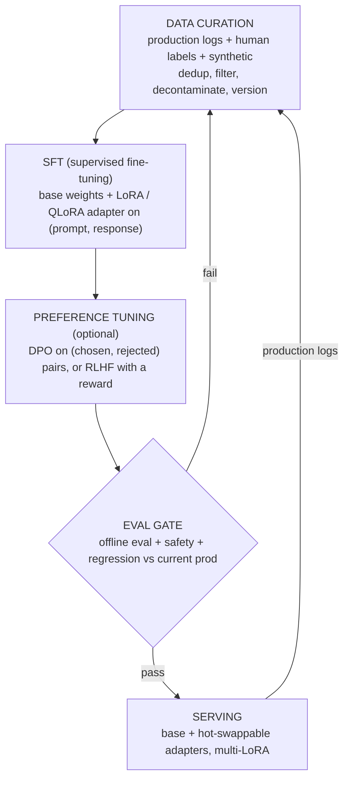
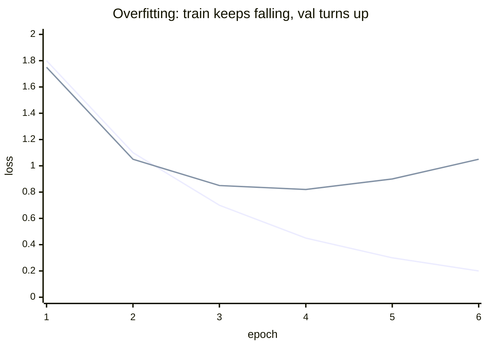

# Chapter 8: Fine-Tuning and Post-Training

Sooner or later a base model is not good enough at the task you actually care about, and someone asks you to fix it. The reflex is to reach for a training run, and it is usually the wrong reflex. This chapter is about the pipeline that adapts a base model to a domain task, gets it into production safely, and keeps it improving, but it is really about judgment: the strongest engineers spend their first minute arguing that you probably should not fine-tune yet, then design the pipeline anyway behind an evaluation gate that decides whether the new model ever reaches a user. Fine-tuning is the last lever, not the first, and knowing that is the difference between a system that compounds and one that burns a training budget chasing a problem retrieval should have owned.

In this chapter, we will work through that pipeline as a concrete scenario: our base model underperforms on a domain task, we have some data and a path to more, and we need to adapt it, ship it, and keep it getting better. We will start by deciding whether to prompt, retrieve, or train, because the ordering is the whole answer. Then we will curate a versioned dataset, run supervised fine-tuning, and see why parameter-efficient methods like LoRA and QLoRA are almost always the right call. We will add preference optimization with DPO and RLHF where a quality axis demands it, write down the KL anchor that keeps an aligned model from drifting, gate every candidate behind an evaluation, close the loop with a data flywheel, and serve many task adapters cheaply over one frozen base. Along the way we will open two validated reference architectures, Llama-3 8B and Mistral 7B, so you can trace the exact weight matrices a LoRA adapter rides on rather than reason about a box labeled "the model."

In this chapter, we will cover the following main topics:

- Scoping the adaptation problem: prompt, retrieve, or train
- The post-training pipeline end to end
- Data curation as the whole game
- Supervised fine-tuning, overfitting, and catastrophic forgetting
- Parameter-efficient tuning: LoRA and QLoRA
- Preference optimization: DPO, RLHF, and the KL anchor
- The evaluation gate before promotion
- The data flywheel and multi-adapter serving
- Failure modes, safety, and evaluation

## Technical requirements

To follow along you need a modern web browser to open the validated reference graphs used as figures in this chapter. These are not screenshots: they are shape-checked architecture graphs from the Neurarch model zoo, and each one opens live in the editor so you can inspect real dimensions layer by layer. When you fine-tune, it helps to see what you are actually touching, because "a LoRA adapter perturbs well under 1% of the parameters" stays abstract until you open the graph and find the specific weight matrices the adapter rides on.

The two architectures we open in this chapter are:

- **Llama-3 8B**, a common open base to fine-tune: [open it live](https://www.neurarch.com/?import=https://raw.githubusercontent.com/neurarch-ai/awesome-llm-model-zoo/main/architectures/llama3-8b/model.json)
- **Mistral 7B**, another standard fine-tune target: [open it live](https://www.neurarch.com/?import=https://raw.githubusercontent.com/neurarch-ai/awesome-llm-model-zoo/main/architectures/mistral-7b/model.json)

The full collection of 92 validated reference graphs lives in the [Model Zoo repository](https://github.com/neurarch-ai/awesome-llm-model-zoo), with a browsable [gallery](https://neurarch-ai.github.io/awesome-llm-model-zoo). It is built by [Neurarch](https://www.neurarch.com).

Conceptually you will also want to be aware of the tooling classes we name but do not install here: a parameter-efficient tuning library that implements LoRA and QLoRA adapters, a preference-optimization trainer for DPO or RLHF, a multi-LoRA serving stack that batches requests across adapters over one shared base, and a versioned dataset store that pins each model artifact to the exact data snapshot it came from. No datasets are required to read the chapter; the running example is an internal domain task where the base model is close but not good enough.

## Scoping the adaptation problem: prompt, retrieve, or train

Before drawing any boxes, we scope the problem, because "not good enough" is not one problem. Wrong facts, wrong format, wrong tone, and a genuinely missing skill each point at a different fix, and only the last is really a fine-tuning case. So we clarify first: What does "not good enough" mean concretely? Do we have clean labeled data and someone to label more, or is this a data problem wearing a compute costume? How fast does the domain knowledge churn, because baking weekly-changing facts into weights is a treadmill? What is the hosting story, since self-hosted open weights make adapter tuning and serving cheap while a closed API limits you to whatever tuning the vendor exposes? And what is the quality floor, and how will we measure it, because no evaluation means no promotion.

With that scoped, we say the ordering out loud, because the honest ordering is the signal:

- **Prompt engineering first.** Few-shot examples, a sharper system prompt, output schemas, and task decomposition fix a surprising share of "the model is bad at our task" complaints. It is free, instant to iterate, and it is your baseline. You cannot tell whether fine-tuning helped if you never tuned the prompt.
- **Retrieval next, when the gap is knowledge.** If the model lacks facts (your docs, your catalog, your tickets), put the facts in context instead of in the weights. Retrieval updates the instant a document changes and cites sources, and it never needs a training run. The decision rule: retrieval teaches the model what it does not know; fine-tuning teaches it how to behave.
- **Fine-tuning last, when the gap is behavior or skill.** A consistent output format, a domain tone, a reasoning pattern, a structured-extraction skill the base fumbles, or shaving a long few-shot prompt down to a short one for cost. Fine-tuning is also how you bake in a style retrieval cannot inject.

The trap to name explicitly is fine-tuning to teach facts. It is expensive, it goes stale, it hallucinates confidently between the facts you taught, and it has to be redone when the facts move. Reach for retrieval there. The two compose well: tune for behavior, retrieve for knowledge, on the same base.

Writing the target out as functional and non-functional requirements gives us:

**Functional**

- Curate a high-quality task dataset and keep it versioned
- Supervised fine-tune a base model into a task model
- Optionally apply preference optimization to align tone and choices
- Gate every candidate behind an evaluation before it can be promoted
- Serve the adapted model, ideally many task variants, cheaply
- Feed production interactions back into the next dataset

**Non-functional**

- Reproducibility: a model version pins its data, base, and hyperparameters
- Cost control: tune and serve without a full-fine-tune budget per task
- Safety: a promotion cannot silently regress quality or safety
- Rollback: a bad model reverts in one step, not a retrain

## The post-training pipeline end to end

The pipeline is a loop, not a line, and the loop at the bottom is the part most engineers forget and the part that actually compounds: production output becomes tomorrow's training data. We keep the whole shape in one diagram and then walk its stages in the order data flows through them.

*Figure 8.1: The post-training pipeline, from data curation through the evaluation gate to serving, with the production feedback loop that makes it compound*

Every stage below is one node in this diagram. The evaluation gate is the load-bearing component: a candidate model does not reach users until it beats the current production model on a held-out set, and we return to it in its own section.

## Data curation as the whole game

A small, clean dataset beats a large, noisy one, and it is not close. The model imitates exactly what you show it, including the mistakes, so curation is where most of the quality is won or lost. The work is unglamorous and it is the job:

- **Quality over quantity.** A few thousand carefully curated examples often outperform tens of thousands of scraped ones for supervised fine-tuning. More data helps only until the marginal examples are redundant, low-quality, or off-distribution, at which point they add noise and compute cost without lowering real error. Treat any specific count as illustrative and earn your own number on your task.
- **Deduplicate and balance.** Near-duplicates get effectively upweighted, so the model memorizes them, wastes capacity, and can regurgitate them verbatim, which is both a quality and a privacy problem. Deduplication, including near-dedup via hashing or embedding similarity, spreads the token budget across genuinely distinct content. Keep exact-dup removal strict and tune the near-dup threshold, since overly aggressive near-dedup strips legitimately similar-but-distinct examples.
- **Decontaminate.** Make sure your evaluation set has not leaked into training, or your evaluation numbers are fiction. Duplicates that straddle train and eval inflate benchmark scores and hide real generalization failure. This is the single most common way teams fool themselves.
- **Format consistency.** One prompt template, one response shape. The model learns the template as hard as it learns the content.
- **Synthetic data, used carefully.** A stronger model can generate or augment examples, but unfiltered synthetic data drifts toward the generator's biases and collapses diversity. Filter it through the same quality and dedup gates as human data, and keep a human-labeled core.

Label noise deserves its own mention, because high-capacity models will memorize even mislabeled examples given enough epochs, which is precisely when noise does the most damage. Wrong targets, inconsistent formatting, and contradictory annotations raise the noise floor of validation loss and produce confident wrong outputs. Reduce epochs so the model fits the consistent majority signal before it memorizes the noisy outliers, and treat improving annotation quality as the durable fix rather than only softening the loss.

Finally, version the dataset like code. A model artifact should name the exact data snapshot it came from, or you cannot reproduce or debug it.

## Supervised fine-tuning, overfitting, and catastrophic forgetting

Supervised fine-tuning (SFT) is plain next-token prediction on `(prompt, ideal response)` pairs: show the model the input and the output you wish it had produced, and train it to produce that. It is the workhorse and usually the only training step you actually need, teaching format, tone, and task-specific behavior directly. Most production teams ship SFT alone.

Because a pretrained model has enormous capacity relative to a few thousand fine-tuning examples, it can memorize the set in one or two passes, so overfitting is the first thing to watch. It shows up as training loss continuing to fall while held-out validation loss flattens and then rises, and behaviorally as the model parroting training phrasings, memorizing rare examples verbatim, and losing calibration on out-of-distribution prompts:

The minimum of the validation curve, around epoch 3 above, is where we want to stop. Since most task adaptation happens in the first epoch, the cheapest defense is to train fewer epochs with early stopping on a real validation split. The tradeoff is that aggressive early stopping can underfit genuinely new formats or vocabulary, so we tune the stopping patience rather than hard-capping at one epoch.

The second thing to watch is **catastrophic forgetting**: the model getting better at your task while regressing on reasoning, other languages, or instruction following it used to handle, because gradient updates on the narrow fine-tuning distribution overwrite weights that encoded broad knowledge. The strongest structural mitigation is the parameter-efficient tuning we turn to next, which freezes the base weights so original capability is preserved by construction. Complementary fixes are a low learning rate, few epochs, and replay: mixing a slice of general instruction data into the fine-tune so the optimizer keeps a gradient signal for the old distribution. Replay dilutes task signal, so we tune the mix ratio to the amount of forgetting we actually observe.

## Parameter-efficient tuning: LoRA and QLoRA

Full fine-tuning updates every weight in the model, which means optimizer state and gradients for billions of parameters, multiple copies of the model in GPU memory, and a fresh full-size checkpoint per task. In mixed precision it costs roughly $2N$ bytes for the bf16 weights plus about $12N$ bytes for the Adam state (an fp32 master copy plus first and second moments), so an $N$-parameter model needs on the order of $14N$ bytes before activations. You rarely need it.

**LoRA (low-rank adaptation)** freezes the base weights and learns a small pair of low-rank matrices that adjust each target weight matrix. It rests on the empirical observation that the weight update a task needs has low intrinsic rank, so the effective weight becomes:

$$W = W_0 + \Delta W = W_0 + \frac{\alpha}{r} B A, \qquad B \in \mathbb{R}^{d \times r},\; A \in \mathbb{R}^{r \times k},\; r \ll \min(d, k)$$

Here $W_0$ is frozen, $B$ starts at zero and $A$ is initialized randomly so that $\Delta W = 0$ at step 0, and $\frac{\alpha}{r}$ is a fixed scaling factor. You train and store only $A$ and $B$, often well under 1% of the model's parameters, and the base never moves. Because $\Delta W$ can be folded back into $W_0$ after training, there is zero added inference latency once merged, unlike adapter layers that sit in the forward path.

The most LoRA-specific regularization lever is the rank $r$ itself: a smaller rank constrains the update to a low-dimensional subspace and mechanically limits how much the model can memorize, so dropping from $r = 64$ to $r = 8$ or $r = 16$ is often the single best anti-overfitting move on small data. LoRA dropout and weight decay on $A$ and $B$ add milder regularization. Raise the rank only when validation loss shows underfitting rather than reflexively, because too small a rank underfits tasks that require a broad behavioral change.

**QLoRA** goes further: it quantizes the frozen base to 4-bit (NF4) to slash its memory footprint, then trains the LoRA adapter on top in higher precision. The base is quantized only to hold it cheaply; the learned adapter carries the precision that matters. The memory math is what lets people fine-tune very large models on a single commodity GPU: a 65B base in 4-bit is roughly $0.5N$ bytes, about 33 GB, and the trainable adapter's optimizer state is negligible, which collapses the footprint from around 900 GB onto a single 48 GB or 80 GB card. The costs you accept are runtime dequantization of the 4-bit base on every forward pass and a small quality gap from the quantized base, which the higher-precision adapter and NF4's information-theoretically motivated levels largely close.

LoRA is usually applied to the attention projection matrices, the query, key, value, and output projections, and often the feed-forward matrices too, since that is where task adaptation concentrates. This is exactly the kind of claim that stays abstract until you open the graph. Llama-3 8B is a common open base, and opening it lets you find the specific matrices an adapter targets.

*Figure 8.2: Llama-3 8B, a common open base to fine-tune; the attention query/key/value/output projections and the feed-forward matrices in each block are the weights a LoRA adapter rides on*

You can [open this graph live](https://www.neurarch.com/?import=https://raw.githubusercontent.com/neurarch-ai/awesome-llm-model-zoo/main/architectures/llama3-8b/model.json) and locate the attention projections and feed-forward matrices in a block: those are the target weights, and everything else stays frozen, which is why one base can host many adapters at once. Mistral 7B is another standard fine-tune target with the same projection-and-feed-forward structure, and opening it lets you picture the QLoRA setup concretely: this whole base held in 4-bit while a tiny higher-precision adapter learns on top.

*Figure 8.3: Mistral 7B, another standard fine-tune target; picture the QLoRA setup with this whole base quantized to 4-bit and a small higher-precision adapter learning on top*

You can [open this graph live](https://www.neurarch.com/?import=https://raw.githubusercontent.com/neurarch-ai/awesome-llm-model-zoo/main/architectures/mistral-7b/model.json) and trace the same structure. When is full fine-tuning justified? A large dataset, a big behavior shift from the base, or a need to change the model deeply rather than nudge it. For the "adapt a base model to our domain task" prompt, LoRA or QLoRA is almost always the right call, and saying so plainly is the senior answer.

## Preference optimization: DPO, RLHF, and the KL anchor

SFT teaches the model to imitate good answers. It is a maximum-likelihood fit that pushes probability up on demonstrated tokens, but it has no mechanism to push probability down on plausible-but-undesirable continuations, so it never tells the model that one acceptable answer is better than another or why a tempting-but-wrong style is bad. Preference tuning supplies that relative, contrastive signal by training on comparisons: response A is better than response B for this prompt.

**RLHF (reinforcement learning from human feedback)** trains a separate reward model on human preference comparisons, then optimizes the policy against that reward, commonly with PPO, while a KL penalty keeps it from drifting too far from the SFT model. The objective maximizes expected reward under the policy minus a $\beta$-scaled KL to a frozen reference $\pi_\text{ref}$:

$$\max_{\pi_\theta}\ \mathbb{E}_{x,\,y\sim\pi_\theta(\cdot\mid x)}\big[r(x,y)\big]-\beta\,\text{KL}\!\big(\pi_\theta(y\mid x)\,\|\,\pi_\text{ref}(y\mid x)\big)$$

The KL term is not decoration. The reward model is a learned, imperfect proxy for human preference, accurate only on the distribution it was trained on. If you let the policy roam freely it drifts into regions where the reward model is untrustworthy and assigns spuriously high scores, which is textbook reward hacking. The KL is a trust region in distribution space: it caps how far $\pi_\theta$ can travel from where the reward is calibrated, and it preserves the fluency the base already learned. This is why measured true reward typically rises, peaks, then falls as KL grows, and choosing $\beta$ is choosing where on that curve to stop. RLHF is powerful and general but operationally heavy: you are training and serving a reward model and running an unstable multi-model RL loop.

**DPO (direct preference optimization)** skips the separate reward model and the RL loop entirely. Starting from the same KL-regularized objective, whose optimum is $\pi^*(y\mid x)\propto\pi_\text{ref}(y\mid x)\exp(r(x,y)/\beta)$, it inverts the relation to express reward as a $\beta$-scaled log-ratio, plugs that into the Bradley-Terry preference likelihood so the intractable partition term cancels, and is left with a simple classification-style loss on `(chosen, rejected)` pairs:

$$\mathcal{L}_\text{DPO}=-\log\sigma\!\Big(\beta\log\tfrac{\pi_\theta(y_w\mid x)}{\pi_\text{ref}(y_w\mid x)}-\beta\log\tfrac{\pi_\theta(y_l\mid x)}{\pi_\text{ref}(y_l\mid x)}\Big)$$

DPO never runs RL or samples on-policy, yet the same KL-to-reference is baked in through $\pi_\text{ref}$ appearing in every log-ratio, with $\beta$ as the exact same temperature. Larger $\beta$ keeps $\pi_\theta$ closer to the reference; smaller $\beta$ allows bigger preference-driven departures. That simplicity and stability is why DPO is the common first choice now.

When to use which: reach for preference tuning only after SFT, and only when you have a real quality axis SFT cannot capture, like helpfulness, tone, or refusing the wrong thing. Start with DPO for its simplicity and reserve full RLHF for when you need a reusable reward signal or the extra control justifies the operational weight. Be honest that many domain tasks are solved by good SFT alone; proposing RLHF for a format-and-tone problem is over-engineering.

One more case matters in practice: fine-tuning a model that already went through RLHF or instruction tuning. Plain SFT on a narrow set can overwrite the aligned policy, so the model regresses on safety, tone, or format while gaining your task. The standard control is the same KL anchor, adding a regularization term $\beta \, \mathrm{KL}(\pi_\theta \,\|\, \pi_\text{ref})$ toward the pre-fine-tune model, combined with a low learning rate, LoRA to keep base weights recoverable, and replay of general instruction data. Sweep $\beta$ against both task metrics and a behavior-preservation eval, because too high and the model cannot learn the task, too low and it drifts and forgets alignment.

## The evaluation gate before promotion

This is the load-bearing component of the whole pipeline, and it deserves its own chapter, which is where we go next. The rule is simple: a candidate model does not reach users until it beats the current production model on a held-out evaluation. The minimum gates are task quality on a labeled held-out set the model never trained on, a regression check against the current production model rather than an absolute bar (new does not mean better), a safety and refusal pass that matters especially after preference tuning since it can shift what the model is willing to say, and a contamination check confirming the evaluation set is disjoint from training data.

Beware iterative overfitting to the evaluation set itself: repeatedly tuning hyperparameters, prompts, or data against the same held-out benchmark until you fit its idiosyncrasies rather than the underlying skill. The guard is to separate a large development set for frequent iteration from a small locked test set used only for final, honest measurement. Automate the gate so every candidate runs the same checks, and store the result with the model version. Promotion is a decision the gate makes, not a human hunch.

## The data flywheel and multi-adapter serving

Production is the richest source of training data, because it is real distribution, not guessed distribution, so the pipeline closes into a flywheel. We log production inputs and outputs with consent and PII scrubbing, mine them for failures (thumbs-down, escalations, corrections, retries, low confidence, fallbacks), have humans label or fix the hard ones so they become gold SFT examples while the "model output versus human correction" pairs become preference data for free, fold them into the next dataset version, and gate, promote, repeat. Each turn targets exactly where the current model is weakest, which is why a mediocre first model plus a tight flywheel beats a great first model with no feedback path. Mention privacy, consent, and PII scrubbing on the logging step unprompted; it is both a legal and a trust requirement, and unfiltered self-generated data loops also risk model collapse, so keep a human-labeled core.

The serving side is where the LoRA choice pays off operationally. Because every task adapter shares the same frozen base, we load the base into GPU memory once and keep many small adapters resident alongside it, routing to the right adapter and running base-plus-adapter at request time. This is multi-LoRA serving. Instead of $N$ full model copies for $N$ tasks, you pay for one base plus $N$ tiny adapters, and you can even batch requests that use different adapters together against the shared base. Compare that with full fine-tuning, where each task is a separate multi-gigabyte model needing its own memory and serving slot. Swapping adapters is also the fast rollback and the A/B mechanism: promote a new adapter, route a slice of traffic to it, revert by pointing the route back, with no redeploy of the base.

## Bottlenecks and scaling

As the pipeline scales, a predictable set of bottlenecks surface. It is worth memorizing the cause and the fix for each, because they map directly onto the stages above:

| Bottleneck | Cause | Fix |
|---|---|---|
| Data quality | Noisy, duplicated, contaminated examples | Curate, dedup, decontaminate, version; quality over quantity |
| Training memory and cost | Full fine-tune of a large model | LoRA / QLoRA; quantize the frozen base |
| Catastrophic forgetting | Over-training on a narrow set | Fewer epochs, modest LR, mix in general data, small adapters |
| Evaluation is the gate but slow | Full eval per candidate | Tiered eval: fast smoke set per run, full gate before promotion |
| Serving many tasks | One full model per task | Multi-LoRA: shared base, hot-swappable adapters |
| Stale knowledge in weights | Fine-tuned facts that move | Move facts to retrieval; tune only behavior |
| Flywheel drift | Synthetic / self-generated data loops | Keep a human-labeled core, filter synthetic through the same gates |

## Failure modes, safety, and evaluation

Post-training fails in ways that are specific to it, and we plan for them:

- **Fine-tuning the wrong problem.** Training to fix a knowledge gap that retrieval should own is the most common and most expensive mistake. Revisit the scoping decision before touching a trainer.
- **Evaluation-set contamination.** Training data leaks into the evaluation, numbers look great, production disappoints. Decontaminate and verify disjointness every run.
- **Catastrophic forgetting.** The model gets better at the task and worse at everything else. The regression gate catches it; modest training and frozen-base adapters avoid it.
- **Preference tuning over-steers.** DPO and RLHF can make a model sycophantic, evasive, or over-refusing, and reward models get gamed on spurious correlations like length bias, where the policy inflates length to farm reward. Always re-run safety and quality evaluation after this step, not just task accuracy, and watch KL against reward rather than reward alone.
- **Flywheel feedback loops.** Training on the model's own unfiltered output narrows diversity over time, the model-collapse risk. Keep humans in the labeling path and filter synthetic data hard.
- **Silent promotion regressions.** Without a gate that compares to current production, "newer" quietly ships "worse." Gate on relative improvement and keep one-step rollback.
- **Privacy in the logs.** Production logs are training gold and a liability. Scrub PII, honor consent, and gate retention.

## Summary

In this chapter we treated post-training as a pipeline governed by judgment. We scoped the adaptation problem and put the honest ordering first: prompt, then retrieve when the gap is knowledge, then fine-tune only when the gap is behavior or skill. We curated a small, clean, deduplicated, decontaminated, and versioned dataset, since the model imitates exactly what we show it. We ran supervised fine-tuning and watched for the two failure signatures it invites, overfitting on tiny data and catastrophic forgetting of general ability, and reached for parameter-efficient tuning as the structural fix. We wrote down the LoRA low-rank update $W = W_0 + \frac{\alpha}{r} B A$ and the QLoRA memory math that fits a large base on one GPU, then opened Llama-3 8B and Mistral 7B to trace the exact attention and feed-forward matrices an adapter rides on. We added preference optimization where a quality axis demanded it, deriving the DPO loss and locating the KL anchor that both RLHF and DPO share, and saw why that KL is the trust region that bounds reward hacking. We gated every candidate behind an evaluation that beats current production on a decontaminated held-out set, closed the loop with a data flywheel, and served many task adapters cheaply over one frozen base with multi-LoRA. Finally we covered the failure modes specific to post-training: fine-tuning the wrong problem, contamination, forgetting, over-steering, flywheel collapse, silent regressions, and log privacy.

In the next chapter, *Evaluating LLM Systems*, we open up the gate we kept deferring to: how to build held-out task evaluations, regression checks against production, safety and refusal suites, and LLM-as-judge pipelines that are trustworthy enough to decide, automatically, whether a candidate model ever sees a user.

## Questions

1. When you fine-tune on a small task dataset, how does overfitting show up in the loss curves and in behavior, and what is your first line of defense?
2. Explain catastrophic forgetting during fine-tuning and the practical mitigations, including why a frozen-base method preserves capability by construction.
3. Write the LoRA update and explain why the rank $r$ is the most LoRA-specific regularization lever. When do you raise it rather than lower it?
4. Compare full fine-tuning, LoRA, and QLoRA. What does each give up, and what is the memory math that lets QLoRA fine-tune a very large model on a single GPU?
5. Why is fine-tuning to teach facts a trap, and what is the decision rule that separates a retrieval problem from a fine-tuning problem?
6. Where exactly does KL divergence enter the RLHF objective, and why regularize toward the reference at all rather than just maximizing reward?
7. Derive the DPO objective from the KL-regularized reward objective and identify where its implicit KL lives. What role does $\beta$ play?
8. When you fine-tune a model that already went through RLHF or instruction tuning, how do you keep it from drifting off its aligned behavior, and how do you choose the KL coefficient $\beta$?
9. What is benchmark contamination, and how does it differ from iterative overfitting to an evaluation set? How do you guard against each?
10. Why does the LoRA choice pay off at serving time, and how does multi-LoRA change the economics of serving many task variants compared with full fine-tuning?

## Further reading

Each of the following is a first-party engineering writeup that ships the patterns in this chapter. Every one rides the same skeleton: start from an open or vendor base, curate a small high-quality dataset, run supervised fine-tuning (usually a LoRA or QLoRA adapter, sometimes a full fine-tune), optionally add preference optimization, then gate on a held-out evaluation before serving. The differences are which knobs each team actually needed, not the shape of the loop. Read them for what an interview answer skips: who the system serves, the product design, the evaluation bar, and the deployment shape.

- [CoEdIT: state-of-the-art text editing with fewer parameters (Grammarly)](https://www.grammarly.com/blog/engineering/coedit-text-editing/): dense task-specific instruction tuning beats generalist LLMs at 12x to 60x fewer parameters.
- [Fine-Tuning LLMs: LoRA or Full-Parameter? (Anyscale)](https://www.anyscale.com/blog/fine-tuning-llms-lora-or-full-parameter-an-in-depth-analysis-with-llama-2): LoRA versus full fine-tune accuracy tradeoffs, broken down per task type.
- [Direct Preference Optimization with Synthetic Data (Anyscale)](https://www.anyscale.com/blog/direct-preference-optimization-with-synthetic-data): iterative DPO with synthetic preferences, an async reference model, and judge-aligned evaluation.
- [Preference Tuning LLMs with Direct Preference Optimization Methods (Hugging Face)](https://huggingface.co/blog/pref-tuning): empirical DPO versus IPO versus KTO, where the beta parameter drives the outcomes.
- [A Practical Guide to LLM Fine Tuning (Databricks)](https://www.databricks.com/blog/llm-fine-tuning): the end-to-end lifecycle covering metrics, data quality, a LoRA-first stance, and retrain cadence.
- [Flow generation through natural language: an agentic modeling approach (Shopify)](https://shopify.engineering/fine-tuning-agent-shopify-flow): a fine-tuned Qwen3-32B agent with a weekly LLM-judge retraining flywheel.
- [Leveraging multimodal LLMs for the global catalogue (Shopify)](https://shopify.engineering/leveraging-multimodal-llms): fine-tunes small vision-language models for catalogue extraction at 40M inferences per day.
- [How to fine-tune: focus on effective datasets (Meta)](https://ai.meta.com/blog/how-to-fine-tune-llms-peft-dataset-curation/): data-curation rules for SFT and parameter-efficient tuning, quality over quantity.
- [Building a faster, smarter Copilot with a custom model (GitHub)](https://github.blog/ai-and-ml/github-copilot/the-road-to-better-completions-building-a-faster-smarter-github-copilot-with-a-new-custom-model/): a mid-training plus SFT (fill-in-middle) plus RL pipeline.
- [A custom vision LLM to improve document processing (Grab)](https://engineering.grab.com/custom-vision-llm-at-grab): LoRA then full fine-tune of Qwen2-VL for OCR and key-information extraction.
- [How we built domain-adapted foundation GenAI models (LinkedIn)](https://www.linkedin.com/blog/engineering/generative-ai/how-we-built-domain-adapted-foundation-genai-models-to-power-our-platform): Llama-based EON models via instruction tuning plus RLHF/DPO, 75x cheaper than GPT-4 on platform tasks.
- [Running fine-tuned models on Workers AI with LoRAs (Cloudflare)](https://blog.cloudflare.com/fine-tuned-inference-with-loras/): serving customer LoRA adapters on shared base models across edge inference.
- [Open Source and In-House: How Uber Optimizes LLM Training (Uber)](https://www.uber.com/us/en/blog/open-source-and-in-house-how-uber-optimizes-llm-training/): an in-house stack using LoRA/QLoRA, full fine-tuning, and continued pre-training.
- [Fine-Tuning an LLM to Extract Dynamically Specified Attributes (Mercari)](https://engineering.mercari.com/en/blog/entry/20240913-fine-tuning-an-llm-to-extract-dynamically-specified-attributes/): a QLoRA-tuned 2B model beats GPT-3.5 on attribute extraction at 14x lower cost.
- [Optimizing Query Expansions via LLM Preference Alignment (Spotify)](https://research.atspotify.com/2025/7/optimizing-query-expansions-via-llm-preference-alignment): rejection-sampling SFT plus DPO aligns a query-expansion LLM, 70% faster.
- [Fine-Tuning Transaction User Models (Nubank)](https://building.nubank.com/fine-tuning-transaction-user-models/): SFT of transaction foundation models with joint fusion.
- [Scaling LLM research with Amazon SageMaker HyperPod (Thomson Reuters)](https://aws.amazon.com/blogs/machine-learning/scaling-thomson-reuters-language-model-research-with-amazon-sagemaker-hyperpod/): domain-adapted legal LLMs (7B to 30B) trained to beat general models on legal tasks.
- [Evidently AI ML system design database](https://www.evidentlyai.com/ml-system-design): the broadest curated index, 800 case studies from 150-plus companies, for going beyond the cases listed here.
