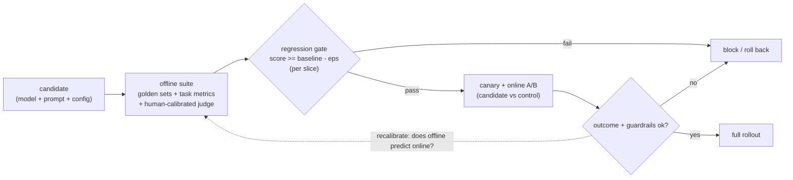

# Chapter 9: Evaluating LLM Systems

You shipped an LLM feature and it works, or at least it worked on the three examples you demoed. Next week a teammate wants to tweak the prompt and swap in a newer model. How do you know the feature is good today, and how do you stop that innocent-looking change from silently making it worse? This is the question that separates people who have shipped LLM features from people who have only demoed them, because "look at these examples, it works" is not a measurement, it is a vibe. The entire discipline of LLM evaluation is about turning a fuzzy "is the output any good" into a number you can repeat, version, and gate a deploy on.

In this chapter, we will build that discipline as a system. We will scope what makes an eval problem easy or hard, then construct the two loops every serious LLM team runs: an offline suite that gates the deploy on a fixed golden dataset, and an online loop that checks the offline suite was telling the truth. We will treat the two ways of scoring an output, checkable task metrics and LLM-as-judge, as distinct tools chosen per task, and we will take the judge seriously as a measurement instrument that itself has to be calibrated before you trust it. We will wire the offline suite into the deploy path as a regression gate, price the recurring bill honestly, and extend the pattern to RAG and agents where a single number hides which half is broken. Along the way we will open one validated reference architecture, a capable open model of exactly the kind you would run as a judge, so you can see what you are paying for per judgment rather than treating the judge as free infrastructure.

In this chapter, we will cover the following main topics:

- Scoping an evaluation problem and its requirements
- The two loops: an offline gate and an online check
- Offline suites and golden datasets
- Task metrics versus LLM-as-judge, and tracing the judge model
- Online evaluation with A/B tests and guardrails
- Regression gates in the deploy path and the cost of eval
- Evaluating RAG and agents
- Failure modes: Goodhart, judge drift, and contamination

## Technical requirements

To follow along you need a modern web browser to open the validated reference graph used as a figure in this chapter. It is not a screenshot: it is a shape-checked architecture graph from the Neurarch model zoo, and it opens live in the editor so you can inspect real dimensions layer by layer.

The architecture we open in this chapter is:

- **Qwen3-8B**, a capable open decoder-only model of the kind you would run as an LLM-as-judge: [open it live](https://www.neurarch.com/?import=https://raw.githubusercontent.com/neurarch-ai/awesome-llm-model-zoo/main/architectures/qwen3-8b/model.json)

The full collection of 92 validated reference graphs lives in the [Model Zoo repository](https://github.com/neurarch-ai/awesome-llm-model-zoo), with a browsable [gallery](https://neurarch-ai.github.io/awesome-llm-model-zoo). It is built by [Neurarch](https://www.neurarch.com).

Conceptually you will also want to be aware of the tooling classes we name but do not install here: a version-controlled golden dataset held in source control alongside the code, a task-metric harness (exact match, F1, unit-test pass or fail), an LLM-as-judge with a pinned model version and a versioned rubric, a small human-labeled calibration set, and an online A/B or canary framework that reads behavioral outcome metrics. No datasets are required to read the chapter; the running example is a shipped LLM feature whose prompt and model id change on a weekly cadence.

## Scoping an evaluation problem and its requirements

Before designing any suite, we scope the problem, because the answers change the entire eval design. Five questions do most of the work.

- **What is the task?** A closed task with a checkable answer (classification, extraction, SQL generation) is worlds easier to evaluate than an open one (summaries, chat, "is this a good explanation"). Ask which you have, because it decides whether you can use exact metrics or need a judge.
- **Is there a ground truth?** Sometimes there is a correct label, sometimes only a human preference. This changes whether you score against a reference or rank against a control.
- **What does a failure cost?** A wrong extraction in a billing pipeline is expensive; a slightly worse tone in a chat reply is not. This sets how tight the gate needs to be.
- **What is the change cadence?** Prompts edited daily and models swapped monthly need a cheap automated gate, not a quarterly human study.
- **What is the eval budget?** Every judged example costs a model call, so the eval itself has a bill, and at high cadence it is not small.

Writing the answers out as functional and non-functional requirements gives us a target to build against.

**Functional**

- A repeatable offline suite that scores a candidate (prompt plus model plus config) against a fixed dataset
- A way to score open-ended outputs where no exact answer exists
- A regression gate that blocks a deploy when quality drops
- Online measurement that confirms the offline number actually predicts real user outcomes

**Non-functional**

- Deterministic and versioned: the same candidate plus the same dataset gives the same score, and the dataset itself is version-controlled
- Cheap and fast enough to run on every change, not once a quarter
- Trustworthy: the metric must correlate with what users actually care about, because a confident metric that measures the wrong thing is worse than no metric, it gives false confidence

The non-functional requirement that quietly dominates here is **trustworthiness**, because it constrains everything downstream. An eval that does not correlate with real outcomes is not a weak gate, it is a harmful one: it greenlights regressions and blocks improvements while wearing the authority of a number. We flag it early and return to it when we validate the judge and when we correlate offline against online.

## The two loops: an offline gate and an online check

A production evaluation system is really two loops that share a scoring vocabulary. We keep them separate in our heads and in our diagrams. The **offline loop** runs a candidate against a fixed golden dataset, scores each output, aggregates and slices the result, and blocks the deploy if the score drops. The **online loop** takes a candidate that cleared the gate, ships it behind a canary or A/B test, reads the behavioral outcome, and, crucially, feeds that outcome back to check whether the offline gate was honest. The offline loop tells you a candidate is *probably* better; the online loop tells you it *actually* is, on real traffic. They disagree more often than people expect, which is exactly why both exist.

*Figure 9.1: The two-loop evaluation pipeline, an offline suite gating the deploy and an online loop recalibrating it*

The rest of the chapter walks the stages of this diagram in the order a candidate flows through them, pausing where a stage hides a real design decision. The two things an interviewer will probe are how you score open-ended outputs without fooling yourself, and how the gate is actually wired into the deploy path so a regression cannot ship by accident.

## Offline suites and golden datasets

The foundation of the offline loop is a fixed set of inputs with expected outcomes, the **golden dataset**, that you run every candidate against. Get this right and everything else is easier. Four properties matter.

- **Coverage over volume.** A few hundred well-chosen cases beat ten thousand random ones. You want the common paths, the known-hard cases, and one row for every bug you have ever fixed, added as a regression case so it never comes back.
- **Slice it.** A single average hides regressions. Score per segment (language, document length, customer tier, query type) so a change that lifts the average while tanking one segment gets caught.
- **Version it.** The dataset lives in source control. A score is only comparable against another score computed on the exact same dataset version.
- **Keep a held-out set.** If you tune prompts against the eval set you start fitting to it. Reserve a slice you never look at during iteration, so your final number measures the task and not your own overfitting.

The discipline here is the same one you apply to test data anywhere: the value is not the row count, it is whether the rows represent the traffic you will actually see and the failures you have actually hit.

## Task metrics versus LLM-as-judge, and tracing the judge model

There are two ways to score an output, and you pick per task.

**Task metrics** apply when the answer is checkable: exact match, F1 on extracted fields, pass or fail on a unit test for generated code, retrieval recall, numeric tolerance. These are cheap, deterministic, and unfoolable, so you use them wherever the task allows. When the task produces a set of predicted items against a set of true items, the standard summary is the F1 score, the harmonic mean of precision and recall:

$$F_1 = \frac{2 \cdot \text{precision} \cdot \text{recall}}{\text{precision} + \text{recall}}, \quad \text{precision} = \frac{TP}{TP + FP}, \quad \text{recall} = \frac{TP}{TP + FN}$$

The art is reframing a task to *expose* a checkable metric: instead of judging a free-text answer, ask the model for a structured field you can compare exactly, and you have converted a subjective grade into an unfoolable one.

**LLM-as-judge** applies when quality is genuinely subjective: is this summary faithful, is this reply helpful, is answer A better than answer B. You prompt a capable model to score or rank outputs against a rubric, and it scales where human labeling cannot. But it has sharp, well-documented failure modes you must name and control for.

- **Position bias.** Judges favor whichever answer is shown first (or sometimes last) in a pairwise comparison. The mitigation is to run both orderings and average, so the reported score for A against B is $\tfrac{1}{2}(s_{AB} + s_{BA})$, and to track the swap rate as a health signal.
- **Verbosity bias.** Judges reward longer, more confident-sounding answers even when they are not better. Control for length, or instruct the rubric to penalize padding explicitly.
- **Self-preference bias.** A judge tends to prefer outputs from its own model family. Where you can, use a different model family as the judge than the one you are evaluating.
- **Calibration.** Raw judge scores on a 1 to 10 scale are not meaningful in absolute terms and bunch up in the middle. Pairwise comparison (A versus B) is far more reliable than absolute scoring, and a binary pass or fail against a sharp rubric beats a fuzzy 1 to 10.
- **The judge must itself be validated.** This is the point most candidates miss. An LLM judge is a measurement instrument, and an uncalibrated instrument lies. Before you trust it, collect a few hundred human labels and check that the judge agrees with humans. Chance-corrected agreement, Cohen's kappa, is the standard number to report:

$$\kappa = \frac{p_o - p_e}{1 - p_e}$$

where $p_o$ is the observed agreement rate between judge and humans and $p_e$ is the agreement expected by chance. A judge you have not validated this way is just a second opinion you have no reason to believe; if $\kappa$ is low, you fix the rubric before you gate anything on the judge.

Because the judge is a full model with its own latency and per-call bill, it helps to open one and see exactly what a single judgment costs. Qwen3-8B is a capable open decoder-only model of the size and shape you would realistically run as a judge, not the most expensive frontier model but a validated, right-sized one.

*Figure 9.2: Qwen3-8B, a capable open model of the kind you would run as an LLM-as-judge*

You can [open this graph live](https://www.neurarch.com/?import=https://raw.githubusercontent.com/neurarch-ai/awesome-llm-model-zoo/main/architectures/qwen3-8b/model.json) and trace its attention and feed-forward blocks to see where the per-token cost of a single judgment goes. Multiply that per-judgment cost by your suite size and cadence and you have sized the eval bill honestly. The judge is not free infrastructure sitting off to the side of the diagram: it is a model you run, on every row, on every candidate.

## Online evaluation with A/B tests and guardrails

Offline tells you a candidate is probably better; online tells you it actually is, on real traffic. Three pieces make up the online loop.

- **A/B test.** Route a slice of traffic to the candidate and the rest to the control, then compare. The outcome metrics that matter are behavioral: task completion, user edits to the output, thumbs up or down, follow-up "that is wrong" messages, escalation rate. These are what you actually care about and cannot measure offline.
- **Guardrail metrics.** Even if the target metric improves, watch the metrics that must not regress: latency, cost per request, refusal rate, error rate. A candidate that lifts quality but doubles latency or cost may not be a win, and a guardrail is what stops you shipping it anyway.
- **Online-to-offline correlation.** The most valuable thing the online loop produces is a check on the offline loop. If the candidate that won offline loses online, your offline suite is not measuring what matters, and you fix the suite. Over time you want the offline score to become a trustworthy predictor of the online outcome, so most changes can ship on the cheap offline gate alone and only the genuinely uncertain ones need a full A/B test.

This correlation is the payoff of taking trustworthiness seriously in scoping. A suite that reliably predicts the A/B result lets you move fast on the cheap gate; a suite that does not is a liability you are still paying to run.

## Regression gates in the deploy path and the cost of eval

An eval that someone runs manually when they remember is not a gate, it is a good intention. We wire it into the deploy path so a regression cannot ship by accident.

The offline suite runs automatically on any change to a prompt, a model id, or an inference config, the same way unit tests run on a code change. It compares the candidate score to the current production baseline and **fails the build if the score drops more than a small tolerance**:

$$s_{\text{cand}} \ge s_{\text{baseline}} - \epsilon$$

The tolerance $\epsilon$ absorbs judge noise, so you set it from the judge's measured run-to-run variance, not by guessing. Critically, you apply this inequality **per slice**, not just on the average, so a regression hidden inside one segment still blocks. Prompts and model ids are versioned artifacts: a "drop-in newer model" is exactly the kind of change that silently regresses one segment while improving the average, so a model swap goes through the same gate as any code change. After the gate passes, the candidate ships to a canary and the online loop confirms before full rollout.

None of this is free, and a senior answer says so out loud. Every judged example is a model call, so for a golden set of $N$ rows scored by a pairwise judge run in both orderings, the judge-call count per candidate is

$$C_{\text{judge}} = 2N, \qquad \text{cost per candidate} = 2N \cdot p_{\text{judge}}$$

where $p_{\text{judge}}$ is the price of one judge call, and this recurs on every prompt edit. A thousand-row suite is a few thousand judge calls per candidate, every time someone touches the prompt. The levers that keep it sane: use cheap deterministic task metrics wherever the task allows and reserve the judge for the genuinely open cases; use a smaller, cheaper, validated judge model (like the one we opened) rather than the most expensive one; cache judge results for unchanged output pairs; and run the full suite on the gate but only a small smoke subset on every local iteration.

## Bottlenecks and scaling

As cadence and suite size grow, the same handful of bottlenecks surface in a predictable order. It is worth memorizing the cause and the fix for each, because they map directly onto the stages above.

| Bottleneck | Cause | Fix |
|---|---|---|
| Eval cost per change | Judge call on every row, every candidate | Task metrics where possible, cheaper judge, cache judged pairs, smoke subset for local iteration |
| Slow gate | Large suite run serially | Parallelize judge calls, smoke subset on iteration and full suite on the gate |
| Untrustworthy score | Judge not validated against humans | Collect human labels, measure judge-human $\kappa$, fix the rubric before gating |
| Average hides regressions | Single aggregate metric | Slice by segment, gate per slice |
| Offline disagrees with online | Suite measures the wrong thing | Use the online A/B as ground truth, recalibrate the offline suite to it |
| Stale dataset | Real traffic drifts from the golden set | Periodically sample production, label, and refresh the suite |

## Evaluating RAG and agents

Two common systems break if you score them with a single end-to-end number, because a single number cannot tell you which half is broken.

A **RAG** answer can be wrong for two completely different reasons, and you must measure them separately or you cannot tell which half to fix. **Retrieval quality** asks whether the right documents came back at all, measured as recall and precision at $k$ against labeled relevant documents:

$$\text{recall@}k = \frac{|\{\text{relevant}\} \cap \{\text{top-}k\}|}{|\{\text{relevant}\}|}$$

If recall is low, no amount of prompt tuning saves you, the evidence was never in the context. **Answer groundedness** (faithfulness) asks whether, given the retrieved context, the answer is actually supported by it or the model invented something; this is a judge task that checks each claim against the provided context. **Answer relevance** asks whether the answer addresses the question, separate from whether it is grounded. Splitting these three lets you localize a failure to retrieval, grounding, or the generation prompt: a high groundedness score with low retrieval recall means the model is faithfully answering from the wrong documents.

**Agents** need end-to-end and step-level metrics both. **End-to-end task success** on a labeled set of tasks is the metric that matters: did the ticket actually get resolved correctly. Everything else is diagnostic. **Step-level metrics** localize failures: was the right tool chosen, were the arguments valid, did the plan match intent. A run can succeed by luck with bad steps, or fail late after good steps, and step metrics tell you which. **Trajectory cost** rounds it out, because success at ten times the steps is not success: track steps, tokens, and dollars per task alongside the raw success rate.

## Failure modes: Goodhart, judge drift, and contamination

An evaluation system fails in ways a plain metric dashboard does not, because the metric is under active optimization pressure and the judge is a moving hosted model. We plan for four categories.

- **Gaming the metric (Goodhart).** Once a metric is a target it stops being a good metric. Optimizing hard against an LLM judge produces outputs that the judge loves and users do not, often longer and more confident. The mitigation is to keep the online behavioral metrics as the real ground truth, keep a held-out set, and watch for the offline-online gap widening.
- **Judge drift.** The judge is a hosted model that can change under you, or its prompt gets edited, and yesterday's scores stop being comparable to today's. Pin the judge model version, version the judge prompt, and keep a fixed calibration set you re-score periodically to detect drift.
- **Contaminated test sets.** If your eval cases (or near-duplicates) leaked into a model's training data, the model looks great on them and fails in production. This is a real risk with public benchmarks, which is why a private, freshly-sampled golden set beats a famous public one for gating your own feature.
- **Tuning on the eval set, and the single number.** Iterating prompts against the same set you score on fits the set, not the task, so you keep a held-out slice you never look at during development. And "quality is 87%" with no slices, no confidence interval, and no dataset version is not a measurement, it is a press release: always report the spread and the segments.

## Summary

In this chapter we turned "is the output any good" into a system you can gate a deploy on. We scoped what makes an eval problem easy or hard (closed versus open task, ground truth or preference, failure cost, change cadence, budget) and wrote the functional and non-functional requirements, flagging trustworthiness as the quiet dominator. We built the two loops: an offline suite that scores a candidate against a versioned, sliced, held-out golden dataset and blocks the deploy on a per-slice tolerance, and an online loop that A/B tests the survivor against real behavioral outcomes and feeds the result back to recalibrate the offline gate. We separated the two scoring tools, checkable task metrics with their exact F1 and recall math versus LLM-as-judge for the open cases, and took the judge seriously as an instrument that must be validated against human labels with Cohen's kappa before it can gate anything, naming the position, verbosity, and self-preference biases you control for. We opened Qwen3-8B, a real model of the kind you would run as a judge, to price a single judgment honestly, and we wrote the eval-cost formula that recurs on every prompt edit. Finally we extended the pattern to RAG (retrieval recall versus groundedness versus relevance) and agents (end-to-end success versus step metrics versus trajectory cost), and covered the failure modes specific to evaluation: Goodhart gaming, judge drift, contamination, and the dishonest single number.

In the next chapter, *Safety, Moderation, and Guardrails*, we turn from measuring quality to enforcing boundaries: how to catch harmful, off-policy, or injected content before and after the model, and how the moderation classifiers and guardrail checks in that chapter are themselves evaluated with exactly the offline-plus-online discipline we built here.

## Questions

1. Why is "it works, look at these examples" not an acceptable answer to "how do you know your LLM feature is good," and what does turning it into a real evaluation require?
2. What distinguishes a closed task you can score with task metrics from an open task that needs an LLM-as-judge, and how would you try to reframe an open task to expose a checkable metric?
3. Why does a production evaluation system need both an offline loop and an online loop, and what does each one tell you that the other cannot?
4. What four properties make a golden dataset trustworthy, and why does coverage matter more than raw volume?
5. Name the main biases of an LLM-as-judge (position, verbosity, self-preference) and give a concrete mitigation for each.
6. Why must an LLM judge be validated against human labels before you gate on it, and what does Cohen's kappa measure in that validation?
7. Write the regression-gate inequality and explain why the tolerance is set from measured judge variance and why the gate is applied per slice rather than on the average.
8. Estimate the recurring cost of a thousand-row suite scored by a pairwise judge run in both orderings, and list the levers that drive that cost down.
9. Why must a RAG system be evaluated on retrieval quality and answer groundedness separately, and what does a high groundedness score with low retrieval recall tell you?
10. Explain Goodhart's law as it applies to an LLM judge, judge drift, and benchmark contamination, and give the guard for each.

## Further reading

Each of the following is a first-party engineering writeup that ships the patterns in this chapter. Every one runs the same two-loop skeleton (an offline suite gates the change, an online loop checks the gate was honest), pairs checkable task metrics with an LLM-as-judge for open output, and trusts the judge only after calibrating it against human labels. Read them for what an interview answer skips: who the system serves, the product design, the eval bar, and the deployment shape.

- [A Simulation and Evaluation Flywheel to Develop LLM Chatbots at Scale (DoorDash)](https://careersatdoordash.com/blog/doordash-simulation-evaluation-flywheel-to-develop-llm-chatbots-at-scale/): simulated multi-turn conversations graded by an LLM judge calibrated to humans before release.
- [How DoorDash leverages LLMs to evaluate search result pages (DoorDash)](https://careersatdoordash.com/blog/doordash-llms-to-evaluate-search-result-pages/): AutoEval, fine-tuned LLM raters with a human in the loop for whole-page relevance.
- [Efficiently evaluating LLMs for legal tasks (Thomson Reuters)](https://legal.thomsonreuters.com/blog/evaluating-llms-legal-tasks/): a three-stage gate of public benchmarks, semi-automated task eval, then a human A/B as the final arbiter.
- [uReview: scalable, trustworthy GenAI for code review (Uber)](https://www.uber.com/us/en/blog/ureview/): an LLM grader scores generated comments and confidence thresholds gate what gets posted.
- [From Predictive to Generative: how Michelangelo accelerates Uber AI (Uber)](https://www.uber.com/blog/from-predictive-to-generative-ai/): an eval framework comparing models, prompts, and fine-tunes across iterations.
- [Developing Rapidly with Generative AI (Discord)](https://discord.com/blog/developing-rapidly-with-generative-ai): a critic-LLM AI-assisted eval of prompts before A/B rollout.
- [So we shipped an AI product. Did it work? (Honeycomb)](https://www.honeycomb.io/blog/we-shipped-ai-product): post-launch product eval via activation and adoption metrics.
- [How we evaluate AI models and LLMs for GitHub Copilot (GitHub)](https://github.blog/ai-and-ml/generative-ai/how-we-evaluate-models-for-github-copilot/): 4000-plus offline tests plus manual and safety gates, with a daily regression run against production.
- [Better experiments with LLM evals: a funnel, not a fork (Spotify)](https://engineering.atspotify.com/2026/5/better-experiments-with-llm-evals-a-funnel-not-a-fork): offline evals calibrated against the online A/B as a funnel that filters before the experiment.
- [Profile-aware LLM-as-a-Judge for Podcasts (Spotify)](https://research.atspotify.com/2025/9/profile-aware-llm-as-a-judge-for-podcasts-a-better-middle-ground-between): an LLM judge bridging offline metrics and costly A/B tests.
- [LLM Evaluation: practical tips at Booking.com](https://booking.ai/llm-evaluation-practical-tips-at-booking-com-1b038a0d6662): LLM-as-judge plus golden datasets for production quality monitoring and drift watch.
- [LLM-Powered Relevance Assessment for Pinterest Search](https://medium.com/pinterest-engineering/llm-powered-relevance-assessment-for-pinterest-search-b846489e358d): fine-tuned LLM judges label search relevance to evaluate ranking A/B experiments.
- [Scaling Catalog Attribute Extraction with Multi-modal LLMs (Instacart)](https://company.instacart.com/tech-innovation/scaling-catalog-attribute-extraction-with-multi-modal-llms): LLM-as-judge auto-eval monitors attribute-extraction quality alongside human auditors.
- [How Ramp Fixes Merchant Matches with AI (Ramp)](https://builders.ramp.com/post/fixing-merchant-classifications-with-ai): shadow mode plus an LLM judge evaluate agent classifications against humans pre-rollout.
- [LLM-Rubric: a multidimensional, calibrated approach to automated evaluation (Microsoft)](https://www.microsoft.com/en-us/research/publication/llm-rubric-a-multidimensional-calibrated-approach-to-automated-evaluation-of-natural-language-texts/): a calibrated multi-dimension rubric judge predicts human satisfaction for a dialogue system.
- [How we engineered LinkedIn's Hiring Assistant (LinkedIn)](https://www.linkedin.com/blog/engineering/ai/how-we-engineered-linkedins-hiring-assistant): a quality framework pairing product policy with LLM judges scoring coherence and factuality.
- [Developing GitLab Duo: validating and testing AI models at scale (GitLab)](https://about.gitlab.com/blog/developing-gitlab-duo-how-we-validate-and-test-ai-models-at-scale/): a central eval framework with an LLM judge running daily regression at scale.
- [How AI understands what you're looking for (Wayfair)](https://www.aboutwayfair.com/careers/tech-blog/smarter-shopping-starts-here-how-ai-understands-what-youre-looking-for): LLM-as-judge validation tasks periodically evaluate AI-generated customer interests offline.
- [Evidently AI ML system design database](https://www.evidentlyai.com/ml-system-design): the broadest curated index, 800 case studies from 150-plus companies, for going beyond the cases listed here.
