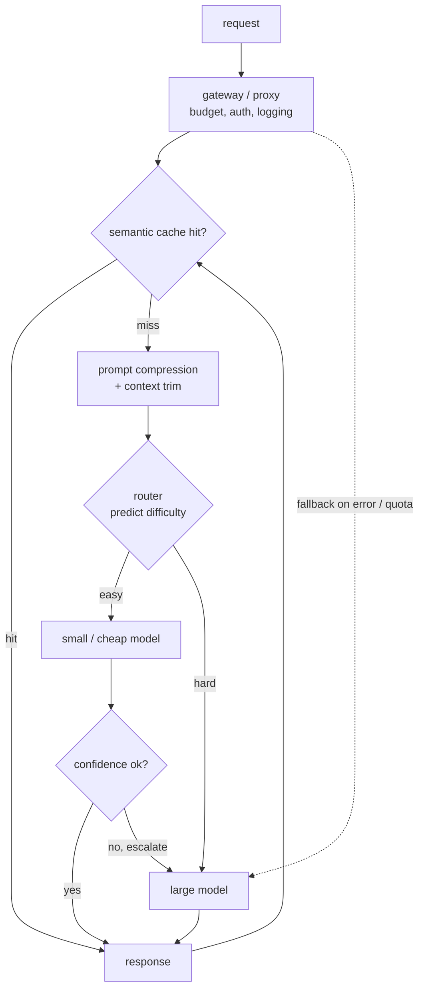

# Chapter 11: Cost Optimization and Model Routing

Your LLM feature shipped, users love it, and now the monthly provider bill is the single biggest line item in the infrastructure budget. Finance is asking hard questions, and the obvious move, downgrading everyone to a cheaper model, tanks quality on exactly the queries that matter. This is one of the most common senior-level system-design prompts in production interviews, because it is one of the most common real problems: the bill is real, the quality bar is real, and the two pull in opposite directions.

The core tension is that traffic is not uniform. Most queries are easy: a greeting, a reformat, a lookup that retrieval already answered. A small tail is genuinely hard and needs your biggest model. Paying for the frontier model on every request charges the easy majority the same unit cost as the hard minority. The win is not one clever trick. It is matching the model and the technique to each query's difficulty along a quality-cost frontier: cheap paths for easy work, expensive paths only where they earn their keep. In this chapter we will build that frontier stage by stage. We will scope the problem so we know what "quality" even means, put a gateway in front so spend becomes observable, then walk the levers in the order a request meets them: semantic caching, prompt compression, model routing, cascades, right-sizing, and the structural levers baked into the architecture itself. Along the way we will open four validated reference graphs, a tiny cheap model, a capable generalist, a small embedding encoder, and a sparse mixture-of-experts block, so you can read the real dimensions that make the price gap a router monetizes.

In this chapter, we will cover the following main topics:

- Scoping the cost problem and its requirements
- The gateway pattern: one proxy for budgets, fallbacks, and logging
- Semantic caching: the cheapest call is the one you never make
- Prompt compression and shorter context
- Model routing: predicting difficulty before the call
- Cascades and deferral: escalate only when unsure
- Right-sizing models per task
- Structural cost levers: mixture-of-experts, quantization, and batching
- Measuring the frontier and setting the threshold

## Technical requirements

To follow along you need a modern web browser to open the validated reference graphs used as figures in this chapter. These are not screenshots: they are shape-checked architecture graphs from the Neurarch model zoo, and each one opens live in the editor so you can inspect real dimensions layer by layer. The whole point of a cost chapter is that every lever bottoms out in real model dimensions, how big the "big" model is, how small the cheap path can be, how wide an embedding you cache on, and those are the numbers that get miscopied from blog posts.

The four architectures we open in this chapter are:

- **GPT-2 small**, a tiny cheap model for easy paths or the router itself: [open it live](https://www.neurarch.com/?import=https://raw.githubusercontent.com/neurarch-ai/awesome-llm-model-zoo/main/architectures/gpt2-small/model.json)
- **Llama-3 8B**, the capable generalist you escalate hard queries to: [open it live](https://www.neurarch.com/?import=https://raw.githubusercontent.com/neurarch-ai/awesome-llm-model-zoo/main/architectures/llama3-8b/model.json)
- **all-MiniLM-L6**, the small embedding encoder behind a semantic cache and an embedding router: [open it live](https://www.neurarch.com/?import=https://raw.githubusercontent.com/neurarch-ai/awesome-llm-model-zoo/main/architectures/all-minilm-l6/model.json)
- **Mixtral block**, a sparse mixture-of-experts block, more capacity per active FLOP: [open it live](https://www.neurarch.com/?import=https://raw.githubusercontent.com/neurarch-ai/awesome-llm-model-zoo/main/architectures/mixtral-block/model.json)

The full collection of 92 validated reference graphs lives in the [Model Zoo repository](https://github.com/neurarch-ai/awesome-llm-model-zoo), with a browsable [gallery](https://neurarch-ai.github.io/awesome-llm-model-zoo). It is built by [Neurarch](https://www.neurarch.com).

Conceptually you will also want to be aware of the infrastructure classes we name but do not install here: an LLM gateway or proxy (the central chokepoint), a vector index for the semantic cache, a small classifier or embedding model for the router, and a provider batch API for offline jobs. No datasets are required to read the chapter; the running example is a mixed-intent chat surface whose provider bill has become the top infrastructure cost.

## Scoping the cost problem and its requirements

Before drawing any boxes, we scope the problem, because the answers change which lever we reach for first. Five questions do most of the work.

**What is the quality bar, and how is it measured?** You cannot trade cost for quality without a number for quality. If quality is only vibes with no eval set or judge, the first deliverable is measuring it, not routing. Every knob below trades cost against quality, and a knob you cannot measure is a knob you cannot set.

**Where does the money actually go?** Long-context retrieval is input-heavy, agent loops and long generations are output-heavy, high-QPS classification is request-heavy. The dominant term decides the lever: compression for input, right-sizing for output, caching for repeats. Optimizing the wrong term is wasted effort.

**Online or batch?** Interactive chat has a latency budget that caps how much you can defer or cascade. A nightly bulk job has no user waiting, so you can batch aggressively and take the cheapest path.

**One task or many?** A single well-defined task, classify sentiment, right-sizes to one small model. A surface with mixed intents needs routing across a fleet.

**How much regression is acceptable, and where?** A 1% drop on easy queries to halve cost is usually yes. The same drop on a safety- or revenue-critical path is usually no. Get the tolerance per surface, not as a single global number.

Writing these out as functional and non-functional requirements gives us:

**Functional**

- Serve each request through the cheapest path that still meets the quality bar
- Route across a fleet of models of different sizes and prices
- Reuse prior work (cache) when a request near-duplicates a past one
- Fall back gracefully when a provider or model is down or over quota

**Non-functional**

- Cut cost per successful request without quality regression where it matters
- Hold the latency budget: cost tricks that add a round trip must still fit
- Keep routing and caching decisions observable so a silent quality drop is caught
- Make budgets and spend enforceable, per team and per tenant

The non-functional requirement that quietly dominates is **observability of quality**. A cost drop with no quality tracking is a silent quality cut waiting to be discovered, and the dashboard will be green because it only shows cost. We flag it early and return to it, because the scariest failure this system has is a 40% bill reduction that nobody can prove held quality.

## The gateway pattern: one proxy for budgets, fallbacks, and logging

Every request should pass through a single gateway, an LLM proxy, rather than each service calling providers directly. Before we optimize anything, we need somewhere to stand, and the gateway is that place. It is where cost control becomes both enforceable and observable.

Four responsibilities live here. **Budgets and rate limits** per team, tenant, or key, so one runaway agent loop cannot torch the budget and finance can see spend by owner. **Fallbacks** across providers when the primary is down, over quota, or timing out, so the feature degrades instead of dying. **Caching and routing** applied uniformly in one place instead of reimplemented per service. And **logging** of every call's tokens, cost, latency, and model, without which you cannot even find where the money goes. This is the Uber GenAI Gateway and Cloudflare AI Gateway shape, and the lesson is blunt: cost optimization without a central chokepoint is guesswork.

Figure 11.1 shows the full path a request takes through the gateway and the levers behind it. It is the map for the rest of the chapter: cache first, then compress, then route, then cascade, with the gateway wrapping all of it for budgets and fallback.

*Figure 11.1: The routing and cascade path, cache and compression upstream, fallback wrapping the fleet*

The interesting decisions are all upstream of the model call: whether we hit cache, how long the prompt is, and which model the request even reaches. We walk them in that order.

## Semantic caching: the cheapest call is the one you never make

The cheapest LLM call is the one you never make, so caching is the first lever. There are two flavors, and the difference is the whole game.

An **exact cache** keys on the normalized prompt plus the model and parameters. It carries zero risk of a wrong answer, but it only fires on identical inputs, which is rare in free text. A **semantic cache** embeds the request and serves a stored response when a past request is within a similarity threshold in embedding space. It catches paraphrases, "what's your return policy" versus "how do I return something", where the real hit rate lives. The mechanics are a small embedding model, a vector index of past queries, and a similarity threshold $\tau$: serve the cached response for query $q$ when

$$\max_{i} \; \text{sim}(e(q), e(q_i)) \;\ge\; \tau$$

where $e(\cdot)$ is the embedding and the maximum runs over cached queries $q_i$.

That threshold $\tau$ is the entire tradeoff. Too loose and you serve the answer to a *different* question ("capital of France" returning the cached answer for "capital of Germany"), which is worse than a wrong model call because it is confidently, cheaply wrong. Too tight and the hit rate collapses back to exact-match. We tune $\tau$ against labeled should-hit and should-not-hit pairs and monitor the quality of cache-served responses, not just the hit rate.

Staleness is the other hazard. We cache stable content (definitions, policies), put a TTL on things that move, and never cache personalized or scoped answers into a shared cache, which is a data leak rather than a cost win. Note that this is whole-response caching. Prefix caching at the serving layer, reusing the KV cache of a shared prompt across requests, is a related but distinct win covered in Chapter 2; here we are skipping the model call entirely.

The embedding model is the workhorse behind the cache, and it deserves more than a labeled box. all-MiniLM-L6 is a small, widely used sentence-embedding encoder: text in, one pooled vector out. Its output dimension is the width of every vector in your cache index, so it drives the index memory budget directly.

*Figure 11.2: all-MiniLM-L6, the small encoder behind a semantic cache and an embedding router*

You can [open this graph live](https://www.neurarch.com/?import=https://raw.githubusercontent.com/neurarch-ai/awesome-llm-model-zoo/main/architectures/all-minilm-l6/model.json) and trace how it pools per-token hidden states into a single vector, and note the output dimension: that number is the one every cache vector and every embedding-router vector is stored at.

## Prompt compression and shorter context

You pay per token, so tokens you did not need to send are money burned. When the bill is input-heavy, this is the lever, and it has two moves of increasing sharpness.

**Context trimming** is the blunt, safe one: send fewer retrieved chunks, drop stale conversation turns, cut boilerplate. Most retrieval prompts over-retrieve, and sending the top 3 chunks instead of the top 20 is often free quality-wise and directly cheaper. A good reranker (Chapter 8) lets you send fewer, better chunks.

**Prompt compression** is the sharper tool: drop low-information tokens while preserving meaning, the LLMLingua idea. A small model scores tokens by their contribution, often via perplexity under a small language model, and removes the low-value ones, yielding a shorter prompt the big model still understands. If the original prompt is $n$ tokens and we keep a fraction $\rho \in (0, 1]$, the input token cost scales as

$$\text{cost}_\text{in} \;\propto\; \rho \cdot n \;+\; c_\text{compressor}$$

where $c_\text{compressor}$ is the cheap small-model pass that does the compression. Two consequences follow directly from that formula. First, the compression pass is not free, so it pays off only when input tokens dominate and context is long and redundant; when $n$ is small, $c_\text{compressor}$ eats the saving. Second, compression is lossy, so an aggressive $\rho$ can drop the one detail the answer hinged on. We gate the ratio $\rho$ behind the same quality eval as any other lever, and back off toward $\rho = 1$ where every token matters: exact extraction, legal, code.

## Model routing: predicting difficulty before the call

A router is a small, fast decision made **before** the expensive call. It predicts how hard the query is and dispatches to the cheapest model likely to answer it well. There are two families.

**Classifier routers** train a small model, or even a regex or heuristic layer, to predict difficulty or category, then map the class to a model. They are cheap and easy to reason about, but they need labeled data for what "hard" means. **Preference routers** learn from preference data, which model humans preferred on which queries, and route to the weak model unless the query looks like one the strong model would win. This is the RouteLLM framing: predict the cheap model's win probability $p_\text{win}$ and send to the expensive model only when it is low,

$$\text{route} = \begin{cases} \text{small model} & \text{if } p_\text{win}(q) \ge \theta \\ \text{large model} & \text{if } p_\text{win}(q) < \theta \end{cases}$$

where $\theta$ is the routing threshold on a representative eval.

Two rules keep a router honest. It must be **cheap**, or it eats its own savings, so it is a sub-millisecond classifier or a tiny model, never another frontier call. And it is itself a model, so it **drifts**: a router tuned on old traffic mis-routes when traffic shifts. We monitor post-routing quality per bucket, not just cost. The honest limitation of any router is that it decides once, blind, before seeing any answer, so it cannot know it was wrong. That is what cascades fix, in the next section.

It helps to make the price gap the router monetizes concrete by opening the two ends of it. The cheap end is GPT-2 small, a tiny decoder that is plenty for classification, routing, or first-stage work.

*Figure 11.3: GPT-2 small, the cheap end of the fleet and a candidate for the router itself*

You can [open this graph live](https://www.neurarch.com/?import=https://raw.githubusercontent.com/neurarch-ai/awesome-llm-model-zoo/main/architectures/gpt2-small/model.json) and read its layer count and hidden width. The expensive end is Llama-3 8B, the capable generalist you only want on the hard tail.

*Figure 11.4: Llama-3 8B, the escalation target you reserve for the hard tail*

[Open this graph live](https://www.neurarch.com/?import=https://raw.githubusercontent.com/neurarch-ai/awesome-llm-model-zoo/main/architectures/llama3-8b/model.json) and compare its depth and width against GPT-2 small. That gap in dimensions is the gap in price, and the entire economic argument for routing is that you pay it only on the queries that need it.

We can even estimate the saving before building the router. If the small model handles a fraction $f$ of traffic at the quality bar, and $p_\text{large}$ and $p_\text{small}$ are the per-request prices, the saving per request is

$$\text{saving} \;=\; f \cdot (p_\text{large} - p_\text{small}) \;-\; c_\text{router}$$

The lesson in that formula is to reason from a *measured* handle-rate $f$, not a hopeful one, and to subtract the router's own cost $c_\text{router}$ so a router as expensive as the models it dispatches shows up as the non-win it is.

## Cascades and deferral: escalate only when unsure

A cascade runs the cheap model first, **scores its own confidence**, and escalates to a pricier model only when that confidence is low. This is the FrugalGPT pattern. Unlike a router, a cascade looks at an actual answer before deciding to spend more, so it can catch its own mistakes. The expected cost per request, with escalation rate $\epsilon$, is

$$\mathbb{E}[\text{cost}] \;=\; p_\text{small} \;+\; \epsilon \cdot p_\text{large}$$

which makes the failure mode obvious: as $\epsilon \to 1$ you pay for both models on everything.

A cascade lives or dies on the confidence signal, and the signals rank by trustworthiness. Best is a trained **scorer** that predicts whether the cheap answer is reliable, which is exactly what FrugalGPT trains. Next are model-reported signals: log-probabilities, self-consistency across samples, or a cheap self-critique. Most trustworthy of all, when you have it, is a **verifier** against ground truth: does the SQL run, does the code compile, does the citation exist. Verifiable tasks, code, SQL, math, extraction, are the sweet spot, because the check is a real test and escalation is precise. On open-ended generation the signal is softer and you accept more escalations.

The failure mode is a miscalibrated cutoff. Too eager to accept and quality quietly drops; too eager to escalate and $\epsilon$ climbs until you have paid for two models on every request. We calibrate the cutoff on held-out data and re-check as traffic shifts, and we monitor $\epsilon$ as a first-class metric.

Routers and cascades are not rivals; they compose. Use a router when you must decide before spending, because the latency budget is too tight for a two-model path, and you have signal on difficulty. Use a cascade when you can afford a cheap call first and the task has a trustworthy confidence or verification signal. In practice you route first into a bucket, then cascade within it, which is exactly the shape of Figure 11.1.

## Right-sizing models per task

The largest cost mistake in most systems is using one frontier model for everything, because it was the easiest thing to wire up, when most of the pipeline does not need it. Right-sizing is matching model size to task across the whole pipeline, not just the final generation:

- **Routing, classification, intent, extraction** go to small models. A fine-tuned small model often beats a giant general one on a narrow task at a fraction of the cost.
- **Embeddings** go to a small dedicated embedding model, not a generative call.
- **Reranking** goes to a small cross-encoder.
- Only **hard, open-ended generation and reasoning** goes to the big model, which now sees only the queries that survived every cheaper stage.

The tradeoff is operational, not quality: more models to host, evaluate, and keep from drifting, each one able to silently regress. That is a real cost, but it is a cost you can monitor, unlike a bill you cannot explain.

## Structural cost levers: mixture-of-experts, quantization, and batching

The levers so far bolt cost control onto serving from the outside. Some of the biggest wins are baked into the architecture and the hardware instead, and understanding them tells you when self-hosting beats a per-token API.

Start with the architecture. A sparse **mixture-of-experts (MoE)** block gives you large-model capacity at a fraction of the active compute, because only a couple of experts fire per token. It is a cost lever structural to the model rather than bolted on at serving time. Tracing the expert routing on a real block makes the idea concrete.

*Figure 11.5: A Mixtral MoE block, large capacity per token at a fraction of the active FLOPs*

[Open this graph live](https://www.neurarch.com/?import=https://raw.githubusercontent.com/neurarch-ai/awesome-llm-model-zoo/main/architectures/mixtral-block/model.json) and follow the router into the experts: only the top few are selected per token, so the active parameter count per forward pass is far below the total.

The hardware levers, quantization and batching, only apply to models **you host**, not to per-token API pricing you cannot change. To see why they work, recall that autoregressive decode is memory-bandwidth-bound: each step streams every weight from memory to do a tiny amount of matrix-vector work, so the arithmetic intensity

$$I = \frac{\text{FLOPs performed}}{\text{bytes moved from memory}}$$

is very low and the step time is set by

$$t_\text{decode step} \approx \frac{\text{weight bytes}}{\text{bandwidth}}$$

Two consequences drop out. **Quantization** (fewer bytes per weight, for example fp8 or int8) speeds decode almost linearly, because it directly shrinks the numerator of $t_\text{decode step}$. **Continuous batching** packs more requests into each decode step so each streamed weight is reused across more token vectors, raising $I$ and moving you off the memory-bound floor toward compute-bound throughput. The ceiling is KV-cache memory, whose bytes grow as

$$\text{KV bytes} = 2 \times n_\text{layers} \times n_\text{kv} \times d_\text{head} \times \text{seq} \times \text{batch} \times b$$

which caps how many sequences share the GPU, which is why the KV-memory levers from Chapters 2 and 4 indirectly raise the throughput ceiling.

There is one more freedom to exploit: not every call has a user waiting. Backfills, nightly summarization, classification over a warehouse table, and offline eval generation have no latency budget, and that freedom is a cost lever. Provider **batch APIs** trade latency (results within hours) for a large discount, and self-hosted bulk inference runs at maximum batch size on cheap spot capacity, saturating the GPU in a way online serving never can. A surprising amount of "LLM bill" is bulk work accidentally sitting on the interactive endpoint.

So the self-hosting question resolves to volume: below some QPS the API wins, because you pay for no idle GPUs; above it, self-hosting wins, and it additionally buys you quantization and batching. On an API your levers are the earlier ones, routing, caching, compression, and right-sizing.

## Measuring the frontier and setting the threshold

Every lever above has a knob, the route threshold $\theta$, the cascade cutoff, the cache similarity $\tau$, the compression ratio $\rho$, and every knob trades cost against quality. So we set them by measuring the curve, not guessing. The method is mechanical: take a representative eval set with a quality metric, sweep the knob, and at each setting plot quality against cost. That curve is the quality-cost frontier. Pick the point that meets your bar at the lowest cost, or the knee where more cost stops buying quality.

The metric that keeps this honest is cost per *successful* request, because cheap-but-wrong is not success. Alongside it we track quality per routing bucket, cache hit rate and cache-hit quality, escalation rate $\epsilon$, and the frontier over time. We deliberately load the eval with the hard tail, so a router that dumps hard queries on the small model shows up as a quality regression rather than a cost win.

Then we hold the setting under monitoring, because traffic drift moves the curve. We re-sweep periodically and alert on per-bucket quality, not just aggregate cost. This is the answer to the interviewer's sharpest follow-up, "the bill dropped 40%, did quality hold?": it is unanswerable without per-bucket quality tracking, and a cost drop with no quality number is a silent regression, not a win.

## Summary

In this chapter we took a system whose provider bill had become the top infrastructure cost and cut it without users noticing a quality drop. We started by scoping: fixing a measurable quality bar, finding where the money goes (input, output, or request count), and separating online from batch traffic. We put a gateway in front so budgets, fallbacks, and per-call logging made spend enforceable and observable, then walked the levers in the order a request meets them. Semantic caching skips the model call for near-duplicate queries behind a tuned similarity threshold. Prompt compression and context trimming shrink the input-token bill when input dominates. A router predicts difficulty before the call and pays for the big model only on the hard tail, while a cascade answers cheap and escalates only when its own confidence is low, the two composing as route-then-cascade. Right-sizing sends each pipeline stage to the smallest model that clears its bar. Structural levers, mixture-of-experts capacity per active FLOP, quantization and continuous batching on models you host, and batch APIs for offline work, attack cost from inside the architecture and the hardware. Throughout, we tied every knob back to the quality-cost frontier and to cost per successful request, because a cost drop you cannot prove held quality is a silent regression. We opened four validated reference graphs, GPT-2 small and Llama-3 8B to feel the price gap a router monetizes, all-MiniLM-L6 as the encoder behind the cache, and a Mixtral MoE block as a structural cost lever.

In the next chapter, *Production Monitoring and Observability*, we build the other half of that story: the telemetry, tracing, and quality dashboards that catch a silent regression before finance, or a user, does.

## Questions

1. Traffic is described as non-uniform. Explain why that non-uniformity is the entire economic argument for routing and cascades, rather than just downgrading everyone to a cheaper model.
2. Before optimizing, why is finding where the money goes (input tokens, output tokens, or request count) the question that decides which lever you reach for first?
3. What four responsibilities does the gateway centralize, and why is cost optimization without a central chokepoint described as guesswork?
4. Compare an exact cache and a semantic cache. Why is the similarity threshold the whole game, and what goes wrong at each extreme?
5. Write the input-cost relation for prompt compression and explain the two conditions under which compression fails to pay off or damages quality.
6. Contrast a classifier router and a preference router, and state the honest limitation that every router shares regardless of family.
7. A router decides once and blind; a cascade sees an answer first. Write the cascade's expected-cost expression and explain the miscalibration failure mode it exposes.
8. When do you use a router, when a cascade, and how do the two compose on a single mixed-intent surface?
9. Quantization and continuous batching speed up hosted decode. Using arithmetic intensity and the decode-step-time relation, explain the mechanism behind each, and why neither applies to per-token API pricing.
10. Your bill dropped 40%. Explain why that number alone cannot tell you whether quality held, and what you would measure and monitor to answer the question honestly.

## Further reading

Each of the following is a first-party engineering writeup that ships the patterns in this chapter. Read them for what an interview answer skips: who the system serves, the product design, the eval bar, and the deployment shape.

- [FrugalGPT: Using LLMs While Reducing Cost and Improving Performance (Stanford)](https://arxiv.org/abs/2305.05176): an LLM cascade defers to pricier models only when the cheap response scores unreliable. *(eval bar)*
- [RouteLLM: an open framework for cost-effective LLM routing (LMSYS)](https://www.lmsys.org/blog/2024-07-01-routellm/): a preference-data router splits queries between strong and weak models for about an 85% cost cut. *(product design)*
- [Building an LLM Router for High-Quality and Cost-Effective Responses (Anyscale)](https://www.anyscale.com/blog/building-an-llm-router-for-high-quality-and-cost-effective-responses): a fine-tuned classifier routes by query complexity between closed and open models. *(eval bar)*
- [LLM routing for quality, low-cost responses (IBM Research)](https://research.ibm.com/blog/LLM-routers): a real-time router sends each query to the best-value model, cutting cost up to 85%. *(product design)*
- [LLMLingua: prompt compression for LLM efficiency (Microsoft Research)](https://www.microsoft.com/en-us/research/blog/llmlingua-innovating-llm-efficiency-with-prompt-compression/): removes unimportant tokens for up to 20x prompt compression with little loss. *(product design)*
- [Simple, Fast, Scalable Batch LLM Inference (Databricks)](https://www.databricks.com/blog/introducing-simple-fast-and-scalable-batch-llm-inference-mosaic-ai-model-serving): governed batch inference over large datasets for cost-efficient bulk processing. *(deployment)*
- [33% faster LLM inference with FP8 quantization (Baseten)](https://www.baseten.co/blog/33-faster-llm-inference-with-fp8-quantization/): FP8 quantization gives a 33% throughput gain and 24% lower cost per token. *(deployment)*
- [Caching in AI Gateway (Cloudflare)](https://developers.cloudflare.com/ai-gateway/features/caching/): the gateway serves identical requests from cache, cutting billable provider calls and latency. *(deployment)*
- [Uber's GenAI Gateway](https://www.uber.com/blog/genai-gateway/): a unified multi-vendor gateway with usage and budget management across teams, plus fallbacks. *(deployment)*
- [Evidently AI ML system design database](https://www.evidentlyai.com/ml-system-design): the broadest curated index, 800 case studies from 150-plus companies, for going beyond the cases listed here.
